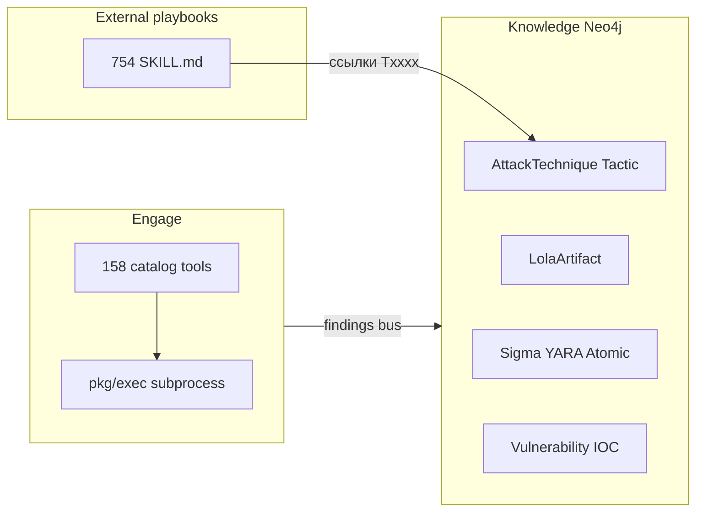
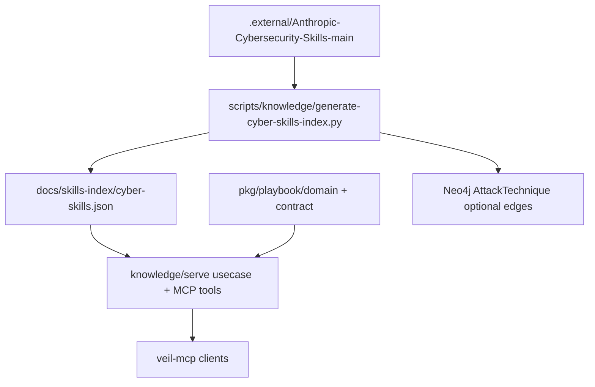

# Интеграция Anthropic Cybersecurity Skills в Knowledge

## Что это за корпус (прочитанное)

| Источник | Содержание |
|----------|------------|
| [README](.external/Anthropic-Cybersecurity-Skills-main/README.md) | **754** skills, **26** доменов, стандарт [agentskills.io](https://agentskills.io), Apache-2.0; **community project** (не официальный Anthropic) |
| [SKILL.md пример](.external/Anthropic-Cybersecurity-Skills-main/skills/acquiring-disk-image-with-dd-and-dcfldd/SKILL.md) | YAML frontmatter (`name`, `domain`, `subdomain`, `tags`, `nist_csf`, …) + playbook: When to Use → Prerequisites → Workflow → Tools → Scenarios |
| [ATTACK_COVERAGE.md](.external/Anthropic-Cybersecurity-Skills-main/ATTACK_COVERAGE.md) + [mappings/mitre-attack/](.external/Anthropic-Cybersecurity-Skills-main/mappings/mitre-attack/) | 291 technique refs, Navigator layer [`attack-navigator-layer.json`](.external/Anthropic-Cybersecurity-Skills-main/mappings/attack-navigator-layer.json) |
| [CODE_OF_CONDUCT.md](.external/Anthropic-Cybersecurity-Skills-main/CODE_OF_CONDUCT.md) | CoC upstream; на лицензию skills смотреть **Apache-2.0** в frontmatter |

**Суть:** это **процедурные знания для AI-агента** (как и когда действовать), а не исполняемые бинарники. Veil уже закрывает другой слой:

| Слой Veil | Роль | Anthropic skills |
|-----------|------|------------------|
| [knowledge/connector/query/categories.go](knowledge/connector/query/categories.go) | `mitre`, `detection`, `lola`, … | **Новая категория `playbook`** (read-only) |
| [discovery/.../lola](discovery/harvest/internal/sources/lola/) | Официальный ATT&CK STIX → `AttackTechnique` | Skills **дополняют** технику playbook-текстом, не заменяют STIX |
| [engage/serve/catalog](engage/serve/catalog/) | `nmap_scan`, `nuclei`, … | Skills могут **рекомендовать** tool names из workflow, но не регистрировать новые MCP tools |
| [.cursor/skills/](.cursor/skills/) | Поведение **разработки** Veil (Karpathy) | **Отдельно** от cyber playbooks; опционально symlink позже |

Принцип как у [docs/external-security-frameworks.md](docs/external-security-frameworks.md) и [docs/external-agent-store.md](docs/external-agent-store.md): **`.external/` не исполняется**, operational truth — в `docs/` + сгенерированный индекс + API/MCP.

---

## Архитектурное решение (выбранный MVP: индекс + veil-mcp)

**Не делать в волне 0–1:**
- Копировать `skills/**` в `pkg/` или коммитить 754 файла вне `.external/`
- Пускать skills через NATS `harvest`/`commit` (нет live feed; статический corpus)
- Добавлять skills в Engage `tools.yaml`
- Менять содержимое `.external/Anthropic-Cybersecurity-Skills-main/`

**Делать:**

1. **Machine-readable index** (генерируется из `.external/`, коммитится в repo)
2. **Read API + MCP** на [knowledge/serve](knowledge/serve/) — поиск и `get_skill(slug)`
3. **Тонкий граф** — только рёбра `AttackTechnique` ↔ skill id (опционально волна 1b), тело skill остаётся в index/filesystem
4. **Документация** — один hub в `docs/`, ссылка из [AGENTS.md](AGENTS.md)

---

## Domain model (pkg SOT)

Новый пакет по образцу [docs/domain-contour.md](docs/domain-contour.md) — **не** смешать с `pkg/ti/domain`:

| Путь | Типы | Назначение |
|------|------|------------|
| `pkg/playbook/domain` | `SkillMeta`, `SkillRef`, `FrameworkRef` | id, name, subdomain, tags, attack_ids[], nist_csf[], license, external_path |
| `pkg/playbook/contract` (или расширить `pkg/api`) | HTTP/MCP DTO | `SkillSummary`, `SkillDetail`, `SkillSearchRequest` |

**SkillDetail:** metadata + markdown body (читается с диска по `external_path` или из snapshot в `var/veil/` после `make skills-index`).

**Связь с MITRE:** `attack_ids: []string` (`T1059.001`) — валидировать против id в Neo4j (`AttackTechnique.id`), версия ATT&CK: в графе уже [enterprise STIX](discovery/harvest/internal/sources/lola/internal/usecase/mitre_stix.go); расхождение v14 (Navigator layer) vs v18 (ingest) — **нормализовать по external_id**, не по версии matrix.

---

## Фазы (ветки, малый diff — по [veil_cleanup_domain_pkg_master.plan.md](.cursor/plans/veil_cleanup_domain_pkg_master.plan.md))

### P0 — Inventory и контракт (только docs + скрипт, без Go)

| Задача | Артефакт |
|--------|----------|
| Hub-док | `docs/external-cybersecurity-skills.md` — лицензия, что vendored, что не делаем |
| Обновить | [docs/external-security-frameworks.md](docs/external-security-frameworks.md) — строка в таблице vendored refs |
| Скрипт | `scripts/knowledge/generate-cyber-skills-index.py` — обход `skills/*/SKILL.md`, парсинг YAML + regex `T\d{4}(?:\.\d{3})?` |
| Выход | `docs/skills-index/cyber-skills.json` + `docs/skills-index/README.md` (поля, stats) |
| Makefile | `make skills-index` / `make check-skills-index` (CI: fail if stale) |

**DoD:** `python3 scripts/knowledge/generate-cyber-skills-index.py` → JSON ~754 записей; `rg` ATT&CK ids согласуется с [ATTACK_COVERAGE.md](.external/Anthropic-Cybersecurity-Skills-main/ATTACK_COVERAGE.md) в пределах ±5%.

**Ветка:** `feat/knowledge-p0-cyber-skills-index`

---

### P1 — Read path в knowledge/serve + veil-mcp

| Компонент | Изменения |
|-----------|-----------|
| [knowledge/serve/internal/usecase](knowledge/serve/internal/usecase/) | `playbook` package: `SearchSkills`, `GetSkill`, `ListByTechnique`, `ListSubdomains` |
| [knowledge/connector/query/categories.go](knowledge/connector/query/categories.go) | Категория `playbook` (labels пустые или `CyberSkill` если позже граф) |
| [knowledge/serve/internal/transport/mcpserver](knowledge/serve/internal/transport/mcpserver/) | Tools: `playbook_search`, `playbook_get`, `playbook_for_technique` (read-only) |
| [docs/mcp-agents.md](docs/mcp-agents.md) | Таблица новых tools + пример запроса для DFIR skill |
| Tests | Unit на парсер индекса + usecase без Neo4j |

**Поведение `playbook_get`:** возвращает frontmatter + markdown body (лимит размера, напр. 64KB) из `.external/.../skills/<slug>/SKILL.md`.

**Поведение `playbook_for_technique`:** join index `attack_ids` + опционально Cypher «какие skills уже в графе» после P1b.

**DoD:** `make test-knowledge-serve`; smoke: MCP `playbook_search` query `disk imaging` → slug `acquiring-disk-image-with-dd-and-dcfldd`.

**Ветка:** `feat/knowledge-p1-playbook-mcp`

**Не трогать:** deprecated `ti_list_kinds` и engage catalog.

---

### P1b — Графовые рёбра (минимальный ingest)

| Задача | Детали |
|--------|--------|
| Новый ingest slice | `knowledge/ingest/internal/sources/playbook/` — MERGE `(:CyberSkill {id})` + `(:AttackTechnique)-[:HAS_PLAYBOOK]->(:CyberSkill)` |
| Wire | **Не** через NATS на первом шаге: `cmd/playbook_seed` или hook в `generate-cyber-skills-index.py --emit-cypher` + одноразовый import |
| [knowledge/connector/query](knowledge/connector/query/) | `PlaybookForTechnique(techniqueID)` — список skill ids + merge с index |

**DoD:** `MATCH (t:AttackTechnique {id:'T1003'})-[:HAS_PLAYBOOK]->(s) RETURN s` не пусто для покрытых техник; `make test-graph-ingest-p7e` если добавлены тесты envelope.

**Ветка:** `feat/knowledge-p1b-playbook-graph-edges`

**Graph version:** при появлении ingest paths — `bump-graph-version.sh patch` по [AGENTS.md](AGENTS.md).

---

### P2 — Engage intelligence bridge (опционально, после P1)

Только **рекомендации**, без выполнения markdown:

- [engage/serve/internal/usecase/intelligence](engage/serve/internal/usecase/intelligence/) — при `AnalyzeTarget` / `DiscoverAttackChains` вызывать veil-api `playbook_for_technique` для CVE/ATT&CK из graph hits
- [pkg/decision](pkg/decision/) — не дублировать; skills = «что делать человеку/агенту», decision = «какой catalog tool запустить»

**Ветка:** `engage/phase-playbook-hints` — согласовать с [engage_mcp_client_native_execution_master.plan.md](.cursor/plans/engage_mcp_client_native_execution_master.plan.md), без изменений `tools.yaml`.

---

### P3 — Cursor / repo ergonomics (опционально)

- `.cursor/skills/cyber-playbooks/` — тонкие SKILL.md со ссылкой на `docs/external-cybersecurity-skills.md` + `playbook_get` через MCP (не копировать 754 файла)
- Или `npx skills add` upstream — документировать как **внешний** путь для разработчиков

---

## Сопоставление с существующими доменами

| Anthropic `subdomain` | Veil category | Примечание |
|----------------------|---------------|------------|
| `digital-forensics` | `playbook` + `lola`/`mitre` | Skill = процедура; LOLA = бинарии/техники |
| `threat-hunting` | `playbook` + `detection` | Sigma/YARA уже в `detection` |
| `web-application-security` | `playbook` + engage OWASP tools | |
| `threat-intelligence` | `playbook` + `ti` | STIX/MISP skills ≠ IOC graph |

**Дедупликация:** один skill slug — один узел `CyberSkill`; detection rules (Sigma) остаются отдельными сущностями ds-scraper.

---

## Риски и ограничения

| Риск | Митигация |
|------|-----------|
| Размер corpus / MCP context | Search возвращает summaries; `playbook_get` — один skill; пагинация |
| `.external/` отсутствует локально | `make skills-index` fail с hint `git clone` / submodule doc |
| License / attribution | `docs/external-cybersecurity-skills.md` + поле `license` в index |
| ATT&CK version drift | Match по `external_id` string; не merge STIX objects из skills repo |
| Путаница skill vs engage tool | Имена MCP `playbook_*`, не `ti_*` / catalog names |

---

## Critic / agent chain

| Роль | Фаза |
|------|------|
| `cleanup-implementer` или новый `knowledge-implementer` в [manifest.yaml](.cursor/agents/manifest.yaml) | P0–P1b |
| Critic | Scope: no `.external` edits, no engage catalog, tests listed |
| `docs-only` | После merge каждой фазы — [veil-agent-documentation.mdc](.cursor/rules/veil-agent-documentation.mdc) |

---

## Definition of done (программа)

- [ ] `docs/external-cybersecurity-skills.md` + индекс в `docs/skills-index/`
- [ ] `make skills-index` в CI
- [ ] veil-mcp: `playbook_search`, `playbook_get`, `playbook_for_technique`
- [ ] [domain-contour.md](docs/domain-contour.md) — секция `pkg/playbook/domain`
- [ ] (P1b) Рёбра `HAS_PLAYBOOK` к `AttackTechnique` для покрытых T-ids
- [ ] Engage catalog и `.external/` content **без изменений**

---

## Рекомендуемый порядок старта

1. **P0** — один PR: index + docs (нулевой риск для runtime)
2. **P1** — MCP read (ценность для агентов сразу)
3. **P1b** — graph edges (корреляция с [engage intelligence graph](engage/serve/internal/usecase/intelligence/target_graph.go))
4. **P2** — только если нужны подсказки в engage workflows

Оценка: **3–4 PR**, каждый &lt; ~400 LOC Go + generated JSON.
