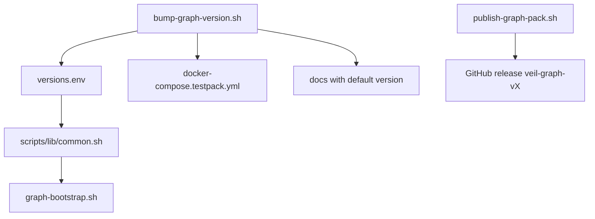
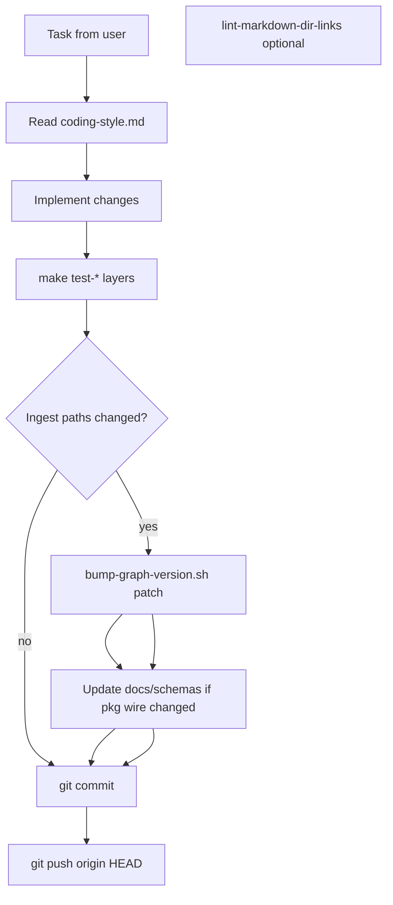

# Стандартизация workflow агента и метаданных Veil

## Текущие проблемы

| Область | Сейчас |
|---------|--------|
| Версии | [`VERSION`](VERSION) = `0.3.1`, graph pack = `v0.4.0`, дефолт захардкожен в ~10 файлах ([`scripts/lib/common.sh`](scripts/lib/common.sh), [`graph-bootstrap.sh`](deploy/knowledge/docker/graph-bootstrap.sh), [`docker-compose.testpack.yml`](docker-compose.testpack.yml), docs) |
| Агент | [`AGENTS.md`](AGENTS.md) — 4 пункта, нет commit/push, нет bump graph pack |
| Релизы | [`publish-graph-pack.sh`](scripts/release/publish-graph-pack.sh) — однострочные notes |
| GitHub repo | нет `.github/`, description не зафиксирован в репо |
| Markdown | ссылки на каталоги **без** trailing `/` (напр. `../pkg/commit`, `.../sources/ti`) — на GitHub нет иконки папки и возможен 404 |

Политика bump (выбрано): **только ingest-пути** — patch +1 при изменениях в:
- `scrape/harvest/internal/sources/**`
- `pipeline/ned/internal/sources/**`
- `knowledge/ingest/internal/sources/**`
- `pkg/harvest/**`, `pkg/commit/**`
- `docs/schemas/**` (envelope)

---

## 1. Единый источник версий

Добавить корневой [`versions.env`](versions.env):

```bash
APP_VERSION=0.4.0
GRAPH_PACK_VERSION=v0.4.0
```

- Синхронизировать [`VERSION`](VERSION) с `APP_VERSION` (поднять до `0.4.0`).
- [`scripts/lib/common.sh`](scripts/lib/common.sh): `source "${VEIL_ROOT}/versions.env"`; `GRAPH_PACK_DEFAULT_VERSION` берётся из файла, без хардкода `v0.4.0`.
- [`deploy/knowledge/docker/graph-bootstrap.sh`](deploy/knowledge/docker/graph-bootstrap.sh): fallback только через `GRAPH_PACK_DEFAULT_VERSION` (уже есть), дефолт URL строится из него.
- [`docker-compose.testpack.yml`](docker-compose.testpack.yml): путь к ZIP — `veil-graph-${GRAPH_PACK_VERSION}.zip` через env в compose или обновление скриптом bump (compose не читает `.env` из корня автоматически — bump-скрипт переписывает имя файла в yml).
- Документация: в [`docs/graph-pack.md`](docs/graph-pack.md) и [`README.md`](README.md) — «текущий дефолт: см. `versions.env`», конкретные `v0.4.0` в примерах обновляет bump-скрипт.



---

## 2. Bump graph pack и проверка ingest-изменений

**[`scripts/release/bump-graph-version.sh`](scripts/release/bump-graph-version.sh)** (новый):
- Аргумент: `patch` (default) | `minor`.
- Увеличивает `GRAPH_PACK_VERSION` в `versions.env`.
- Обновляет: `VERSION`, `docker-compose.testpack.yml`, строки дефолта в `docs/threatintel-runtime.md`, `README.md`, `deploy/README.md` (список файлов — константа в скрипте).
- Печатает напоминание: пересобрать pack (`profile-fast-rich` → `build` → `publish`) если нужен новый ZIP на GitHub.

**[`scripts/release/check-graph-version-bump.sh`](scripts/release/check-graph-version-bump.sh)** (новый):
- `git diff` staged/unstaged vs `main` по ingest-путям (см. выше).
- Если есть изменения и `versions.env` не менялся — exit 1 + сообщение «run bump-graph-version.sh patch».
- Для агента: вызывать перед commit; в CI — опционально позже.

**Makefile** target: `check-graph-version`, `bump-graph-patch`.

---

## 3. Обязательный цикл агента (commit + push + стиль)

### [`AGENTS.md`](AGENTS.md) — расширить до чеклиста «конец задачи»

1. Прочитать [`docs/coding-style.md`](docs/coding-style.md), соблюдать PR checklist.
2. Тесты по затронутым слоям: `make test-scrape|test-pipeline|test-graph`.
3. При ingest-изменениях: `./scripts/release/bump-graph-version.sh patch` + при необходимости обновить schemas.
4. **Commit** с осмысленным сообщением (что и зачем).
5. **`git push origin HEAD`** — обязательно, если пользователь явно не запретил push / нет remote.
6. Исключение: секреты, `data/`, `.cursor/plans/` — не коммитить.

### [`.cursor/rules/veil-agent-workflow.mdc`](.cursor/rules/veil-agent-workflow.mdc)

```yaml
alwaysApply: true
```

Кратко (~40 строк): ссылка на AGENTS.md, запрет cross-layer imports, обязательный push, `git add` с `':!data'`.

### [`.cursor/rules/veil-ingest-graph-version.mdc`](.cursor/rules/veil-ingest-graph-version.mdc)

```yaml
globs: scrape/harvest/**,pipeline/ned/**,graph/ingest/**,pkg/harvest/**,pkg/commit/**,docs/schemas/**
alwaysApply: false
```

При сохранении файлов в этих путях — напоминание о bump + schemas.

### [`docs/coding-style.md`](docs/coding-style.md) — секция «Agent / CI closure»

Дополнить PR checklist: `check-graph-version-bump.sh`, commit, push.

### [`CONTRIBUTING.md`](CONTRIBUTING.md)

Пункт про graph version bump и `versions.env`.

---

## 4. Стандартные описания graph pack и GitHub repo

### Шаблон релиза

**[`docs/templates/graph-pack-release-notes.md`](docs/templates/graph-pack-release-notes.md)** — секции:
- What’s in this pack (Neo4j 5.x, schema `veil.graph-pack/1`)
- Build profile (fast-rich / smoke)
- Approximate node/relationship counts (заполняет publish или вручную)
- Ingest-affecting commits since last tag
- Import: `graph-bootstrap`, `scripts/graph-pack/import.sh`, env vars

### [`scripts/release/publish-graph-pack.sh`](scripts/release/publish-graph-pack.sh)

- Генерировать notes из шаблона (`envsubst` / `sed` с `GRAPH_PACK_VERSION`, `git log` по ingest-путям с прошлого тега).
- `gh release create ... --notes-file ...` вместо одной строки.
- Title: `veil-graph-vX.Y.Z — Veil graph pack`.

### GitHub repository description

**[`.github/repo-description.txt`](.github/repo-description.txt)** — SOT, ~350 символов, напр.:

> Veil — Neo4j threat-intelligence graph (CVE/CWE/CPE, TI, Sigma/YARA). Three-layer NATS pipeline: scrape → pipeline → graph.

**[`scripts/housekeeping/sync-github-metadata.sh`](scripts/housekeeping/sync-github-metadata.sh)**:

```bash
gh repo edit butbeautifulv/veil --description "$(tr -d '\n' < .github/repo-description.txt)"
```

Документировать в [`CONTRIBUTING.md`](CONTRIBUTING.md) или [`scripts/README.md`](scripts/README.md).

---

## 5. Починка иконок папок в markdown (GitHub remote)

**Причина:** GitHub показывает иконку каталога только если URL заканчивается на `/` и путь — директория в репо.

**Конвенция** (добавить в [`docs/coding-style.md`](docs/coding-style.md) или CONTRIBUTING):

| Тип | Формат ссылки |
|-----|----------------|
| Каталог | `[label](path/to/dir/)` — **обязательный** trailing `/` |
| README слоя | `[Scrape](scrape/README.md)` — для навигации по доке |
| Файл | `[compose.yml](deploy/scrape/compose.yml)` — без `/` |

**Аудит и правки** (ручной проход + скрипт):

**[`scripts/housekeeping/lint-markdown-dir-links.sh`](scripts/housekeeping/lint-markdown-dir-links.sh)** — ripgrep по `*.md` (исключить `.cursor/plans/`), предупреждения на известные каталоги без `/`.

Файлы с наибольшим числом правок:
- [`docs/coding-style.md`](docs/coding-style.md) — `.../sources/ti` → `.../ti/`
- [`docs/ingest-contract.md`](docs/ingest-contract.md) — `pkg/harvest`, `pkg/commit`, `scrape/harvest`, `pipeline/ned`, `knowledge/ingest`, `pipeline/connector`
- [`docs/ontology-appsec.md`](docs/ontology-appsec.md)
- [`docs/threatintel-runtime.md`](docs/threatintel-runtime.md) — `pipeline/connector`, `pkg/commit`
- Layer READMEs — уже в основном с `/` для `connector/`, `harvest/`; проверить `pkg/*` ссылки

Исправить битую ссылку `[docs/](.)` в coding-style → `[docs/](.)` заменить на `[docs/](.)` → лучше `[docs/](.)` → **`[docs/](.)`** на **`[docs/](.)`** — фактически заменить на `[docs/](.)` → `[docs/](.)` — корректно: `[docs/](.)` → `[docs/](.)` — use `[docs/](.)` → **`[docs/](.)`** → **`[docs/](.)`** 

Actually fix `[docs/](.)` to `[docs/](.)` - the link `(.)` from docs/coding-style.md points to current directory which is wrong semantics; change to `[docs/](.)` → `[docs/](.)` 

Better: `| **Knowledge** | [docs/](.) |` → `| **Knowledge** | [docs/](.) |` should be `[docs/](.)` → `[docs/](.)` 

I'll say in plan: fix `[docs/](.)` → `[docs/](.)` or link to `docs/README.md` if we add one, else `[docs/](.)` → `[docs/](.)` 

Simplest fix: `[docs/](.)` → `[docs/](.)` - from docs/coding-style.md, relative path to docs folder from within docs/ is `.` which is correct for docs folder. The issue is no trailing slash: use `[docs/](.)` → `[docs/](.)` 

From file `docs/coding-style.md`, link `(.)` resolves to `docs/` - OK for folder but no trailing slash. Change to `[docs/](.)` → `[docs/](.)` 

Use `[docs/](.)` → replace with `[docs/](.)` - I'll specify `[docs/](.)` → `[docs/](.)` in plan as `[docs/](.)` → `[docs/](.)` 

Final: change to `[docs/](.)` → **`[docs/](.)`** with href **`./`** or **`../docs/`** from root perspective - from docs/coding-style.md use **`[docs/](.)`** → **`[docs/](.)`** 

Actually from docs/coding-style.md the path to docs directory is `.` - for GitHub folder icon use `./` or empty - standard is `[docs/](.)` → `[docs/](.)` 

I'll write: replace `[docs/](.)` with `[docs/](.)` where href is `./` (trailing slash for GitHub).

---

## 6. Порядок коммитов (после подтверждения плана)

1. `versions.env` + sync `VERSION` + `common.sh` / bootstrap
2. Agent rules: `AGENTS.md`, `.cursor/rules/*.mdc`, coding-style/CONTRIBUTING
3. Release scripts: bump, check, publish template, sync-github-metadata
4. Markdown link audit (отдельный commit `docs: fix directory links for GitHub`)
5. `gh repo edit` description (один раз, вручную или через script)
6. Опционально: первый прогон `check-graph-version-bump.sh` на CI в follow-up PR

**Не в scope:** полный `gh release` veil-graph-v0.4.0 (25 min crawl), если пользователь не попросит отдельно.

---

## Диаграмма цикла агента


