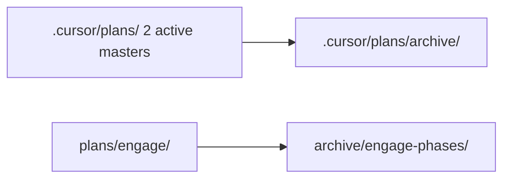
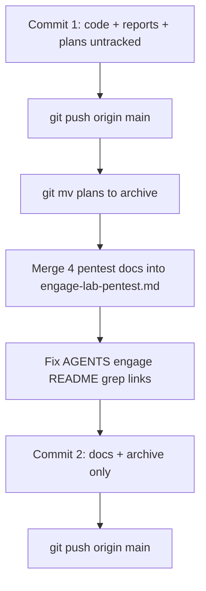

# Commit, push и актуализация документации

## Текущее состояние репозитория

На `main` (синхрон с `origin/main`) есть **незакоммиченная работа** из последней сессии:

| Тип | Пути |
|-----|------|
| Код / ops | [`scripts/ops/engage-core-tools.yaml`](scripts/ops/engage-core-tools.yaml) (новый), [`engage-tools-packages.yaml`](scripts/ops/engage-tools-packages.yaml), [`engage-tools-sources.yaml`](scripts/ops/engage-tools-sources.yaml), [`install-engage-host-tools.sh`](scripts/ops/install-engage-host-tools.sh), [`preflight-client-tools.sh`](scripts/engage/preflight-client-tools.sh) |
| Доки | [`AGENTS.md`](AGENTS.md), [`docs/engage/engage-install-linux.md`](docs/engage/engage-install-linux.md), [`docs/engage/engage-red-blue-bugs.md`](docs/engage/engage-red-blue-bugs.md), 3 новых hexstrike/self-pentest отчёта |
| Артефакты | `eval/results/veil-pentest-*.{md,json}`, планы `self_pentest_*`, `engage_158_*` (untracked) |

`git add` — с исключением `data/` ([`AGENTS.md`](AGENTS.md) § Commit): `git add -A -- . ':!data'`.

---

## Фаза 1 — Commit и push (сразу после подтвержления плана)

### Сообщение коммита (предложение)

```
feat(engage): core47 host install, self-pentest and lab reports

- core47 profile in packages/sources/preflight/installer
- Veil MCP aggressive prod pentest artifacts and report
- HexStrike lab probes (soft, intelligence, aggressive smart-scan)
- Field notes in engage-red-blue-bugs; AGENTS core47 quick path
```

### Push

`git push origin main` (ветка уже `main...origin/main`).

### Не включать в коммит без явного решения

- Локальные артефакты HexStrike (`eval/results/hexstrike-*.json`), если они ещё не в индексе — **добавить**, если нужна воспроизводимость отчётов; иначе оставить только `*-latest.md` и markdown-отчёты (меньше шума в git).
- `data/neo4j_user_export` — permission denied; не трогать.

---

## Фаза 2 — Архив завершённых планов

### Принцип

- **Не редактировать** содержимое plan-файлов (история/DoD) — только `git mv` в [`.cursor/plans/archive/`](.cursor/plans/archive/).
- Обновить [`.cursor/plans/archive/README.md`](.cursor/plans/archive/README.md): убрать устаревшую ссылку на «active plan» `pkg_dry_refactor` (файл уже в archive), добавить **индекс по темам** и дату последней уборки.

### Пакет A — завершено в сессии 2026-05

Перенести в `archive/` (плоско или `archive/2026-05-lab/`):

- [`self_pentest_engage_veil_api_7960f69f.plan.md`](.cursor/plans/self_pentest_engage_veil_api_7960f69f.plan.md)
- [`engage_158_tools_coverage_da886200.plan.md`](.cursor/plans/engage_158_tools_coverage_da886200.plan.md)
- [`engage_tool_source_map_659061ca.plan.md`](.cursor/plans/engage_tool_source_map_659061ca.plan.md)
- [`engage_userfriendly_install_73f6d9c0.plan.md`](.cursor/plans/engage_userfriendly_install_73f6d9c0.plan.md)
- [`engage/docs_commit_push_4e07b071.plan.md`](.cursor/plans/engage/docs_commit_push_4e07b071.plan.md)

### Пакет B — уже помечены **done** в [`AGENTS.md`](AGENTS.md) (строки 21–29)

Перенести в archive (корень → `archive/`):

- Platform: `veil_platform_refactor_p6`, `veil_platform_p7_*`, `veil_platform_v8_*`, `veil_platform_p12_*`, `veil_deploy_platform_p5_*`, `veil_platform_v3_*`, `veil_platform_v4_*`, `platform_phase_p0_*`, `platform_phase_p3_*`
- Engage program: `engage_hexstrike_master_*`, `engage_hexstrike_post_p10_*`, `engage_hexstrike_behavioral_port_*`, `engage_layer_greenfield_*`, `engage_master_post-audit_*`, `engage_phase_24` … `engage_phase_30`, `hexstrike_migration_audit_*`

### Пакет C — фазы Engage

- Весь каталог [`.cursor/plans/engage/`](.cursor/plans/engage/) → `archive/engage-phases/` (сохранить имена файлов).
- **Дубликаты без hash** (`engage_phase_14.plan.md` рядом с `engage_phase_14_9a37abf5.plan.md`): оставить в archive **оба** (история), в README archive отметить «stub vs slice»; не удалять без сравнения diff.

### Оставить в активном корне `.cursor/plans/`

| План | Причина |
|------|---------|
| [`engage_mcp_client_native_execution_master.plan.md`](.cursor/plans/engage_mcp_client_native_execution_master.plan.md) | AGENTS: **active** |
| [`engage_tools_full_coverage.plan.md`](.cursor/plans/engage_tools_full_coverage.plan.md) | До **158/158** (`P9f`) |

Опционально оставить один **master index** (новый короткий `engage-lab-master.plan.md` или обновить `engage_mcp_*`) со ссылками на archive — без дублирования тел фаз.

### Обновить ссылки

- [`AGENTS.md`](AGENTS.md) — completed tracks → `archive/...`
- [`docs/engage/engage-red-blue-lab.md`](docs/engage/engage-red-blue-lab.md) — ссылка на userfriendly plan → archive path
- `grep -r '.cursor/plans/' docs/ engage/ README` — массовая замена путей



---

## Фаза 3 — Дедупликация docs (меньше файлов)

### Проблема

Сейчас **четыре** пересекающихся отчёта по одной лабораторной теме:

| Файл | Содержание |
|------|------------|
| [`docs/engage-self-pentest-report.md`](docs/engage-self-pentest-report.md) | `pentest-veil-mcp.sh`, prod aggressive |
| [`docs/hexstrike-pentest-veil.md`](docs/hexstrike-pentest-veil.md) | intelligence API only |
| [`docs/hexstrike-veil-engage-soft-compare.md`](docs/hexstrike-veil-engage-soft-compare.md) | health + read-only |
| [`docs/hexstrike-aggressive-veil-pentest-report.md`](docs/hexstrike-aggressive-veil-pentest-report.md) | `smart-scan` + nuclei |

Плюс полевой лог [`docs/engage/engage-red-blue-bugs.md`](docs/engage/engage-red-blue-bugs.md) — **оставить** (краткие строки, не дублировать полные findings).

### Решение: один hub-документ

Создать **[`docs/engage/engage-lab-pentest.md`](docs/engage/engage-lab-pentest.md)** (единый источник):

1. **Scope** — ссылка на [`engage-red-blue-lab.md`](docs/engage/engage-red-blue-lab.md), localhost only.
2. **Veil harness** — методология + findings (из self-pentest report), ссылки на `eval/results/veil-pentest-prod-*`.
3. **HexStrike paths** — таблица трёх глубин (soft / intelligence / aggressive) + итоги nuclei; ссылка на [`external-hexstrike.md`](docs/external/external-hexstrike.md) для запуска `:8888`.
4. **Core47 install** — 46/47, ghidra gap — **краткий абзац** + ссылка на [`engage-install-linux.md`](docs/engage/engage-install-linux.md) (не копировать YAML-таблицы).
5. **Open actions** — 2 high (`ENG-CATALOG`, `GRAPH-OPEN`), HSTS — одна таблица.

**Удалить** после переноса содержимого и правки ссылок:

- `hexstrike-pentest-veil.md`
- `hexstrike-veil-engage-soft-compare.md`
- `hexstrike-aggressive-veil-pentest-report.md`
- `engage-self-pentest-report.md`

### Engage install / coverage (второй проход, без удаления generated)

| Действие | Файлы |
|----------|-------|
| Оставить canonical | [`engage-install-linux.md`](docs/engage/engage-install-linux.md), [`engage-runtime.md`](docs/engage/engage-runtime.md), [`engage-mcp-topology.md`](docs/engage/engage-mcp-topology.md) |
| Сократить перекрёстные абзацы | [`engage-client-dependencies.md`](docs/engage/engage-client-dependencies.md) vs [`engage-client-native-viability.md`](docs/engage/engage-client-native-viability.md) — один «dependencies» doc, второй → 5–10 строк + ссылка |
| Generated matrix | [`engage-tool-install-coverage.md`](docs/engage/engage-tool-install-coverage.md) — только ссылка из install-linux / `make engage-tool-install-coverage` |
| Audit KPI | [`engage-audit-report.md`](docs/engage/engage-audit-report.md) — единственный sign-off; не дублировать KPI в AGENTS (таблица статуса + ссылка) |

### Точки входа

- [`AGENTS.md`](AGENTS.md) — одна ссылка «Lab pentest & install field results» → `docs/engage/engage-lab-pentest.md`; core47 quick path оставить (3 команды).
- [`engage/README.md`](engage/README.md) — в секции docs заменить 4 pentest-ссылки на hub + bugs log.
- [`scripts/README.md`](scripts/README.md) — при необходимости одна строка на `scripts/eval/pentest-veil-mcp.sh`.

### Проверка

```bash
./scripts/housekeeping/lint-markdown-dir-links.sh
rg 'engage-self-pentest-report|hexstrike-aggressive|hexstrike-pentest-veil|hexstrike-veil-engage-soft'
```

Второй коммит: `docs: archive completed plans, consolidate lab pentest docs`.

---

## Порядок выполнения



---

## Definition of done

- [ ] Фаза 1: два push на `main` (или один, если пользователь предпочтёт squash — по умолчанию **два** коммита для review).
- [ ] В корне `.cursor/plans/` остаются только активные master-планы + `archive/`.
- [ ] `archive/README.md` актуален; нет битых ссылок на перенесённые планы.
- [ ] Вместо 4 pentest markdown — **один** [`docs/engage/engage-lab-pentest.md`](docs/engage/engage-lab-pentest.md) + [`engage-red-blue-bugs.md`](docs/engage/engage-red-blue-bugs.md).
- [ ] `rg` не находит удалённые имена файлов (кроме archive/history при необходимости).

## Вне scope (не блокирует doc cleanup)

- Исправление 2 high findings (auth на `/api/tools`, `/v1/categories`).
- Установка `ghidra` для 47/47.
- Полный HexStrike `smart-scan` с `max_tools > 1`.
