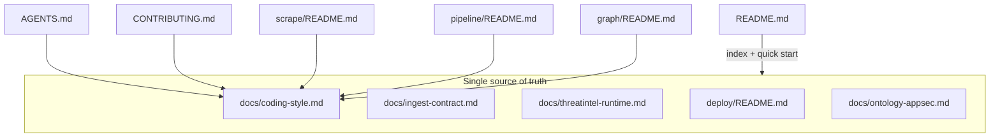

# Дедупликация и актуализация документации

## Проблема

Сейчас одни и те же правила (три слоя, DDD, PR checklist, NATS-контракт, compose) размазаны по [docs/coding-style.md](docs/coding-style.md) (~226 строк), [CONTRIBUTING.md](CONTRIBUTING.md), [README.md](README.md), layer READMEs и частично [docs/ingest-contract.md](docs/ingest-contract.md). Плюс **устаревшие пути** после переноса NVD в pipeline:

| Файл | Сейчас (неверно) | Должно быть |
|------|------------------|-------------|
| [README.md](README.md) L36 | `pipeline/pipeline/pkg/nvd/parse` | `pipeline/pkg/nvd/parse` |
| [docs/threatintel-runtime.md](docs/threatintel-runtime.md) L217 | `pipeline/pipeline/pkg/nvd/parse` | `pipeline/pkg/nvd/parse` |
| [docs/ontology-appsec.md](docs/ontology-appsec.md) L16 | `pipeline/pipeline/pkg/nvd/parse` | `pipeline/pkg/nvd/parse` |
| [docs/deploy.md](docs/deploy.md) L52 | `pkg/nvd/parse` | `pipeline/pkg/nvd/parse` |
| [pipeline/pkg/nvd/README.md](pipeline/pkg/nvd/README.md) | «used by harvest» | только pipeline NED enrich |

Фактический код: NVD парсится **только** в `pipeline/pkg/nvd/*` (импорт из [pipeline/ned/internal/sources/vuln/enrich/nvd.go](pipeline/ned/internal/sources/vuln/enrich/nvd.go)); harvest NVD не импортирует.



## Целевая иерархия документов

| Документ | Единственная роль |
|----------|-------------------|
| [docs/coding-style.md](docs/coding-style.md) | Принципы (CLEAN/DRY/KISS/DDD), изоляция слоёв, layering, **единый PR checklist**, Go style, naming/logging |
| [docs/ingest-contract.md](docs/ingest-contract.md) | `harvest` / `commit`, JetStream, Vitess ledger, TI/NVD wire semantics |
| [docs/threatintel-runtime.md](docs/threatintel-runtime.md) | Compose, порты, env, сервисы, bootstrap, API/MCP, NATS |
| [deploy/README.md](deploy/README.md) | Compose per layer, scaling, smoke, **graph pack releases** (контент из `docs/deploy.md`) |
| [README.md](README.md) | Описание проекта, mermaid-архитектура, quick start, **индекс ссылок** (без детальных таблиц модулей) |
| [AGENTS.md](AGENTS.md) | 4–6 пунктов для агентов + ссылки (уже почти идеален) |
| [CONTRIBUTING.md](CONTRIBUTING.md) | CoC, лицензия, шаги PR (тесты, schemas, runtime doc) — **без** повторения архитектуры |
| `{scrape,pipeline,graph}/README.md` | Build, layout tree, env-таблицы источников — **без** правил DDD/checklist |
| Module READMEs (`harvest/`, `ned/`, `ingest/`) | Одна страница на бинарь: binary, build, deploy link |

**Удалить:** [docs/deploy.md](docs/deploy.md) после переноса graph-pack/releases в [deploy/README.md](deploy/README.md).

**Не трогать:** `.cursor/plans/*`, `SECURITY.md`, `CODE_OF_CONDUCT.md`.

---

## 1. Переписать `docs/coding-style.md` (главный фокус)

**Оставить и уплотнить:**
- Design principles + таблица «что где делается» (scrape/pipeline/graph)
- Одна компактная таблица repo map (5 зон: docs, deploy, scrape, pipeline, graph, pkg)
- Layering diagram (`cmd` → domain → usecase → …) + **один объединённый PR checklist** (сейчас три разрозненных: общий L57, harvest L89, NED L156)
- Go style (Google) — одна секция
- Logging / naming / tests

**Убрать или заменить ссылками** (дубли с layer READMEs):
- Детальные таблицы модулей scrape/graph/pipeline (L61–157) → ссылки:
  - Scrape: [scrape/README.md](../scrape/README.md)
  - Pipeline: [pipeline/README.md](../pipeline/README.md), [pipeline/ned/README.md](../pipeline/ned/README.md)
  - Graph: [graph/README.md](../knowledge/README.md)
- Секция Wire envelopes (L160–165) → одна строка: «см. [ingest-contract.md](ingest-contract.md); Go SOT: `pkg/harvest`, `pkg/commit`»
- Дублирующая секция Errors (L202–206) — слить с Go style Errors

**Актуализировать domain paths** (сейчас неточно «mandatory `internal/domain/`»):
- Scrape: `internal/sources/<name>/internal/domain/`
- Graph ingest: `internal/sources/<name>/domain/`
- Graph serve: `internal/domain/`
- Pipeline: domain там, где есть сущности (сейчас `vuln/domain/`; остальные — transform без отдельного domain-пакета)

Формулировка: «domain-пакет у источника, без I/O; точный путь — по эталону в `scrape/.../ti` и `knowledge/ingest/.../ti`».

---

## 2. Упростить точки входа

### [README.md](README.md)
- Исправить путь NVD
- **Удалить** таблицу «Repository layout» (L96–106) — дублирует coding-style; оставить ссылку в Documentation index
- Сохранить mermaid + quick start + doc index

### [CONTRIBUTING.md](CONTRIBUTING.md)
- Пункт 1: «Read [docs/coding-style.md](docs/coding-style.md) (architecture + PR checklist)» — убрать перечисление `cmd → usecase → …`
- Остальное без изменений по смыслу (schemas, tests, serve/NATS rule, runtime doc)

### [AGENTS.md](AGENTS.md)
- Добавить якорную ссылку на PR checklist в coding-style (опционально одна строка)

### Layer READMEs
В начало [scrape/README.md](scrape/README.md), [pipeline/README.md](pipeline/README.md), [graph/README.md](knowledge/README.md):
- Одна строка: architecture rules → [docs/coding-style.md](../docs/coding-style.md)
- Убрать повтор «Layers communicate only via NATS» из pipeline/graph README (достаточно в coding-style) **или** оставить одну короткую фразу без таблиц

### [docs/ontology-appsec.md](docs/ontology-appsec.md)
- Исправить NVD path
- NATS-параграф (L31) сократить до ссылки на [ingest-contract.md](ingest-contract.md)
- Related docs: убрать `deploy.md`, заменить на `deploy/README.md`

---

## 3. Deploy: merge по вашему выбору

1. Перенести из [docs/deploy.md](docs/deploy.md) в [deploy/README.md](deploy/README.md):
   - Graph pack releases (таблица v0.3.2 vs main)
   - Build/export commands (если ещё нет)
2. Удалить дублирующие секции full stack / scale / smoke из `docs/deploy.md` (они уже в deploy/README)
3. **Удалить** `docs/deploy.md`
4. Обновить ссылки: [README.md](README.md) doc index, [ontology-appsec.md](docs/ontology-appsec.md), [threatintel-runtime.md](docs/threatintel-runtime.md) (если ссылается на deploy.md)

---

## 4. Мелкие актуализации

- [pipeline/pkg/nvd/README.md](pipeline/pkg/nvd/README.md): «pipeline NED enrich only; harvest publishes raw `scrape_nvd_page`»
- [docs/threatintel-runtime.md](docs/threatintel-runtime.md): fix NVD path; проверить, что `vulnFromNVDPage` ещё актуально как имя (или обобщить «pipeline vuln enrich»)
- Grep по репо на `docs/deploy.md`, `pipeline/pipeline/`, `pkg/nvd` в `.md` (кроме `.cursor/plans`)

---

## 5. Commit и push

После правок:
```bash
git add -A
git status && git diff --staged --stat
git commit -m "$(cat <<'EOF'
docs: deduplicate style guide and fix stale paths

Consolidate coding-style as architecture SOT, merge deploy docs,
remove repeated layer/checklist text, and correct pipeline/pkg/nvd links.
EOF
)"
git push
```

Сообщение коммита можно уточнить под фактический diff.

---

## Ожидаемый результат

- **coding-style.md**: ~100–130 строк вместо 226, без повторов layer READMEs и ingest-contract
- Один PR checklist, один deploy guide, исправленные пути NVD
- Новый контрибьютор: README → coding-style / ingest-contract / layer README по задаче
- Нет противоречий «NVD в harvest» vs реальный код
