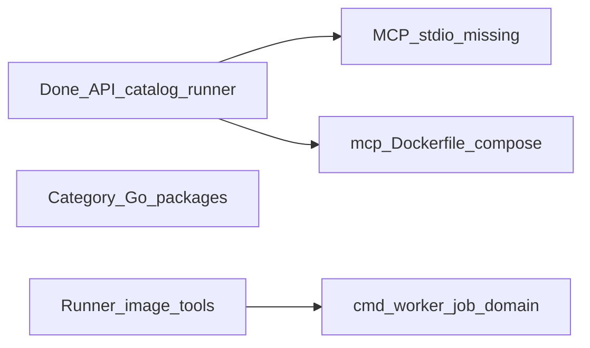

# Engage: пробелы, нейминг, следующие PR

## Что уже есть (первый коммит)

| Область | Статус | Пути |
|---------|--------|------|
| Слой + module | Done | [`engage/go.work`](engage/go.work), [`engage/serve/`](engage/serve/) |
| `pkg/auth` | Done | [`pkg/auth/`](pkg/auth/), knowledge/serve переведён |
| HTTP API | Done | [`cmd/api`](engage/serve/cmd/api/main.go), [`httpserver/router.go`](engage/serve/internal/transport/httpserver/router.go) |
| Catalog 150 имён | Done | [`catalog/tools.yaml`](engage/serve/catalog/tools.yaml) (имена из legacy MCP, **без** префикса HexStrike в `name`) |
| 5 live tools | Done | [`catalog/tools.live.yaml`](engage/serve/catalog/tools.live.yaml) |
| Runner + registry | Done | [`runner/`](engage/serve/internal/runner/), [`tools/registry.go`](engage/serve/internal/tools/registry.go) |
| veil-api client | Done | [`client/veilgraph/`](engage/serve/internal/client/veilgraph/) |
| Intelligence / workflows | Stub | [`usecase/intelligence`](engage/serve/internal/usecase/intelligence/), [`workflow`](engage/serve/internal/usecase/workflow/) |
| Deploy dev + secure | Done | [`deploy/engage/`](deploy/engage/) |
| Docs + Makefile | Done | [`docs/engage-*.md`](docs/), `make test-engage`, `catalog-engage` |

## Что в плане заявлено, но ещё не сделано (честный gap)



| Пункт плана | Факт |
|-------------|------|
| `internal/transport/mcpserver` | **Нет** — [`cmd/mcp`](engage/serve/cmd/mcp/main.go) только заглушка |
| `deploy/engage/docker/mcp.Dockerfile` | **Нет** |
| `internal/tools/network|web|cloud|...` | **Нет** — только YAML + generic `POST /api/tools/{name}` |
| `cmd/worker` | **Нет** |
| `domain/job`, `domain/target` | **Нет** |
| `runner/sandbox.go` | **Нет** |
| MCP ~151 tools для агентов | Агенты сейчас только через **HTTP** ([`engage.http.json.example`](examples/mcp/engage.http.json.example)) |

Имена tools (`nmap_scan`, `gobuster_scan`, …) — это **legacy API names**, не бренд; их менять не нужно. Убрать нужно **текст** `HexStrike parity` в `description` и заголовках YAML (150 строк).

---

## Правило нейминга (зафиксировать в плане)

- **Слой:** в [`engage/README.md`](engage/README.md), [`NOTICE.hexstrike`](engage/NOTICE.hexstrike), один абзац в [`docs/engage/engage-runtime.md`](docs/engage/engage-runtime.md) — «greenfield rewrite of MIT reference in `.external/`».
- **Catalog:** нейтральные `description` (что делает tool), без слова HexStrike.
- **Скрипт:** переименовать [`scripts/engage/extract-hexstrike-catalog.py`](scripts/engage/extract-hexstrike-catalog.py) → `extract-legacy-catalog.py`; Makefile target `catalog-engage` → `catalog-engage` (оставить) или `catalog-regen`.
- **Док:** [`docs/engage-hexstrike-parity.md`](docs/engage-hexstrike-parity.md) → переименовать в `docs/engage/engage-legacy-parity.md` (матрица совместимости, без бренда в заголовках tools).

---

## Разбивка на PR (малый diff)

Добавить в [`engage_layer_greenfield_9d048eec.plan.md`](.cursor/plans/engage_layer_greenfield_9d048eec.plan.md) секцию **«Phase 2+ (пошагово)»** и заменить статус старых todo на «foundation done» + новые id ниже.

### PR-1 — Catalog hygiene (следующий шаг, ~1 день)

**Цель:** один осмысленный diff, без логики.

- Обновить `extract-legacy-catalog.py`: `description: "<category> tool: <name>"` или краткое действие, не «HexStrike parity».
- Перегенерировать [`tools.yaml`](engage/serve/catalog/tools.yaml); header: `# Veil engage tool catalog (names aligned with legacy MCP reference)`.
- Поправить [`tools.live.yaml`](engage/serve/catalog/tools.live.yaml), тесты, docs.
- `make test-engage` зелёный.

**Не трогать:** `name:` полей (совместимость с legacy clients).

### PR-2 — MCP stdio `veil-engage` (~2–3 дня)

- Скопировать/адаптировать паттерн из [`knowledge/serve/internal/transport/mcpserver`](knowledge/serve/internal/transport/mcpserver/): LSP framing, `initialize` negotiation, `tools/list`, `tools/call` → [`usecase/tools`](engage/serve/internal/usecase/tools/run.go).
- `cmd/mcp`: полноценный stdio + optional HTTP (`ENGAGE_MCP_HTTP_*`).
- [`examples/mcp/engage.stdio.json.example`](examples/mcp/) + обновить docs.
- Тесты: `server_test.go`, smoke script.

### PR-3 — Deploy MCP (~0.5 дня)

- [`deploy/engage/docker/mcp.Dockerfile`](deploy/engage/docker/mcp.Dockerfile) (distroless).
- Сервис `engage-mcp` в [`compose.yml`](deploy/engage/compose.yml), порт `8892`.
- Secure overlay: nginx location `/engage-mcp` (опционально).

### PR-4 — Runner toolbox + enable-by-category (~2 дня)

- Расширить [`runner.Dockerfile`](deploy/engage/docker/runner.Dockerfile): minimal set (nmap, nuclei, httpx, subfinder, feroxbuster, …).
- Скрипт `scripts/engage/enable-catalog-by-category.sh` — выставить `enabled: true` для категории, если `which binary` ok (без 150 ручных правок).
- CI: `ENGAGE_TOOLS_MINIMAL=1` для smoke одного tool.

### PR-5 — Domain job + worker (опционально, ~2 дня)

- [`domain/job`](engage/serve/internal/domain/job/), async `cmd/worker` для long scans.
- Не блокирует агентов, если PR-2 готов.

### PR-6 — Category Go packages (опционально, низкий приоритет)

- Пакеты `internal/tools/network/` и т.д. **только** если нужны кастомные parsers/args; иначе catalog + generic runner достаточны (KISS).

---

## Обновление старого плана (вставить в конец файла)

```markdown
## Статус foundation (2026-05)

R0–R1 и deploy/docs: **сделано в первом коммите**.  
R2–R6 в исходном виде: **частично** (catalog + HTTP API + stubs; без MCP stdio и без Go-пакетов по категориям).

## Phase 2+ — пошаговые PR

| PR | id | Содержание |
|----|-----|------------|
| 1 | engage-pr1-catalog | Убрать HexStrike из YAML/docs; regen catalog |
| 2 | engage-pr2-mcp-stdio | veil-engage MCP transport |
| 3 | engage-pr3-mcp-deploy | mcp.Dockerfile + compose |
| 4 | engage-pr4-runner-tools | toolbox image + enable tools |
| 5 | engage-pr5-worker | job domain + worker (optional) |
| 6 | engage-pr6-category-go | category packages (optional) |
```

Пометить исходные todo `engage-r2-r5-tools` … `engage-r6-workflows` как **superseded by PR-1…PR-6** (foundation catalog ≠ category Go code).

---

## Рекомендуемый порядок

1. **PR-1** (нейминг + regen yaml) — сразу, минимальный риск.  
2. **PR-2 + PR-3** — агенты Cursor/Claude получают stdio `veil-engage`.  
3. **PR-4** — реальное исполнение tools в Docker.  
4. PR-5/6 — по необходимости.

После PR-1 можно обновить frontmatter старого плана: `engage-r2-r5` → `cancelled` или переименовать в `engage-pr1-catalog` … `pending`.
