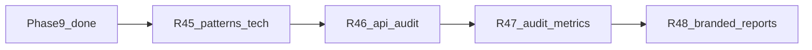

# Engage Phase 10 — intelligence deep parity & observability

## Контекст

[engage_layer_greenfield_9d048eec.plan.md](engage_layer_greenfield_9d048eec.plan.md): **Phase 9 (R40–R44) complete.** Достигнуто:

- NATS JetStream + Redis multi-worker e2e
- `ARGS_TEMPLATES` 128+; CI 10-tool matrix
- Playwright browser sidecar (real title/status)
- Secure overlay smoke + runner apt reliability

### Что остаётся после Phase 9

| Область | Сейчас | Phase 10 |
|---------|--------|----------|
| `attack_patterns` | 9 ключей в [patterns.go](engage/serve/internal/usecase/intelligence/patterns.go) | 20+ keys из HexStrike `_initialize_attack_patterns` (L698–809) |
| `TechnologyStack` | строки в `detect.go` / CMS boost | enum 15 значений + сигнатуры headers/body |
| API audit | `api_fuzzer` / schema tools по отдельности | `POST /api/intelligence/comprehensive-api-audit` (aggregate) |
| Audit | JSONL + `GET /api/audit/recent` | webhook batch export + optional SIEM JSON schema |
| Metrics | `GET /api/telemetry` (JSON) | Prometheus `/metrics` (jobs, tools, audit counters) |
| Reports | gofpdf plain text PDF | HTML template + branded PDF (logo, sections) |

**Вне Phase 10:** 150 Go adapters; Postgres audit store; Keycloak в default PR CI; line-by-line port 17k LOC Python.

---

## Цель Phase 10

Закрыть **agent-visible intelligence parity** с HexStrike `IntelligentDecisionEngine`: полные сценарии цепочек, технологический профиль цели, единый API security audit, эксплуатационная наблюдаемость (metrics + audit export), отчёты пригодные для заказчика.

---

## R45 — Full attack_patterns & TechnologyStack

**Источник:** [hexstrike_server.py](.external/hexstrike-ai-master/hexstrike_server.py) `TechnologyStack` (L455–471), `_initialize_attack_patterns` (L698–809), `_detect_technologies` (L880+), `select_optimal_tools` CMS boost (L962+).

**Сделать:**

- [engage/serve/internal/usecase/intelligence/techstack.go](engage/serve/internal/usecase/intelligence/techstack.go):
  - `type Technology string` + const block (apache, nginx, wordpress, …, unknown) — 15 значений
  - `DetectTechnologies(ctx, target, headers, body)` — header/body/path heuristics (port из detect.go)
- Расширить [patterns.go](engage/serve/internal/usecase/intelligence/patterns.go):
  - Добавить недостающие ключи: `binary_exploitation`, `ctf_pwn_challenge`, `container_security_assessment`, `iac_security_assessment`, `multi_cloud_assessment`, `bug_bounty_high_impact`, … (итого ≥20)
  - Маппинг short tool id → catalog name (`nmap` → `nmap_scan`, `scout-suite` → `scout_suite_assessment`)
- `SelectPatternKey`: cloud/binary/ctf objectives → соответствующие patterns
- `SelectToolsForTarget` / `cmsToolBoost`: использовать `TechnologyStack` вместо ad-hoc strings
- Тесты: pattern count ≥20, tech detection table, chain filters disabled tools

**Не в scope:** HTTP fingerprint database; ML-based tech detection.

---

## R46 — Comprehensive API audit

**Источник:** [hexstrike_mcp.py](.external/hexstrike-ai-master/hexstrike_mcp.py) `comprehensive_api_audit` (L3103+).

**Сделать:**

- [engage/serve/internal/usecase/intelligence/api_audit.go](engage/serve/internal/usecase/intelligence/api_audit.go):
  - `ComprehensiveAPIAudit(ctx, req)` — orchestration:
    1. API fuzz / endpoint discovery (httpx + ffuf или catalog `api_fuzzer` если enabled)
    2. Optional OpenAPI/schema parse (`schema_url`)
    3. Optional JWT analysis (`jwt_token`)
    4. Optional GraphQL probe (`graphql_endpoint`)
  - Response: `tests_performed[]`, `total_findings`, per-phase results, `recommendations[]`
- Route: `POST /api/intelligence/comprehensive-api-audit` в [httpserver](engage/serve/internal/transport/httpserver/)
- MCP: alias tool name `comprehensive_api_audit` → same handler (optional `tools/call` mapping)
- Тесты: handler with mocked runner; empty optional fields skips phases

**Не в scope:** Active exploitation; Burp import.

---

## R47 — Audit export & Prometheus metrics

**Сделать:**

- [engage/serve/internal/audit/export.go](engage/serve/internal/audit/export.go):
  - `ExportWebhook(ctx, url, events)` — POST JSON batch with retry (3x, backoff)
  - Env: `ENGAGE_AUDIT_WEBHOOK_URL`, `ENGAGE_AUDIT_WEBHOOK_SECRET` (HMAC optional)
  - `GET /api/audit/export?since=` — NDJSON download for SIEM
- [engage/serve/internal/telemetry/prometheus.go](engage/serve/internal/telemetry/prometheus.go):
  - Counters: `engage_tool_runs_total{tool,status}`, `engage_jobs_total{status}`, `engage_audit_events_total`
  - Gauges: `engage_jobs_pending`, `engage_cache_entries`
  - Route `GET /metrics` (behind `ENGAGE_METRICS_ENABLED=1`)
- Wire в [components/api.go](engage/serve/internal/components/api.go); document env in [docs/engage/engage-runtime.md](docs/engage/engage-runtime.md)
- CI: unit tests for metric registration; webhook mock server test

**Не в scope:** Grafana dashboards; Splunk HEC full schema.

---

## R48 — Branded HTML & PDF reports

**Сделать:**

- [engage/serve/internal/usecase/report/html.go](engage/serve/internal/usecase/report/html.go):
  - `RenderAssessmentHTML(report AssessmentReport, branding Branding)` — embedded template
  - Sections: executive summary, findings table, tools run, recommendations
- Extend [report/pdf.go](engage/serve/internal/usecase/report/pdf.go):
  - Branded header/footer (org name, date, classification banner)
  - Or HTML→PDF via wkhtmltopdf optional path (`ENGAGE_PDF_ENGINE=wkhtml|gofpdf`)
- `POST /api/visual/export-report`: `format=html|pdf`, `branding` optional JSON
- Sample branding in [docs/engage-reports.md](docs/engage-reports.md) (new, short)
- Golden test: HTML contains finding title; PDF non-empty bytes

**Не в scope:** HexStrike ANSI visual reports; interactive dashboards.

---

## Phase 11 (preview — не входит в Phase 10)

| Release | Содержание |
|---------|------------|
| R49 | Postgres audit store + retention |
| R50 | Keycloak in compose e2e (optional profile) |
| R51 | Cross-layer NATS events (engage → pipeline ingest) |
| R52 | Agent workflow templates (bugbounty playbooks as YAML) |

---

## Обновление планов (при реализации)

| Файл | Действие |
|------|----------|
| [engage_layer_greenfield_9d048eec.plan.md](engage_layer_greenfield_9d048eec.plan.md) | Секция **Phase 10** R45–R48 |
| [engage-legacy-parity.md](docs/engage/engage-legacy-parity.md) | API audit, metrics, full patterns |
| **Не редактировать** | `engage_phase_9_ed05c68b.plan.md`, `engage_phase_8.plan.md` |

---

## Критерии готовности Phase 10

- `AttackPatterns()` ≥ 20 keys; unit test на каждый ключ → ≥1 enabled step
- `TechnologyStack` 15 values; `technology-detection` returns typed list
- `POST /api/intelligence/comprehensive-api-audit` — 200 + `tests_performed` ≥1 для типичного API URL
- `GET /metrics` exposes job/tool counters when enabled
- Audit webhook smoke (mock server) or export NDJSON
- `export-report?format=html` returns branded HTML; PDF includes header branding
- `make test-engage` green

---

## Рекомендуемый порядок PR

1. **R45** — patterns + tech stack (разблокирует audit tool selection)
2. **R46** — comprehensive API audit (видимый API parity)
3. **R47** — metrics + audit export (ops)
4. **R48** — branded reports (deliverables)
