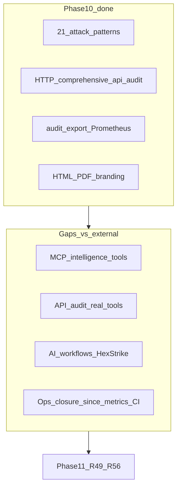

# Engage — аудит Phase 10 vs `.external` и следующий слайс

## Вердикт

**Phase 10 можно считать закрытой** для заявленного scope ([engage_phase_10.plan.md](.cursor/plans/engage_phase_10.plan.md), [greenfield Phase 10](.cursor/plans/engage_layer_greenfield_9d048eec.plan.md)): `make test-engage` green, все R45–R48 в коде есть, критерии плана в основном выполнены.

**Полный parity с HexStrike (151 MCP + Python `IntelligentDecisionEngine`) — нет** и не был целью Phase 10. Для agent-visible сценариев остаются **структурные** пробелы, которые логично вынести в **Phase 11**.

---

## Что на месте (Phase 10)

| Критерий плана | Факт в репо |
|----------------|-------------|
| `AttackPatterns()` ≥ 20 | **25** ключей в [patterns.go](engage/serve/internal/usecase/intelligence/patterns.go); все **15** ключей HexStrike `_initialize_attack_patterns` покрыты |
| `TechnologyStack` 15 значений | [techstack.go](engage/serve/internal/usecase/intelligence/techstack.go), `technology-detection` отдаёт `technology_stack` |
| `POST /api/intelligence/comprehensive-api-audit` | [api_audit.go](engage/serve/internal/usecase/intelligence/api_audit.go) + route в [router.go](engage/serve/internal/transport/httpserver/router.go) |
| Prometheus `/metrics` | [telemetry/prometheus.go](engage/serve/internal/telemetry/prometheus.go), `ENGAGE_METRICS_ENABLED=1` |
| Audit export / webhook | [audit/export.go](engage/serve/internal/audit/export.go), `GET /api/audit/export`, `POST /api/audit/export-webhook` |
| Branded HTML/PDF | [html.go](engage/serve/internal/usecase/report/html.go), `export-report` с `format=html\|pdf` |
| Документация | [engage-legacy-parity.md](docs/engage-legacy-parity.md), [engage-reports.md](docs/engage-reports.md), [engage-runtime.md](docs/engage-runtime.md) |

---

## Пробелы vs `.external/hexstrike-ai-master`

### 1. MCP intelligence tools (критично для агентов)

- HexStrike: **151** `@mcp.tool`, из них ~13 intelligence/audit (`comprehensive_api_audit`, `analyze_target_intelligence`, `create_attack_chain_ai`, …).
- Engage MCP: только `tools/list` + `tools/call` → **subprocess по catalog** ([mcpserver](engage/serve/internal/transport/mcpserver/server.go)).
- В [tools.yaml](engage/serve/catalog/tools.yaml) intelligence-инструменты имеют фиктивные `binary` (`comprehensive`, `correlate`, `bugbounty`) — **`tools/call` не вызывает HTTP intelligence API**.
- HTTP-маршруты (`/api/intelligence/*`) работают; **MCP parity для intelligence — нет**.

*План Phase 10: MCP alias — optional; **не сделан**.*

### 2. Comprehensive API audit — shallow vs legacy

- HexStrike [comprehensive_api_audit](.external/hexstrike-ai-master/hexstrike_mcp.py) вызывает `api_fuzzer`, `api_schema_analyzer`, `jwt_analyzer`, `graphql_scanner`.
- Engage: **лёгкие HTTP-эвристики** в `phaseAPIDiscovery` / `phaseSchemaAnalysis` ([api_audit.go](engage/serve/internal/usecase/intelligence/api_audit.go) L94+), без `Runner.Run` для `api_fuzzer`, `httpx_probe`, `graphql_scanner` при `enabled: true`.

### 3. AI / advanced intelligence (вне Phase 10, нет в engage)

В `.external` есть, в Go **нет** HTTP/MCP реализации:

- `analyze_target_intelligence`, `create_attack_chain_ai`, `intelligent_smart_scan`
- `ai_vulnerability_assessment`, `discover_attack_chains`, `correlate_threat_intelligence`
- `vulnerability_intelligence_dashboard`

Engage заменяет часть этого упрощёнными `analyze-target`, `create-attack-chain`, `smart-scan` — **не 1:1**.

### 4. Мелкие closure-пробелы Phase 10

| Пункт плана | Статус |
|-------------|--------|
| `GET /api/audit/export?since=` | Store поддерживает `since` ([store.go](engage/serve/internal/audit/store.go) L105), но router всегда передаёт `time.Time{}` (L452) |
| `ENGAGE_PDF_ENGINE=wkhtml` | Не реализован (только gofpdf) |
| Logo в HTML branding | `logo_url` в [branding.go](engage/serve/internal/usecase/report/branding.go), в HTML не рендерится |
| CI smoke metrics/webhook | Unit-тесты есть; нет compose/CI scrape smoke |

### 5. Осознанно out of scope (не Phase 11 blocker)

- 150 отдельных Go adapters — generic runner + YAML
- ~5 tools enabled в [tools.live.yaml](engage/serve/catalog/tools.live.yaml) (остальные по PATH/CI matrix)
- HexStrike ANSI `format_tool_output_visual`
- Line-by-line port ~17k LOC Python

---

## Сравнение attack_patterns

| Источник | Ключей |
|----------|--------|
| HexStrike `_initialize_attack_patterns` | 15 |
| Engage `AttackPatterns()` | **25** (15 legacy + 10 расширений: `osint_passive_recon`, `active_directory_assessment`, …) |

Глубина шагов в engage **короче**, чем в HexStrike (3–7 tools vs 6–8 с богатыми `params`) — приемлемо для lab, не полный клон.

---

## Рекомендация: следующий слайс **Phase 11**

Объединить preview из [engage_phase_10.plan.md](engage_phase_10.plan.md) (R49–R52) и **closure backlog** после аудита `.external`.

| Release | Содержание | Зачем |
|---------|------------|--------|
| **R49** | Postgres audit store + retention | Ops / SIEM scale (было в preview) |
| **R50** | Keycloak optional compose e2e profile | Secure deploy end-to-end |
| **R51** | Cross-layer NATS events (engage → pipeline) | Veil stack integration |
| **R52** | Bugbounty playbooks as YAML templates | Agent workflows |
| **R53** | **MCP intelligence bridge**: `tools/call` для `category: intelligence` и `comprehensive_api_audit` → HTTP handlers / in-process Intel | Закрывает главный MCP gap |
| **R54** | **API audit depth**: orchestration через `Tools.Run` (`api_fuzzer`, `api_schema_analyzer`, `jwt_analyzer`, `graphql_scanner`) when enabled | Parity с HexStrike aggregate |
| **R55** | **Intelligence MCP HTTP parity** (минимум): `analyze_target_intelligence` → `analyze-target`, `create_attack_chain_ai` → `create-attack-chain`; document AI tools as out-of-scope or veil-graph stub | Agent tool names match legacy |
| **R56** | Phase 10 closure: `audit/export?since=`, optional metrics CI, logo in HTML | Мелочи из критериев |

### Порядок PR

1. **R53** — MCP bridge (максимальный эффект для Cursor/agents)
2. **R54** — real API audit tools
3. **R56** — closure
4. **R49–R52** — infra/playbooks по приоритету продукта

### Не редактировать

- [engage_phase_10.plan.md](engage_phase_10.plan.md) (по вашему правилу)
- [engage_phase_9_ed05c68b.plan.md](engage_phase_9_ed05c68b.plan.md), phase 7/8 plans

### При старте Phase 11

- Создать [engage_phase_11.plan.md](.cursor/plans/engage_phase_11.plan.md) с todos `engage-r49`…`engage-r56`
- Обновить [engage_layer_greenfield_9d048eec.plan.md](.cursor/plans/engage_layer_greenfield_9d048eec.plan.md) секцией Phase 11

---

## Итог для решения

| Вопрос | Ответ |
|--------|--------|
| Phase 10 «на месте»? | **Да** — для заявленного scope и greenfield |
| `.external` полностью покрыт? | **Нет** — MCP intelligence, AI tools, глубина API audit |
| Нужен следующий слайс? | **Да — Phase 11** (R49–R52 + R53–R56) |

Если нужна **минимальная** Phase 11 только для agent parity — достаточно **R53 + R54 + R56**; R49–R52 отложить на Phase 12.
