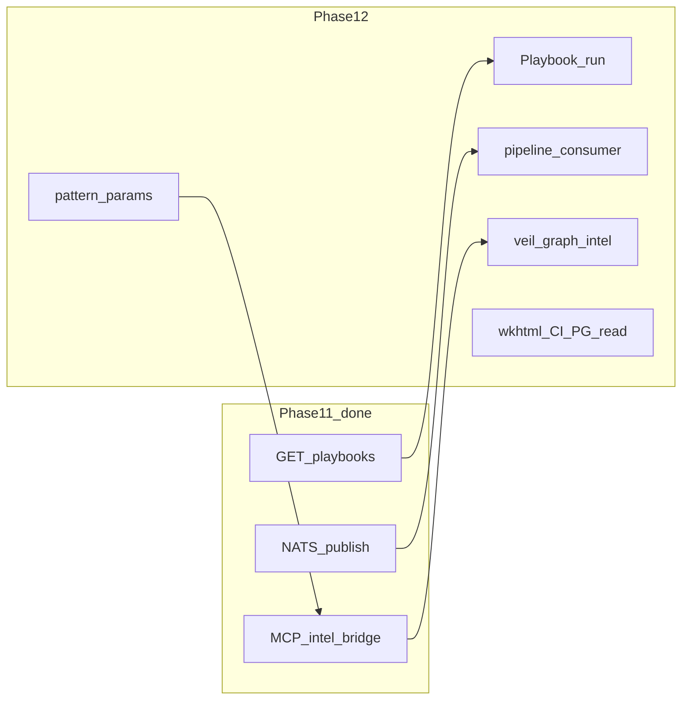

# Engage Phase 12 — Playbooks execution, Veil bus closure, graph intelligence

## Контекст

[Phase 11](.cursor/plans/engage_phase_11.plan.md) закрыла R49–R56: MCP bridge, deep API audit, Postgres audit mirror, NATS publish, playbooks **list**, Keycloak/metrics smokes.

Остаётся (из [аудита Phase 11](.cursor/plans/engage_phase_11_audit_06020c9c.plan.md) и кода):

| Пробел | Сейчас |
|--------|--------|
| R55 (имена AI tools) | Частично в [intel_bridge.go](engage/serve/internal/transport/mcpserver/intel_bridge.go); `ai_vulnerability_assessment`, `discover_attack_chains` — **не** замаплены |
| R52 playbooks | Только `GET /api/playbooks`; нет run/MCP |
| R51 NATS | Engage **публикует** `engage.events.audit`; **pipeline не подписан** |
| Pattern depth | 25 ключей есть, но `Params` короче HexStrike; chain не всегда прокидывает params в runner |
| Closure | `ENGAGE_PDF_ENGINE=wkhtml` нет; metrics/webhook не в основном CI job; Postgres — append-only, нет `recent`/`export` с PG |

**Не редактировать:** [engage_phase_10.plan.md](.cursor/plans/engage_phase_10.plan.md), [engage_phase_11_audit_06020c9c.plan.md](.cursor/plans/engage_phase_11_audit_06020c9c.plan.md), phase 7–9 plans.

---

## Releases (R57–R62)

### R57 — Playbook execution

**Цель:** YAML playbooks из [bugbounty.yaml](engage/serve/playbooks/bugbounty.yaml) становятся исполняемыми workflow, не только справочником.

| Deliverable | Детали |
|-------------|--------|
| HTTP | `POST /api/playbooks/{name}/run` — body: `target`, optional `async`; резолв через [FindPlaybook](engage/serve/internal/usecase/workflow/playbooks.go) → `workflow.RunWorkflow` / `SmartScan` с `objective` + `max_tools` из YAML |
| MCP | В `intel_bridge`: `tools/call` для имён playbook/workflow alias (или общий `run_playbook`) |
| Tests | `playbooks_test.go` + router test: run `reconnaissance` against httptest target |

**Файлы:** [router.go](engage/serve/internal/transport/httpserver/router.go), [workflow/workflow.go](engage/serve/internal/usecase/workflow/workflow.go), [intel_bridge.go](engage/serve/internal/transport/mcpserver/intel_bridge.go).

---

### R58 — Pipeline consumer (закрытие R51 end-to-end)

**Цель:** События engage попадают в Veil ingest bus без cross-layer Go imports (NATS only).

| Deliverable | Детали |
|-------------|--------|
| Wire contract | В [pkg/commit](pkg/commit/): `SourceEngage = "engage"`, `KindEngageToolRun = "engage_tool_run"`; payload: tool, target, subject, success, at |
| Pipeline | Новый pull consumer в `pipeline/` (например `pipeline/engage-events/` или расширение [connector](pipeline/connector/nats/)): подписка на `engage.events.>`, маппинг → `commit.Envelope`, publish на `ingest.engage` (или существующий ingest subject + stream ensure) |
| Compose | `deploy/engage/compose.events.yml` overlay: shared NATS + engage `ENGAGE_EVENTS_NATS_ENABLED=1` + pipeline consumer |
| Smoke | `scripts/test/smoke-engage-events-pipeline.sh` — один tool run → сообщение в JetStream → consumer ack |
| Docs | [engage-runtime.md](docs/engage/engage-runtime.md), кратко в [pipeline/README.md](pipeline/README.md) |

**Ограничение:** consumer не импортирует `engage/serve`; только `pkg/commit` + NATS.

---

### R59 — Veil-graph intelligence depth (R55 + AI tool names)

**Цель:** Agent-visible tools с legacy именами дают обогащённый ответ через veil-api, без порта Python LLM.

| Tool (catalog) | Реализация |
|----------------|------------|
| `correlate_threat_intelligence` | [veilgraph.Search](engage/serve/internal/client/veilgraph/client.go) по IOC/domain из target + indicators; merge в ответ |
| `discover_attack_chains` | `AnalyzeTarget` + `CreateAttackChain` + optional graph search по technologies/CVE |
| `ai_vulnerability_assessment` | `SmartScan` / ranked nuclei + findings summary + graph context; document as **deterministic**, not LLM |
| MCP | Добавить cases в [intel_bridge.go](engage/serve/internal/transport/mcpserver/intel_bridge.go) |
| HTTP (optional) | `POST /api/intelligence/correlate-threat` если удобнее для non-MCP clients |
| Docs | [engage-legacy-parity.md](docs/engage/engage-legacy-parity.md): AI-* web tools (`ai_generate_*`) остаются subprocess/stub; intelligence AI names = graph-backed |

**Out of scope:** настоящий LLM/HexStrike `IntelligentDecisionEngine` Python port.

---

### R60 — Attack pattern param depth

**Цель:** Шаги цепочек ближе к HexStrike (богатые `params` для топ-15 legacy keys).

| Deliverable | Детали |
|-------------|--------|
| [patterns.go](engage/serve/internal/usecase/intelligence/patterns.go) | Расширить `Params` для 15 legacy keys (ports, templates, `additional_args`, …) по `.external` reference |
| [create chain execution](engage/serve/internal/usecase/intelligence/) | `CreateAttackChain` / job enqueue передаёт `AttackStep.Params` в `ToolRunRequest.Parameters` |
| Test | Golden: `web_reconnaissance` step 1 → nmap params non-empty |

---

### R61 — Phase 11 ops closure

| Item | Детали |
|------|--------|
| `ENGAGE_PDF_ENGINE` | `gofpdf` (default) \| `wkhtml` — optional subprocess `wkhtmltopdf` в [report/](engage/serve/internal/usecase/report/) |
| CI | Добавить в [.github/workflows/engage.yml](.github/workflows/engage.yml): `make test-engage-metrics` (continue-on-error off); optional webhook mock test |
| Postgres read | `GET /api/audit/recent` и `export` при `ENGAGE_AUDIT_POSTGRES_URL`: merge или fallback query из [postgres.go](engage/serve/internal/audit/postgres.go) (`Recent`, `ExportNDJSON`) |

---

### R62 — Catalog hygiene & CI matrix (optional, если время)

- Переклассифицировать miscategorized `category: intelligence` binary tools (`checksec_analyze`, `volatility_*`, `objdump_analyze`) → `binary` / `forensics` в [tools.yaml](engage/serve/catalog/tools.yaml) (regen script)
- Расширить [tools.live.yaml](engage/serve/catalog/tools.live.yaml) + CI matrix на +5–10 enabled tools (api_fuzzer, graphql_scanner, …)
- `make test-engage-parity` — assert intelligence bridge tools count

---

## Порядок PR

1. **R57** — playbooks run (быстрый agent win)
2. **R59** — graph intelligence (закрывает R55 + audit gap #3)
3. **R58** — pipeline consumer (архитектурно важно для Veil)
4. **R60** — pattern depth
5. **R61** — closure
6. **R62** — optional polish

## Критерии готовности Phase 12

- `POST /api/playbooks/reconnaissance/run` → 200 + workflow result
- При `ENGAGE_EVENTS_NATS_ENABLED=1` + pipeline consumer: tool run → envelope на ingest subject (smoke green)
- MCP `discover_attack_chains` / `ai_vulnerability_assessment` → JSON без bogus subprocess
- `CreateAttackChain` передаёт params в первый enabled step (unit test)
- `make test-engage` green; новые smokes documented in Makefile
- Создать [engage_phase_12.plan.md](.cursor/plans/engage_phase_12.plan.md); обновить секцию Phase 12 в [engage_layer_greenfield_9d048eec.plan.md](.cursor/plans/engage_layer_greenfield_9d048eec.plan.md)

## Минимальный слайс (если сжать scope)

Достаточно **R57 + R59 + R61** для agent + ops; **R58** и **R60** — в Phase 12b или Phase 13.
