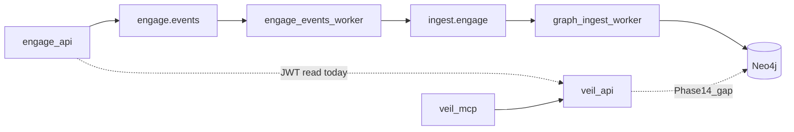

# Engage Phase 14 — Graph read API, correlation, agent closure

## Контекст

[Phase 13](.cursor/plans/engage_phase_13_3c4af607.plan.md) (R63–R68, в [greenfield](.cursor/plans/engage_layer_greenfield_9d048eec.plan.md)) закрыла **write path**: engage → `engage.events.*` → [engage-events-worker](pipeline/engage-events/cmd/worker) → `ingest.engage.*` → [graph ingest engage](knowledge/ingest/internal/sources/engage/) → Neo4j (`EngageToolRun`, `EngageFinding`, `EngageTarget`). Graph pack **v0.4.3**.

**Главный разрыв:** данные engage есть в Neo4j, но [veil-api](knowledge/serve/internal/transport/httpserver/router.go) не знает категорию `engage` — [categories.go](knowledge/connector/query/categories.go) содержит только scrape-источники (`vuln`, `ti`, …). [veilgraph.Search](engage/serve/internal/client/veilgraph/client.go) и `correlate_threat_intelligence` не видят сканы/находки engage.

**Не редактировать:** [engage_phase_13_3c4af607.plan.md](.cursor/plans/engage_phase_13_3c4af607.plan.md), phase 10–12 plan files.

---

## Releases (R69–R74)

### R69 — veil-api / MCP read для engage nodes (приоритет #1)

**Цель:** Phase 13 write path становится видимым агентам через существующий graph read API (без прямого Bolt из engage).

| Deliverable | Детали |
|-------------|--------|
| Category | В [graph/connector/query/categories.go](knowledge/connector/query/categories.go): `engage` → labels `EngageToolRun`, `EngageFinding`, `EngageTarget`; добавить в `categoryOrder` |
| Search | Использовать существующий `SearchInCategory` / `GET /v1/categories/{category}/search` — поиск по `target`, `tool`, `title`, `severity` (props уже на нодах) |
| Neighbors (минимум) | `GET /v1/nodes/{id}/neighbors` для `EngageTarget` — отдавать `ENGAGE_RAN` / `ENGAGE_FOUND` (при необходимости — узкий Cypher в [graph/connector/query/service.go](knowledge/connector/query/service.go)) |
| Engage client | [veilgraph/client.go](engage/serve/internal/client/veilgraph/client.go): `Search(ctx, "engage", q)`; в [graph_intel.go](engage/serve/internal/usecase/intelligence/graph_intel.go) добавить `engage` в цикл `CorrelateThreatIntelligence` / `DiscoverAttackChains` |
| MCP | [veil-mcp](knowledge/serve/cmd/mcp) — категория `engage` в `list_categories` / search tools без нового бинарника |
| Tests | `knowledge/serve` router tests: `/v1/categories` содержит `engage`; search smoke с mock Neo4j или testcontainers |
| Docs | [docs/threatintel-runtime.md](docs/threatintel-runtime.md), [docs/mcp-agents.md](docs/mcp-agents.md), [docs/engage-legacy-parity.md](docs/engage-legacy-parity.md) |

**Out of scope R69:** отдельный `GET /v1/engage/*` REST namespace — достаточно категории `engage` в categorical API.

**Graph version:** только если меняются constraint/index Cypher в read path — иначе bump не нужен (ingest schema уже в v0.4.3).

---

### R70 — Events bus e2e до Neo4j (закрытие R64)

**Цель:** Smoke не только «сообщение на INGEST», а **нода в Neo4j**.

| Deliverable | Детали |
|-------------|--------|
| [smoke-engage-events-pipeline.sh](scripts/test/smoke-engage-events-pipeline.sh) | Поднять `--profile graph-ingest`; после tool run: `cypher-shell` `MATCH (r:EngageToolRun) RETURN count(r) AS c` ≥ 1 |
| Compose | [compose.events.yml](deploy/engage/compose.events.yml) — убедиться, что `ingest_worker` ждёт Neo4j healthy и подписан на `ingest.>` |
| CI | [.github/workflows/engage.yml](.github/workflows/engage.yml): при наличии docker — fail если Neo4j count = 0 (сейчас WARN на NATS CLI) |
| Makefile | Краткая заметка в target help / [engage-runtime.md](docs/engage-runtime.md) |

---

### R71 — Finding ↔ TI/vuln correlation (light)

**Цель:** Минимальная связь findings с intel-графом (без enrichment engine).

| Deliverable | Детали |
|-------------|--------|
| Ingest (optional) | В [neo4j.go](knowledge/ingest/internal/sources/engage/storage/neo4j.go): если `title`/`description` содержит CVE-YYYY-NNNNN — `OPTIONAL MATCH` `Vulnerability` + `MERGE (f)-[:MAY_RELATE_TO]->(v)` |
| Read API | `correlate-threat` / новый поле в ответе: `engage_findings` из category search по target |
| Assessment | [assessment.go](engage/serve/internal/usecase/workflow/assessment.go) — publish findings на bus (как [smartscan.go](engage/serve/internal/usecase/workflow/smartscan.go)) |
| Tests | Unit test CVE regex + ingest apply mock |

**Out of scope:** полная корреляция с Semgrep/Nuclei nodes, batch enrichment jobs.

---

### R72 — Agent MCP closure (остаток R68)

| Item | Детали |
|------|--------|
| `ai_generate_attack_suite` | В [agent_tools.go](engage/serve/internal/transport/mcpserver/agent_tools.go): deterministic suite — `CreateAttackChain` + `payloads.Generate` summary (не LLM); убрать generic stub для `ai_generate_attack_suite` |
| Pattern params | Сверка 15 legacy keys в [patterns.go](engage/serve/internal/usecase/intelligence/patterns.go) с `.external/hexstrike-ai-master`; дополнить `Params` где пусто; [patterns_test.go](engage/serve/internal/usecase/intelligence/patterns_test.go) golden |
| Schemas | [docs/schemas/commit-envelope.json](docs/schemas/commit-envelope.json) — optional `kind` examples для `engage_tool_run` / `engage_finding` |

---

### R73 — Catalog & runner execution scale

**Цель:** CI реально гоняет больше инструментов, не только stubs.

| Deliverable | Детали |
|-------------|--------|
| [tools.live.yaml](engage/serve/catalog/tools.live.yaml) | +5–10 tools с рабочими minimal args (или `enabled: false` + matrix only when binary present) |
| [runner.Dockerfile](deploy/engage/docker/runner.Dockerfile) | Установить `ffuf`, `arjun`, `nuclei`, `httpx` и т.д. для matrix |
| [smoke-engage-tool-matrix.sh](scripts/test/smoke-engage-tool-matrix.sh) | Target ≥15 passed/skipped; document skip policy |
| R62 hygiene | Переклассифицировать misc `category: intelligence` binary tools → `binary` в [tools.yaml](engage/serve/catalog/tools.yaml) + regen |

---

### R74 — Pack publish & dual-MCP docs

| Item | Детали |
|------|--------|
| Release | Опубликовать `veil-graph-v0.4.3.zip` если ещё нет на GitHub ([publish-graph-pack.sh](scripts/release/publish-graph-pack.sh)) |
| Agent docs | [docs/mcp-agents.md](docs/mcp-agents.md): workflow «run tool on engage → query engage category on veil-mcp» |
| Greenfield | Секция Phase 14 в [engage_layer_greenfield_9d048eec.plan.md](.cursor/plans/engage_layer_greenfield_9d048eec.plan.md); создать `engage_phase_14.plan.md` (отдельный файл, **не** править phase 13 plan) |

---

## Порядок PR

1. **R69** — graph read (разблокирует ценность ingest для агентов)
2. **R70** — Neo4j e2e smoke
3. **R71** — correlation + assessment findings bus
4. **R72** — MCP agent parity
5. **R73** — catalog/runner CI
6. **R74** — pack publish + docs

## Критерии готовности Phase 14

- `curl /v1/categories/engage/search?q=example.com` возвращает `EngageToolRun` / `EngageFinding` после events-enabled scan
- `make test-engage-events-pipeline` с `graph-ingest` подтверждает `EngageToolRun` count ≥ 1 в Neo4j
- `correlate_threat_intelligence` включает `engage` hits при настроенном `ENGAGE_VEIL_API_URL`
- `ai_generate_attack_suite` MCP → structured JSON (не stub)
- `make test-engage`, `make test-graph`, `make test-graph-serve` green
- Greenfield + `engage_phase_14.plan.md` обновлены

## Минимальный слайс

**R69 + R70** — read path + доказанный full loop; R71–R74 — Phase 14b при нехватке времени.

## Осознанно out of scope (как в Phase 13)

- LLM / HexStrike `IntelligentDecisionEngine`
- 150 отдельных Go adapters
- Line-by-line Python parity
- Отдельный engage read microservice
