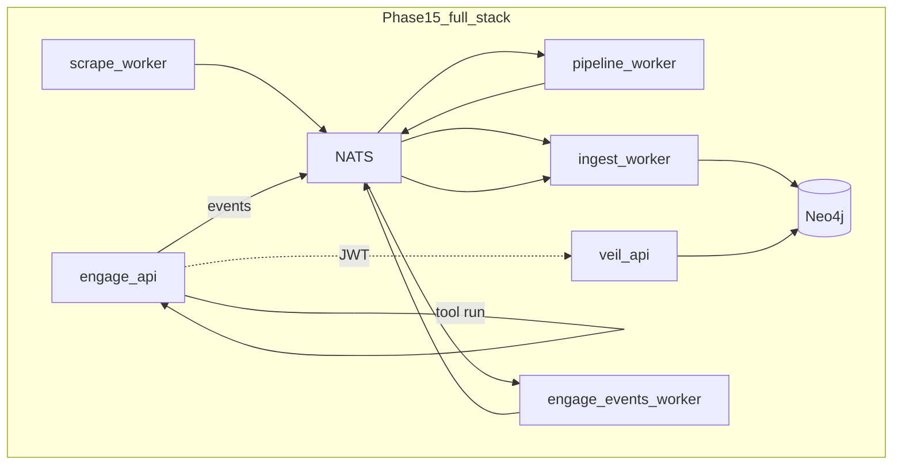

# Engage Phase 15 — Full stack, pack release, target timeline

## Контекст

[Phase 13](.cursor/plans/engage_phase_13_3c4af607.plan.md) закрыла **write path** (engage → Neo4j). [Phase 14](.cursor/plans/engage_phase_14_9a37abf5.plan.md) (R69–R74) закрыла **read path** (категория `engage` в veil-api/MCP, Neo4j smoke, лёгкая корреляция CVE). Graph pack в репо: **v0.4.4** ([versions.env](versions.env)).

**Оставшиеся разрывы после Phase 14:**

| Gap | Детали |
|-----|--------|
| Full stack | [compose-up-full.sh](scripts/ops/compose-up-full.sh) поднимает scrape/pipeline/graph **без** engage; events smoke использует **отдельный** NATS в [compose.events.yml](deploy/engage/compose.events.yml) |
| Pack release | R74: publish `veil-graph-v0.4.4` на GitHub — может быть не выполнен |
| Target-centric UX | Агент ищет по hostname (`example.com`), а не по `elementId`; neighbors для `EngageTarget` работают generically, но нет одного HTTP «timeline по target» |
| CI | `engage-events-e2e` — `continue-on-error: true`; workflow не триггерится на `knowledge/connector` / `knowledge/ingest/engage` |
| Catalog runner | 15 live tools, но runner image без rustscan/dalfox/gobuster; matrix best-effort |

**Не редактировать:** [engage_phase_14_9a37abf5.plan.md](.cursor/plans/engage_phase_14_9a37abf5.plan.md), phase 10–13 plan files.

---

## Releases (R75–R80)

### R75 — Full Veil + Engage lab stack (приоритет #1)

**Цель:** Один entrypoint поднимает TI pipeline + engage + events bus на **общих** NATS/Neo4j.

| Deliverable | Детали |
|-------------|--------|
| Compose overlay | Новый [deploy/engage/compose.veil-stack.yml](deploy/engage/compose.veil-stack.yml): `engage-api`, `engage-events-worker`, env `ENGAGE_EVENTS_NATS_ENABLED=1`, `ENGAGE_VEIL_API_URL=http://api:8090`, `NATS_URL=nats://nats:4222` (shared с knowledge/pipeline) |
| Script | [scripts/ops/compose-up-veil-engage.sh](scripts/ops/compose-up-veil-engage.sh) — вызывает `compose-up-full.sh` + engage overlay + optional `profile graph-ingest` / shared `ingest_worker` |
| Smoke | [scripts/test/smoke-veil-engage-stack.sh](scripts/test/smoke-veil-engage-stack.sh): tool run → `GET /v1/categories/engage/search?q=` → count ≥ 1 |
| Docs | [deploy/README.md](deploy/README.md), [docs/engage-runtime.md](docs/engage-runtime.md) |

**Не дублировать** второй NATS в events overlay при использовании veil-stack (документировать: либо standalone `compose.events.yml`, либо `compose.veil-stack.yml`).

---

### R76 — Graph pack v0.4.4 release (закрытие R74)

| Deliverable | Детали |
|-------------|--------|
| Build/publish | `GRAPH_PACK_VERSION=v0.4.4 ./scripts/graph-pack/build.sh` (или profile-fast-rich) + [publish-graph-pack.sh](scripts/release/publish-graph-pack.sh) |
| Verify | GitHub release `veil-graph-v0.4.4`; bootstrap smoke с [docker-compose.testpack.yml](docker-compose.testpack.yml) |
| Docs | [deploy/README.md](deploy/README.md) release table актуальна |

---

### R77 — Target timeline API (agent convenience)

**Цель:** Один engage HTTP endpoint для «всё по target» без отдельного `/v1/engage/*` namespace (согласно Phase 14 out of scope).

| Deliverable | Детали |
|-------------|--------|
| Endpoint | `POST /api/intelligence/target-timeline` (или `GET` с query `target=`): audit recent + `veilgraph` search `engage`/`vuln`/`ti` + `correlate` summary |
| Implementation | [graph_intel.go](engage/serve/internal/usecase/intelligence/graph_intel.go) + thin handler в [router.go](engage/serve/internal/transport/httpserver/router.go); MCP bridge name `target_timeline` / alias в [intel_bridge.go](engage/serve/internal/transport/mcpserver/intel_bridge.go) |
| Tests | Unit test with mock `Veil` client |
| Parity | [docs/engage-legacy-parity.md](docs/engage-legacy-parity.md) |

---

### R78 — Graph read polish (EngageTarget + MCP smoke)

| Deliverable | Детали |
|-------------|--------|
| Node lookup | В [service.go](knowledge/connector/query/service.go) `GetNode` / seed match: добавить `seed.name` для `EngageTarget` (hostname lookup) |
| MCP smoke | [scripts/test/smoke-graph-engage-category.sh](scripts/test/smoke-graph-engage-category.sh) — с testpack/compose: categories contains `engage`, search returns 200 |
| veil-mcp docs | Пример `ti_search_in_category` с `category=engage` в [docs/mcp-agents.md](docs/mcp-agents.md) |

---

### R79 — CI & runner hardening

| Deliverable | Детали |
|-------------|--------|
| engage.yml | Paths: `knowledge/connector/**`, `knowledge/ingest/internal/sources/engage/**`, `pipeline/engage-events/**`; `engage-events-e2e` **required** when Docker available (убрать silent pass on Neo4j fail) |
| Runner | [runner.Dockerfile](deploy/engage/docker/runner.Dockerfile): `rustscan`, `dalfox`, `gobuster` (apt или static); align с [tools.live.yaml](engage/serve/catalog/tools.live.yaml) |
| Matrix | [smoke-engage-tool-matrix.sh](scripts/test/smoke-engage-tool-matrix.sh): document 15 defined / N exercised policy; optional CI step on runner profile |

---

### R80 — Correlation traversal (light)

**Цель:** Read-side обход `MAY_RELATE_TO` (Phase 14 ingest), без batch enrichment engine.

| Deliverable | Детали |
|-------------|--------|
| Cypher/read | В [target-timeline](engage/serve/internal/usecase/intelligence/) или graph query helper: для findings с CVE — optional `MATCH (f)-[:MAY_RELATE_TO]->(v:Vulnerability)` и включить в JSON |
| Ingest test | Расширить [cve_test.go](knowledge/ingest/internal/sources/engage/storage/cve_test.go) + doc в [ingest-contract.md](docs/ingest-contract.md) |
| Graph version | Bump **patch** только если меняется ingest Cypher снова |

---

## Порядок PR

1. **R75** — full stack (максимальная интеграционная ценность)
2. **R76** — pack publish
3. **R77** — target timeline API
4. **R78** — graph read polish + smoke
5. **R79** — CI/runner
6. **R80** — correlation traversal

## Критерии готовности Phase 15

- `./scripts/ops/compose-up-veil-engage.sh` + smoke: tool run → engage search в veil-api на том же Neo4j
- GitHub release `veil-graph-v0.4.4` опубликован (или documented skip с причиной)
- `POST /api/intelligence/target-timeline` возвращает audit + graph hits
- `make test-engage`, `make test-graph`, `make test-graph-serve` green
- Создать [engage_phase_15.plan.md](.cursor/plans/engage_phase_15.plan.md); секция Phase 15 в [greenfield](.cursor/plans/engage_layer_greenfield_9d048eec.plan.md)

## Минимальный слайс

**R75 + R76 + R77** — integrated lab + release + agent API; R78–R80 — Phase 15b.

## Осознанно out of scope

- LLM / HexStrike `IntelligentDecisionEngine`
- 150 отдельных Go adapters
- Отдельный microservice `engage-read`
- Line-by-line Python parity
- Полный unified compose в default `docker compose up` (engage остаётся opt-in)
