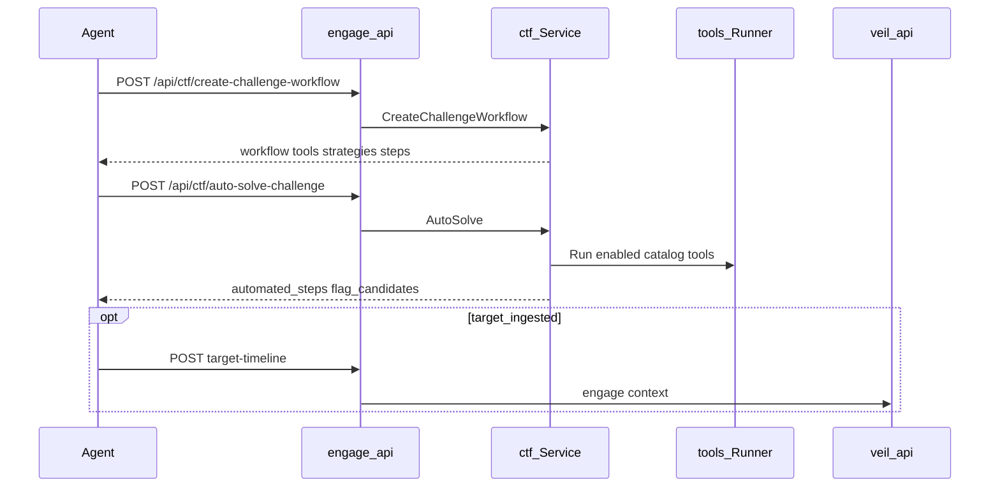
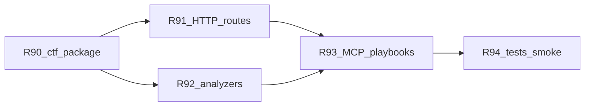

# Engage Phase 17 — CTF subsystem

## Контекст

**Источник:** [hexstrike_server.py](.external/hexstrike-ai-master/hexstrike_server.py) L2780–4070 (managers) и L16116–16514 (7 HTTP routes).

**Фундамент (уже есть):**
- Phase 16: target-timeline, `EngageContext`, graph read ([target_timeline.go](engage/serve/internal/usecase/intelligence/target_timeline.go))
- Attack pattern `ctf_pwn_challenge` в [patterns.go](engage/serve/internal/usecase/intelligence/patterns.go); objective `ctf`/`pwn` в `SelectPatternKey`
- `toolid.CategoryCTF` в [pkg/engage/toolid/category.go](pkg/engage/toolid/category.go)
- Bug bounty precedent: HTTP `registerWorkflows` + MCP `callBugbountyWorkflow` + [bugbounty.yaml](engage/serve/playbooks/bugbounty.yaml)
- Tool id → catalog mapping: [catalog_names.go](engage/serve/internal/tools/catalog_names.go) (`httpx` → `httpx_probe`, `checksec` → `checksec_analyze`, …)

**Пробел:** 0 маршрутов `/api/ctf/*`; нет `internal/usecase/ctf/`; в catalog нет `category: ctf` bridge tools.



---

## Scope (R90–R94)

| ID | Deliverable |
|----|-------------|
| **R90** | Пакет [`engage/serve/internal/usecase/ctf/`](engage/serve/internal/usecase/ctf/) |
| **R91** | 7 HTTP routes под тем же auth, что intelligence |
| **R92** | Heuristic solvers: crypto / forensics / binary (порт логики Python, без «AI») |
| **R93** | MCP bridge + catalog entries + `playbooks/ctf.yaml` |
| **R94** | Unit/router tests + smoke web + pwn |

**Не в scope:** LLM auto-solve; line-by-line port 17k LOC; новые graph ingest labels; bump graph pack.

**Зависимость (мягкая):** полнота auto-solve растёт с Phase 19 (больше `enabled` tools в runner). Phase 17 должен **деградировать gracefully** (plan + skip missing binaries), как сейчас [workflow.go](engage/serve/internal/usecase/workflow/workflow.go).

---

## R90 — `internal/usecase/ctf/`

### Структура пакета

| File | Responsibility |
|------|----------------|
| `challenge.go` | `Challenge` (name, category, description, difficulty, points, files, url, hints) + validation |
| `tools.go` | `ToolManager`: `categoryTools` map (web/crypto/pwn/forensics/rev/misc/osint) — порт [L2799–2848](.external/hexstrike-ai-master/hexstrike_server.py); `SuggestTools(description, category)` с keyword heuristics ([L3738+](.external/hexstrike-ai-master/hexstrike_server.py)); `ResolveTools(registry)` → catalog names via `tools.ResolveCatalogNames` |
| `workflow.go` | `Manager.CreateChallengeWorkflow(challenge)` → JSON shape: `tools`, `strategies`, `workflow_steps`, `estimated_time`, `success_probability`, `parallel_tasks`, `validation_steps` (порт `create_ctf_challenge_workflow` L2895–2974) |
| `automator.go` | `Automator.AutoSolve(ctx, subject, challenge, opts)`: build workflow → execute steps via `tools.Runner` (не симуляция как в Python L3934–3976); `extractFlagCandidates` / `validateFlagFormat`; status `solved` \| `needs_manual_intervention` \| `error` |
| `team.go` | `Coordinator.TeamStrategy(challenges, teamSkills)` — assign challenges by category skill (порт `CTFTeamCoordinator` L4072+) |
| `crypto.go` | `AnalyzeCrypto(cipherText, cipherType, hints)` — heuristics only (hex/base64/hash length/ROT/RSA hints) — порт L16273–16365 |
| `forensics.go` | `AnalyzeForensics(filePath, opts)` — optional `exec` for `file`/`strings`/`exiftool` when on PATH + catalog tools (`binwalk_analyze`, `steghide_analysis`, `exiftool_extract`); paths under `ENGAGE_FILES_DIR` when relative |
| `binary.go` | `AnalyzeBinary(binaryPath, opts)` — `checksec_analyze`, `strings_analyze`, `file` via runner/command; exploitation_hints |
| `service.go` | Facade wiring: `Registry`, `*tools.Runner`, optional `*intelligence.Service` for `AnalyzeTarget` on web targets |

### Category → attack patterns (reuse)

Расширить [patterns.go](engage/serve/internal/usecase/intelligence/patterns.go):

- `ctf_web_challenge` — httpx, katana, nuclei, gobuster, arjun (catalog-resolved)
- `ctf_crypto_challenge` — hashcat/john placeholders + manual steps in workflow
- `ctf_forensics_challenge` — binwalk, exiftool, strings

`CreateChallengeWorkflow` использует `SuggestTools` + при `target` непустом — merge с `SelectPatternKey(..., "ctf")`.

### Wire в components

[`components/api.go`](engage/serve/internal/components/api.go): поле `CTF *ctf.Service` (или `CTF ctf.Facade`), init с `Registry`, `toolRunner`, `intel`.

[`APIComponents`](engage/serve/internal/components/api.go): экспорт для router/MCP.

---

## R91 — HTTP routes (7 legacy paths)

Новая `registerCTF(mux, c)` в [router.go](engage/serve/internal/transport/httpserver/router.go), вызов из `Register`:

| Route | Handler |
|-------|---------|
| `POST /api/ctf/create-challenge-workflow` | `CreateChallengeWorkflow` |
| `POST /api/ctf/auto-solve-challenge` | `AutoSolve` (+ body `max_steps?`, `execute_tools?` default true) |
| `POST /api/ctf/team-strategy` | `TeamStrategy` — body `challenges[]`, `team_skills` map |
| `POST /api/ctf/suggest-tools` | `SuggestTools` + `tool_commands` map (template strings, not shell exec) |
| `POST /api/ctf/cryptography-solver` | `AnalyzeCrypto` |
| `POST /api/ctf/forensics-analyzer` | `AnalyzeForensics` |
| `POST /api/ctf/binary-analyzer` | `AnalyzeBinary` |

Request/response: `success`, `timestamp` (RFC3339), nested `workflow` / `analysis` / `solve_result` — **structural parity** с Python, не побайтный JSON.

Errors: 400 на missing `name` / `description` / `file_path` / `binary_path` / `cipher_text`; 200 с `found: false` где уместно.

---

## R92 — Specialized analyzers (orchestration)

Порт **детерминированной** логики из Python (без subprocess там, где достаточно regex/heuristics):

- **Crypto:** hash length → MD5/SHA*; base64/hex patterns; substitution/ROT/RSA `recommended_tools` + `next_steps` (как L16296–16358)
- **Forensics:** classify by `file` output string → recommend exiftool/binwalk/steghide; optional best-effort tool runs
- **Binary:** `checksec` + strings interesting lines + gadget hints list

Все recommended tool ids проходят через `ResolveCatalogName` и фильтр `registry.Get`.

---

## R93 — MCP, catalog, playbooks

### MCP bridge

[`intel_bridge.go`](engage/serve/internal/transport/mcpserver/intel_bridge.go):

- `IsIntelBridgeTool`: добавить имена `ctf_*` **или** `spec.Category == toolid.CategoryCTF`
- Cases (mirror HTTP):
  - `ctf_create_challenge_workflow`
  - `ctf_auto_solve_challenge`
  - `ctf_suggest_tools`
  - `ctf_team_strategy`
  - `ctf_cryptography_solver`
  - `ctf_forensics_analyzer`
  - `ctf_binary_analyzer`

### Catalog

[`engage/serve/catalog/tools.yaml`](engage/serve/catalog/tools.yaml): 7 entries, `category: ctf`, `enabled: false`, parameters aligned with HTTP bodies.

[`scripts/engage/check-catalog-parity.sh`](scripts/engage/check-catalog-parity.sh): extend `bridge` set with CTF tool names (extra vs legacy 151 is OK — same as `target_timeline_intelligence`).

### Playbooks

[`engage/serve/playbooks/ctf.yaml`](engage/serve/playbooks/ctf.yaml):

```yaml
playbooks:
  - name: ctf-web
    objective: ctf
    workflow: ctf-web
    max_tools: 6
  - name: ctf-pwn
    objective: pwn
    workflow: ctf-pwn
    max_tools: 5
```

Extend [`playbooks.go`](engage/serve/internal/usecase/workflow/playbooks.go): `LoadAllPlaybooks(catalogPath)` merges `bugbounty.yaml` + `ctf.yaml`; `GET /api/playbooks` returns combined list; `RunPlaybook` delegates CTF names to `ctf.Service.RunPlaybook` (thin wrapper: create workflow + optional auto-solve steps).

---

## R94 — Tests and smoke

| Test | Location |
|------|----------|
| Table-driven `CreateChallengeWorkflow` per category (web, crypto, pwn, forensics, misc) | `ctf/workflow_test.go` |
| `SuggestTools` keyword cases (sql/xss/rsa/base64) | `ctf/tools_test.go` |
| `AnalyzeCrypto` / flag regex | `ctf/crypto_test.go`, `ctf/automator_test.go` |
| HTTP 200 smoke | `router_test.go` — `TestCTF_createWorkflow`, `TestCTF_suggestTools` |
| Playbook load | `workflow/playbooks_test.go` — ctf.yaml present |

**Smoke scripts:**

- [`scripts/test/smoke-ctf-web.sh`](scripts/test/smoke-ctf-web.sh): POST create-workflow + auto-solve with `category=web`, `target=https://example.com`; SKIP if engage-api down
- [`scripts/test/smoke-ctf-pwn.sh`](scripts/test/smoke-ctf-pwn.sh): binary-analyzer + create-workflow `category=pwn` with sample file in `ENGAGE_FILES_DIR` or skip

**Makefile:** `test-engage-ctf` → both scripts.

---

## Docs (DoD)

Update:

- [docs/engage-legacy-parity.md](docs/engage-legacy-parity.md) — 7 rows `POST /api/ctf/*` = implemented
- [docs/engage-runtime.md](docs/engage-runtime.md) — CTF section, env `ENGAGE_FILES_DIR` for forensics/binary paths
- [docs/mcp-agents.md](docs/mcp-agents.md) — CTF workflow after scan + optional target-timeline

---

## PR order (recommended)



1. **R90+R91** — core workflow + HTTP (unblocks manual API testing)
2. **R92** — analyzers (can ship in same PR as R91)
3. **R93** — MCP + playbooks + catalog
4. **R94** — tests + smoke + docs

---

## Definition of Done

- All 7 `POST /api/ctf/*` routes return 200 with structurally valid JSON for minimal valid bodies
- `CreateChallengeWorkflow` for `category=web` includes ≥4 resolved catalog tools when registry has web tools enabled
- `AutoSolve` runs ≥1 tool when `execute_tools=true` and binary on PATH; returns `flag_candidates` array (may be empty)
- MCP `tools/call` for each `ctf_*` bridge name matches HTTP payload shape
- `GET /api/playbooks` lists `ctf-web` and `ctf-pwn`
- `make test-engage` green; `make test-engage-ctf` passes or SKIP without stack
- No Neo4j driver import in `engage/serve/internal/usecase/ctf`

---

## Out of scope (explicit)

- Phase 18 Bug Bounty phased manager
- Phase 19 runner image / 50+ enabled tools (improves CTF execution but not blocking)
- Phase 20 CVE/exploit templates
- LLM summarization or «magic» flag extraction beyond regex
