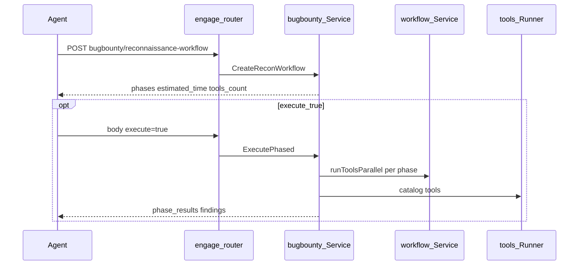

# Engage Phase 18 — Bug Bounty depth

## Контекст

**Источник:** `BugBountyWorkflowManager`, `FileUploadTestingFramework` ([hexstrike_server.py](.external/hexstrike-ai-master/hexstrike_server.py) L2447–2775, HTTP L10098–10310).

**Сейчас:** [`workflow.go`](engage/serve/internal/usecase/workflow/workflow.go) `RunWorkflow` для `reconnaissance` / `vuln-hunt` / … вызывает `SelectToolsForTarget(..., "comprehensive")` и линейный `Tools.Run` — **без фаз**. HTTP/MCP маршруты есть ([`router.go`](engage/serve/internal/transport/httpserver/router.go) L337–349, [`intel_bridge.go`](engage/serve/internal/transport/mcpserver/intel_bridge.go)), но ответ не совпадает с HexStrike.

**Прецедент:** Phase 17 [`internal/usecase/ctf/`](engage/serve/internal/usecase/ctf/) + `c.CTF` в [`components/api.go`](engage/serve/internal/components/api.go).



---

## Scope (R95–R98)

| ID | Deliverable |
|----|-------------|
| **R95** | [`engage/serve/internal/usecase/bugbounty/`](engage/serve/internal/usecase/bugbounty/) — phased workflow builders |
| **R96** | `high_impact_vulns` map → vuln-hunt priorities + payload hints |
| **R97** | `workflow.RunWorkflow` / HTTP / MCP → manager; HexStrike-shaped JSON |
| **R98** | Playbook `execute` + `FindingBus` per phase; async job queue per tool |

**Не в scope:** новые HTTP paths; LLM; graph ingest; Phase 19 tool breadth (улучшит execute, не блокирует plan mode).

---

## R95 — `internal/usecase/bugbounty/`

### Файлы

| File | Role |
|------|------|
| `target.go` | `Target` (domain, scope, priority_vulns, program_type); `TargetFromBody` — принимает `domain` **или** `target`, `target_url` для file-upload |
| `high_impact.go` | `HighImpactVulns` map (rce/sqli/ssrf/idor/xss/lfi/xxe/csrf) — порт L2451–2460 |
| `manager.go` | `Manager`: `CreateReconnaissance`, `CreateVulnHunt`, `CreateBusinessLogic`, `CreateOSINT`, `CreateFileUpload`, `CreateComprehensive` |
| `execute.go` | `Executor`: run phases → `workflow.runToolsParallel`; skip missing catalog tools |
| `service.go` | Facade: plan + execute; timestamps `success`/`workflow`/`timestamp` |

### Reconnaissance (DoD anchor) — 4+ phases

Порт [`create_reconnaissance_workflow`](.external/hexstrike-ai-master/hexstrike_server.py) L2473–2542:

1. `subdomain_discovery` — amass, subfinder, assetfinder (skip if not in registry)
2. `http_service_discovery` — httpx, nuclei (tech/info)
3. `content_discovery` — katana, gau, dirsearch/feroxbuster
4. `parameter_discovery` — paramspider, arjun

Каждая фаза: `name`, `description`, `tools[]` (`tool`, `params`), `expected_outputs`, `estimated_time`. Итог: `estimated_time` = sum, `tools_count` = sum len(tools).

### Остальные workflows

| Workflow | Response key | Structure |
|----------|--------------|-----------|
| `vuln-hunt` | `vulnerability_tests[]` | per `priority_vulns` + `high_impact` tools, `test_scenarios`, `priority_score` |
| `business-logic` | `business_logic_tests[]` | categories + manual/automated tests |
| `osint` | `osint_phases[]` | 4 phases (domain/social/email/tech intel) |
| `file-upload` | `test_phases[]` | recon → baseline → bypass → polyglot (tools from catalog where exist) |
| `comprehensive` | nested maps | recon + vuln-hunt + optional osint/business_logic + `summary` totals |

Tool ids — short names → [`catalog_names.go`](engage/serve/internal/tools/catalog_names.go) + `tools.ResolveCatalogNames`.

---

## R96 — High-impact vulns

В [`high_impact.go`](engage/serve/internal/usecase/bugbounty/high_impact.go):

```go
type VulnProfile struct {
    Priority   int
    Tools      []string
    PayloadType string
    Scenarios  []TestScenario // name + sample payloads (deterministic, no LLM)
}
```

`CreateVulnHunt` сортирует `target.PriorityVulns` (default: rce, sqli, xss, idor, ssrf) по priority; `_get_test_scenarios` — порт L2577–2607 (subset: rce, sqli, xss, ssrf, idor).

---

## R97 — Integration (HTTP, workflow, MCP)

### `workflow.Service`

[`workflow.go`](engage/serve/internal/usecase/workflow/workflow.go):

- Добавить поле `BugBounty *bugbounty.Service` (или inject `Manager` + delegate)
- `RunWorkflow(name, target, opts)`:
  - `comprehensive` → `bugbounty.CreateComprehensive` (+ optional execute via existing `Comprehensive`/`SmartScan` if `execute`)
  - `reconnaissance`, `vuln-hunt`, `business-logic`, `osint`, `file-upload` → `bugbounty.PlanAndMaybeExecute`
- **Plan-only default** (`execute` false): возвращает `{success, workflow, timestamp}` как Python
- **Legacy compat:** при `execute: true` добавить `phase_results`, `findings`, `tools_executed`

### HTTP router

[`registerWorkflows`](engage/serve/internal/transport/httpserver/router.go):

- Передавать полный `body` в `bugbounty.TargetFromBody` + `ExecuteOptions{Execute: body["execute"], Async: body["async"]}`
- File-upload: `target_url` → domain/target
- Comprehensive: `include_osint`, `include_business_logic`, `priority_vulns`

### MCP

[`callBugbountyWorkflow`](engage/serve/internal/transport/mcpserver/intel_bridge.go) → `s.bugbounty.Run(...)` вместо `s.workflows.RunWorkflow` (wire `BugBounty` на `mcpserver.Server` как для CTF).

### Components

[`components/api.go`](engage/serve/internal/components/api.go): `BugBounty *bugbounty.Service`; init с `Registry`, `toolRunner`, `intel`, `FindingBus` from workflow.

---

## R98 — Execute, async, findings

### Per-phase execution

[`execute.go`](engage/serve/internal/usecase/bugbounty/execute.go):

```text
for each phase in workflow.Phases:
  toolNames := resolve phase tools
  results := workflowService.runToolsParallel(...)
  publish findings via FindingBus (reuse smartscan aggregateFindings)
  append phase_result {name, tools_executed, findings_count, estimated_time}
```

[`FindingBus`](engage/serve/internal/usecase/workflow/events.go) уже используется в [`smartscan.go`](engage/serve/internal/usecase/workflow/smartscan.go) L81–84 — вызывать **после каждой фазы**, не только в конце.

### Async playbooks

[`playbook_run.go`](engage/serve/internal/usecase/workflow/playbook_run.go):

- Bug bounty playbooks (`reconnaissance`, `vuln-hunt`, …): delegate to `bugbounty.RunPlaybook`
- `async: true` → `Jobs.Enqueue` per tool in first N phases (cap `max_tools`), return `job_ids` + planned `phases` JSON
- Sync default for playbook run when `async: false` + `execute: true`

---

## Tests (R98)

| Test | File |
|------|------|
| Recon ≥4 phases, tools_count, estimated_time | `bugbounty/manager_test.go` |
| Vuln-hunt priority order | `bugbounty/high_impact_test.go` |
| JSON shape snapshot (recon workflow) | `bugbounty/testdata/recon_workflow.golden.json` + `TestReconWorkflow_golden` |
| HTTP 200 + `phases` in body | `router_test.go` `TestBugBounty_reconnaissanceWorkflow` |
| Playbook delegates to bugbounty | `playbook_run_test.go` |

**Smoke:** `scripts/test/smoke-bugbounty-recon.sh` — POST recon with `example.com`; `make test-engage-bugbounty`.

---

## Docs

- [`docs/engage/engage-legacy-parity.md`](docs/engage/engage-legacy-parity.md) — уточнить bug bounty: **phased** (не generic scan)
- [`docs/engage/engage-runtime.md`](docs/engage/engage-runtime.md) — секция Bug Bounty: `domain`/`target`, `execute`, `priority_vulns`
- [`docs/agents/mcp-agents.md`](docs/agents/mcp-agents.md) — phased workflow перед smart-scan

---

## PR order

1. **R95+R96** — package + manager + high_impact (plan-only responses)
2. **R97** — wire workflow/router/MCP/components
3. **R98** — execute + findings + async playbooks + tests/smoke

---

## Definition of Done

- `POST /api/bugbounty/reconnaissance-workflow` body `{"domain":"example.com"}` → `workflow.phases` length ≥ 4, `tools_count` ≥ 8, `estimated_time` > 0
- `POST .../vulnerability-hunting-workflow` → `vulnerability_tests` ordered by priority
- `POST .../comprehensive-assessment` → nested workflows + `summary`
- `execute: true` runs ≥1 catalog tool when enabled; `findings` / events per phase when `FindingBus` set
- `make test-engage` green; `make test-engage-bugbounty` pass or SKIP
- No Neo4j import in `bugbounty/`

---

## Out of scope

- Phase 19 runner image / 50+ enabled tools
- Phase 20 CVE templates
- Новые MCP catalog tools (existing `bugbounty_*` bridge names sufficient)
