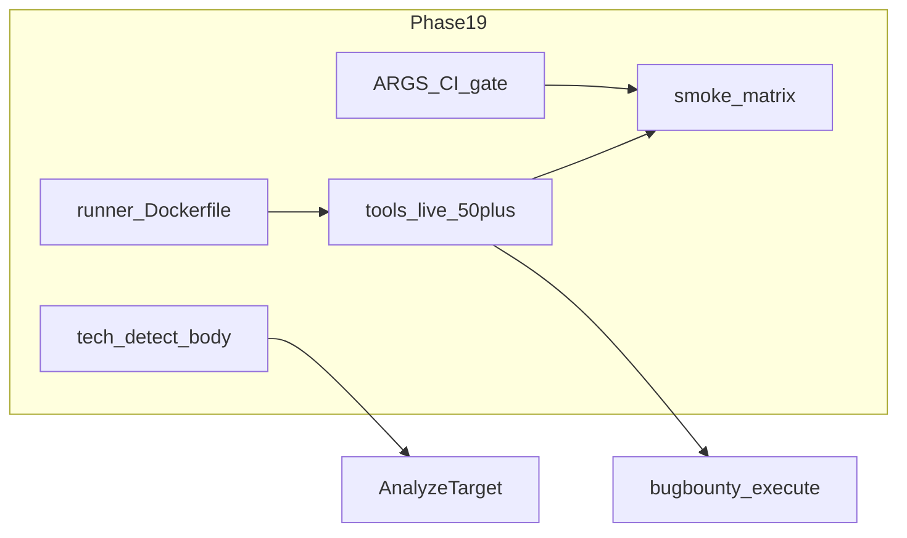

# Engage Phase 19 — Tool execution breadth

## Контекст

**Источник:** мастер-план [engage_hexstrike_master_7666e9b4.plan.md](.cursor/plans/engage_hexstrike_master_7666e9b4.plan.md) Phase 19 (R99–R104).

**Зависимости:** Phase 18 ([bugbounty/](engage/serve/internal/usecase/bugbounty/)) уже планирует `amass`, `katana`, `gau`, `paramspider`, `arjun` — без бинарников в runner `execute: true` даёт пустые `phase_results`. Phase 19 — prerequisite для осмысленного execute/smoke recon.

**Сейчас:**

| Компонент | Состояние |
|-----------|-----------|
| [runner.Dockerfile](deploy/engage/docker/runner.Dockerfile) | nmap, masscan, sqlmap, nikto, gobuster + PD: nuclei, httpx, subfinder, ffuf, feroxbuster (~10) |
| [tools.live.yaml](engage/serve/catalog/tools.live.yaml) | 15× `enabled: true`; часть бинарников **не в образе** (trivy, rustscan, dalfox, arjun) и 3 записи с фиктивными `binary: api/graphql/jwt` |
| [extract-legacy-catalog.py](scripts/engage/extract-legacy-catalog.py) | ~100+ `ARGS_TEMPLATES`; при regen печатает `non_generic` count; **нет CI gate** |
| [smoke-engage-tool-matrix.sh](scripts/test/smoke-engage-tool-matrix.sh) | 13 tools, hardcoded |
| [detect.go](engage/serve/internal/usecase/intelligence/detect.go) + [techstack.go](engage/serve/internal/usecase/intelligence/techstack.go) | HEAD probe; [analyze.go](engage/serve/internal/usecase/intelligence/analyze.go) вызывает `DetectTechnologies(ctx, target, nil, "")` — **body не читается** |
| [effectiveness_legacy.json](engage/serve/internal/usecase/intelligence/testdata/effectiveness_legacy.json) | tier-1 список для matrix (score ≥ 0.85) |



---

## R99 — Runner image (tier-1)

**Файл:** [deploy/engage/docker/runner.Dockerfile](deploy/engage/docker/runner.Dockerfile)

**Добавить (tier-1 по effectiveness + Bug Bounty recon):**

| Категория | Бинарники | Способ установки |
|-----------|-----------|------------------|
| PD / Go | katana, naabu, dnsx, gau, waybackurls, dalfox | `go install` (multi-stage `pd`) |
| OSINT | amass | go install или официальный .deb |
| Web | dirsearch, arjun, paramspider | pip3 (`--break-system-packages` в bookworm) |
| Web | wpscan | optional — gem heavy; **defer** если образ >2GB |
| Cloud | trivy | curl release binary |
| Network | rustscan | curl release (как feroxbuster) |

**Не ставить в образ (R104 / out of runner):** ghidra, burpsuite, metasploit, GUI tools, `binary: api` placeholders.

**Документация:** новая секция **Runner tool matrix** в [docs/engage-tools.md](docs/engage-tools.md) — таблица `tool_id | binary | in_runner | default_enabled`.

**Проверка:** `docker build -f deploy/engage/docker/runner.Dockerfile` + `docker run … which amass katana paramspider trivy`.

---

## R100 — `tools.live.yaml` → 50+ lab-enabled

**Стратегия:** `tools.live.yaml` = **явный allowlist** инструментов, чьи `binary` есть в runner (не автоген всех 150). Удалить/отключить записи с несуществующими бинарниками (`api_fuzzer`, `graphql_scanner`, `jwt_analyzer` → `enabled: false` или убрать из live, оставить в полном [tools.yaml](engage/serve/catalog/tools.yaml)).

**Источник списка:** скрипт `scripts/engage/list-runner-binaries.sh` (печатает PATH внутри образа) + ручная курация tier-1 (~55 entries):

- Recon chain: `subfinder_scan`, `amass_scan`, `httpx_probe`, `nuclei_scan`, `katana_crawl`/`katana_scan`, `gau_discovery`, `gobuster_scan`, `feroxbuster_scan`, `paramspider_scan`, `arjun_scan`, `ffuf_scan`, `nikto_scan`, `sqlmap_scan`, `dalfox_xss_scan`, …
- Network: `nmap_scan`, `masscan_high_speed`, `rustscan_fast_scan`
- Cloud: `trivy_scan`
- OSINT subset: `theharvester_scan`, `dnsenum_scan` (если binary в образе)

**Синхронизация args:** для каждой live-записи — `args` из `ARGS_TEMPLATES` (не generic `["{target}","{additional_args}"]`).

**[enable-tools-on-path.sh](scripts/engage/enable-tools-on-path.sh):** расширить default categories: `network web osint cloud binary`; в CI runner job вызывать после build runner (optional).

**Compose:** [compose.runner.yml](deploy/engage/compose.runner.yml) уже указывает `ENGAGE_CATALOG_PATH: tools.live.yaml` — без изменений путей.

---

## R101 — ARGS 150/150 + CI gate

**Расширить** [extract-legacy-catalog.py](scripts/engage/extract-legacy-catalog.py):

- Добить `ARGS_TEMPLATES` / `INFER_TOOLS` для оставшихся catalog names (цель: `non_generic == 150` при `make catalog-engage`)
- Для GUI/невыполнимых tools — явный `DOCUMENTED_GENERIC` set в скрипте + комментарий в YAML header (не silent generic)

**Новый скрипт:** `scripts/engage/check-catalog-args.sh`

- Парсит `tools.yaml` (или запускает extract в dry-run)
- Fail CI если `non_generic < 150` **или** если `DOCUMENTED_GENERIC` + `non_generic` ≠ 150
- Exit 0 с warning если `.external` отсутствует (как parity)

**Makefile / CI:**

```makefile
test-engage-catalog-args:
	./scripts/engage/check-catalog-args.sh
```

Добавить step в [.github/workflows/engage.yml](.github/workflows/engage.yml) после `catalog-engage` (или только на PR с изменением `scripts/engage/extract-legacy-catalog.py`).

**Regen:** один прогон `make catalog-engage` + commit обновлённого `tools.yaml` если diff.

---

## R102 — Per-tool smoke matrix (effectiveness ≥ 0.85)

**Генератор:** `scripts/engage/tool-matrix-from-effectiveness.py`

- Читает [effectiveness_legacy.json](engage/serve/internal/usecase/intelligence/testdata/effectiveness_legacy.json)
- Эмитит список `catalog_name:safe_target` (map binary → `*_scan` via [catalog_names.go](engage/serve/internal/tools/catalog_names.go) / existing naming)
- Score threshold: `>= 0.85`

**Обновить** [smoke-engage-tool-matrix.sh](scripts/test/smoke-engage-tool-matrix.sh):

- Source generated list (checked-in `scripts/engage/tool-matrix.targets` или inline gen)
- Target: **≥30 exercised** when runner profile up; **≥15** on ubuntu-latest CI (best-effort skip)
- Fail only if `ENGAGE_TOOL_MATRIX_STRICT=1` and ran < 30

**Runner profile smoke:** расширить [smoke-engage-runner-profile.sh](scripts/test/smoke-engage-runner-profile.sh) — 3–5 tools из recon chain (subfinder, httpx, katana) через API.

**Bug bounty execute smoke (DoD timing):** `scripts/test/smoke-bugbounty-recon-execute.sh`

- POST `reconnaissance-workflow` с `{"domain":"example.com","execute":true}`
- Assert `phase_results` non-empty, `tools_executed >= 1`
- Log elapsed; warn if > 900s (15 min cap для lab)

**Makefile:**

```makefile
test-engage-tool-matrix:
	./scripts/test/smoke-engage-tool-matrix.sh
```

---

## R103 — Technology detection (headers + body)

**Новый файл:** [engage/serve/internal/usecase/intelligence/signatures.go](engage/serve/internal/usecase/intelligence/signatures.go)

- Порт subset HexStrike `_initialize_technology_signatures` (L669–696): `headers` + `content` maps → `Technology` enum
- Функции `MatchHeaderSignatures(hdr http.Header)`, `MatchContentSignatures(body string)`

**Изменить** [detect.go](engage/serve/internal/usecase/intelligence/detect.go):

- `httpProbe` → возвращает `headers`, `bodySample` (limit 64KB, GET after HEAD fail)
- `probeTarget` передаёт sample в `DetectTechnologies`

**Изменить** [analyze.go](engage/serve/internal/usecase/intelligence/analyze.go):

- `stack := DetectTechnologies(ctx, target, hdrs, bodySample)` вместо `nil, ""`
- Metadata: `technologies_detected`, `cms` из signatures

**Тесты:** [techstack_test.go](engage/serve/internal/usecase/intelligence/techstack_test.go) + cases: WordPress body snippet, `Server: nginx`, `X-Powered-By: PHP`.

---

## R104 — Thin adapters (optional, KISS)

Только после matrix выявит systematic failures:

| Кандидат | Причина | Место |
|----------|---------|-------|
| sqlmap | batch/crawl flags | `internal/tools/web/doc.go` + hook в runner pre-args **или** расширить ARGS template |
| nuclei | `-duc`, template path | template only (preferred) |
| paramspider | output dir | pip wrapper script in Dockerfile `ENTRYPOINT` shim |

**Правило:** не создавать 150 пакетов; максимум 2–3 shims в runner image, остальное — ARGS.

---

## PR order (3 slices)

1. **R99 + R100** — Dockerfile + tools.live.yaml + docs matrix + `list-runner-binaries.sh`
2. **R101 + R102** — ARGS gate, regen tools.yaml, matrix script + CI/Makefile targets
3. **R103 + R104** — signatures + analyze wiring + tests; adapters only if matrix red

---

## Definition of Done

- Runner image содержит recon chain binaries: amass, subfinder, httpx, nuclei, katana, gau, paramspider, arjun (+ existing)
- `tools.live.yaml`: ≥50 entries с `enabled: true` и реальными `binary`
- `make catalog-engage` + `make test-engage-catalog-args` green (150 non-generic or documented exceptions)
- `smoke-engage-tool-matrix.sh`: ≥30 tools exercised в runner profile; ≥15 best-effort в default CI
- `POST .../reconnaissance-workflow` + `execute:true` → ≥1 `tools_executed` в runner profile; timing logged (<15 min target)
- `AnalyzeTarget` использует body+header signatures; unit tests green
- `make test-engage` green; no Neo4j imports in new code
- [docs/engage-legacy-parity.md](docs/engage-legacy-parity.md) — строка tool execution: **Partial → implemented (lab 50+)**

---

## Вне scope (Phase 19)

- Phase 20 CVE/exploit
- Phase 22 ProcessPool / benchmarks script (отдельная фаза)
- Установка всех 150 бинарников
- LLM payload generation
