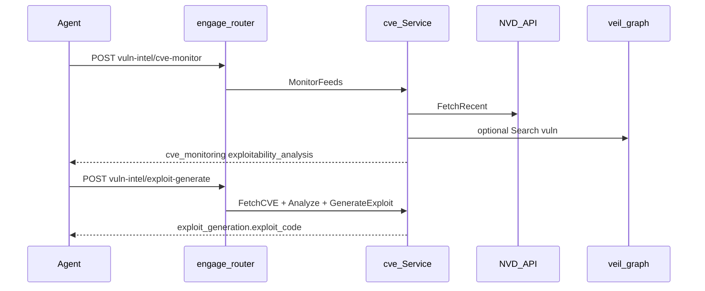

# Engage Phase 20 — CVE & exploit intelligence

## Контекст (из [мастер-плана](.cursor/plans/engage_hexstrike_master_7666e9b4.plan.md))

| Мастер | Gap до Phase 20 | Цель |
|--------|-----------------|------|
| **CVEIntelligenceManager** (L5750+) | Частично через `correlate` + veil `vuln` | NVD lookup, feed monitor, exploitability scoring |
| **AIExploitGenerator** (L7027+) | Отсутствует | Deterministic PoC templates + `payload_hints` (без LLM) |
| HTTP `POST /api/vuln-intel/*` (L15496+) | Не было | `cve-monitor`, `exploit-generate` (+ convenience `cve-lookup`) |
| MCP `monitor_cve_feeds`, `generate_exploit_from_cve` | Subprocess placeholder в catalog | In-process intel bridge |

**Прецедент:** Phase 17 CTF ([`internal/usecase/ctf/`](engage/serve/internal/usecase/ctf/)), Phase 18 Bug Bounty ([`internal/usecase/bugbounty/`](engage/serve/internal/usecase/bugbounty/)) — отдельный usecase + [`components.APIComponents`](engage/serve/internal/components/api.go) + `register*` + MCP delegate.

**Статус в репозитории:** реализация **уже есть** (пакет `cve/`, router, MCP, graph extensions, tests, docs). План ниже — эталон scope/DoD; при расхождениях — править код под DoD.

---

## Scope (R105–R108)

| ID | Deliverable | Ключевые файлы |
|----|-------------|----------------|
| **R105** | `internal/usecase/cve/` — NVD client, lookup, monitor, veil enrich | [`nvd.go`](engage/serve/internal/usecase/cve/nvd.go), [`lookup.go`](engage/serve/internal/usecase/cve/lookup.go), [`monitor.go`](engage/serve/internal/usecase/cve/monitor.go), [`graph.go`](engage/serve/internal/usecase/cve/graph.go), [`service.go`](engage/serve/internal/usecase/cve/service.go) |
| **R106** | Deterministic exploit templates (порт `AIExploitGenerator` без LLM/GitHub) | [`analyze.go`](engage/serve/internal/usecase/cve/analyze.go), [`exploit.go`](engage/serve/internal/usecase/cve/exploit.go) |
| **R107** | CVE depth в correlate / discover attack chains | [`graph_intel.go`](engage/serve/internal/usecase/intelligence/graph_intel.go), [`correlate.go`](engage/serve/internal/usecase/cve/correlate.go), `Intel.CVE` в [`analyze.go`](engage/serve/internal/usecase/intelligence/analyze.go) |
| **R108** | HTTP + MCP bridge + components wire | [`router.go`](engage/serve/internal/transport/httpserver/router.go) `registerVulnIntel`, [`intel_bridge.go`](engage/serve/internal/transport/mcpserver/intel_bridge.go), [`server.go`](engage/serve/internal/transport/mcpserver/server.go) `NewServerFull`, [`api.go`](engage/serve/internal/components/api.go) |

**Не в scope (мастер + legacy):**
- `POST /api/vuln-intel/attack-chains` (дублирует [`discover-attack-chains`](engage/serve/internal/transport/httpserver/router.go))
- `threat-feeds`, `zero-day-research`, `search_existing_exploits` (GitHub/Exploit-DB)
- Обязательный LLM; graph ingest write; новые имена MCP tools (используем существующие 2 из catalog)
- Neo4j import в `cve/`; cross-import scrape/pipeline/graph

---

## R105 — `internal/usecase/cve/`

### NVD client
- Интерфейс `NVDClient`: `FetchCVE(ctx, cveID)`, `FetchRecent(ctx, hours, severityFilter)` → NVD API 2.0 `https://services.nvd.nist.gov/rest/json/cves/2.0`
- Production: `http.Client{Timeout: 30s}`; optional `ENGAGE_NVD_API_KEY`
- Monitor: max 100 results; rate-limit sleep между paginated calls (1s)
- Тесты: `httptest.Server` + [`testdata/nvd_cve_sample.json`](engage/serve/internal/usecase/cve/testdata/nvd_cve_sample.json)

### Типы и анализ
- `CVEEntry`, `ExploitabilityAnalysis`, `MonitorResult` — JSON shape как HexStrike (`success`, `cve_monitoring`, `exploitability_analysis`, `timestamp`)
- `AnalyzeExploitability`: CVSS + keyword heuristics → `exploitability_score`, `exploitability_level` (CRITICAL/HIGH/MEDIUM/LOW)

### Veil tie-in
- `VeilSearcher` interface (implemented by [`veilgraph.Client`](engage/serve/internal/client/veilgraph/))
- После lookup/monitor: `Search(ctx, "vuln", cveID)` → `veil_enrichment[]`

---

## R106 — Exploit templates

- `ClassifyVuln(description)` → `sql_injection`, `xss`, `rce`, `xxe`, `deserialization`, `file_read`, `auth_bypass`, `buffer_overflow`, `generic`
- `GenerateExploit(ExploitRequest)` → `exploit_generation{ exploit_code, instructions, vulnerability_type, payload_hints }`
- `Service.GenerateExploitFromCVE` = NVD fetch → `AnalyzeExploitability` → `GenerateExploit` (не type-assert из `map[string]any`)
- `evasion_level != none` → только comment hints (без `_apply_evasion`)

---

## R107 — Graph correlate / discover

### `CorrelateThreatIntelligence`
- Парсинг `CVE-\d{4}-\d+` из `indicators` + merge с `related_cves` из `EngageContext`
- При `Intel.CVE != nil`: `cve_intelligence[]` (full lookup), `cve_details[]` (slim exploitability)
- Сохранить `graph_hits.vuln` и `engage_context`

### `DiscoverAttackChains`
- Сбор CVE из target/objective, graph `vuln` search, `EngageContext`
- `cve_attack_paths[]`: `{ cve_id, severity, exploitability_score, suggested_tools, exploit_template_available }`
- `cve_stages[]`: ordered by score desc; `exploit_available` only (без полного `exploit_code`)

Wiring: `cveSvc := cve.NewService(veil, cve.DefaultNVDClient())`; `intel.CVE = cveSvc` (interface `CVEIntelligence` в intelligence для тестов без циклов).

---

## R108 — HTTP, MCP, components

### HTTP (`registerVulnIntel`)

| Route | Body | Handler |
|-------|------|---------|
| `POST /api/vuln-intel/cve-monitor` | `hours`, `severity_filter`, `keywords` | `CVE.MonitorFromBody` |
| `POST /api/vuln-intel/exploit-generate` | `cve_id`, `target_os`, `target_arch`, `exploit_type`, `evasion_level`, … | `CVE.GenerateExploitFromCVE` |
| `POST /api/vuln-intel/cve-lookup` | `cve_id` | `CVE.Lookup` |

Prefix `/api/vuln-intel/` (не `/api/cve/`) — parity с HexStrike.

### MCP
- `IsIntelBridgeTool`: explicit `monitor_cve_feeds`, `generate_exploit_from_cve`
- `callCVEBridge` → те же handlers (не subprocess из catalog)
- `NewServerFull(..., cveSvc, ...)` в [`components/mcp.go`](engage/serve/internal/components/mcp.go)

---

## Tests & docs (DoD)

| Check | Location |
|-------|----------|
| NVD parse mock | `cve/nvd_test.go` |
| Classify / exploitability | `cve/analyze_test.go`, `cve/exploit_test.go` |
| Golden exploit shape | `cve/testdata/exploit_sql.golden.json` |
| HTTP monitor / exploit | `router_test.go` `TestVulnIntel_*` |
| MCP bridge | `intel_bridge_test.go` |
| `cve_details` in correlate | `graph_intel_test.go` |
| Full suite | `make test-engage` |
| Live smoke (SKIP if API down) | [`scripts/test/smoke-cve-monitor.sh`](scripts/test/smoke-cve-monitor.sh) → `make test-engage-cve` |

**Docs:** [`docs/engage-legacy-parity.md`](docs/engage-legacy-parity.md), [`docs/engage-runtime.md`](docs/engage-runtime.md) (секция Phase 20), [`docs/mcp-agents.md`](docs/mcp-agents.md) (workflow: monitor → correlate → exploit-generate).

### Definition of Done (acceptance)

- `POST /api/vuln-intel/cve-monitor` `{"hours":24,"severity_filter":"HIGH,CRITICAL"}` → `timestamp`, `cve_monitoring` (graceful error if NVD offline)
- `POST /api/vuln-intel/exploit-generate` `{"cve_id":"CVE-2021-44228",...}` → non-empty `exploit_generation.exploit_code`, `vulnerability_type` set
- MCP tools return same JSON via bridge
- `correlate_threat_intelligence` with `CVE-…` indicator includes `cve_details` when CVE service wired
- `make test-engage` green

---

## PR order (рекомендуемый)

1. **R105 + R106** — `cve/` package + unit tests
2. **R107 + R108** — graph extensions, HTTP/MCP/components
3. Tests, smoke, docs

---

## Зависимости roadmap

- **После:** Phase 17 (CTF), Phase 18 (Bug Bounty), желательно Phase 19 (tools) для `suggested_tools` (nuclei, searchsploit) в lab
- **Перед:** Phase 21 (browser/visual), Phase 22 (benchmarks)
