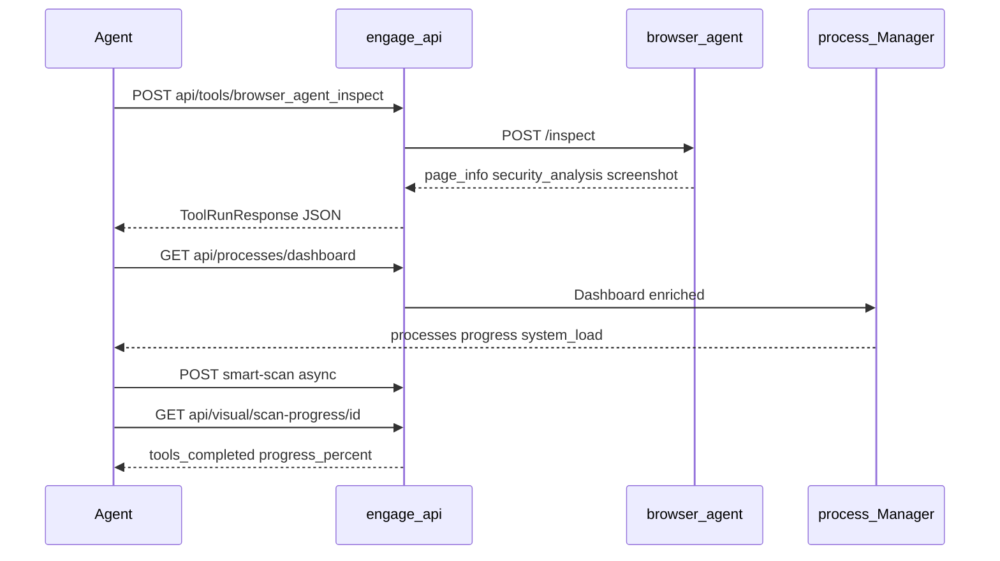

# Engage Phase 21 — Browser & visual engine

## Контекст (из [мастер-плана](.cursor/plans/engage_hexstrike_master_7666e9b4.plan.md))

| Мастер | Gap сейчас | Цель |
|--------|------------|------|
| **BrowserAgent** (L13623+) | Sidecar: title/url/screenshot only ([`index.mjs`](engage/serve/cmd/browser-agent/index.mjs)) | Form extraction, security pass, tech hints, screenshot |
| **GET /api/processes/dashboard** | `total` + `processes[]` без progress/ETA/system ([`manager.go`](engage/serve/internal/usecase/process/manager.go) L134) | Live stats как HexStrike L9414+ |
| **Visual / progress** | Smart-scan sync — нет промежуточного progress | JSON progress для scan/chain; poll endpoint |
| **Assessment report** | `summary_report` + `severity_breakdown` ([`assessment.go`](engage/serve/internal/usecase/workflow/assessment.go)) | `executive_summary` block (structured, не ANSI) |

**Прецедент:** Phase 20 CVE — отдельный usecase + HTTP `register*` + MCP bridge; Phase 17 CTF — catalog tools → in-process handlers.

**Уже есть (не дублировать):**
- `POST /api/visual/summary-report`, `vulnerability-card`, `tool-output`, `export-report` ([`registerVisual`](engage/serve/internal/transport/httpserver/router.go))
- `ENGAGE_BROWSER_URL` + [`BrowserProxy`](engage/serve/internal/runner/browser.go) для `binary: browser`
- MCP `format_tool_output_visual` → structured JSON ([`agent_tools.go`](engage/serve/internal/transport/mcpserver/agent_tools.go))
- Smoke: [`scripts/test/smoke-engage-browser.sh`](scripts/test/smoke-engage-browser.sh), `make test-engage-browser`



---

## Scope (R109–R112)

| ID | Deliverable | Ключевые файлы |
|----|-------------|----------------|
| **R109** | BrowserAgent depth: forms, security analysis, tech detect, screenshot | [`cmd/browser-agent/index.mjs`](engage/serve/cmd/browser-agent/index.mjs), новый [`internal/usecase/browser/`](engage/serve/internal/usecase/browser/) (optional HTTP `/api/browser/inspect`) |
| **R110** | Enriched process dashboard | [`process/manager.go`](engage/serve/internal/usecase/process/manager.go), runner hooks в [`tools/run.go`](engage/serve/internal/usecase/tools/run.go) |
| **R111** | Scan/chain progress JSON + poll | [`workflow/smartscan.go`](engage/serve/internal/usecase/workflow/smartscan.go), `registerVisual` или `registerIntel` route |
| **R112** | Executive summary в assessment | [`report/assessment.go`](engage/serve/internal/usecase/report/assessment.go), `AssessmentReport` response shape |

**Не в scope:**
- Полный порт `ModernVisualEngine` (ANSI boxes, cyberpunk bars) — agents получают **structured JSON** + optional `progress_bar` string field
- Selenium/Chrome in-process в Go API (остаётся Playwright sidecar)
- SSE/WebSocket live stream (v1: **poll** `GET /api/visual/scan-progress/{id}`)
- `POST /api/tools/browser-agent` как отдельный legacy path (достаточно catalog `browser_agent_inspect` + enriched sidecar)
- LLM narrative reports

---

## R109 — BrowserAgent parity

### Sidecar (`index.mjs`)

Расширить `POST /exec` или добавить `POST /inspect` с телом как HexStrike MCP:

| Field | Behavior |
|-------|----------|
| `url` / `target` | Navigate `domcontentloaded`, configurable `wait_time` |
| `screenshot` | base64 PNG (уже есть) |
| `headless` | Playwright launch option |
| `active_tests` | Safe GET-only reflected XSS probe (optional, subset L14253+) |

**Response shape** (agent-stable JSON, без ANSI):

```json
{
  "success": true,
  "page_info": {
    "title", "url", "forms", "links", "inputs", "scripts"
  },
  "security_analysis": {
    "issues": [{ "type", "severity", "description" }],
    "total_issues", "security_score", "modules"
  },
  "technologies": ["nginx", "react"],
  "screenshot": "<base64>"
}
```

Реализация в sidecar (Node):
- `page.$$eval('form', ...)` — forms (action, method, inputs)
- `page.$$eval('a[href]', ...)` — links (cap 50)
- `page.content()` + lightweight heuristics: missing CSP/HSTS via `page.goto` response headers (`response.headers()`)
- Tech: regex/meta generator + reuse signatures subset (WordPress, React, etc.) — mirror [`signatures.go`](engage/serve/internal/usecase/intelligence/signatures.go) as small JS map or call back optional

### Go layer

| File | Role |
|------|------|
| `internal/usecase/browser/service.go` | `Inspect(ctx, InspectRequest)` → calls sidecar, normalizes JSON |
| `internal/runner/browser.go` | Map catalog params (`url`, `wait_time`, `screenshot`, `active_tests`) to sidecar payload; parse stdout JSON into structured `Result` |

**MCP / catalog:** `browser_agent_inspect` — prefer **in-process bridge** (как CVE) when `ENGAGE_BROWSER_URL` set: `callBrowserBridge` in [`intel_bridge.go`](engage/serve/internal/transport/mcpserver/intel_bridge.go) OR extend [`agent_tools.go`](engage/serve/internal/transport/mcpserver/agent_tools.go) — avoids bogus subprocess `binary: generate`.

Optional convenience: `POST /api/browser/inspect` (не в legacy route list, но полезно для agents) — thin delegate to `browser.Service`.

---

## R110 — Process dashboard enrich

### `process.Record` extensions

```go
Progress        float64 `json:"progress"`         // 0..1
LastOutput      string  `json:"last_output,omitempty"`
BytesProcessed  int64   `json:"bytes_processed,omitempty"`
ETA             float64 `json:"eta_seconds,omitempty"`
```

- `Manager.UpdateProgress(pid, progress, lastOutput, bytes)` — вызывать из runner после chunks / tool completion
- `Dashboard()` returns HexStrike-like envelope:

```json
{
  "timestamp": "...",
  "total_processes": N,
  "running": R,
  "system_load": { "goroutines": ..., "memory_alloc_mb": ... },
  "processes": [{
    "pid", "tool", "target", "status", "runtime", "progress_percent",
    "progress_fraction", "last_output"
  }]
}
```

`system_load`: Go `runtime.ReadMemStats` + optional `github.com/shirou/gopsutil` **only if** already in module graph; иначе lightweight runtime metrics (избежать новой heavy dep — KISS).

### MCP bridge

- `get_process_dashboard`, `get_live_dashboard` (catalog) → `GET /api/processes/dashboard` via in-process handler (не subprocess)

---

## R111 — Visual progress (smart-scan / chain)

### In-memory `ScanProgress` store

| File | Role |
|------|------|
| `internal/usecase/visual/progress.go` | `Store`: `Create(scanID)`, `UpdateTool(scanID, tool, status, progress)`, `Get(scanID)` |
| Wire в `SmartScan` sync path: before/after each tool in `runToolsParallel` |
| Async path: update on job completion via job callback or poll jobs in `Get` |

**HTTP:** `GET /api/visual/scan-progress/{id}` — returns:

```json
{
  "scan_id": "...",
  "target": "...",
  "status": "running|completed|failed",
  "progress_percent": 42.5,
  "tools_total": 5,
  "tools_completed": 2,
  "current_tool": "nuclei_scan",
  "tools": [{ "tool", "status", "progress", "execution_time" }]
}
```

**Smart-scan / assessment async:** при `async: true` return `scan_id` in response for polling.

**Attack chain:** `POST /api/intelligence/execute-attack-chain` — optional same `scan_id` progress (reuse store, type=`chain`).

**Не в scope v1:** SSE; progress в Neo4j.

---

## R112 — Executive summary (assessment)

Расширить [`report.FromSmartScan`](engage/serve/internal/usecase/report/assessment.go) / new `BuildExecutiveSummary`:

```json
"executive_summary": {
  "target": "...",
  "risk_posture": "high|medium|low",
  "total_findings": 12,
  "critical": 1, "high": 3, "medium": 5, "low": 3,
  "tools_executed": 5,
  "duration_seconds": 42.1,
  "top_risks": ["..."],
  "recommendations": ["patch...", "run nuclei templates..."]
}
```

- `risk_posture` from max severity + target profile `risk_level`
- `top_risks`: up to 5 finding titles (critical/high first)
- `recommendations`: deterministic strings from severity + technologies (reuse intel `AnalyzeTarget`)

`AssessmentReport` adds top-level `executive_summary`; `POST /api/visual/summary-report` accepts optional pre-built `executive_summary` passthrough.

---

## Tests (DoD)

| Test | File |
|------|------|
| Sidecar inspect JSON (mock HTTP) | `runner/browser_test.go` |
| Browser service parse | `browser/service_test.go` |
| Dashboard progress fields | `process/manager_test.go` |
| Scan progress store | `visual/progress_test.go` |
| Executive summary shape | `report/assessment_test.go` |
| HTTP dashboard / scan-progress | `router_test.go` |
| MCP `get_process_dashboard` | `intel_bridge_test.go` or `agent_tools_test.go` |
| Smoke | extend `smoke-engage-browser.sh` (forms/security_score); `make test-engage-browser` |
| Full | `make test-engage` green |

---

## Docs

- [`docs/engage/engage-legacy-parity.md`](docs/engage/engage-legacy-parity.md) — browser inspect enriched; dashboard live stats; scan-progress route
- [`docs/engage/engage-runtime.md`](docs/engage/engage-runtime.md) — `ENGAGE_BROWSER_URL`, scan-progress poll workflow
- [`docs/agents/mcp-agents.md`](docs/agents/mcp-agents.md) — browser inspect → assessment-report with executive_summary

---

## Definition of Done

- `browser_agent_inspect` (MCP or `POST /api/tools/browser_agent_inspect`) with sidecar up returns `page_info.forms` and `security_analysis.security_score`
- `GET /api/processes/dashboard` includes `progress_percent` per running process and `system_load`
- Async `smart-scan` returns `scan_id`; `GET /api/visual/scan-progress/{id}` shows monotonic `progress_percent`
- `POST /api/intelligence/assessment-report` includes non-empty `executive_summary` with severity counts
- MCP `get_live_dashboard` / `get_process_dashboard` return dashboard JSON (in-process)
- `make test-engage` + `make test-engage-browser` pass or SKIP

---

## PR order

1. **R109** — sidecar inspect + browser usecase + runner/MCP wire
2. **R110** — process progress + dashboard enrich + MCP dashboard tools
3. **R111** — progress store + HTTP poll + smart-scan `scan_id`
4. **R112** — executive summary + tests + docs

---

## Зависимости

- **После:** Phase 19 (tools), Phase 20 (CVE) — optional cross-links in recommendations
- **Перед:** Phase 22 (benchmarks use assessment-report timing), Phase 23 (CI veil-stack)
