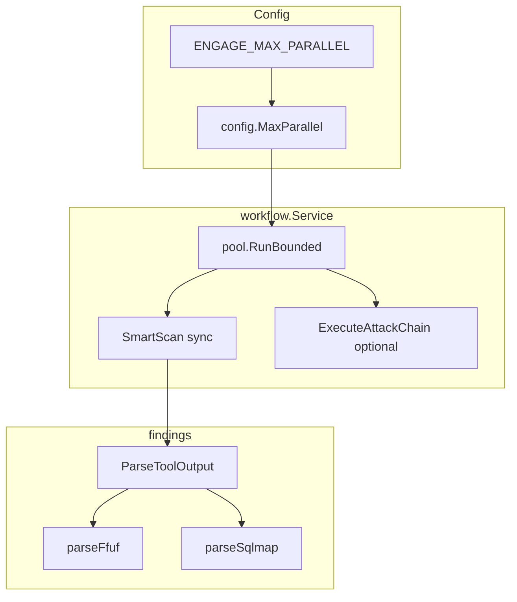

# Engage Phase 22 — Scale, quality & benchmarks

## Контекст (из [мастер-плана](.cursor/plans/engage_hexstrike_master_7666e9b4.plan.md))

| KPI (HexStrike README) | Endpoint / сценарий | Цель фазы |
|------------------------|---------------------|-----------|
| Subdomain enum 5–10 min | `POST /api/bugbounty/reconnaissance-workflow` + `execute` | timing в benchmark |
| Vuln scan 15–30 min | `POST /api/intelligence/smart-scan` (`objective: comprehensive`) | timing + findings parsers |
| Report 2–5 min | `POST /api/intelligence/assessment-report` | latency в benchmark |
| FP rate | dedup + labeled set | **вне scope** (future) |

**Прецедент:** Phase 21 — `visual.Store`, `RunToolsParallel`, executive summary; Phase 20 — отдельный usecase + HTTP/MCP.

**Уже есть (не дублировать):**
- Параллельный sync smart-scan: семафор `workers = 5` в [`smartscan.go`](engage/serve/internal/usecase/workflow/smartscan.go) L122–123
- Bug bounty execute использует тот же [`RunToolsParallel`](engage/serve/internal/usecase/workflow/smartscan.go)
- Парсеры: nuclei JSONL, nmap, generic в [`findings/parse.go`](engage/serve/internal/usecase/findings/parse.go)
- Recovery классифицирует `rate_limit` post-hoc ([`recovery/handler.go`](engage/serve/internal/usecase/recovery/handler.go))
- `ENGAGE_WORKER_CONCURRENCY` — **очередь jobs**, не tool pool ([`config.go`](engage/serve/internal/config/config.go) L123–130)
- Smoke timing: [`scripts/test/smoke-bugbounty-recon-execute.sh`](scripts/test/smoke-bugbounty-recon-execute.sh)



---

## Scope (R113–R116)

| ID | Deliverable | Ключевые файлы |
|----|-------------|----------------|
| **R113** | Bounded `ProcessPool` / env `ENGAGE_MAX_PARALLEL` | [`config/config.go`](engage/serve/internal/config/config.go), новый [`workflow/pool.go`](engage/serve/internal/usecase/workflow/pool.go), [`smartscan.go`](engage/serve/internal/usecase/workflow/smartscan.go), [`components/api.go`](engage/serve/internal/components/api.go) |
| **R114** | Парсеры ffuf + sqlmap → `domainreport.Finding` | [`findings/parse.go`](engage/serve/internal/usecase/findings/parse.go), `testdata/ffuf.json`, `testdata/sqlmap.txt` |
| **R115** | Benchmark script + Makefile target | [`scripts/benchmark/engage-hexstrike-parity.sh`](scripts/benchmark/engage-hexstrike-parity.sh), `Makefile` |
| **R116** | Rate-limit pre-flight (optional httpx / HTTP probe) | новый [`intelligence/ratelimit.go`](engage/serve/internal/usecase/intelligence/ratelimit.go), wire в smart-scan router |

**Не в scope:**
- NATS-based distributed pool (v1: **in-process** semaphore, как сейчас)
- FP rate / labeled dedup dataset
- Обязательный benchmark в CI (локальный/regression; CI — optional nightly)
- Правки `.external/`

---

## R113 — ProcessPool + `ENGAGE_MAX_PARALLEL`

### Config

Добавить в `Config`:

```go
MaxParallel int // default 5, env ENGAGE_MAX_PARALLEL
```

Функция `maxParallel()` по аналогии с `workerConcurrency()`: default **5**, min **1**, max cap **32** (защита от случайного `ENGAGE_MAX_PARALLEL=9999`).

### Pool helper

Новый [`workflow/pool.go`](engage/serve/internal/usecase/workflow/pool.go):

```go
// RunBounded runs fn for each item with at most maxWorkers concurrent goroutines.
func RunBounded[T any](maxWorkers int, items []T, fn func(T)) 
```

Или typed `ParallelRun(ctx, maxN, tasks []func())` — без внешних зависимостей.

### Wire

- Поле `MaxParallel int` на [`workflow.Service`](engage/serve/internal/usecase/workflow/workflow.go)
- [`components/api.go`](engage/serve/internal/components/api.go): `wf.MaxParallel = cfg.MaxParallel`
- Заменить `const workers = 5` в `runToolsParallel` на `maxWorkers := s.maxParallel()` (helper: если `<=0` → 5)

### Attack chain (минимальный parity)

[`execute_chain.go`](engage/serve/internal/usecase/intelligence/execute_chain.go) сейчас **последовательный**. Для «smart-scan/chain»:

- Добавить опциональный режим: если в HTTP body `parallel: true` (router [`router.go`](engage/serve/internal/transport/httpserver/router.go) для `execute-attack-chain`), собрать tool names из steps и вызвать `workflow.RunToolsParallel` через интерфейс (как bugbounty [`execute.go`](engage/serve/internal/usecase/bugbounty/execute.go) L23–24).
- По умолчанию `parallel: false` — поведение без регрессии в unit-тестах.
- `MaxParallel` передаётся в intel service или workflow callback при wiring в `api.go`.

**Отличие от jobs:** async smart-scan (`req.Async && Jobs`) остаётся на `ENGAGE_WORKER_CONCURRENCY`; R113 только sync parallel path.

---

## R114 — Findings parsers (ffuf, sqlmap)

Расширить [`ParseToolOutput`](engage/serve/internal/usecase/findings/parse.go):

```go
case strings.Contains(low, "ffuf"):
    return parseFfuf(...)
case strings.Contains(low, "sqlmap"):
    return parseSqlmap(...)
```

### `parseFfuf`

1. **JSON** (ffuf `-json` / consolidated output): поле `results[]` → `Finding` per hit:
   - `Title`: `"ffuf: " + url` или FUZZ value
   - `Severity`: `403/401` → medium; `500` → high; иначе info/low
   - `Evidence`: compact JSON line
2. **Fallback**: regex/lines `Status: 200` / URL lines → info findings
3. Пустой результат → `parseGeneric`

Fixture: минимальный JSON с 2–3 `results` в `engage/serve/internal/usecase/findings/testdata/ffuf_sample.json`.

### `parseSqlmap`

1. Маркер `sqlmap identified the following injection point` → **high** finding с summary title
2. Блоки `Parameter:` / `Type:` / `Title:` → отдельные findings или один aggregated
3. Строки `is vulnerable` / `payload:` → high
4. Fallback → `parseGeneric` (уже ловит «SQL injection»)

Fixture: фрагмент stdout из реального sqlmap log в `testdata/sqlmap_injection.txt`.

### Интеграция

- `aggregateFindings` в smart-scan уже вызывает `ParseToolOutput` — без изменений
- Assessment report / executive summary автоматически получат structured findings

---

## R115 — Benchmark script

Новый [`scripts/benchmark/engage-hexstrike-parity.sh`](scripts/benchmark/engage-hexstrike-parity.sh):

| Step | Request | Metric |
|------|---------|--------|
| 1 | `POST /api/bugbounty/reconnaissance-workflow` `{"domain":"$TARGET","execute":true}` | `recon_sec` |
| 2 | `POST /api/intelligence/smart-scan` `{"target":"$TARGET","objective":"comprehensive","max_tools":5}` sync | `smart_scan_sec` |
| 3 | `POST /api/intelligence/assessment-report` same target | `assessment_sec` |

**Env:**

| Var | Default |
|-----|---------|
| `ENGAGE_API_URL` / `ENGAGE_URL` | `http://127.0.0.1:8890` |
| `BENCHMARK_TARGET` | `example.com` |
| `ENGAGE_BENCHMARK_EXECUTE` | `1` (set `0` для dry API-only) |
| `BENCHMARK_MAX_SEC` | per-step soft warn (как `BB_RECON_MAX_SEC`) |

**Output:** Markdown table на stdout + optional `BENCHMARK_OUT=results/engage-benchmark-$(date +%Y%m%d).md` (директория в `.gitignore`).

**Makefile:**

```makefile
test-engage-benchmark:
	chmod +x ./scripts/benchmark/engage-hexstrike-parity.sh
	./scripts/benchmark/engage-hexstrike-parity.sh
```

Поведение как smoke: **SKIP** если API недоступен; не ломать `make test-engage` по умолчанию.

---

## R116 — Rate limit pre-flight

Новый [`intelligence/ratelimit.go`](engage/serve/internal/usecase/intelligence/ratelimit.go):

```go
type RateLimitProbe struct {
    Detected bool   `json:"rate_limit_detected"`
    Source   string `json:"source"` // httpx|http|none
    Detail   string `json:"detail,omitempty"`
}

func (s *Service) ProbeRateLimit(ctx context.Context, subject, target string) RateLimitProbe
```

**Стратегия (v1, детерминированная):**

1. Если `s.Tools != nil` и в registry enabled `httpx_probe` — короткий run (`-u target -status-code -silent -timeout 5`), parse stdout на `429` / `rate` / `too many`
2. Иначе `net/http` HEAD/GET с 3s timeout — status `429` или header `Retry-After`
3. Не fail scan — только advisory

**Wire в smart-scan** ([`router.go`](engage/serve/internal/transport/httpserver/router.go) + [`SmartScanRequest`](engage/serve/internal/usecase/workflow/smartscan.go)):

- Body flag `rate_limit_check: true` (default false)
- Response fields: `rate_limit_probe`, при detected — снизить effective parallel: `min(MaxParallel, 2)` или добавить `"recommendation": "reduce parallelism"` в out map
- Документировать связь с recovery `TypeRateLimit` (post-tool retry уже есть)

Опционально MCP: не обязательно в v1; HTTP flag достаточно для benchmark/agents.

---

## Tests (DoD)

| Test | File |
|------|------|
| Pool bounds (max 2 concurrent) | `workflow/pool_test.go` |
| `runToolsParallel` respects `MaxParallel` | `smartscan_test.go` (mock runner + timing/count) |
| `parseFfuf` JSON + fallback | `findings/parse_test.go` + golden fixtures |
| `parseSqlmap` injection block | `findings/parse_test.go` |
| `ProbeRateLimit` 429 mock | `intelligence/ratelimit_test.go` |
| Router `rate_limit_check` | `router_test.go` (optional field in response) |
| Benchmark script syntax | `shellcheck` or `bash -n` in CI comment only |

`make test-engage` — обязательно green.

---

## Docs

- [`docs/engage/engage-legacy-parity.md`](docs/engage/engage-legacy-parity.md) — R113 env, R114 parsers, R115 benchmark, R116 pre-flight
- [`docs/engage/engage-runtime.md`](docs/engage/engage-runtime.md) — `ENGAGE_MAX_PARALLEL` vs `ENGAGE_WORKER_CONCURRENCY`, benchmark workflow
- [`docs/engage-reports.md`](docs/engage-reports.md) — ffuf/sqlmap finding shapes в assessment

---

## Definition of Done

- `ENGAGE_MAX_PARALLEL=2` ограничивает одновременные tool runs в sync smart-scan / bugbounty execute
- `ParseToolOutput("ffuf_scan", ...)` и `ParseToolOutput("sqlmap_scan", ...)` возвращают structured findings (не только generic)
- `./scripts/benchmark/engage-hexstrike-parity.sh` печатает timing table при доступном API
- `rate_limit_check: true` на smart-scan добавляет `rate_limit_probe` без падения scan
- `make test-engage` green; `make test-engage-benchmark` SKIP или pass локально

---

## PR order

1. **R113** — config + pool + smartscan + api wiring
2. **R114** — parsers + fixtures + tests
3. **R116** — ratelimit probe + smart-scan flag
4. **R115** — benchmark script + Makefile + docs (использует R113–R116)

---

## Зависимости

- **После:** Phase 21 (assessment-report, scan progress, executive summary для benchmark step 3)
- **Перед:** Phase 23 (veil-stack CI, secure profile) — benchmark script можно запускать вручную до CI hardening
