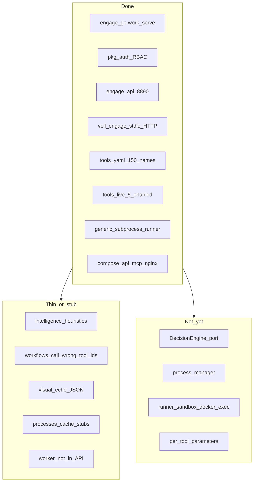
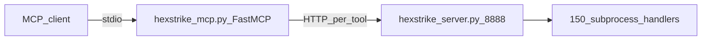

# Engage: срез реализации и Phase 3 (полная Go-перепись)

## Сравнение двух планов

| Источник | Статус в репозитории |
|----------|----------------------|
| [engage_follow-up_phases](.cursor/plans/engage_follow-up_phases_483cb3c3.plan.md) PR-1…PR-6 | **Выполнено в коде** (каталог, MCP stdio, deploy mcp, runner image, worker stub, category doc-пакеты) |
| [engage_layer_greenfield](.cursor/plans/engage_layer_greenfield_9d048eec.plan.md) R0–R7 | **R0/R1/R7 — по факту да**; **R2–R6 в frontmatter помечены completed, но это завышено** — см. таблицу ниже |

---

## Что уже реализовано (честный срез, май 2026)

### Инфраструктура и транспорт — готово

| Компонент | Путь | Факт |
|-----------|------|------|
| Слой + module | [engage/go.work](engage/go.work), [engage/serve/](engage/serve/) | Есть |
| Auth | [pkg/auth/](pkg/auth/), [AuthorizeEngageMCP](pkg/auth/mcp.go) | Общий с graph |
| HTTP API | [router.go](engage/serve/internal/transport/httpserver/router.go) | `/health`, `/api/tools`, intelligence, bugbounty, visual, admin |
| MCP | [mcpserver/](engage/serve/internal/transport/mcpserver/), [cmd/mcp](engage/serve/cmd/mcp/main.go) | stdio LSP + optional HTTP :8892 |
| Deploy | [deploy/engage/](deploy/engage/) | api/mcp distroless, runner toolbox, nginx `/engage-mcp/` |
| Каталог | [tools.yaml](engage/serve/catalog/tools.yaml) | **150** имён MCP; нейтральные descriptions |
| Live tools | [tools.live.yaml](engage/serve/catalog/tools.live.yaml) | **5** `enabled: true` |
| Доки | [engage-legacy-parity.md](docs/engage/engage-legacy-parity.md) | Матрица маршрутов |

### Phase 2+ (follow-up) — закрыто

- PR-1: [extract-legacy-catalog.py](scripts/engage/extract-legacy-catalog.py), без HexStrike в YAML
- PR-2–3: MCP + [mcp.Dockerfile](deploy/engage/docker/mcp.Dockerfile) + compose
- PR-4: [runner.Dockerfile](deploy/engage/docker/runner.Dockerfile) (nmap, nuclei, httpx, subfinder, feroxbuster), [enable-catalog-by-category.sh](scripts/engage/enable-catalog-by-category.sh)
- PR-5: [domain/job](engage/serve/internal/domain/job/), [cmd/worker](engage/serve/cmd/worker/main.go) — in-process queue, **не подключён к HTTP**
- PR-6: [internal/tools/network|web|cloud|osint](engage/serve/internal/tools/network/doc.go) — только doc stubs (KISS)

---

## Сравнение с HexStrike (`.external/hexstrike-ai-master/`)

Архитектура reference:

| Область | HexStrike (Python) | Veil engage (Go) сейчас | Gap |
|---------|-------------------|-------------------------|-----|
| MCP tools | ~151 `@mcp.tool` → HTTP | 150 в catalog, MCP `tools/list` + `tools/call` | Имена есть; **схемы аргументов упрощены** (`target` only) |
| HTTP tools | ~90 маршрутов `/api/tools/{binary}` с телом полей | Один `POST /api/tools/{name}` | **Нет** per-route handlers; нет `scan_type`, `ports`, recovery |
| Intelligence | `IntelligentDecisionEngine` (~1k+ строк таблиц) | [analyze.go](engage/serve/internal/usecase/intelligence/analyze.go) — URL/heuristics + veil categories | **Не портирован** decision engine |
| Workflows | Оркестрация с правильными tool id | [workflow.go](engage/serve/internal/usecase/workflow/workflow.go) вызывает `"nmap"`, `"httpx"` | **Баг**: catalog names = `nmap_scan`, `httpx_probe` |
| Processes | list/status/terminate/pause/dashboard/command | `GET /api/processes/list` → `[]` | **Нет** ProcessManager |
| Visual | `ModernVisualEngine`, карточки, ANSI | JSON echo stubs | **Не портирован** |
| Cache/Telemetry | Реальные счётчики | stubs | Минимально |
| Runner | subprocess на хосте сервера | [executor.go](engage/serve/internal/runner/executor.go) на API-хосте | **Нет** `sandbox.go`, **нет** exec в `engage-runner` контейнере |
| Auth | нет | Keycloak + RBAC | Преимущество Veil |
| Graph | нет | [veilgraph client](engage/serve/internal/client/veilgraph/) | Преимущество Veil |

**Вывод:** engage — это **greenfield каркас + catalog parity по именам**, а не полная перепись ~17k строк `hexstrike_server.py`. «Полностью на Go» означает Phase 3+: поведение, параметры, процессы, intelligence, изоляция runner.

---

## Расхождение с greenfield-планом (почему R2–R6 нельзя считать done)

| Release в плане | Заявлено | Факт |
|-----------------|----------|------|
| R2–R5 category Go | `internal/tools/network/*` с логикой | Только `doc.go`; исполнение = YAML + generic runner |
| R6 Intelligence + MCP ~151 | Decision engine + workflows | Routes есть; логика stub; workflows ломаются на именах tools |
| R3 worker | async long scans | `cmd/worker` есть; **нет** `POST /api/jobs`, нет compose service |

---

## Что вставить в конец [engage_layer_greenfield_9d048eec.plan.md](.cursor/plans/engage_layer_greenfield_9d048eec.plan.md)

*(Редактирование файла — отдельный шаг после approve; plan file follow-up не трогаем.)*

### Статус foundation + Phase 2+ (2026-05)

- **R0, R1, R7:** выполнены (scaffold, 5 live tools, secure deploy, docs).
- **Phase 2+ PR-1…PR-6:** выполнены (нейминг, MCP, mcp deploy, runner image, worker skeleton, category doc packages).
- **R2–R6 (исходная таблица):** **частично** — catalog 150 имён + generic execution; **не** category adapters и **не** порт DecisionEngine.

### Phase 2+ — итог

| PR | id | Статус |
|----|-----|--------|
| 1 | engage-pr1-catalog | done |
| 2 | engage-pr2-mcp-stdio | done |
| 3 | engage-pr3-mcp-deploy | done |
| 4 | engage-pr4-runner-tools | done |
| 5 | engage-pr5-worker | skeleton |
| 6 | engage-pr6-category-go | doc-only |

### Frontmatter — предложенные правки

- `engage-r2-r5-tools` → **status: cancelled** (superseded; реальная работа = Phase 3 R8–R12)
- `engage-r6-workflows` → **status: cancelled** (routes stub)
- Добавить todos Phase 3 (ниже)

---

## Phase 3 — полная Go-перепись (приоритет: exec depth)

Выбранный порядок: **сначала глубина исполнения**, затем process/jobs, затем intelligence.

### R8 — Catalog + execution depth (PR-A, ~3–4 дня)

**Цель:** один tool = предсказуемый запуск с legacy-совместимыми аргументами.

1. **Расширить schema каталога** в [catalog.go](engage/serve/internal/tools/catalog.go) / YAML:
   - `parameters:` (имя, type, default, required) — извлечь из сигнатур `@mcp.tool` / тел `hexstrike_mcp.py` + `hexstrike_server.py` routes
   - Обновить [extract-legacy-catalog.py](scripts/engage/extract-legacy-catalog.py) (или новый `extract-legacy-parameters.py`)
2. **Runner:** [BuildArgs](engage/serve/internal/runner/executor.go) — подстановка всех `{param}` из `ToolRunRequest.Parameters`
3. **MCP:** [tools.go](engage/serve/internal/transport/mcpserver/tools.go) — `inputSchema` per tool из catalog (не общий `target`-only)
4. **Fix workflows:** [SelectTools](engage/serve/internal/usecase/intelligence/analyze.go) → возвращать **catalog names** (`nmap_scan`, …); mapping table `binary → default_catalog_name`
5. **Тесты:** golden tests на 5 live tools + 3–5 tools с богатыми args (nmap ports, nuclei templates)

### R9 — Runner isolation (PR-B, ~2 дня)

**Цель:** как HexStrike отделяет «опасные» subprocess, но с Veil hardening.

1. [sandbox.go](engage/serve/internal/runner/sandbox.go) — `docker exec` / `nerdctl` в `engage-runner` (compose profile `runner`)
2. API `ENGAGE_RUNNER_MODE=local|docker`, `ENGAGE_RUNNER_CONTAINER=engage-runner`
3. Env allowlist, cwd [ENGAGE_RUNNER_WORKDIR](engage/serve/internal/config/config.go)
4. Smoke: `test-engage-smoke` гоняет `nmap_scan` через sidecar

### R10 — Enable + parity CI (PR-C, ~1 день)

1. Доработать [enable-catalog-by-category.sh](scripts/engage/enable-catalog-by-category.sh) — писать overrides в `tools.enabled.yaml` (не мутировать generated `tools.yaml`)
2. CI: `tools.yaml` count == 150; diff vs `.external` tool list; `ENGAGE_TOOLS_MINIMAL=1` smoke one network tool

### R11 — Process + async jobs (после exec depth)

1. Port subset of HexStrike process APIs: `list`, `status`, `terminate`, `dashboard`
2. `POST /api/jobs`, `GET /api/jobs/{id}` → [usecase/job](engage/serve/internal/usecase/job/queue.go)
3. `engage-worker` service в [compose.yml](deploy/engage/compose.yml)

### R12 — Intelligence engine (после jobs)

1. Go port `IntelligentDecisionEngine` tables → [usecase/intelligence](engage/serve/internal/usecase/intelligence/) (domain types в `domain/target`)
2. Реализовать `optimize-parameters`, `create-attack-chain` с реальной логикой
3. Опционально: enrichment из veil-api (TI context)

### R13 — Visual / reports

1. [usecase/report](engage/serve/internal/usecase/report/report.go) — structured findings, severity
2. `visual/*` — JSON schema stable для агентов (без ANSI); PDF/HTML later

---

## Не делаем (границы greenfield)

- Не правим [`.external/hexstrike-ai-master/`](.external/hexstrike-ai-master/)
- Не копируем 90 отдельных Flask routes — **единый** `POST /api/tools/{name}` + богатый catalog
- Не line-by-line port 17k LOC Python — только **поведенческий** паритет

---

## Первый PR после обновления плана (рекомендация)

**R8 PR-A:** catalog parameters + workflow name fix + MCP per-tool schemas + tests.

Критерий готовности: `POST /api/tools/nmap_scan` с `{"target":"127.0.0.1","parameters":{"scan_type":"-sV"}}` и `tools/call` с теми же полями; workflow `comprehensive-assessment` вызывает реальные enabled tools.
