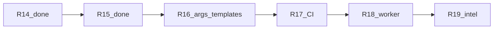

# Engage Phase 4 — слайс R16 (catalog args depth)

## Где мы сейчас

| Release | Статус |
|---------|--------|
| R14 Runner + smoke | Done — [`compose.runner.yml`](deploy/engage/compose.runner.yml), [`api-runner.Dockerfile`](deploy/engage/docker/api-runner.Dockerfile), [`smoke-engage-tool.sh`](scripts/test/smoke-engage-tool.sh) |
| R15 Process + jobs | Done — [`executor.go`](engage/serve/internal/runner/executor.go) + `ProcessTracker`, jobs `parameters`, router tests |
| **R16** | **Следующий** |
| R17 CI parity | Pending — нет `.github/workflows` для engage |
| R18 Worker queue | Pending — [`cmd/worker`](engage/serve/cmd/worker/main.go) всё ещё in-process stub |
| R19 Intelligence | Pending — [`SelectTools`](engage/serve/internal/usecase/intelligence/analyze.go) не вызывает [`RankTools`](engage/serve/internal/usecase/intelligence/decision.go) |



## Проблема (gap)

- В [`extract-legacy-catalog.py`](scripts/engage/extract-legacy-catalog.py) только **6** записей в `ARGS_TEMPLATES`; остальные 144+ tools получают generic `["{target}", "{additional_args}"]`.
- **MCP `parameters`** богатые (из сигнатур `@mcp.tool`), но **CLI `args`** не отражают флаги — `BuildArgs` подставляет поля, которых нет в шаблоне.
- Часть tools в [`tools.yaml`](engage/serve/catalog/tools.yaml) уже имеет кастомные `args` (ручной drift vs script) — нужна **одна** regen-истина.
- [`mergeParameters`](engage/serve/internal/usecase/tools/run.go) кладёт только `target`; legacy tools с `url` (gobuster, sqlmap, ffuf) требуют alias.

## Цель R16

Для **~25–30** наиболее используемых tools (runner image + `BinaryToCatalog` + live catalog) — предсказуемый CLI из `parameters`, с golden-тестами на `BuildArgs`.

**Не в scope:** полные 150 templates, category Go adapters, worker/CI/intelligence (R17–R19).

---

## 1. Расширить `ARGS_TEMPLATES` в extract-скрипте

Файл: [`scripts/engage/extract-legacy-catalog.py`](scripts/engage/extract-legacy-catalog.py)

Добавить явные шаблоны (ориентир — сигнатуры в [`.external/hexstrike-ai-master/hexstrike_mcp.py`](.external/hexstrike-ai-master/hexstrike_mcp.py)):

| Категория | Tools (catalog name) | Шаблон args (идея) |
|-----------|----------------------|-------------------|
| network | `rustscan_fast_scan` | `rustscan -a {target} -p {ports} {additional_args}` |
| network | `masscan_high_speed` | `{target} -p{ports} --rate {rate} {additional_args}` |
| network | `nmap_advanced_scan` | как `nmap_scan` + `{timing}`, `{nse_scripts}` |
| web | `nikto_scan` | `-h {target} {additional_args}` |
| web | `sqlmap_scan` | `-u {target} --data {data} {additional_args}` |
| web | `ffuf_scan` | `-u {target} -w {wordlist} {additional_args}` |
| web | `feroxbuster_scan` | `-u {target} -w {wordlist} {additional_args}` |
| web | `wpscan_scan` | `--url {target} {additional_args}` |
| web | `gobuster_scan` | `{mode} -u {target} -w {wordlist} {additional_args}` (исправить hardcoded `dir`) |
| osint | `amass_scan`, `theharvester_scan` | `-d {target} {additional_args}` |
| auth | `hydra_attack` | типовой hydra template по params из MCP |

Уже есть (сохранить): `nmap_scan`, `nuclei_scan`, `httpx_probe`, `subfinder_scan`, `trivy_scan`, `gobuster_scan`.

---

## 2. Эвристика `infer_args_template(name, params)` (fallback)

После lookup в `ARGS_TEMPLATES`, если шаблона нет — генерировать из имён параметров:

```python
def infer_args_template(name: str, params: list[dict]) -> list[str]:
    names = {p["name"] for p in params}
    if "scan_type" in names and "ports" in names:
        return ["{scan_type}", "-p", "{ports}", "{additional_args}", "{target}"]
    if "wordlist" in names and ("url" in names or "target" in names):
        return ["-u", "{target}", "-w", "{wordlist}", "{additional_args}"]
    if "templates" in names:
        return ["-u", "{target}", "-t", "{templates}", "{additional_args}"]
    # ... 3–4 правила для cloud/auth
    return ["{target}", "{additional_args}"]
```

Применять **только** для tools из allowlist `INFER_TOOLS` (~30 имён), чтобы не менять поведение всех 150 entries за один PR.

---

## 3. Parameter alias `target` → `url`

В [`mergeParameters`](engage/serve/internal/usecase/tools/run.go):

```go
if req.Target != "" {
    out["target"] = req.Target
    if _, hasURL := findParam(spec, "url"); hasURL {
        if out["url"] == "" {
            out["url"] = req.Target
        }
    }
}
```

Покрыть тестом: `gobuster_scan` / `sqlmap_scan` с телом `{"target":"http://example.com"}`.

---

## 4. Regen catalog + live overlay

```bash
make catalog-engage
make test-engage-parity   # 150 names vs .external
```

- [`tools.yaml`](engage/serve/catalog/tools.yaml) — перезаписать из скрипта (diff ~25–40 tools с новыми `args`).
- [`tools.live.yaml`](engage/serve/catalog/tools.live.yaml) — **не** трогать вручную (5 enabled tools уже с rich args).
- Убедиться, что regen не ломает `enabled: false` default.

---

## 5. Golden tests `BuildArgs`

Файл: [`engage/serve/internal/runner/executor_test.go`](engage/serve/internal/runner/executor_test.go) (или новый `catalog_args_test.go`).

Table-driven кейсы (минимум 8):

| Tool | Parameters | Assert contains |
|------|------------|-----------------|
| `nmap_scan` | ports empty | no `-p` |
| `rustscan_fast_scan` | ports `80,443` | `-p` / ports value |
| `gobuster_scan` | mode `dir`, wordlist | `-u`, `-w` |
| `ffuf_scan` | wordlist | `-w` |
| `sqlmap_scan` | data POST | `--data` |
| `nikto_scan` | target only | `-h` |
| `nuclei_scan` | templates | `-t` |
| `masscan_high_speed` | rate | `--rate` |

Опционально: тест загружает args из `tools.yaml` для 3 tools (integration с `tools.LoadCatalog`) — ловит drift regen vs live.

---

## 6. Документация

- [`docs/engage-tools.md`](docs/engage-tools.md) — секция «Args templates»: `ARGS_TEMPLATES`, `infer_args_template`, `make catalog-engage`.
- Одна строка в [`engage/README.md`](engage/README.md) catalog table.

**Не редактировать** [`.cursor/plans/engage_phase_4_slice_67ef98c5.plan.md`](.cursor/plans/engage_phase_4_slice_67ef98c5.plan.md) (по запросу пользователя). Обновить [`engage_layer_greenfield_9d048eec.plan.md`](.cursor/plans/engage_layer_greenfield_9d048eec.plan.md): Phase 4 table, todos `engage-r16` … `engage-r19`.

---

## Критерии готовности

- `make test-engage` зелёный.
- `make test-engage-parity` зелёный.
- `POST /api/tools/gobuster_scan` с `{"target":"http://127.0.0.1","parameters":{"mode":"dir"}}` — args содержат `-u` и `dir` (не generic single `{target}`).
- ≥25 tools в `tools.yaml` с non-generic `args` (не `["{target}","{additional_args}"]` only).

---

## Preview: R17–R19 (следующие слайсы)

| Release | Содержание | ~объём |
|---------|------------|--------|
| **R17** | GitHub workflow: `make test-engage`, `test-engage-parity`, `ENGAGE_SKIP_TOOL_SMOKE=1` | 0.5 дня |
| **R18** | File-based job queue (`/var/veil/engage/jobs`), worker читает pending, API пишет | 2 дня |
| **R19** | `SelectTools` → `RankTools` + расширение effectiveness tables + catalog name resolution | 2 дня |
