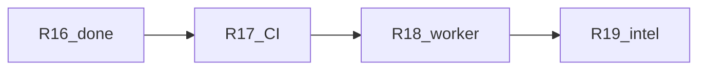
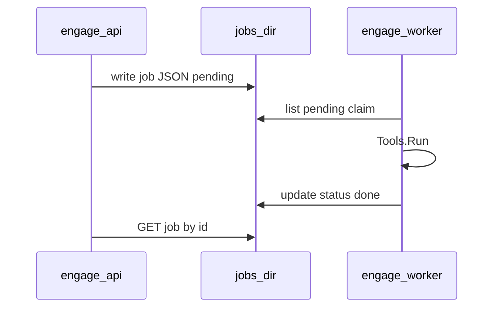

# Engage Phase 4 — слайс R17 (CI parity)

## Контекст

| Release | Статус |
|---------|--------|
| R14–R16 | **Done** (runner compose, process/jobs, catalog args) |
| **R17** | **Следующий** |
| R18 Worker queue | Pending |
| R19 Intelligence depth | Pending |



Сейчас engage тестируется только локально (`make test-engage`, `make test-engage-parity`). В репозитории **нет** [`.github/workflows/`](.github/workflows/) — CI для engage отсутствует.

---

## Проблема

- [`AGENTS.md`](AGENTS.md) требует `make test-engage` / `test-engage-parity` при изменении catalog, но PR не ловят регрессии автоматически.
- [`check-catalog-parity.sh`](scripts/engage/check-catalog-parity.sh) сравнивает с [`.external/hexstrike-ai-master/hexstrike_mcp.py`](.external/hexstrike-ai-master/hexstrike_mcp.py), но [`.external/` в `.gitignore`](.gitignore) — в CI файла нет; скрипт уже **корректно skip** (`exit 0`, сообщение `skip parity`).
- `test-engage-smoke-tool` требует поднятый API + nmap — **не** в default CI (только `ENGAGE_SKIP_TOOL_SMOKE=1` или отдельный manual workflow).

---

## Цель R17

Один workflow: на каждый push/PR с изменениями engage — зелёные unit-тесты и build `cmd/api|mcp|worker`.

**Не в scope R17:** Docker runner e2e, file-based job queue (R18), RankTools (R19).

---

## 1. GitHub Actions workflow

Создать [`.github/workflows/engage.yml`](.github/workflows/engage.yml):

```yaml
name: engage

on:
  push:
    branches: [main, master]
    paths:
      - 'engage/**'
      - 'pkg/auth/**'
      - 'pkg/engage/**'
      - 'scripts/engage/**'
      - 'scripts/test/smoke-engage*.sh'
      - 'Makefile'
      - '.github/workflows/engage.yml'
  pull_request:
    paths: [ ... same ... ]

jobs:
  test:
    runs-on: ubuntu-latest
    steps:
      - uses: actions/checkout@v4
      - uses: actions/setup-go@v5
        with:
          go-version: '1.25'
      - name: Unit tests and build
        run: make test-engage
      - name: Catalog parity
        run: make test-engage-parity
        # skips gracefully when .external/ is absent (gitignored)
```

**Заметки:**
- `engage/go.work` тянет `../pkg`, `../pkg/auth`, `../pkg/engage` — path filters включают эти каталоги.
- Go version **1.25** — как в [`engage/go.work`](engage/go.work) и Dockerfiles.
- Без `GOWORK` в env shell (Makefile сам выставляет `GOWORK` для `engage/serve`).

---

## 2. Опционально: workflow для полного parity (manual / schedule)

Если в CI нужен строгий count 150 vs legacy (не skip):

- Отдельный job `parity-external` с `workflow_dispatch` + documented step «clone/reference `.external` locally» **или** закоммиченный минимальный fixture `scripts/engage/fixtures/mcp-tool-names.txt` (вне scope R17 unless requested).

**Рекомендация R17:** оставить skip при отсутствии `.external`; в [`docs/engage-tools.md`](docs/engage-tools.md) одна строка: «full parity requires local `.external/`».

---

## 3. Документация

| Файл | Изменение |
|------|-----------|
| [`docs/engage-tools.md`](docs/engage-tools.md) | Секция **CI**: workflow `engage.yml`, что запускается, что skip без `.external` |
| [`engage/README.md`](engage/README.md) | Badge или ссылка «CI: GitHub Actions engage workflow» (badge optional, только если repo на GitHub) |
| [`CONTRIBUTING.md`](CONTRIBUTING.md) | Одна строка: PR с `engage/` → CI `engage` job должен быть зелёным |
| [`engage_layer_greenfield_9d048eec.plan.md`](.cursor/plans/engage_layer_greenfield_9d048eec.plan.md) | `engage-r17-ci-parity` → completed после merge |

**Не редактировать** plan-файлы `engage_phase_4_*.plan.md` (по предыдущему запросу).

---

## 4. Локальная проверка перед merge

```bash
make test-engage
make test-engage-parity
ENGAGE_SKIP_TOOL_SMOKE=1 make test-engage-smoke-tool   # optional local
```

---

## Критерии готовности R17

- [`.github/workflows/engage.yml`](.github/workflows/engage.yml) существует и валиден (YAML lint / act optional).
- `make test-engage` и `make test-engage-parity` проходят локально.
- Path filters не запускают engage job на чистых graph-only PR.
- Документация обновлена.

---

## Preview: R18 — Worker queue (~2 дня)

| Компонент | Сейчас | Цель |
|-----------|--------|------|
| [`queue.go`](engage/serve/internal/usecase/job/queue.go) | In-memory map, `go q.run` на Enqueue | API пишет pending job в dir |
| [`cmd/worker`](engage/serve/cmd/worker/main.go) | Отдельный in-proc queue, не читает API | Poll `ENGAGE_JOBS_DIR`, claim + run |
| Compose | `engage-worker` healthcheck only | Shared volume `engage_jobs` |



Без NATS (граница engage layer).

---

## Preview: R19 — Intelligence depth (~2 дня)

1. [`SelectTools`](engage/serve/internal/usecase/intelligence/analyze.go) — кандидаты → [`RankTools`](engage/serve/internal/usecase/intelligence/decision.go) → [`ResolveCatalogNames`](engage/serve/internal/tools/catalog_names.go).
2. Расширить `defaultEffectiveness()` (больше binary ids из catalog).
3. Тесты: web target → `nuclei_scan` выше `nmap_scan` в ranking.

---

## Порядок работ (R17 checklist)

1. Добавить `.github/workflows/engage.yml` с path filters и Go 1.25.
2. Прогнать `make test-engage` / `test-engage-parity` локально.
3. Обновить docs (engage-tools, CONTRIBUTING, engage README).
4. Обновить greenfield plan frontmatter `engage-r17-ci-parity` → done.
