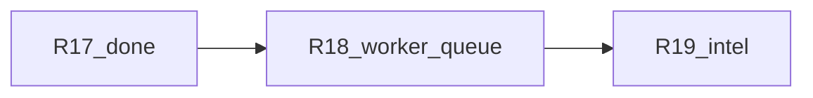
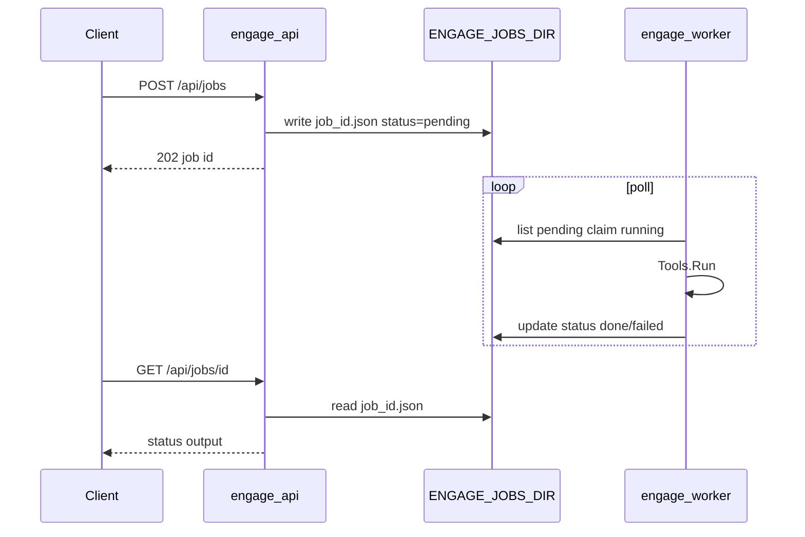

# Engage Phase 4 — слайс R18 (Worker queue)

## Контекст

| Release | Статус |
|---------|--------|
| R14–R17 | **Done** (runner, process/jobs, catalog args, CI [`.github/workflows/engage.yml`](.github/workflows/engage.yml)) |
| **R18** | **Следующий** |
| R19 Intelligence | Pending |



### Текущий gap

| Компонент | Факт |
|-----------|------|
| [`queue.go`](engage/serve/internal/usecase/job/queue.go) | In-memory `map`; `go q.run()` на каждый `Enqueue` |
| [`cmd/worker`](engage/serve/cmd/worker/main.go) | Свой `NewQueue`, `RunWorker` только ждёт `ctx.Done()` |
| [`compose.yml`](deploy/engage/compose.yml) | `engage-worker` без общего volume с API |
| `GET /api/jobs/{id}` | Читает только in-memory API-процесса — worker не видит те же jobs |

---

## Цель R18

Разделить **enqueue** (API) и **execute** (worker) через файловую очередь без NATS.

| Режим | Кто исполняет | Когда |
|-------|---------------|--------|
| `memory` (default) | API in-process `go run()` | Локальные тесты, один процесс |
| `file` | `engage-worker` poll | Compose / prod-like |

**Не в scope:** Redis/NATS, `RankTools` (R19), cancel job API.

---

## Архитектура



---

## 1. Job store interface

Новый файл [`engage/serve/internal/usecase/job/store.go`](engage/serve/internal/usecase/job/store.go):

```go
type Store interface {
    Put(j *domain.Job) error
    Get(id string) (*domain.Job, bool)
}

type MemoryStore struct { ... }  // текущий map, для тестов

type FileStore struct {
    Dir string
}
```

**File layout:** `{ENGAGE_JOBS_DIR}/{id}.json` — полный [`domain.Job`](engage/serve/internal/domain/job/job.go) (JSON).

**Claim (worker):** read file → if `status == pending` → set `running` + `UpdatedAt` → atomic write (`WriteFile` temp + `Rename`).

Расширить `Job`:

```go
Subject string `json:"subject,omitempty"` // RBAC subject from POST /api/jobs
```

---

## 2. Refactor `Queue`

[`queue.go`](engage/serve/internal/usecase/job/queue.go):

- Поля: `store Store`, `tools *Runner`, `mode string` (`memory`|`file`), `pollInterval`
- `NewQueue(runner, opts...)` с `WithStore`, `WithMode`
- **Enqueue:** validate tool → create job (`pending`) → `store.Put` → **только если `mode == memory`:** `go q.run(subject, j)`
- **Get:** `store.Get`
- **RunWorker(ctx):** loop:
  - `ListPending` / scan dir for `pending`
  - claim + `run(subject, j)` + `store.Put` with result
  - sleep `pollInterval` (default 1s, env `ENGAGE_JOBS_POLL_SEC`)
  - exit on `ctx.Done()`

---

## 3. Config + wiring

[`config.go`](engage/serve/internal/config/config.go):

| Env | Default | Role |
|-----|---------|------|
| `ENGAGE_JOBS_MODE` | `memory` | `memory` \| `file` |
| `ENGAGE_JOBS_DIR` | `/tmp/engage/jobs` | FileStore directory |
| `ENGAGE_JOBS_POLL_SEC` | `1` | Worker poll interval |

[`components/api.go`](engage/serve/internal/components/api.go):

```go
store := jobuc.NewMemoryStore()
if cfg.JobsMode == "file" {
    _ = os.MkdirAll(cfg.JobsDir, 0700)
    store = jobuc.NewFileStore(cfg.JobsDir)
}
jobs := jobuc.NewQueue(toolRunner, jobuc.WithStore(store), jobuc.WithMode(cfg.JobsMode))
```

[`cmd/worker/main.go`](engage/serve/cmd/worker/main.go):

- `ENGAGE_JOBS_MODE=file` (force or inherit env)
- `InitAPI` → shared `api.Jobs.RunWorker(ctx)` (тот же queue instance config)
- Убрать отдельный `NewQueue` в worker

---

## 4. Compose

[`deploy/engage/compose.yml`](deploy/engage/compose.yml):

```yaml
volumes:
  engage_jobs:

services:
  engage-api:
    environment:
      ENGAGE_JOBS_MODE: file
      ENGAGE_JOBS_DIR: /var/veil/engage/jobs
    volumes:
      - engage_jobs:/var/veil/engage/jobs

  engage-worker:
    environment:
      ENGAGE_JOBS_MODE: file
      ENGAGE_JOBS_DIR: /var/veil/engage/jobs
    volumes:
      - engage_jobs:/var/veil/engage/jobs
      - catalog (existing)
```

---

## 5. Тесты

| Файл | Содержание |
|------|------------|
| [`store_test.go`](engage/serve/internal/usecase/job/store_test.go) | FileStore Put/Get, claim race (single worker) |
| [`queue_test.go`](engage/serve/internal/usecase/job/queue_test.go) | Сохранить memory enqueue; добавить `TestQueue_fileMode_workerRuns` — temp dir, `mode=file`, `Enqueue`, `RunWorker` в goroutine с timeout, assert `done` |
| [`router_test.go`](engage/serve/internal/transport/httpserver/router_test.go) | Optional: inject file queue + skip if no echo |

`make test-engage` зелёный.

---

## 6. Документация

- [`docs/engage/engage-runtime.md`](docs/engage/engage-runtime.md) — env `ENGAGE_JOBS_*`, diagram API vs worker
- [`engage/README.md`](engage/README.md) — worker consumes file queue in compose
- [`engage_layer_greenfield_9d048eec.plan.md`](.cursor/plans/engage_layer_greenfield_9d048eec.plan.md) — `engage-r18-worker-queue` → completed

**Не редактировать** `engage_phase_4_*.plan.md`.

---

## Критерии готовности

- `POST /api/jobs` с `ENGAGE_JOBS_MODE=file` создаёт JSON в `ENGAGE_JOBS_DIR`, **не** запускает tool в API-процессе
- `engage-worker` с тем же volume переводит job в `done`/`failed`
- `GET /api/jobs/{id}` возвращает актуальный статус из файла
- `ENGAGE_JOBS_MODE=memory` — поведение как сейчас (backward compatible)
- Compose `engage-api` + `engage-worker` с `engage_jobs` volume

---

## Preview: R19 — Intelligence depth

1. [`SelectTools`](engage/serve/internal/usecase/intelligence/analyze.go): candidates → [`RankTools`](engage/serve/internal/usecase/intelligence/decision.go) → [`ResolveCatalogNames`](engage/serve/internal/tools/catalog_names.go)
2. Тест: `web` → `nuclei` ranked above `nmap`
3. Optional: filter to **enabled** catalog tools only
