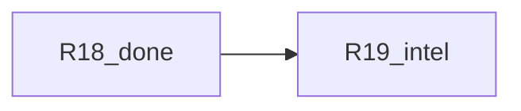
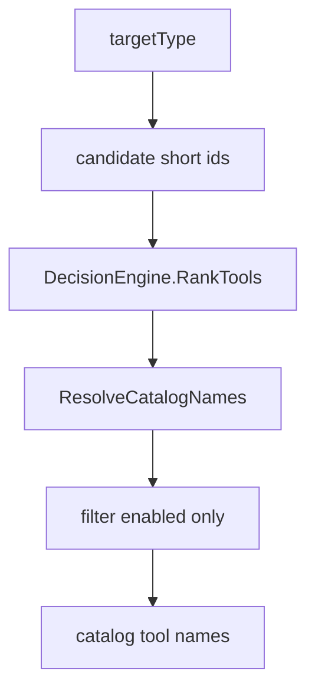

# Engage Phase 4 — слайс R19 (Intelligence depth)

## Контекст

| Release | Статус |
|---------|--------|
| R14–R18 | **Done** (runner, jobs, catalog args, CI, file worker queue) |
| **R19** | **Следующий** (закрывает Phase 4) |



### Gap

[`SelectTools`](engage/serve/internal/usecase/intelligence/analyze.go) возвращает **фиксированный порядок** short ids → `ResolveCatalogNames`, **без** [`RankTools`](engage/serve/internal/usecase/intelligence/decision.go):

```47:57:engage/serve/internal/usecase/intelligence/analyze.go
func (s *Service) SelectTools(_ context.Context, targetType string, _ string) []string {
	var short []string
	switch targetType {
	case "web", "api":
		short = []string{"httpx", "nuclei", "gobuster", "nikto"}
	// ...
	return tools.ResolveCatalogNames(short, s.Registry)
}
```

`CreateAttackChain` и [`workflow.RunWorkflow`](engage/serve/internal/usecase/workflow/workflow.go) уже вызывают `SelectTools` — улучшение автоматически попадёт в workflows.

**Не в scope:** полный port HexStrike `IntelligentDecisionEngine` (~1k LOC), новые HTTP routes, расширение таблиц на все 150 tools.

---

## Цель R19



1. **Rank** — effectiveness tables (существующие + minor additions).
2. **Resolve** — `nmap` → `nmap_scan`, etc. ([`catalog_names.go`](engage/serve/internal/tools/catalog_names.go)).
3. **Filter** — только tools с `enabled: true` в registry (workflows не вызывают disabled entries).

---

## 1. Injectable `DecisionEngine` on `Service`

[`analyze.go`](engage/serve/internal/usecase/intelligence/analyze.go):

```go
type Service struct {
    Veil     *veilgraph.Client
    Registry *tools.Registry
    Engine   *DecisionEngine // nil → DefaultDecisionEngine()
}
```

[`components/api.go`](engage/serve/internal/components/api.go): optional `Engine: intelligence.DefaultDecisionEngine()` (explicit, testable).

`OptimizeParameters` — использовать `s.Engine` вместо `DefaultDecisionEngine()` каждый раз (DRY).

---

## 2. Refactor `SelectTools`

Extract `candidateIDs(targetType string) []string` — текущий `switch` (web/api/ip/default).

New flow:

```go
func (s *Service) SelectTools(ctx context.Context, targetType, _ string) []string {
    cands := s.candidateIDs(targetType)
    eng := s.Engine
    if eng == nil {
        eng = DefaultDecisionEngine()
    }
    ranked := eng.RankTools(targetType, cands)
    names := tools.ResolveCatalogNames(ranked, s.Registry)
    return filterEnabled(names, s.Registry)
}
```

`filterEnabled` — skip names where `Registry.Get(name)` missing or `!spec.Enabled`.

**Cap (optional):** limit to top 8 after rank — не обязательно в R19; workflows уже skip `MustGet` errors.

---

## 3. Minor effectiveness table updates

[`decision.go`](engage/serve/internal/usecase/intelligence/decision.go) — добавить ids уже используемые в candidates:

| targetType | Add / tune |
|------------|------------|
| `web` | `sqlmap`, `feroxbuster` (scores below nuclei) |
| `ip` | ensure `rustscan`, `masscan` scored |
| `unknown` | `subfinder` 0.75 (already present) |

No new target types in R19.

---

## 4. Tests

New [`analyze_test.go`](engage/serve/internal/usecase/intelligence/analyze_test.go):

| Test | Assert |
|------|--------|
| `TestSelectTools_web_ranksNucleiFirst` | Registry with all names enabled; `SelectTools(..., "web", "")` → first item `nuclei_scan` |
| `TestSelectTools_skipsDisabled` | Registry: `nuclei_scan` disabled, `httpx_probe` enabled → result excludes nuclei |
| `TestSelectTools_unknownUsesEngine` | `unknown` → non-empty, contains `subfinder_scan` |

Existing [`decision_test.go`](engage/serve/internal/usecase/intelligence/decision_test.go) — keep `TestDecisionEngine_RankTools`.

Optional: `TestCreateAttackChain_stepsOrdered` — steps[0].tool is highest-ranked enabled name.

---

## 5. Документация

| File | Change |
|------|--------|
| [`docs/engage-legacy-parity.md`](docs/engage-legacy-parity.md) or [`docs/engage-tools.md`](docs/engage-tools.md) | One line: `select-tools` uses decision engine ranking |
| [`engage_layer_greenfield_9d048eec.plan.md`](.cursor/plans/engage_layer_greenfield_9d048eec.plan.md) | R19 done; Phase 4 complete |

**Не редактировать** `engage_phase_4_*.plan.md`.

---

## Критерии готовности

- `POST /api/intelligence/select-tools` с `target_type: web` возвращает tools в порядке effectiveness (`nuclei_scan` before `nmap_scan` when both enabled).
- Disabled catalog tools не попадают в список.
- `make test-engage` зелёный.
- Workflows (`comprehensive-assessment`) используют тот же ranked order без изменений в `workflow.go` (кроме опционального комментария).

---

## Phase 4 complete

После R19 все релизы R14–R19 закрыты. Дальнейшие улучшения (Redis jobs, full HexStrike engine port, category Go adapters) — вне текущего Phase 4 scope.
