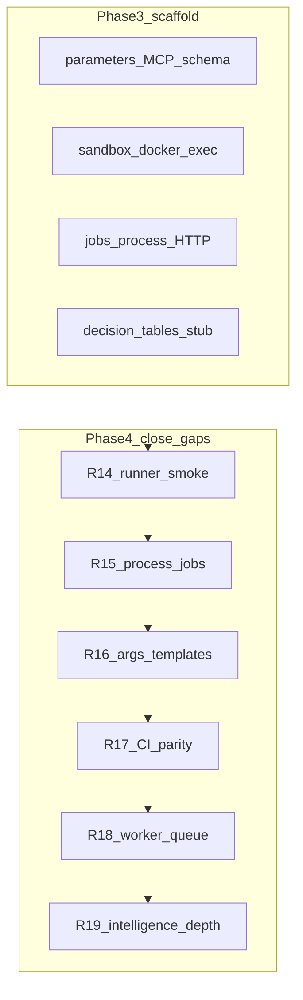
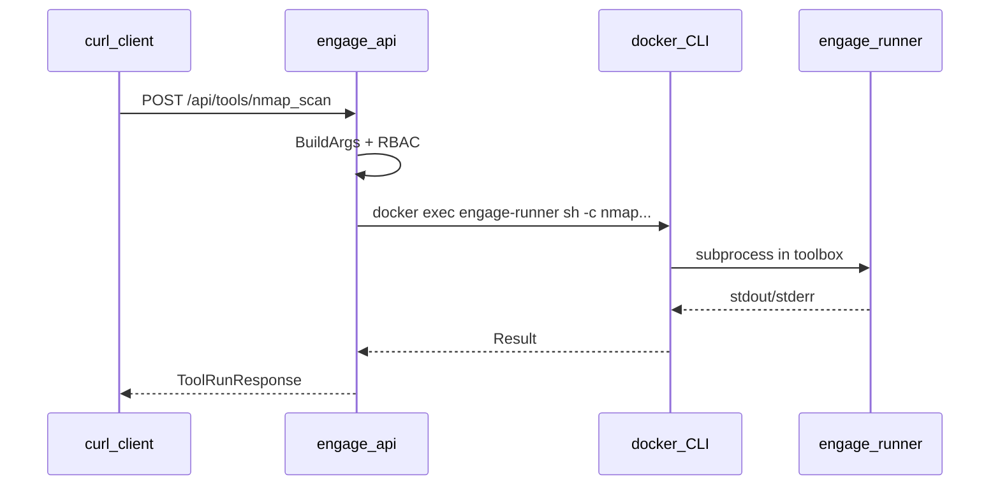

# Engage Phase 4 — следующий слайс (R14)

## Контекст

| Фаза | Статус |
|------|--------|
| Foundation R0–R1, R7 | Done |
| Phase 2+ PR-1…PR-6 | Done ([engage_follow-up_phases](.cursor/plans/engage_follow-up_phases_483cb3c3.plan.md)) |
| Phase 3 R8–R13 | **Scaffold done**, поведенческий паритет **частичный** ([engage_phase_3_slice](.cursor/plans/engage_phase_3_slice_aef67463.plan.md)) |

Phase 4 **не** возвращается к отменённым R2–R6 (category Go adapters) — KISS: YAML catalog + generic runner остаётся.



---

## Phase 4 — релизы (весь объём)

| Release | Цель | Ключевые файлы |
|---------|------|----------------|
| **R14** (первый слайс) | Docker runner в compose + smoke с `nmap_scan` | [compose.yml](deploy/engage/compose.yml), [smoke-engage.sh](scripts/test/smoke-engage.sh), [docs/engage/engage-runtime.md](docs/engage/engage-runtime.md) |
| **R15** | Process manager + jobs с `parameters` | [executor.go](engage/serve/internal/runner/executor.go), [run.go](engage/serve/internal/usecase/tools/run.go), [queue.go](engage/serve/internal/usecase/job/queue.go), [router.go](engage/serve/internal/transport/httpserver/router.go) |
| **R16** | Расширить `ARGS_TEMPLATES` (~20–30 tools) | [extract-legacy-catalog.py](scripts/engage/extract-legacy-catalog.py), regen [tools.yaml](engage/serve/catalog/tools.yaml), golden tests |
| **R17** | Parity в CI | `.github/workflows/*` + `make test-engage-parity` |
| **R18** | Worker ≠ stub: общая очередь jobs | [cmd/worker](engage/serve/cmd/worker/main.go), file/HTTP broker (без NATS в engage) |
| **R19** | Intelligence: `RankTools` → catalog names в `SelectTools` | [decision.go](engage/serve/internal/usecase/intelligence/decision.go), [analyze.go](engage/serve/internal/usecase/intelligence/analyze.go) |

После approve — дописать в [engage_layer_greenfield_9d048eec.plan.md](.cursor/plans/engage_layer_greenfield_9d048eec.plan.md) секцию **Phase 4 R14–R19** и frontmatter todos (как для R8–R13).

---

## Слайс 1: R14 — Runner ops + execution smoke (~1–2 дня)

### Проблема

- [sandbox.go](engage/serve/internal/runner/sandbox.go) реализован, но [compose.yml](deploy/engage/compose.yml) **не** выставляет `ENGAGE_RUNNER_MODE=docker` / `ENGAGE_RUNNER_CONTAINER`.
- `engage-api` не монтирует Docker socket → `docker exec` из API-контейнера невозможен.
- [smoke-engage.sh](scripts/test/smoke-engage.sh) проверяет только `/health` и список tools — **нет** POST tool run (заявленный в R9 критерий не выполнен).
- [test-engage-minimal](Makefile) только вызывает enable-script, не гоняет tool.

### Цель слайса

Лабораторный профиль `runner`: поднять `engage-runner` + API с docker-mode и доказать e2e `POST /api/tools/nmap_scan` (или `httpx_probe` как fallback) через sidecar.

### Изменения

**1. Compose profile `runner` (dev)**

В [deploy/engage/compose.yml](deploy/engage/compose.yml) для `engage-api` (и опционально `engage-mcp`, если MCP вызывает runner напрямую):

```yaml
environment:
  ENGAGE_RUNNER_MODE: ${ENGAGE_RUNNER_MODE:-local}  # local по умолчанию
  ENGAGE_RUNNER_CONTAINER: ${ENGAGE_RUNNER_CONTAINER:-engage-runner-1}
volumes:
  - /var/run/docker.sock:/var/run/docker.sock  # только при profile runner + docker mode
```

Добавить compose **override** или documented env block в [docs/engage/engage-runtime.md](docs/engage/engage-runtime.md):

```bash
docker compose -f deploy/engage/compose.yml --profile runner up -d engage-runner engage-api
export ENGAGE_RUNNER_MODE=docker ENGAGE_RUNNER_CONTAINER=<container_name>
```

Имя контейнера: зафиксировать через `container_name: engage-runner` в compose (проще, чем auto-generated suffix).

**2. API image: docker CLI**

[api.Distroless](deploy/engage/docker/api.Dockerfile) — distroless **не** содержит `docker`. Варианты (выбрать один в PR, минимальный diff):

- **A (рекомендуется):** отдельный dev-only [api-runner.Dockerfile](deploy/engage/docker/) на bookworm-slim + static docker client; profile `runner` переключает dockerfile через compose `build.dockerfile`.
- **B:** smoke только с **local** runner на хосте (`ENGAGE_RUNNER_MODE=local`, API вне compose) — без socket в distroless.

Для R14 предпочтительно **A** для воспроизводимого lab e2e; prod secure profile может оставаться `local` или sidecar pattern в отдельном PR.

**3. Smoke script**

Новый [scripts/test/smoke-engage-tool.sh](scripts/test/smoke-engage-tool.sh):

- `ENGAGE_SKIP_TOOL_SMOKE=1` — skip (CI без runner).
- Default tool: `httpx_probe` или `nmap_scan` с `parameters: {"ports":"80","scan_type":"-sn"}` и target `scanme.nmap.org` (или `127.0.0.1` + `-sn` для быстрого ping scan).
- Assert: HTTP 200, `success: true` или controlled failure (binary missing → skip with message, не fail CI minimal).

Обновить Makefile:

```makefile
test-engage-smoke: smoke-engage.sh smoke-engage-mcp.sh
test-engage-smoke-tool: smoke-engage-tool.sh  # opt-in
```

**4. Документация**

- [engage/README.md](engage/README.md) — секция «Runner profile (docker)» с одной командой up + curl example.
- [docs/engage/engage-runtime.md](docs/engage/engage-runtime.md) — threat model: socket mount = high privilege, только lab/VPN.

**5. Тесты (unit, без Docker в CI)**

- Расширить [sandbox_test.go](engage/serve/internal/runner/) (если нет — создать): `Enabled()` true/false, mock `docker` via interface **не обязателен** в R14 — достаточно table-driven на `NewSandboxFromEnv()`.

### Критерии готовности R14

- `make test-engage` зелёный.
- `docker compose --profile runner up` + `ENGAGE_RUNNER_MODE=docker` → `curl POST .../api/tools/nmap_scan` возвращает stdout/stderr от runner-контейнера.
- `make test-engage-smoke` без изменений (быстрый).
- `ENGAGE_SKIP_TOOL_SMOKE=1 make test-engage-smoke-tool` — skip OK в CI без profile.

### Вне scope R14 (следующие слайсы)

- `Processes.Register` в executor (R15) — для docker exec PID = docker CLI, не child процесса tool; отдельный дизайн (synthetic session id).
- Jobs `parameters`, worker broker (R15/R18).
- Расширение `ARGS_TEMPLATES` (R16).
- GitHub workflow (R17).

---

## Слайс 2 (preview): R15 — Process + jobs depth

Кратко для планирования следующего PR после R14:

1. Прокинуть `*process.Manager` в [tools.Runner](engage/serve/internal/usecase/tools/run.go).
2. В [runLocal](engage/serve/internal/runner/executor.go): после `cmd.Start()` → `Register(pid, tool, target, cmd.String())`, defer `Finish`.
3. Docker mode: `Register` с `pid=0`, поле `session` = `container:command` (расширить [Record](engage/serve/internal/usecase/process/manager.go) опционально).
4. [queue.go](engage/serve/internal/usecase/job/queue.go): `Enqueue(..., parameters map[string]string)`; `Run` передаёт `contract.ToolRunRequest{Target, Parameters}`.
5. `POST /api/jobs` body: `parameters` JSON.
6. Тесты: `router_test.go` job with ports; process list non-empty после sync tool run.

---

## Диаграмма R14 (docker mode)



---

## Риски

| Риск | Митигация |
|------|-----------|
| Docker socket в API = root-equivalent | Только profile `runner`, документировать; secure compose без socket |
| Distroless vs docker CLI | Dev dockerfile variant для profile |
| Flaky smoke (scanme.nmap.org) | `-sn` quick scan; `ENGAGE_SKIP_TOOL_SMOKE`; timeout 60s |
| CI без Docker | Skip tool smoke; parity script без изменений |

---

## Порядок работ (R14 checklist)

1. `container_name` для `engage-runner` + env vars в compose.
2. Dev API image с docker client (profile `runner`).
3. `smoke-engage-tool.sh` + Makefile target.
4. Docs engage-runtime + engage README.
5. Unit test `NewSandboxFromEnv` / `Enabled()`.
6. Ручной e2e: compose profile runner + curl nmap_scan.
7. Обновить greenfield plan: Phase 4 table + todo `engage-r14-runner-smoke` pending→done.
