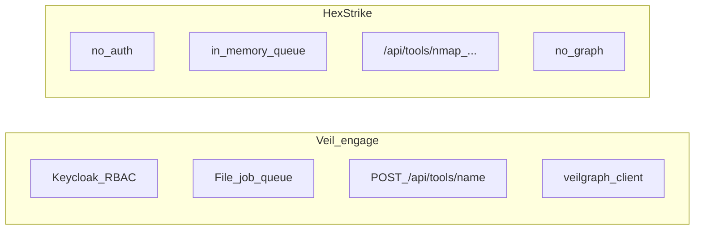
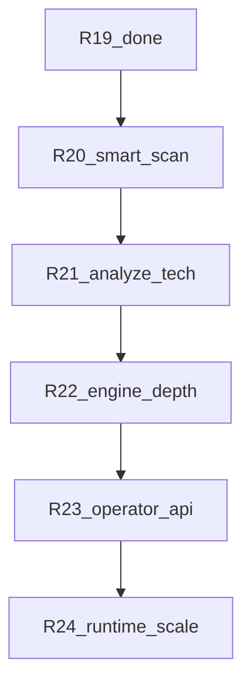

# Engage: аудит выполнения и Phase 5

## Статус [engage_layer_greenfield_9d048eec.plan.md](.cursor/plans/engage_layer_greenfield_9d048eec.plan.md)

Все frontmatter-todo **completed** (R0–R19 + Phase 2+ PR1–6). Таблицы в теле плана согласованы с кодом.

| Фаза | Релизы | Статус | Проверка |
|------|--------|--------|----------|
| Foundation | R0, R1, R7 | done | `engage/go.work`, cmd/api+mcp+worker, deploy, `pkg/auth` |
| Phase 2+ | PR1–PR6 | done | MCP stdio, mcp deploy, runner image, worker skeleton, category `doc.go` |
| Phase 3 | R8–R13 | done | BuildArgs, sandbox, parity CI, jobs, DecisionEngine stub, reports |
| Phase 4 | R14–R19 | done | runner smoke, process tracker, ARGS_TEMPLATES, file job queue, **SelectTools→RankTools** |

`make test-engage` — зелёный. Parity: [scripts/engage/check-catalog-parity.sh](scripts/engage/check-catalog-parity.sh) — 150 имён MCP ↔ catalog.

**Отменённые исходные R2–R6** (category Go adapters, 150 live tools) — корректно superseded: catalog + generic runner вместо 150 Go-обёрток.

---

## Что уже лучше / на уровне HexStrike

- Единый [`POST /api/tools/{name}`](engage/serve/internal/transport/httpserver/router.go) вместо ~100 per-tool routes — проще для MCP и агентов.
- Auth, audit, secure compose, distroless api/mcp.
- Async jobs: [`job.FileStore`](engage/serve/internal/usecase/job/store.go) + `engage-worker` (HexStrike — `queue.Queue` in-process).
- R19: [`SelectTools`](engage/serve/internal/usecase/intelligence/analyze.go) → `RankTools` → `filterEnabled`.

---

## Пробелы vs HexStrike (по коду `.external/hexstrike-ai-master/`)

Источник: [`hexstrike_server.py`](.external/hexstrike-ai-master/hexstrike_server.py) (~17k LOC), [`hexstrike_mcp.py`](.external/hexstrike-ai-master/hexstrike_mcp.py).

### Intelligence (`IntelligentDecisionEngine`, L572–1545)

| Возможность | HexStrike | Engage сейчас |
|-------------|-----------|---------------|
| Effectiveness tables | 5 target types, 20–30 tools/type | 5 types, ~8–10 scores/type в [`decision.go`](engage/serve/internal/usecase/intelligence/decision.go) |
| `analyze_target` | DNS, CMS, tech signatures, attack surface, risk | URL-heuristic + optional `veil_categories` |
| `optimize_parameters` | 15+ per-tool optimizers | nmap, nuclei, httpx |
| `create_attack_chain` | AttackStep, success probability | ordered steps без probability |
| Technology signatures / attack patterns | да | нет |

### Execution

| Возможность | HexStrike | Engage |
|-------------|-----------|--------|
| `smart-scan` | parallel `ThreadPoolExecutor`, `max_tools`, vuln heuristics | alias на [`Comprehensive`](engage/serve/internal/usecase/workflow/workflow.go) — **последовательно** |
| Workflows | tool_execution_map ~16 tools | generic runner для enabled catalog |
| `IntelligentErrorHandler` (L1606+) | classify, retry, alternatives | нет |
| `ProcessPool` (L4877+) | worker pool для задач | file worker — 1 job at a time |

### HTTP routes (156 `@app.route` в HexStrike)

**Есть в engage:** health, tools, intelligence/*, bugbounty/*, visual/*, cache/telemetry (stub), processes list/status/terminate/dashboard, jobs.

**Нет в engage:**

- `POST /api/command` — generic shell (L9137)
- `/api/files/*` — create/modify/delete/list (L9162+)
- `POST /api/payloads/generate` (L9226)
- `POST /api/processes/pause|resume/{pid}` (L9370+)

**Stub в engage:** cache (`entries: 0`), telemetry minimal.

### Runtime / catalog

- Catalog: 150 names, **0** `enabled: true` в [`tools.yaml`](engage/serve/catalog/tools.yaml); **5** в [`tools.live.yaml`](engage/serve/catalog/tools.live.yaml).
- Category Go packages: только [`doc.go`](engage/serve/internal/tools/network/doc.go) — без parsers (осознанный KISS).
- ARGS_TEMPLATES: ~25 имен в extract script; остальные — generic/infer.

---

## Рекомендация: Phase 5 — «behavioral parity»

Не portить 17k LOC. Цель: закрыть маршруты и поведение, которые реально вызывают агенты и workflows.

### R20 — Smart scan + parallel execution

**Цель:** `POST /api/intelligence/smart-scan` ≈ HexStrike L9672+.

- Параметры: `target`, `objective`, `max_tools` (default 5).
- Flow: `AnalyzeTarget` → `SelectTools`[:max_tools] → **enqueue N jobs** (существующий [`job.Queue`](engage/serve/internal/usecase/job/queue.go)) или bounded goroutine pool в API (cap 5).
- Ответ: `tools_executed[]`, job IDs, aggregate status (не блокировать HTTP до конца — optional `async: true`).
- Тесты: router test + unit test cap/order.
- Workflows: `Comprehensive` может делегировать в тот же usecase.

**Не в scope:** полный vuln parser по stdout patterns.

---

### R21 — Analyze target + technology-detection

**Цель:** углубить [`AnalyzeTarget`](engage/serve/internal/usecase/intelligence/analyze.go) без полного port signatures.

- Портировать **subset** из HexStrike `_determine_target_type`, `_detect_technologies` (HTTP headers / simple probes — без тяжёлого browser sidecar).
- `technology-detection` возвращает `technologies[]`, `cms`, `confidence` (сейчас = тот же AnalyzeTarget).
- Опционально: обогатить `TargetType` для workflow (`cloud`, `binary` heuristics по path/extension).
- Тесты: table-driven targets (url, ip, domain).

**Не в scope:** `TechnologyStack` enum на все 15 стеков, attack_patterns.

---

### R22 — DecisionEngine depth

**Цель:** расширить R19 без «full engine port».

- Effectiveness: добавить scores для всех `candidateIDs` (web/api/ip/cloud/unknown) — сверка с HexStrike L584–666 для top tools.
- `OptimizeParameters`: +5–8 tools (gobuster, sqlmap, ffuf, rustscan, masscan) — по образцу HexStrike `_optimize_*_params`.
- `CreateAttackChain`: optional `success_probability` / estimated duration (простая формула от scores).
- `objective` в `SelectTools`: filter/rerank (e.g. `quick` → top 3, `comprehensive` → all candidates).

**Не в scope:** `IntelligentErrorHandler`, advanced_optimizer flag.

---

### R23 — Operator APIs + process control

**Цель:** закрыть частые legacy routes для MCP clients.

- `POST /api/command` → runner с **allowlist** / reject raw shell (безопаснее HexStrike): только catalog binaries или deny by default + env `ENGAGE_ALLOW_RAW_COMMAND=1` for lab.
- File API: `internal/usecase/files` + root `ENGAGE_FILES_DIR` (default `/var/veil/engage/files`), path traversal guard — create/list/delete/modify.
- `POST /api/processes/pause|resume/{pid}` — stub или signal через runner session (если docker exec supports).
- Cache: in-memory TTL cache для repeated tool runs (`use_cache` on command/tool).
- Обновить [docs/engage-legacy-parity.md](docs/engage-legacy-parity.md).

**Не в scope:** `payloads/generate` (можно R23b или defer — низкий приоритет для Veil).

---

### R24 — Runtime scale-up + CI matrix

**Цель:** больше реально исполняемых tools в Docker/lab.

- Расширить [`runner.Dockerfile`](deploy/engage/docker/runner.Dockerfile): +10–15 binaries (feroxbuster, sqlmap, masscan, …).
- Скрипт `scripts/engage/enable-tools-on-path.sh` — merge enabled flags в overlay YAML.
- CI: matrix job `test-engage-smoke-tool` для 3–5 enabled tools (не только nmap).
- Док: сколько tools enabled в minimal vs full runner profile.

**Не в scope:** 150 enabled, browser-agent sidecar, Redis/NATS queue (Phase 6+).

---

## Обновление планов (после подтверждения)

| Файл | Действие |
|------|----------|
| [engage_layer_greenfield_9d048eec.plan.md](.cursor/plans/engage_layer_greenfield_9d048eec.plan.md) | Секция **Phase 5** (таблица R20–R24), todos `engage-r20`…`engage-r24` pending |
| Новый `engage_phase_5_slice.plan.md` | Детальный слайс R20 (как phase_4_r19) |
| [engage-legacy-parity.md](docs/engage-legacy-parity.md) | Матрица route: implemented / stub / missing |
| **Не редактировать** | `engage_phase_4_*.plan.md` |

---

## Вне Phase 5 (backlog)

- Полный `IntelligentDecisionEngine` + `IntelligentErrorHandler` (~1.5k LOC)
- Redis/NATS distributed jobs
- Category Go adapters с custom parsers
- Browser-agent sidecar (R3 original)
- Per-tool HTTP routes (не нужны при generic API)

---

## Критерии завершения Phase 5

- `smart-scan` с `max_tools` и async jobs
- `technology-detection` ≠ stub analyze
- DecisionEngine покрывает все candidate tools + ≥8 optimizers
- Files API + safer command endpoint
- `make test-engage` + smoke matrix ≥3 tools green
- Greenfield plan: Phase 5 table complete
