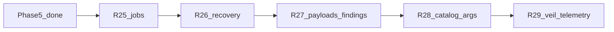

# Engage Phase 6 — resilience, findings, graph context

## Контекст

[engage_layer_greenfield_9d048eec.plan.md](.cursor/plans/engage_layer_greenfield_9d048eec.plan.md): **Phase 5 (R20–R24) complete.** `make test-engage` зелёный.

### Оставшиеся пробелы vs HexStrike

| Область | HexStrike | Engage сейчас |
|---------|-----------|---------------|
| `POST /api/payloads/generate` | buffer/cyclic/random → file | **missing** ([parity doc](docs/engage/engage-legacy-parity.md)) |
| `IntelligentErrorHandler` | classify, retry, alt tools | **нет** |
| Job cancel / list | implicit in pool | только `POST/GET /api/jobs/{id}` |
| Worker throughput | `ProcessPool` + threads | file worker, **1 job за poll** |
| Smart-scan findings | vuln heuristics в stdout | tools run, **без structured findings** |
| ARGS_TEMPLATES | per-tool в Python | ~25 в [extract-legacy-catalog.py](scripts/engage/extract-legacy-catalog.py) |
| veil-api | — | только `Categories()` в [veilgraph/client.go](engage/serve/internal/client/veilgraph/client.go) |
| Telemetry | rich dashboard | minimal `tools_enabled` count |

**Вне Phase 6 (Phase 7+):** Redis/NATS queue, browser-agent sidecar, полный `IntelligentDecisionEngine` (~1k LOC), 150 category Go adapters, 150 enabled tools.

---

## Цель Phase 6

Закрыть **операционную зрелость** и **pipeline findings → reports**, не раздувая scope.

---

## R25 — Job operations + worker concurrency

**Проблема:** async `smart-scan` ставит jobs, но нет cancel/list; worker обрабатывает pending **последовательно** ([queue.go](engage/serve/internal/usecase/job/queue.go) `processPending`).

**Сделать:**

- Domain: `StatusCancelled`; `Store` — `ListByStatus`, `UpdateStatus`
- API:
  - `GET /api/jobs` — list (filter `status`, limit)
  - `POST /api/jobs/{id}/cancel` — pending → cancelled
- Worker: `ENGAGE_WORKER_CONCURRENCY` (default 2), semaphore + goroutines per pending batch
- File store: atomic cancel (skip claim if cancelled)
- Tests: [store_test.go](engage/serve/internal/usecase/job/store_test.go), router tests

**Не в scope:** Redis backend.

---

## R26 — Error recovery (subset `IntelligentErrorHandler`)

**Источник:** HexStrike L1606–2100 — patterns, alternatives, parameter adjustments.

**Сделать:** [`internal/usecase/recovery/handler.go`](engage/serve/internal/usecase/recovery/handler.go) (новый пакет):

- `Classify(stderr/stdout)` → `timeout | not_found | rate_limit | permission | unknown`
- `Suggest(tool, errType)` → optional alt catalog tool (map ~10 пар: `nuclei`→`nikto`, `gobuster`→`feroxbuster`)
- `AdjustParams(tool, errType, params)` — e.g. timeout → меньше threads / `-T2` для nmap
- Интеграция в [tools/run.go](engage/serve/internal/usecase/tools/run.go): **1 retry** при recoverable error
- Интеграция в [workflow/smartscan.go](engage/serve/internal/usecase/workflow/smartscan.go): mark step `recovered` / `alternative_tool`
- Unit tests на regex patterns (без port всех 15 ErrorType)

**Не в scope:** `escalate_to_human`, history 1000 entries.

---

## R27 — Payloads API + structured findings

### Payloads

`POST /api/payloads/generate` по образцу HexStrike L9226:

- Body: `type` (`buffer`|`cyclic`|`random`), `size`, `pattern`, `filename`
- Max 100MB; пишет через [files.Manager](engage/serve/internal/usecase/files/manager.go)
- Router + tests

### Findings pipeline

**Проблема:** [domain/report/Finding](engage/serve/internal/domain/report/finding.go) есть, но tool stdout не парсится.

**Сделать:** [`internal/usecase/findings/parse.go`](engage/serve/internal/usecase/findings/parse.go):

- `ParseToolOutput(tool, stdout)` → `[]Finding`
- Parsers: **nuclei** (JSON lines), **nmap** (grep/open ports heuristic), generic (CRITICAL/HIGH keywords — как HexStrike smart-scan L9738)
- `SmartScan` response: `total_vulnerabilities`, `findings[]` per tool
- `comprehensive-assessment` / visual: опционально `POST /api/visual/summary-report` с aggregated findings
- Tests: golden files в `testdata/`

---

## R28 — Catalog args depth + runtime enablement

**Сделать:**

- Расширить `ARGS_TEMPLATES` в [extract-legacy-catalog.py](scripts/engage/extract-legacy-catalog.py) до **~50** top-used tools (из HexStrike MCP params)
- `make catalog-engage` + golden [executor_test.go](engage/serve/internal/runner/executor_test.go) для +10 tools
- [enable-tools-on-path.sh](scripts/engage/enable-tools-on-path.sh): документировать категории `network web osint cloud auth`
- Runner: +`nikto`, `gobuster` (apt) в [runner.Dockerfile](deploy/engage/docker/runner.Dockerfile) где feasible
- CI: strict smoke — fail if `nmap` on PATH and smoke fails (убрать `|| true` для nmap в [engage.yml](.github/workflows/engage.yml))

---

## R29 — Veil graph context + telemetry

### Veil enrichment

Расширить [veilgraph/client.go](engage/serve/internal/client/veilgraph/client.go):

- `Search(ctx, category, query)` → `GET /v1/categories/{category}/search?q=`
- `AnalyzeTarget`: при enabled veil — search `vuln`/`ti` по host/CVE keywords; metadata `graph_hits`
- `SelectTools`: boost nuclei/trivy scores если graph reports known vulns (простой +0.1 к score)

### Telemetry

`GET /api/telemetry`:

- `jobs_pending`, `jobs_running` (from store when file mode)
- `processes_running`, `cache_entries`
- `uptime_sec` (process start in components)

### Compose e2e (optional but recommended)

- `scripts/test/smoke-engage-compose.sh`: api + worker + runner profile, one async job end-to-end
- Makefile: `test-engage-compose` (skip in CI if no docker)

---

## Обновление планов (при реализации)

| Файл | Действие |
|------|----------|
| [engage_layer_greenfield_9d048eec.plan.md](.cursor/plans/engage_layer_greenfield_9d048eec.plan.md) | Секция **Phase 6** R25–R29, todos `engage-r25`…`engage-r29` |
| Новый `engage_phase_6_r25_*.plan.md` | Детальный слайс R25 (по аналогии с phase_5_slice) |
| [engage-legacy-parity.md](docs/engage/engage-legacy-parity.md) | payloads → implemented; telemetry expanded |
| **Не редактировать** | `engage_phase_5_a7b78921.plan.md` |

---

## Критерии готовности Phase 6

- `POST /api/payloads/generate` + file write
- `GET /api/jobs`, `POST /api/jobs/{id}/cancel`, worker concurrency ≥ 2
- Tool run: 1 retry с recovery на timeout/not_found
- Smart-scan возвращает `findings` / `total_vulnerabilities`
- ARGS_TEMPLATES ~50; `make test-engage` + parity green
- veil search в analyze metadata (when `ENGAGE_VEIL_API_URL` set)
- Greenfield plan: Phase 6 table complete

---

## Рекомендуемый порядок PR

1. **R25** — jobs (разблокирует production async scans)
2. **R27** payloads + findings (видимая ценность для отчётов)
3. **R26** recovery (зависит от стабильного run path)
4. **R28** catalog/runtime
5. **R29** veil + telemetry + compose smoke
