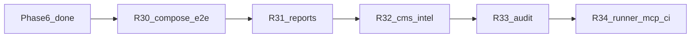
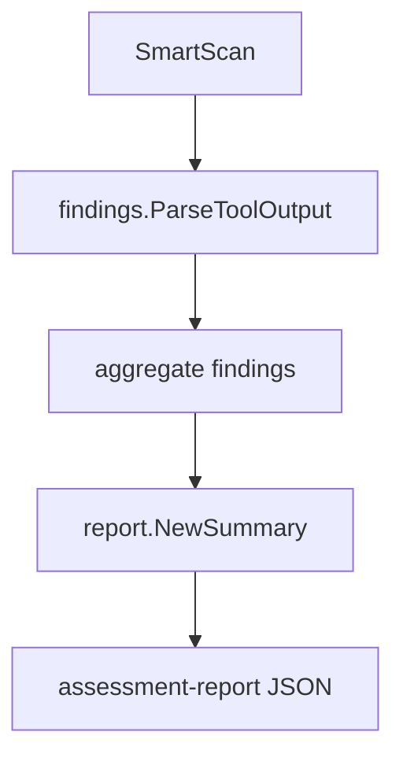

# Engage Phase 7 — production integration & report pipeline

## Контекст

[engage_layer_greenfield_9d048eec.plan.md](.cursor/plans/engage_layer_greenfield_9d048eec.plan.md): **Phase 6 (R25–R29) complete.** HTTP parity закрыт ([engage-legacy-parity.md](docs/engage/engage-legacy-parity.md)); `make test-engage` зелёный.

### Что остаётся vs HexStrike / greenfield backlog

| Область | Сейчас | Phase 7 |
|---------|--------|---------|
| Compose e2e | [smoke-engage-compose.sh](scripts/test/smoke-engage-compose.sh) — **placeholder** | реальный async job e2e |
| Findings → reports | parsers в smart-scan; `summary-report` передаёт `findings: nil` | сквозная связка |
| Technology signatures | HTTP probe + CMS path; нет WordPress→wpscan inject | CMS-aware `SelectTools` |
| Audit | slog only ([audit/log.go](engage/serve/internal/audit/log.go)) | JSONL + read API |
| Runtime | 5 tools в [tools.live.yaml](engage/serve/catalog/tools.live.yaml) | runner profile smoke 5–10 tools |
| Enabled tools | 0 в base catalog | overlay + CI matrix |

**Вне Phase 7 (Phase 8+):** Redis/NATS job backend, browser-agent sidecar, полный `IntelligentDecisionEngine` + `attack_patterns`, 150 category Go adapters, PDF reports.

---

## Цель Phase 7

Довести engage до **lab-ready production loop**: scan → findings → report → audit trail, проверяемый в Docker CI.

---

## R30 — Real compose e2e

**Проблема:** R29 оставил compose smoke как stub.

**Сделать:**

- Переписать [scripts/test/smoke-engage-compose.sh](scripts/test/smoke-engage-compose.sh):
  - `docker compose -f deploy/engage/compose.yml --profile runner up -d engage-api engage-worker engage-runner`
  - `ENGAGE_RUNNER_MODE=docker`, shared `engage_jobs` volume
  - `POST /api/jobs` (nmap или echo tool) → poll `GET /api/jobs/{id}` до `done|failed`
  - teardown on exit
- Makefile `test-engage-compose`: skip if no docker; optional CI job `engage-compose` (allow_failure или nightly)
- Док: [engage/README.md](engage/README.md) — раздел «Compose e2e»

**Не в scope:** полный `compose.secure.yml` + Keycloak в CI.

---

## R31 — Findings → report pipeline

**Проблема:** [`POST /api/visual/summary-report`](engage/serve/internal/transport/httpserver/router.go) вызывает `report.NewSummary(..., nil)` — findings из smart-scan не попадают в отчёт.

**Сделать:**

- Router: парсить `findings` из body (массив объектов) → `[]domain.Finding`
- Новый endpoint `POST /api/intelligence/assessment-report`:
  - body: `target`, optional `objective`, `max_tools`
  - flow: `SmartScan` (sync) → `report.NewSummary` с aggregated findings + severity counts
- Workflows: `comprehensive-assessment` response включает `summary_report` (nested) или ссылку на findings
- Tests: router test + unit test assessment-report shape

---

## R32 — CMS / technology-aware selection

**Источник:** HexStrike `_detect_technologies`, WordPress→wpscan (L880–998).

**Сделать в** [detect.go](engage/serve/internal/usecase/intelligence/detect.go) + [analyze.go](engage/serve/internal/usecase/intelligence/analyze.go):

- Расширить signatures: nginx, php, java, node, wordpress (path + headers)
- `metadata["technologies_detected"]` — structured list
- `SelectToolsForTarget`: если CMS wordpress и `wpscan` в registry enabled → prepend/boost `wpscan_analyze`; аналогично `php` → nikto/sqlmap
- `DecisionEngine` boost map из `probeTarget` (не только veil graph)
- Table-driven tests в [detect_test.go](engage/serve/internal/usecase/intelligence/detect_test.go)

**Не в scope:** полный `TechnologyStack` enum (15 значений).

---

## R33 — Audit trail persistence

**Сделать:**

- [audit/store.go](engage/serve/internal/audit/store.go): append JSONL to `ENGAGE_AUDIT_DIR` (default `/var/veil/engage/audit/events.jsonl`)
- `Logger.ToolRun` → write event `{subject,tool,target,job_id,success,error,at}`
- `GET /api/audit/recent?limit=100` — admin read (last N lines, reverse chrono)
- Config: `ENGAGE_AUDIT_DIR` in [config.go](engage/serve/internal/config/config.go)
- Wire in [components/api.go](engage/serve/internal/components/api.go); router + test with temp dir

**Не в scope:** SIEM export, Postgres.

---

## R34 — Runner profile + MCP/HTTP CI matrix

**Сделать:**

- [deploy/engage/compose.runner.yml](deploy/engage/compose.runner.yml) или profile: api + runner, `ENGAGE_RUNNER_MODE=docker`
- Script [scripts/test/smoke-engage-runner-profile.sh](scripts/test/smoke-engage-runner-profile.sh): `nmap_scan`, `nuclei_scan`, `httpx_probe` через API (skip if no docker)
- CI [engage.yml](.github/workflows/engage.yml): job `engage-runner-smoke` (docker required) after unit tests
- MCP: [scripts/test/smoke-engage-mcp.sh](scripts/test/smoke-engage-mcp.sh) — assert `tools/list` count ≥ 150; optional `tools/call` echo tool
- Expand [tools.enabled.yaml](engage/serve/catalog/tools.enabled.yaml) generation in CI via `enable-tools-on-path.sh` for network+web
- Golden: +5 `TestBuildArgs_*` in [executor_test.go](engage/serve/internal/runner/executor_test.go) for new templates (dalfox, katana, …)

---

## Обновление планов (при реализации)

| Файл | Действие |
|------|----------|
| [engage_layer_greenfield_9d048eec.plan.md](.cursor/plans/engage_layer_greenfield_9d048eec.plan.md) | Секция **Phase 7** R30–R34, todos `engage-r30`…`engage-r34` |
| [engage_phase_7_r30_slice.plan.md](.cursor/plans/engage_phase_7_r30_slice.plan.md) | Детальный слайс R30 |
| [engage-legacy-parity.md](docs/engage/engage-legacy-parity.md) | assessment-report, audit API |
| **Не редактировать** | `engage_phase_6_*.plan.md` |

---

## Критерии готовности Phase 7

- `make test-engage-compose` поднимает stack и завершает async job (или skip без docker)
- `POST /api/intelligence/assessment-report` возвращает summary с `findings[]` и severity breakdown
- WordPress target → `wpscan` в selected tools (when enabled)
- `GET /api/audit/recent` возвращает tool run events
- Runner profile smoke в CI (optional job) + `make test-engage` green
- Greenfield plan: Phase 7 table complete

---

## Рекомендуемый порядок PR

1. **R31** — reports (видимый результат для агентов)
2. **R30** — compose e2e (проверка async path)
3. **R32** — CMS intel
4. **R33** — audit
5. **R34** — runner/MCP CI
