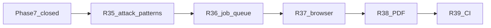

# Engage Phase 8 — intelligence depth & prod runtime

## Контекст

[engage_layer_greenfield_9d048eec.plan.md](engage_layer_greenfield_9d048eec.plan.md): **Phase 7 closed 2026-05.** Lab-ready loop: scan → findings → report → audit (R30–R34). `make test-engage` green.

### Что остаётся vs HexStrike

| Область | Phase 7 (done) | Phase 8 |
|---------|----------------|---------|
| `attack_patterns` | `CreateAttackChain` = ranked tool list | Port `_initialize_attack_patterns` scenarios (web_recon, api_testing, vuln_assessment, …) |
| `objective=stealth` | не реализован | passive subset (amass, subfinder, httpx, nuclei) |
| `objective=comprehensive` | все enabled ranked tools | filter effectiveness > 0.7 (как HexStrike L984–986) |
| Job backend | file queue + worker | Redis or NATS for prod scale |
| Browser tools | catalog names only | sidecar + `ENGAGE_BROWSER_URL` exec path |
| Reports | JSON `SummaryReport` | PDF/HTML export (optional wkhtml/weasyprint or gofpdf) |
| Compose CI | `continue-on-error: true` | required job on `ubuntu-latest` + Docker |

**Вне Phase 8:** 150 category Go adapters, full `TechnologyStack` enum (15 values), `comprehensive_api_audit` dedicated MCP tool, Keycloak in compose CI.

---

## Цель Phase 8

Довести engage до **production-grade intelligence + runtime**: поведенческий паритет с HexStrike `IntelligentDecisionEngine` для цепочек и objectives, масштабируемые jobs, browser-capable scans, экспортируемые отчёты, надёжный Docker gate в CI.

---

## R35 — Attack patterns & objectives

**Источник:** [hexstrike_server.py](.external/hexstrike-ai-master/hexstrike_server.py) `_initialize_attack_patterns` (L698+), `select_optimal_tools` stealth/comprehensive (L971–1001), `create_attack_chain` (L1462+).

**Сделать:**

- Новый файл [engage/serve/internal/usecase/intelligence/patterns.go](engage/serve/internal/usecase/intelligence/patterns.go):
  - `AttackPatterns() map[string][]AttackStep` — 8–12 ключевых сценариев (web_reconnaissance, vulnerability_assessment, api_testing, network_discovery, bug_bounty_*)
  - шаги: `tool` (short id), `priority`, `params` map
- `CreateAttackChain`: выбор pattern по `targetType` + `objective` (как legacy), фильтр по enabled catalog
- `capTools` / `SelectToolsForTarget`:
  - `stealth` → whitelist passive tools
  - `comprehensive` → только tools с `DecisionEngine.Score` > 0.7
- Тесты: table-driven pattern selection, stealth cap, comprehensive filter

**Не в scope:** все 20+ pattern keys из HexStrike; достаточно parity для web/api/ip/cloud/bugbounty.

---

## R36 — Redis/NATS job queue

**Проблема:** `ENGAGE_JOBS_MODE=file` не масштабируется на несколько worker replicas.

**Сделать:**

- Interface `job.Store` (уже частично в [domain/job](engage/serve/internal/domain/job)) — реализации:
  - `file` (existing)
  - `redis` (`ENGAGE_REDIS_URL`, list + BRPOP)
  - или `nats` (`ENGAGE_NATS_URL`, JetStream consumer)
- Worker: poll/claim через выбранный backend
- Config: `ENGAGE_JOBS_MODE=redis|nats|file` in [config.go](engage/serve/internal/config/config.go)
- Compose overlay `deploy/engage/compose.queue.yml` (redis + worker scale)
- Tests: integration test with miniredis or embedded NATS

**Не в scope:** distributed locking beyond queue semantics; Postgres job store.

---

## R37 — Browser-agent sidecar

**Источник:** HexStrike MCP browser tools (Playwright/Selenium wrappers in catalog).

**Сделать:**

- `deploy/engage/docker/browser.Dockerfile` — headless Chromium + agent HTTP API
- `ENGAGE_BROWSER_URL` in runner/sandbox: proxy browser tool calls to sidecar
- Enable catalog entries: `browser_agent_inspect`, `selenium_*`, `playwright_*` via [enable-tools-on-path.sh](scripts/engage/enable-tools-on-path.sh) when sidecar up
- Compose profile `browser` in [compose.runner.yml](deploy/engage/compose.runner.yml)
- Smoke: one browser tool call against local page

**Не в scope:** full HexStrike visual AI; только exec bridge.

---

## R38 — PDF / visual report export

**Сделать:**

- `POST /api/visual/export-report`:
  - input: `summary_report` JSON or `assessment-report` id payload
  - output: PDF bytes or `ENGAGE_FILES_DIR` path + download URL
- Implement via lightweight Go PDF lib or HTML template → external renderer in runner (lab)
- Extend [report package](engage/serve/internal/usecase/report/) with `ToPDF(summary SummaryReport) ([]byte, error)`
- Test: golden PDF size/hash or HTML intermediate

**Не в scope:** ANSI terminal glamour (legacy ModernVisualEngine); agents use JSON + PDF.

---

## R39 — CI hardening

**Сделать:**

- [.github/workflows/engage.yml](.github/workflows/engage.yml):
  - `engage-compose` job: `continue-on-error: false` on main; use `ubuntu-latest` (Docker preinstalled)
  - optional separate `engage-runner-smoke` after compose (sync nmap/nuclei/httpx)
- Pre-pull runner base or cache apt in Dockerfile to reduce flake (mirror ARG)
- Document in [engage/README.md](engage/README.md): CI requirements

**Критерий:** PR to main must pass compose e2e when Docker available (not silent skip on CI runners).

---

## Обновление планов (при реализации)

| Файл | Действие |
|------|----------|
| [engage_layer_greenfield_9d048eec.plan.md](engage_layer_greenfield_9d048eec.plan.md) | Phase 8 table: R35–R39 → done по мере PR |
| [engage-legacy-parity.md](docs/engage-legacy-parity.md) | stealth/comprehensive, export-report, queue modes |
| **Не редактировать** | `engage_phase_7_*.plan.md`, `phase_7_closure_audit_*.plan.md` |

---

## Критерии готовности Phase 8

- `CreateAttackChain` returns ordered steps from named pattern (not only RankTools list)
- `POST .../select-tools` with `objective=stealth` returns ≤4 passive tools
- `ENGAGE_JOBS_MODE=redis` processes jobs with 2+ workers without file races
- Browser profile smoke: one catalog browser tool succeeds via sidecar
- `POST /api/visual/export-report` returns valid PDF for sample assessment
- CI: `engage-compose` required green on GitHub Actions main
- `make test-engage` green

---

## Рекомендуемый порядок PR

1. **R35** — attack_patterns (agent-visible intelligence)
2. **R39** — CI hardening (catch regressions early)
3. **R36** — job queue (prod path)
4. **R37** — browser sidecar
5. **R38** — PDF export
