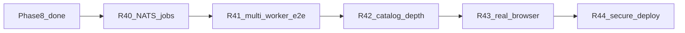

# Engage Phase 9 — scale, catalog breadth & secure deploy

## Контекст

[engage_layer_greenfield_9d048eec.plan.md](.cursor/plans/engage_layer_greenfield_9d048eec.plan.md): **Phase 8 (R35–R39) complete.** Достигнуто:

- Named `attack_patterns` (9 сценариев), stealth/comprehensive objectives
- `ENGAGE_JOBS_MODE=redis` + [compose.queue.yml](deploy/engage/compose.queue.yml)
- Browser sidecar **stub** ([cmd/browser-agent](engage/serve/cmd/browser-agent/main.go))
- PDF export (`POST /api/visual/export-report`)
- CI: обязательный `engage-compose`

### Что остаётся после Phase 8

| Область | Сейчас | Phase 9 |
|---------|--------|---------|
| Job queue | Redis only; NATS — в плане R36, **не сделан** | NATS JetStream store + worker |
| Multi-worker | Redis store есть; **нет e2e** 2+ workers | Compose + smoke без file races |
| Enabled tools | 5 в [tools.live.yaml](engage/serve/catalog/tools.live.yaml) | CI matrix 10–15 tools |
| ARGS templates | ~50 в extract script | Расширить до ~100 приоритетных |
| Browser | HTTP stub, не Chromium | Playwright в browser image |
| Secure deploy | [compose.secure.yml](deploy/engage/compose.secure.yml) есть, **нет CI smoke** | Nightly/manual secure smoke |
| Runner CI flake | apt timeout при сборке runner | `APT_MIRROR` ARG + retry в Dockerfile |
| Attack patterns (полный HexStrike) | 9 из 20+ keys | **Phase 10** |
| 150 Go adapters | generic runner | **out of scope** (by design) |
| Postgres audit / SIEM | JSONL only | **Phase 10** |

---

## Цель Phase 9

Перевести engage из **lab-ready** в **deployable at scale**: очередь jobs согласована с остальными слоями Veil (NATS), проверена на нескольких worker replicas, больше реально исполняемых tools в CI, browser sidecar пригоден для web workflows, secure overlay проверяем автоматически.

---

## R40 — NATS job backend

**Зачем:** В монорепо уже есть `github.com/nats-io/nats.go` ([pipeline/connector](pipeline/connector/go.mod), [pkg](pkg/go.mod)). Redis реализован в Phase 8; NATS — заявленная альтернатива в R36, но отсутствует в [engage/serve](engage/serve).

**Сделать:**

- [engage/serve/internal/usecase/job/store_nats.go](engage/serve/internal/usecase/job/store_nats.go): `Store` через JetStream (subject `engage.jobs`, ack/nak)
- Config: `ENGAGE_JOBS_MODE=nats`, `ENGAGE_NATS_URL` в [config.go](engage/serve/internal/config/config.go)
- Wire в [components/api.go](engage/serve/internal/components/api.go); worker [cmd/worker/main.go](engage/serve/cmd/worker/main.go) accepts `nats`
- Overlay [deploy/engage/compose.nats.yml](deploy/engage/compose.nats.yml) (nats + api + worker)
- Tests: embedded NATS или testcontainers; unit test enqueue/consume/ack

**Не в scope:** Postgres job store; cross-region replication.

---

## R41 — Multi-worker queue e2e

**Проблема:** Критерий Phase 8 («2+ workers без races») не покрыт автотестом; Redis `TryClaim` vs `BRPOP` path различаются.

**Сделать:**

- Скрипт [scripts/test/smoke-engage-redis-workers.sh](scripts/test/smoke-engage-redis-workers.sh):
  - `compose.queue.yml` + 2× `engage-worker`
  - Enqueue N jobs → все `done|failed`, без duplicate execution (job output/idempotency check)
- Исправить Redis store при необходимости: атомарный claim (`SETNX` или Lua), единая семантика с file store
- Makefile `test-engage-redis-workers`; CI job `engage-queue-e2e` (after unit tests, `continue-on-error` только на PR forks без Docker)
- Док в [engage/README.md](engage/README.md)

---

## R42 — Catalog execution depth & CI tool matrix

**Источник:** greenfield R16/R28 (~50 templates); Phase 5 backlog «150 enabled» отложен.

**Сделать:**

- Расширить `ARGS_TEMPLATES` в [scripts/engage/extract-legacy-catalog.py](scripts/engage/extract-legacy-catalog.py) до **~100** tools (top HexStrike MCP по категориям: network, web, osint, cloud)
- `make catalog-engage` + golden [executor_test.go](engage/serve/internal/runner/executor_test.go) (+10 templates)
- CI после `enable-tools-on-path.sh`: matrix smoke **10 tools** (nmap, nuclei, httpx, subfinder, gobuster, nikto, ffuf, rustscan, trivy, sqlmap) — skip individual tool if binary missing
- Обновить [docs/engage/engage-tools.md](docs/engage/engage-tools.md): coverage table

**Не в scope:** 150 отдельных Go adapters; только YAML + generic runner.

---

## R43 — Real browser automation

**Проблема:** Phase 8 browser-agent — stub (`navigated to URL`), не Playwright.

**Сделать:**

- Переписать [deploy/engage/docker/browser.Dockerfile](deploy/engage/docker/browser.Dockerfile): Playwright + Chromium (или `mcr.microsoft.com/playwright` base)
- [cmd/browser-agent](engage/serve/cmd/browser-agent/main.go): `POST /exec` — navigate, screenshot optional, return DOM title/status
- Enable `browser_agent_inspect` в smoke path; [smoke-engage-browser.sh](scripts/test/smoke-engage-browser.sh) assert real response fields
- Compose: `runner` + `browser` profiles together in e2e doc
- Optional: `playwright_*` / `selenium_*` catalog tools route through same sidecar

**Не в scope:** HexStrike visual AI / ANSI reports.

---

## R44 — Secure deploy & runner build reliability

**Сделать:**

- Script [scripts/test/smoke-engage-secure.sh](scripts/test/smoke-engage-secure.sh): `compose.yml` + `compose.secure.yml`, health via nginx :8443, JWT smoke if `ENGAGE_AUTH_ENABLED=1` (self-signed certs gen in script)
- CI: nightly workflow или `workflow_dispatch` job `engage-secure` (не блокирует PR)
- [deploy/engage/docker/runner.Dockerfile](deploy/engage/docker/runner.Dockerfile): `ARG APT_MIRROR`, retry apt; уменьшить flake из Phase 7/8 compose CI
- [engage-legacy-parity.md](docs/engage/engage-legacy-parity.md): secure overlay, NATS mode

**Не в scope:** Keycloak в default PR CI (слишком тяжёлый); полный pentest checklist.

---

## Phase 10 (preview — не входит в Phase 9)

| Release | Содержание |
|---------|------------|
| R45 | Полный port `attack_patterns` (20+ keys), `TechnologyStack` enum |
| R46 | `POST /api/intelligence/comprehensive-api-audit` (HexStrike MCP aggregate) |
| R47 | Audit export (webhook/SIEM), Prometheus metrics |
| R48 | HTML report template + branded PDF |

---

## Обновление планов (при реализации)

| Файл | Действие |
|------|----------|
| [engage_layer_greenfield_9d048eec.plan.md](.cursor/plans/engage_layer_greenfield_9d048eec.plan.md) | Секция **Phase 9** R40–R44, todos `engage-r40`…`engage-r44` |
| [engage_phase_9.plan.md](.cursor/plans/engage_phase_9.plan.md) | Детальный слайс (создать при старте) |
| [engage-legacy-parity.md](docs/engage/engage-legacy-parity.md) | NATS jobs, secure smoke |
| **Не редактировать** | `engage_phase_8.plan.md`, `engage_phase_7_*.plan.md` |

---

## Критерии готовности Phase 9

- `ENGAGE_JOBS_MODE=nats` — worker обрабатывает jobs с ack
- Smoke: 2 worker replicas + Redis, 10 jobs, все завершены без дубликатов
- `ARGS_TEMPLATES` ≥ 100; CI matrix ≥ 10 tool smokes (best-effort skip)
- Browser sidecar возвращает реальные данные страницы (title/status), не stub string
- `smoke-engage-secure.sh` проходит локально; nightly CI green
- `make test-engage` green

---

## Рекомендуемый порядок PR

1. **R42** — catalog/CI matrix (быстрый выигрыш для агентов)
2. **R41** — multi-worker e2e (валидирует Redis из Phase 8)
3. **R40** — NATS (align с Veil stack)
4. **R44** — secure + Dockerfile reliability
5. **R43** — Playwright browser (самый тяжёлый образ)
