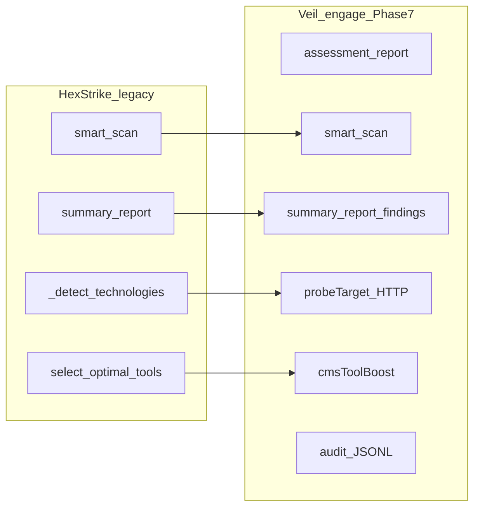

# Аудит Phase 7 и решение о закрытии фазы

## Greenfield-план: статус

В [engage_layer_greenfield_9d048eec.plan.md](.cursor/plans/engage_layer_greenfield_9d048eec.plan.md) секция **Phase 7 (R30–R34)** помечена **complete** (строки 443–453).

| Release | Критерий Phase 7 | Статус в репо |
|---------|------------------|---------------|
| **R30** | Реальный compose e2e (api+worker+runner, async job) | [scripts/test/smoke-engage-compose.sh](scripts/test/smoke-engage-compose.sh) — не stub; [compose.runner.yml](deploy/engage/compose.runner.yml) + [worker-runner.Dockerfile](deploy/engage/docker/worker-runner.Dockerfile); `make test-engage-compose`; CI job `engage-compose` (`continue-on-error: true`) |
| **R31** | Findings → reports | `POST /api/intelligence/assessment-report` в [router.go](engage/serve/internal/transport/httpserver/router.go); [assessment.go](engage/serve/internal/usecase/workflow/assessment.go); `summary-report` парсит `findings`; `comprehensive-assessment` → `AssessmentReport` |
| **R32** | CMS-aware selection | [detect.go](engage/serve/internal/usecase/intelligence/detect.go) + `cmsToolBoost` в [analyze.go](engage/serve/internal/usecase/intelligence/analyze.go); тест `TestSelectToolsForTarget_wordpressWpscanBoost` |
| **R33** | Audit JSONL + API | [store.go](engage/serve/internal/audit/store.go), `ENGAGE_AUDIT_DIR`, `GET /api/audit/recent` |
| **R34** | Runner/MCP CI | [smoke-engage-runner-profile.sh](scripts/test/smoke-engage-runner-profile.sh) (вызов из compose smoke); MCP ≥150 в [smoke-engage-mcp.sh](scripts/test/smoke-engage-mcp.sh); CI `enable-tools-on-path.sh`; +5 golden `BuildArgs` |

[docs/engage/engage-legacy-parity.md](docs/engage/engage-legacy-parity.md) обновлён (`assessment-report`, `audit/recent`).

**Косметика (не блокирует закрытие):** в YAML frontmatter greenfield-плана todos заканчиваются на `engage-r29` — нет отдельных `engage-r30`…`engage-r34` (таблица Phase 7 при этом есть). Файл [engage_phase_7_r30_slice.plan.md](.cursor/plans/engage_phase_7_r30_slice.plan.md) из Phase 7 plan **не создан** (в плане был optional).

---

## Сверка с HexStrike (`.external/hexstrike-ai-master/`)

### Что Phase 7 требовал — паритет достигнут или лучше

| Область | HexStrike | Veil engage (после Phase 7) |
|---------|-----------|----------------------------|
| Technology detect | `_detect_technologies` — **только URL-паттерны** (L880–897) | HTTP probe + headers + path + `technologies_detected` — **глубже legacy** |
| WordPress → wpscan | `select_optimal_tools` append `wpscan` (L995–997) | `cmsToolBoost` + rank; `wpscan` в web candidates — **эквивалент** при `enabled` |
| PHP → nikto | append `nikto` (L998–999) | boost `nikto`/`sqlmap` для `php` CMS |
| Summary + findings | Отдельные `smart-scan` и `visual/summary-report` | `assessment-report` объединяет scan + `summary_report` + `severity_breakdown` — **улучшение для агентов** |
| Audit read API | Нет `GET /api/audit/recent` (только slog/внутреннее) | JSONL + read API — **новое, не регресс** |
| MCP tools | ~150 `@mcp.tool` | catalog 150 + smoke `tools/list` ≥ 150 |
| HTTP routes intelligence | 6 маршрутов (без `assessment-report`) | те же 6 + **assessment-report** |

### Что остаётся vs HexStrike — **вне Phase 7** (уже в плане как Phase 8+)

Из [engage_phase_7_0be04024.plan.md](.cursor/plans/engage_phase_7_0be04024.plan.md) и [hexstrike_server.py](.external/hexstrike-ai-master/hexstrike_server.py):

| Пробел | HexStrike | Veil сейчас |
|--------|-----------|-------------|
| `attack_patterns` | `_initialize_attack_patterns()` + выбор цепочки по objective (L698, L1462+) | `CreateAttackChain` — упрощённый ranked list, без полного pattern dictionary |
| `objective=comprehensive` | фильтр tools с effectiveness > 0.7 (L984–986) | `capTools` только для quick/focused; comprehensive = все ranked enabled |
| `objective=stealth` | passive tool subset (L987–990) | **не реализован** |
| `TechnologyStack` enum (15 значений) | полный enum | subset в metadata — **осознанно out of scope Phase 7** |
| Job backend | in-process / files | file jobs OK; **Redis/NATS** — Phase 8+ |
| Browser sidecar | Playwright/Selenium tools в MCP | **нет** — Phase 8+ |
| PDF reports | visual engine ANSI/HTML | JSON reports only — Phase 8+ |
| 150 Go adapters | N/A (Python monolith) | generic runner + YAML — **by design** |
| `comprehensive_api_audit` MCP | отдельный MCP tool (hexstrike_mcp L3103+) | нет dedicated endpoint — low priority |

**Вывод по HexStrike:** для scope Phase 7 («lab-ready loop: scan → findings → report → audit, Docker CI») паритет **достаточен**. Engage в ряде мест **строже/богаче** legacy (HTTP probe, assessment-report, audit API). Непокрытое — это не «незавершённая Phase 7», а **следующий этап глубины intelligence/runtime**.

---

## Мелкие расхождения с текстом Phase 7 plan (не блокеры)

1. **R34:** отдельный CI job `engage-runner-smoke` — вместо этого runner profile вызывается **внутри** `smoke-engage-compose.sh` перед teardown. Функционально покрыто; отдельный job — опциональная полировка.
2. **R34 optional:** `tools/call` echo в MCP smoke — не сделано (помечено optional в плане).
3. **CI `engage-compose`:** `continue-on-error: true` — job может быть зелёным при skip (нет docker) или при flaky build; для «жёсткого» gate можно ужесточить позже.

---

## Рекомендация

**Закрыть Phase 7** — все критерии готовности из [engage_phase_7_0be04024.plan.md](.cursor/plans/engage_phase_7_0be04024.plan.md) (строки 154–161) выполнены в коде.

### Минимальные шаги при закрытии (опционально, ~30 мин)

- Добавить в frontmatter greenfield-плана todos `engage-r30`…`engage-r34` со статусом `completed` (согласованность с Phase 6).
- Прогнать локально: `make test-engage`, `make test-engage-compose` (если есть Docker).
- Зафиксировать в greenfield-плане строку: **«Phase 7 closed 2026-05»** (без правки `engage_phase_7_*.plan.md`).

### Если продолжаем — Phase 8 (черновик приоритетов)

1. **R35** — `attack_patterns` + stealth/comprehensive objectives в `SelectTools` / `CreateAttackChain`
2. **R36** — Redis/NATS job queue (замена file-only для prod)
3. **R37** — browser-agent sidecar + catalog enablement
4. **R38** — PDF/visual report export
5. **R39** — ужесточение CI: обязательный `engage-compose` на runners с Docker

---

## Итог для пользователя

| Вопрос | Ответ |
|--------|--------|
| Всё ли из greenfield Phase 7 сделано? | **Да** (R30–R34 в коде + таблица в плане) |
| HexStrike блокирует закрытие? | **Нет** — gaps отнесены к Phase 8+ и не входили в критерии Phase 7 |
| Закрываем фазу? | **Да, рекомендуется** |
| Продолжаем? | Только если нужен **Phase 8 plan** (attack_patterns, stealth, queue, browser, PDF)
