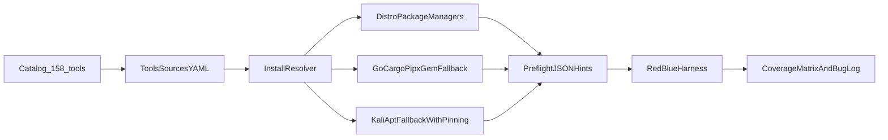

# Engage 158 Tools Install Coverage

## Результат

Сделать воспроизводимую систему, где все 158 инструментов Engage устанавливаются автоматически с проверяемым provenance и проходят preflight, сначала на `Ubuntu LTS + Debian stable` (обязательная волна), затем на остальных Linux family в той же схеме.

## Что уже есть (база)

- Текущий package-map: [`/home/bbv/Desktop/threat_intelligence/scripts/ops/engage-tools-packages.yaml`](/home/bbv/Desktop/threat_intelligence/scripts/ops/engage-tools-packages.yaml)
- Текущий source-map (частично): [`/home/bbv/Desktop/threat_intelligence/scripts/ops/engage-tools-sources.yaml`](/home/bbv/Desktop/threat_intelligence/scripts/ops/engage-tools-sources.yaml)
- Installer: [`/home/bbv/Desktop/threat_intelligence/scripts/ops/install-engage-host-tools.sh`](/home/bbv/Desktop/threat_intelligence/scripts/ops/install-engage-host-tools.sh)
- Preflight: [`/home/bbv/Desktop/threat_intelligence/scripts/engage/preflight-client-tools.sh`](/home/bbv/Desktop/threat_intelligence/scripts/engage/preflight-client-tools.sh)
- Runtime verification harness: [`/home/bbv/Desktop/threat_intelligence/scripts/test/smoke-engage-red-vs-blue.sh`](/home/bbv/Desktop/threat_intelligence/scripts/test/smoke-engage-red-vs-blue.sh)

## Архитектура покрытия

## Merge Order (малые PR)

1. **PR1 — Tool universe & coverage matrix**
   - Сгенерировать canonical список 158 тулов и текущий coverage report.
   - Добавить артефакт: [`/home/bbv/Desktop/threat_intelligence/docs/engage/engage-tool-install-coverage.md`](/home/bbv/Desktop/threat_intelligence/docs/engage/engage-tool-install-coverage.md)
   - Включить поля: binary, категория, apt/deb, kali, upstream, fallback method, status.

2. **PR2 — Full source registry for 158**
   - Дорастить [`/home/bbv/Desktop/threat_intelligence/scripts/ops/engage-tools-sources.yaml`](/home/bbv/Desktop/threat_intelligence/scripts/ops/engage-tools-sources.yaml) до 158/158.
   - На каждый tool: Kali tool page, Kali pkg tracker, packaging repo (Kali/Debian/Salsa где есть), upstream repo/release, preferred methods.

3. **PR3 — Resolver + deterministic fallback policy**
   - Расширить [`/home/bbv/Desktop/threat_intelligence/scripts/ops/install-engage-host-tools.sh`](/home/bbv/Desktop/threat_intelligence/scripts/ops/install-engage-host-tools.sh):
     - режим "repo-first"
     - режим "upstream-fallback"
     - режим "kali-fallback" (для Debian/Ubuntu с pinning и явным opt-in)
   - Вынести policy/env в документированный контракт.

4. **PR4 — Kali fallback implementation (safe)**
   - Добавить отдельный helper: [`/home/bbv/Desktop/threat_intelligence/scripts/ops/install-engage-kali-fallback.sh`](/home/bbv/Desktop/threat_intelligence/scripts/ops/install-engage-kali-fallback.sh)
   - Реализовать apt pinning и ограниченный allowlist пакетов, чтобы не ломать базовую систему.

5. **PR5 — Preflight remediation intelligence**
   - Расширить [`/home/bbv/Desktop/threat_intelligence/scripts/engage/preflight-client-tools.sh`](/home/bbv/Desktop/threat_intelligence/scripts/engage/preflight-client-tools.sh):
     - machine-readable remediation plan per missing tool
     - режим `--emit-install-plan` (готовые команды по policy)

6. **PR6 — Multi-distro execution matrix (поэтапно)**
   - Сначала обязательная волна: Ubuntu LTS + Debian stable.
   - Потом расширение на Kali, Fedora/RHEL-family, Arch-family, openSUSE, Alpine.
   - Добавить matrix runner scripts в [`/home/bbv/Desktop/threat_intelligence/scripts/test/`](/home/bbv/Desktop/threat_intelligence/scripts/test/) и отчёт в [`/home/bbv/Desktop/threat_intelligence/docs/engage/engage-tool-install-coverage.md`](/home/bbv/Desktop/threat_intelligence/docs/engage/engage-tool-install-coverage.md).

7. **PR7 — Agent operationalization**
   - Обновить [`/home/bbv/Desktop/threat_intelligence/.cursor/agents/manifest.yaml`](/home/bbv/Desktop/threat_intelligence/.cursor/agents/manifest.yaml) phase bindings под coverage waves.
   - Обновить runbook [`/home/bbv/Desktop/threat_intelligence/docs/engage/engage-install-linux.md`](/home/bbv/Desktop/threat_intelligence/docs/engage/engage-install-linux.md) и [`/home/bbv/Desktop/threat_intelligence/AGENTS.md`](/home/bbv/Desktop/threat_intelligence/AGENTS.md) с командами "быстрого старта" для агентов.

## Субагенты (параллельно)

- **Agent-SourceCrawler**: интернет-поиск и заполнение provenance для тулов (Kali/pages/trackers/Salsa/upstream).
- **Agent-Resolver**: installer policy engine + fallback methods.
- **Agent-KaliFallback**: безопасный apt pinning helper.
- **Agent-PreflightUX**: remediation JSON/CLI для агентов.
- **Agent-Matrix**: мультидистро прогон и coverage report.
- **Critic**: gatekeeper (дифы, безопасность, воспроизводимость, DoD).

## DoD (Definition of Done)

- 158/158 тулов имеют валидные source records в [`/home/bbv/Desktop/threat_intelligence/scripts/ops/engage-tools-sources.yaml`](/home/bbv/Desktop/threat_intelligence/scripts/ops/engage-tools-sources.yaml).
- Installer не останавливается на частичных промахах, а детерминированно добирает по policy.
- Для Ubuntu/Debian: preflight показывает 158/158 ready после install pipeline.
- Для остальных дистро: coverage report указывает готовность, gaps и автоматический fallback path.
- Agent-runbook позволяет запускать установку и проверку одной командной цепочкой для быстрого старта пентеста.

## Риски и ограничения

- Некоторые security tools могут отсутствовать в стандартных репозиториях или иметь иные package names.
- Kali fallback требует аккуратного pinning/allowlist, иначе риск конфликтов зависимостей.
- Upstream install paths (`go/cargo/pipx/gem`) требуют toolchain и контроля версий; это будет фиксироваться в отчёте provenance.