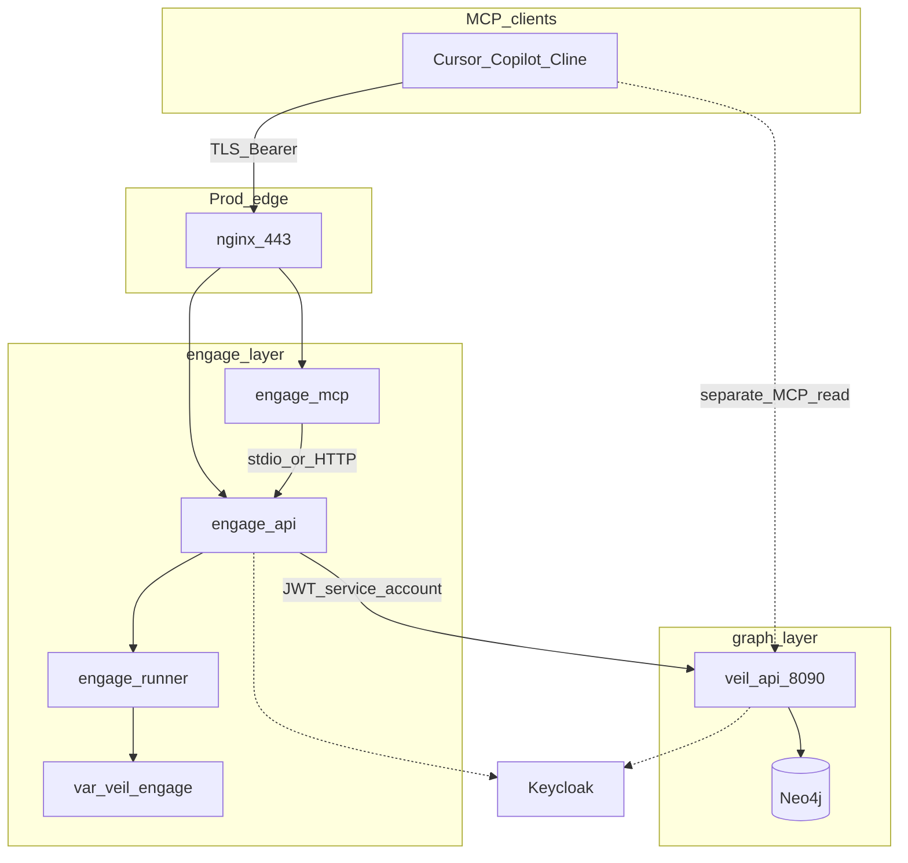

# Engage layer: greenfield Go + deploy (HexStrike parity)

## Архитектурное решение

Ваше ощущение верное: **pentest / discovery / отчёты / запуск tools** — это не `knowledge/serve` (read-only intel), а **отдельный runtime-контекст**, как scrape vs pipeline vs graph.

| Слой | Ответственность | MCP / API |
|------|----------------|-----------|-----------|
| scrape | Сбор сырья | — |
| pipeline | Нормализация | — |
| graph | Neo4j + read API/MCP | `veil-graph` (read) |
| **engage** (новый) | Исполнение tools, workflows, отчёты | `veil-engage` (exec) |



**Связь с графом (выбор):** engage **внутри** вызывает [veil-api](knowledge/serve/cmd/api) через [`engage/serve/internal/client/veilgraph`](engage/serve/internal/client/veilgraph) (client credentials / service account JWT, роль `veil-reader`). Агенты могут дополнительно держать dual MCP (`veil-graph` + `veil-engage`), но workflows не зависят от IDE-конфига.

**Стратегия «без diff, но всё переделано»:**

- Не трогать [`.external/hexstrike-ai-master/`](.external/hexstrike-ai-master/) — только спецификация.
- Новое дерево **`engage/`** + **`deploy/engage/`** + **`pkg/engage/`** — только additive commits.
- Не portить 22k строк Python построчно: **каталог возможностей** (YAML) + тонкие Go-адаптеры на категорию.
- Паритет 150+ tools — **под-релизы R0–R6** (вы выбрали parity).

---

## Repo layout (coding-style)

Следуем [docs/coding-style.md](docs/coding-style.md): `cmd/` = wiring, `internal/usecase`, `domain` без I/O, адаптеры снаружи.

```
engage/
  go.work
  README.md
  serve/                          # один Go module (как knowledge/serve)
    cmd/
      api/                        # REST + workflows + reports
      mcp/                        # veil-engage MCP (stdio + optional HTTP)
      worker/                     # long-running scan jobs (phase R3+)
    internal/
      components/                 # DI: auth, runner, veil client, registry
      config/
      domain/
        target/                   # TargetProfile, scope, rules of engagement
        job/                      # Job, Run, status
        report/                   # Finding, Report, severity
        tool/                     # ToolSpec, Result (no os/exec here)
      usecase/
        intelligence/             # analyze-target, select-tools, attack-chain
        workflow/                 # bugbounty/*, smart-scan
        report/                   # summary-report, vulnerability-card
        tools/                    # RunTool, ListTools
      transport/
        httpserver/               # /api/tools/*, /api/intelligence/*, /health
        mcpserver/                # reuse patterns from knowledge/serve
        securityhttp/
      runner/
        executor.go               # subprocess, timeout, cwd, env allowlist
        sandbox.go                # optional: firejail/docker exec hook
      tools/                      # по категориям HexStrike README
        registry.go               # RegisterAll, Lookup, ListByCategory
        network/                  # nmap, rustscan, masscan, …
        web/                      # nuclei, ffuf, httpx, …
        cloud/                    # prowler, trivy, scout-suite, …
        binary/                   # ghidra headless hooks, gdb, …
        auth/                     # hydra, hashcat, …
        osint/
        ctf/
        common/                   # shared arg builders, output parsers
      client/
        veilgraph/                # GET /v1/... with service JWT
      auth/                       # thin: roles engage-runner, engage-admin
    catalog/                      # generated tool manifests (YAML), not hand-edited per tool in Go
      tools.yaml                  # name, category, binary, arg template, timeout
pkg/
  engage/
    toolid/                       # stable tool IDs, categories enum
    contract/                     # JSON shapes for API/MCP (OpenAPI source)
  auth/                           # NEW: вынести Keycloak JWT+RBAC из knowledge/serve (DRY)
    keycloak/
    rbac/
deploy/
  engage/
    compose.yml
    compose.secure.yml
    docker/
      api.Dockerfile              # distroless
      mcp.Dockerfile
      runner.Dockerfile           # bookworm + security tools (heavy)
    profiles/
      secure-engage.env
docs/
  engage-runtime.md
  engage-tools.md                 # category matrix, parity checklist
  engage-hexstrike-parity.md      # mapping hexstrike route → engage route
```

**Правила слоя engage (добавить в coding-style / AGENTS):**

- Engage **не импортирует** `discovery/`, `pipeline/`, `graph/ingest`.
- Может импортировать `pkg/*`, `pkg/auth`, `pkg/engage/*`.
- Вызов Neo4j только через **HTTP veil-api**, не Bolt напрямую (граница ответственности).
- Каждый tool — один файл или пара `register.go` + `run_*.go` в категории; общий runner — DRY.

---

## Auth и RBAC (Keycloak)

Переиспользовать паттерн [graph/serve/internal/auth](knowledge/serve/internal/auth), вынести в [**`pkg/auth`**](pkg/auth) (рефактор knowledge/serve в том же PR или сразу после R0):

| Realm role | Permission |
|------------|------------|
| `veil-engage-runner` | `engage:tool:run`, `engage:job:create`, `engage:report:read` |
| `veil-engage-admin` | + cancel any job, cache clear, admin telemetry |
| `veil-reader` (existing) | только для service account к veil-api |

Env (аналог graph): `AUTH_ENABLED`, `VEIL_REQUIRE_AUTH`, `KEYCLOAK_*`, `ENGAGE_ENV=prod`.

MCP:

- `tools/call` → RBAC + audit log (subject, tool, target, job_id).
- Отдельный server name **`veil-engage`** (не смешивать с `veil-mcp`).
- `MCP_HTTP_AUTH_STRICT=1` в secure profile.

Service account для veil-api:

- `ENGAGE_VEIL_API_URL`, `ENGAGE_VEIL_CLIENT_ID`, `ENGAGE_VEIL_CLIENT_SECRET` (client credentials).
- Internal client с кэшем token + retry.

---

## Hardening (как graph secure)

| Мера | Где |
|------|-----|
| distroless api/mcp | [deploy/engage/docker/api.Dockerfile](deploy/engage/docker/api.Dockerfile) |
| nginx TLS, rate limit | [deploy/engage/compose.secure.yml](deploy/engage/compose.secure.yml) |
| `read_only` + `tmpfs` | api/mcp containers |
| Runner isolation | отдельный **runner** image с cap_drop, no host network по умолчанию |
| Body limits, timeouts | `securityhttp` + `http.Server` |
| Audit | structured log + optional `engage_audit` table / file under `var/veil/engage/audit/` |
| No publish runner port | только engage-api/mcp через nginx |

Runner-контейнер **намеренно не distroless** (нужны `nmap`, `nuclei`, … на PATH) — как сейчас у HexStrike, но сетево изолирован от graph Neo4j.

---

## API surface (паритет с HexStrike)

Группы маршрутов (сохранить совместимость путей где разумно, префикс `/api/`):

1. **Tools** — `POST /api/tools/{name}` → registry + runner.
2. **Intelligence** — `analyze-target`, `select-tools`, `optimize-parameters`, `create-attack-chain`, `smart-scan`, `technology-detection`.
3. **Workflows** — `bugbounty/*`, `comprehensive-assessment`.
4. **Process** — `processes/list|status|terminate|…`, `command`.
5. **Visual / reports** — `visual/summary-report`, `vulnerability-card`, `tool-output`.
6. **Files / cache / telemetry** — с RBAC admin-only на destructive ops.

MCP: 1:1 mapping tool names → HTTP handlers (как HexStrike MCP → server), но через **единый usecase** (не дублировать логику).

---

## Под-релизы (parity 150+ tools)

| Release | Deliverable | Tools (ориентир) |
|---------|-------------|------------------|
| **R0 Foundation** | `engage/go.work`, cmd/api+mcp skeleton, auth, securityhttp, deploy compose, catalog schema, veilgraph client mock | 0 live tools, health only |
| **R1 Core** | runner executor, registry, audit, 5 e2e tools (nmap, nuclei, httpx, subfinder, trivy) | ~5 |
| **R2 Network** | `internal/tools/network/*` + catalog slice | +25 |
| **R3 Web** | web + browser-agent optional sidecar | +40 |
| **R4 Cloud + Auth** | cloud/, auth/ | +32 |
| **R5 Binary + OSINT + CTF** | binary/, osint/, ctf/ | +55 |
| **R6 Intelligence + workflows + reports** | decision engine port (simplified), all workflow endpoints, report PDF/JSON | parity MCP ~151 tools |
| **R7 Hardening prod** | secure compose, nginx, penetration test checklist | — |

**Генерация каталога (один раз на релиз):**

- Скрипт `scripts/engage/extract-hexstrike-catalog.py` читает `.external` (routes + `@mcp.tool` names) → `engage/serve/catalog/tools.yaml`.
- Go `go generate` или `internal/tools/registry.go` загружает YAML at startup.
- Покрытие: `make test-engage` + parity checklist в CI (`tools.yaml` count vs hexstrike list).

---

## Deploy

[`deploy/engage/compose.yml`](deploy/engage/compose.yml):

| Service | Port (dev) | Image |
|---------|------------|--------|
| engage-api | 8890 | distroless |
| engage-mcp | 8892 (HTTP optional) | distroless |
| engage-runner | internal only | toolbox |
| (optional) engage-worker | — | для async jobs R3+ |

Env file [`deploy/profiles/secure-engage.env`](deploy/profiles/secure-engage.env): `VEIL_REQUIRE_AUTH=1`, `ENGAGE_VEIL_API_URL=http://api:8090`, Keycloak secrets via secret manager.

**Не включать** в default `compose-up-full.sh` — только opt-in profile `engage` (offensive tooling).

Makefile targets:

- `test-engage` — unit + registry tests
- `test-engage-smoke` — api health + one tool against runner
- `catalog-engage` — regenerate tools.yaml from `.external`

---

## Документация

- [docs/engage-runtime.md](docs/engage-runtime.md) — ports, env, threat model (exec vs read).
- [docs/engage-hexstrike-parity.md](docs/engage-hexstrike-parity.md) — route/tool matrix, MIT attribution.
- Обновить [docs/external-hexstrike.md](docs/external-hexstrike.md) → «superseded by engage layer».
- [docs/coding-style.md](docs/coding-style.md) — четвёртый контекст + границы импорта.
- [deploy/README.md](deploy/README.md) — engage table, prod vs dev ports.

Примеры MCP: `examples/mcp/engage.*.example` (отдельно от `veil-graph`).

---

## Риски и ограничения

- **Лицензия MIT** HexStrike: сохранить NOTICE/attribution в `engage/NOTICE.hexstrike`.
- **Legal/safety**: tools runner только в lab/VPN; документировать authorized use.
- **Размер runner image**: гигабайты; CI собирает slim profile (`ENGAGE_TOOLS_MINIMAL=1`) для smoke.
- **Паритет 150+ tools** — много subprocess-обёрток; качество через общий `runner` + шаблоны, не 150 копий логики.

---

## Порядок работ (первый PR — R0)

1. Создать `engage/go.work`, module `engage/serve`, пустые `cmd/api`, `cmd/mcp`.
2. Вынести `pkg/auth` из knowledge/serve (минимальный refactor + тесты).
3. `internal/config`, `securityhttp`, `httpserver` `/health`, `mcpserver` initialize.
4. `client/veilgraph` + integration test с mock HTTP.
5. `deploy/engage/compose.yml` + Dockerfiles (api/mcp distroless, runner stub).
6. `catalog/tools.yaml` schema + extract script (output from hexstrike, no runtime dep on Python).
7. Docs R0 + Makefile `test-engage`.

Последующие PR — по таблице R1–R7, каждый с зелёным `test-engage` и обновлением parity checklist.

---

## Статус foundation + Phase 2+ (2026-05)

- **R0, R1, R7:** выполнены (scaffold, 5 live tools, secure deploy, docs).
- **Phase 2+ (engage-pr1…pr6):** выполнены — нейминг каталога, veil-engage MCP stdio/HTTP, mcp deploy, runner image, worker skeleton, category doc packages.
- **R2–R6 (исходная таблица):** **закрыто** — см. [закрытие R2–R6](#закрытие-r2r6-category-adapters) ниже.

### Phase 2+ — итог

| PR | id | Статус |
|----|-----|--------|
| 1 | engage-pr1-catalog | done |
| 2 | engage-pr2-mcp-stdio | done |
| 3 | engage-pr3-mcp-deploy | done |
| 4 | engage-pr4-runner-tools | done |
| 5 | engage-pr5-worker | skeleton (не в HTTP) |
| 6 | engage-pr6-category-go | closed N/A (superseded by generic catalog runner; optional shims R104) |

---

## Phase 3 — полная Go-перепись (приоритет: exec depth)

| Release | Содержание |
|---------|------------|
| **R8** | catalog `parameters`, BuildArgs, per-tool MCP inputSchema, workflow→catalog names |
| **R9** | `runner/sandbox.go`, docker exec в engage-runner |
| **R10** | `tools.enabled.yaml`, parity CI |
| **R11** | process manager, `POST/GET /api/jobs`, engage-worker в compose |
| **R12** | IntelligentDecisionEngine на Go |
| **R13** | structured reports + visual JSON |

Границы: не правим `.external/`; единый `POST /api/tools/{name}`; поведенческий паритет, не line-by-line port 17k LOC Python.

---

## Phase 4 — operational depth + catalog args (2026-05)

| Release | Статус | Содержание |
|---------|--------|------------|
| **R14** | done | `compose.runner.yml`, `api-runner.Dockerfile`, `smoke-engage-tool.sh` |
| **R15** | done | `ProcessTracker` in executor, jobs `parameters`, admin process list |
| **R16** | done | `ARGS_TEMPLATES` (~25 tools), `infer_args_template`, target→url/domain alias, golden `BuildArgs` tests |
| **R17** | done | GitHub CI: `.github/workflows/engage.yml` — `test-engage`, `test-engage-parity` |
| **R18** | done | File job store (`ENGAGE_JOBS_DIR`), worker poll/claim; compose `engage_jobs` volume |
| **R19** | done | `SelectTools` → `RankTools` + filter enabled catalog tools; injectable `DecisionEngine` on intelligence `Service` |

Phase 4 (R14–R19) complete.

---

## Phase 5 — behavioral parity (2026-05)

| Release | Статус | Содержание |
|---------|--------|------------|
| **R20** | done | `smart-scan`: `max_tools`, parallel sync or async jobs |
| **R21** | done | `AnalyzeTarget` heuristics, `technology-detection` enriched response |
| **R22** | done | DecisionEngine tables + optimizers + `objective` cap in `SelectTools` |
| **R23** | done | `/api/files/*`, guarded `/api/command`, TTL cache, process pause/resume |
| **R24** | done | Runner image + `enable-tools-on-path.sh` + CI smoke matrix |

Phase 5 (R20–R24) complete.

Детальный слайс R20: [engage_phase_5_slice.plan.md](engage_phase_5_slice.plan.md).

---

## Phase 6 — resilience, findings, graph context (2026-05)

| Release | Статус | Содержание |
|---------|--------|------------|
| **R25** | done | Job list/cancel, `ENGAGE_WORKER_CONCURRENCY`, store `ListByStatus` |
| **R26** | done | `recovery` package — classify, retry, alt tool in `tools.Run` |
| **R27** | done | `POST /api/payloads/generate`, findings parsers in smart-scan |
| **R28** | done | ARGS_TEMPLATES ~50, runner nikto/gobuster, CI smoke strict nmap |
| **R29** | done | veilgraph `Search`, graph boost, telemetry API, compose smoke script |

Phase 6 (R25–R29) complete.

---

## Phase 7 — production integration & report pipeline (2026-05)

| Release | Статус | Содержание |
|---------|--------|------------|
| **R30** | done | Real `smoke-engage-compose.sh` (api+worker+runner docker mode), `make test-engage-compose`, CI job `engage-compose` |
| **R31** | done | `POST /api/intelligence/assessment-report`, `summary-report` findings, comprehensive workflow `summary_report` |
| **R32** | done | CMS/tech signatures, `technologies_detected`, `SelectToolsForTarget` CMS boost (wordpress→wpscan) |
| **R33** | done | Audit JSONL store (`ENGAGE_AUDIT_DIR`), `GET /api/audit/recent` |
| **R34** | done | Runner profile smoke, MCP `tools/list` CI (≥150), `enable-tools-on-path`, +5 `BuildArgs` golden tests |

Phase 7 (R30–R34) complete. **Phase 7 closed 2026-05** (audit vs HexStrike: lab-ready loop met; Phase 8+ for attack_patterns, queue, browser, PDF).

---

## Phase 8 — intelligence depth & prod runtime (backlog)

| Release | Статус | Содержание |
|---------|--------|------------|
| **R35** | done | `patterns.go`, stealth/comprehensive objectives, `CreateAttackChain` uses named patterns |
| **R36** | done | `RedisStore`, `ENGAGE_JOBS_MODE=redis`, `compose.queue.yml`, miniredis tests |
| **R37** | done | `browser-agent` cmd, `ENGAGE_BROWSER_URL` proxy, compose profile `browser` |
| **R38** | done | `POST /api/visual/export-report`, `report.ToPDF` (gofpdf) |
| **R39** | done | CI `engage-compose` required (no continue-on-error); deploy paths in workflow |

Phase 8 (R35–R39) complete.

Детальный слайс: [engage_phase_8.plan.md](engage_phase_8.plan.md).

---

## Phase 9 — scale, catalog breadth & secure deploy (2026-05)

| Release | Статус | Содержание |
|---------|--------|------------|
| **R40** | done | `NATSStore` JetStream, `ENGAGE_JOBS_MODE=nats`, `compose.nats.yml`, unit tests |
| **R41** | done | `smoke-engage-redis-workers.sh` (2× worker), atomic Redis `TryClaim` (SETNX), CI `engage-queue-e2e` |
| **R42** | done | `ARGS_TEMPLATES` 128+, CI 10-tool matrix (`smoke-engage-tool-matrix.sh`) |
| **R43** | done | Playwright browser image (`index.mjs`), real title/status in smoke |
| **R44** | done | `smoke-engage-secure.sh`, runner `APT_MIRROR` + apt retry, nightly `engage-secure.yml` |

Phase 9 (R40–R44) complete.

---

## Phase 10 — intelligence deep parity & observability (2026-05)

| Release | Статус | Содержание |
|---------|--------|------------|
| **R45** | done | 21 `attack_patterns`, `TechnologyStack` enum (15), detect/select/cms boost |
| **R46** | done | `POST /api/intelligence/comprehensive-api-audit` |
| **R47** | done | Audit NDJSON export, webhook, Prometheus `/metrics` |
| **R48** | done | HTML report template, branded PDF, `format=html|pdf` |

Phase 10 (R45–R48) complete.

Детальный слайс: [engage_phase_10.plan.md](engage_phase_10.plan.md).

---

## Phase 11 — MCP parity, ops & playbooks (2026-05)

| Release | Статус | Содержание |
|---------|--------|------------|
| **R53** | done | MCP `tools/call` intelligence bridge (`intel_bridge.go`) |
| **R54** | done | API audit runs catalog tools when enabled |
| **R56** | done | `audit/export?since=`, HTML logo, metrics smoke |
| **R49** | done | Postgres audit + retention (`ENGAGE_AUDIT_POSTGRES_URL`) |
| **R50** | done | `compose.keycloak.yml` + smoke |
| **R51** | done | NATS `engage.events.audit` (`ENGAGE_EVENTS_NATS_ENABLED`) |
| **R52** | done | `playbooks/bugbounty.yaml` + `GET /api/playbooks` |

Phase 11 (R49–R56) complete.

Детальный слайс: [engage_phase_11.plan.md](engage_phase_11.plan.md).

---

## Phase 12 — Playbooks execution, Veil bus, graph intelligence (2026-05)

| Release | Статус | Содержание |
|---------|--------|------------|
| **R57** | done | `POST /api/playbooks/{name}/run`, MCP playbook by name |
| **R58** | done | `pkg/commit` engage envelope, `pipeline/engage-events` consumer, `compose.events.yml` |
| **R59** | done | correlate / discover_attack_chains / ai_vulnerability_assessment + veil-graph |
| **R60** | done | `ExecuteAttackChain` passes pattern params to runner |
| **R61** | done | `ENGAGE_PDF_ENGINE=wkhtml`, Postgres audit read/export, CI metrics smoke |
| **R62** | done | Misc intelligence tools → `binary` category in catalog |

Phase 12 (R57–R62) complete.

Детальный слайс: [engage_phase_12.plan.md](engage_phase_12.plan.md).

---

## Phase 13 — Graph ingest, bus e2e, execution scale (2026-05)

| Release | Статус | Содержание |
|---------|--------|------------|
| **R63** | done | `knowledge/ingest` `SourceEngage`: `EngageToolRun` / `EngageTarget` in Neo4j; graph pack v0.4.3 |
| **R64** | done | `smoke-engage-events-pipeline.sh`, `compose.events.yml` profile `graph-ingest`, CI `engage-events-e2e` |
| **R65** | done | `tools.live.yaml` 11 tools; smoke matrix + catalog parity bridge check |
| **R66** | done | `export_webhook_test.go` (HMAC); covered by `make test-engage` in CI |
| **R67** | done | `KindEngageFinding`, smart-scan publish, bridge → `ingest.engage.finding`, graph ingest |
| **R68** | done | MCP `ai_generate_payload` / `format_tool_output_visual`; pattern params polish |

Phase 13 (R63–R68) complete.

Детальный слайс: [engage_phase_13_3c4af607.plan.md](engage_phase_13_3c4af607.plan.md).

---

## Phase 14 — Graph read API, correlation, agent closure (2026-05)

| Release | Статус | Содержание |
|---------|--------|------------|
| **R69** | done | veil-api / MCP category `engage`; search by target/tool/title; veilgraph + correlate |
| **R70** | done | `smoke-engage-events-pipeline.sh` Neo4j `EngageToolRun` assert with `graph-ingest` |
| **R71** | done | `MAY_RELATE_TO` CVE links on ingest; `engage_findings` in correlate; assessment findings bus |
| **R72** | done | MCP `ai_generate_attack_suite`; pattern params; commit schema note |
| **R73** | done | 15 live tools; runner ffuf; matrix ≥15 entries |
| **R74** | done | mcp-agents cross-layer workflow; threatintel-runtime engage category |

Phase 14 (R69–R74) complete.

Детальный слайс: [engage_phase_14.plan.md](engage_phase_14.plan.md).

---

## Phase 16–23 (HexStrike master parity)

Сводка [engage_hexstrike_master_7666e9b4.plan.md](engage_hexstrike_master_7666e9b4.plan.md) — детальные слайсы в `.cursor/plans/engage_phase_*.plan.md`.

| Phase | IDs | Status |
|-------|-----|--------|
| 16 Graph read UX | R87–R89 | done |
| 17 CTF | R90–R94 | done |
| 18 Bug Bounty | R95–R98 | done |
| 19 Tools breadth | R99–R104 | done (R104 optional shims in `internal/tools/{web,network,cloud}/`) |
| 20 CVE | R105–R108 | done |
| 21 Browser/visual | R109–R112 | done |
| 22 Scale/benchmarks | R113–R116 | done |
| 23 Prod CI/hardening | R117–R120 | done |

**Migration audit (2026-05-16):** [docs/engage-audit-report.md](../../docs/engage-audit-report.md) — architecture confirmed; 80 live tools; route parity CSV; MCP↔runner triangle.

---

## Закрытие R2–R6 (category adapters)

| Original | Resolution |
|----------|------------|
| **R2–R5** Per-category Go packages (`internal/tools/{network,web,...}`) | **N/A** — generic catalog runner + ARGS templates (Phase 4–19) |
| **R6** Full intelligence in category packages | **Done** via `intelligence/` + MCP intel bridge (Phase 11–16) |
| **R104** Thin adapters | **Optional done** — shims only where tool matrix requires; not 150 packages |
