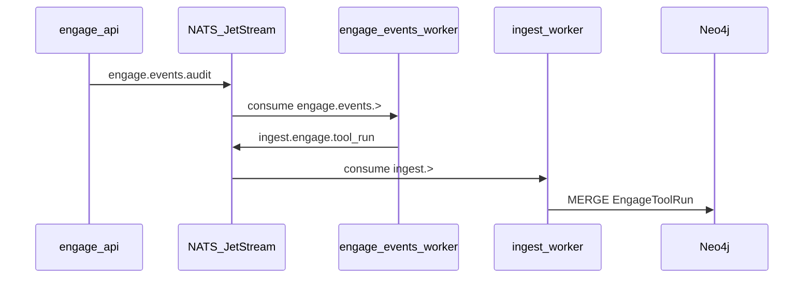

# Phase 24 — CI / E2E closure (R121–R124)

Родитель: [engage_master_post-audit_ec180f8b.plan.md](.cursor/plans/engage_master_post-audit_ec180f8b.plan.md)

**Ветка:** `engage/phase-24-ci-e2e` (создать от `main`, PR → critic APPROVE → merge).

**Цель фазы:** `make test-engage-events-pipeline` и `make test-engage-veil-stack-ci` стабильно **green** на чистом Docker host и в GitHub Actions; обновить [engage-audit-report.md](docs/engage/engage-audit-report.md) и DoD v2.

**Контекст аудита (2026-05-16):**
- Events: Neo4j `EngageToolRun` count = 0; исправлен парсинг cypher (частично), корневая причина не устранена.
- Veil-stack CI: `timeout waiting for engage-api` после ~240s при `compose up --build` полного стека.



---

## Диагностика (перед правками)

Выполнить один раз локально и зафиксировать в PR description:

```bash
make test-engage-events-pipeline   # ожидаем FAIL
docker compose -f deploy/engage/compose.yml -f deploy/engage/compose.events.yml \
  --profile graph-ingest logs engage-api engage-events-worker ingest_worker neo4j
```

| Гипотеза | Проверка |
|----------|----------|
| API без NATS | В логах `engage-api` нет `engage-events` / publish errors; env `ENGAGE_EVENTS_NATS_ENABLED=1` в [compose.events.yml](deploy/engage/compose.events.yml) |
| Smoke не ждёт health | [smoke-engage-events-pipeline.sh](scripts/test/smoke-engage-events-pipeline.sh) L20–25: break без `fail` если `/health` недоступен |
| Ingest не успевает | Фиксированный `sleep 8` без poll Neo4j |
| Tool run без audit event | Audit вызывается и при `success=false` ([run.go](engage/serve/internal/usecase/tools/run.go) L148–149) — искать разрыв в NATS/worker |
| Veil-stack: долгий build | [smoke-veil-engage-stack-ci.sh](scripts/test/smoke-veil-engage-stack-ci.sh) — deadline 240s жёсткий, не связан с `SMOKE_VEIL_ENGAGE_WAIT_SEC` |
| Veil-stack: engage-api не стартует | Зависимости `api` + `nats` healthy в [compose.veil-stack.yml](deploy/engage/compose.veil-stack.yml); конфликт портов 8890 |

---

## R121 — Events pipeline smoke (P0)

**Файлы:** [scripts/test/smoke-engage-events-pipeline.sh](scripts/test/smoke-engage-events-pipeline.sh), опционально [deploy/engage/compose.events.yml](deploy/engage/compose.events.yml)

### 1. Жёсткий wait на сервисы

- После `compose up`: poll `GET /health` до **120s**, иначе `FAIL` + `compose ps` + tail logs `engage-api`.
- Дождаться `neo4j` healthy (`depends_on` уже есть для `ingest_worker`; добавить явный poll `cypher-shell RETURN 1` перед tool POST).
- Дождаться `ingest_worker` running (логи «consumer» / stream INGEST).

### 2. Tool POST с гарантией audit event

- Предпочесть tool, не требующий runner binary в API-образе, **или** включить в events compose profile `engage-runner` + `ENGAGE_RUNNER_MODE=docker` (как [compose.runner.yml](deploy/engage/compose.runner.yml)).
- Минимум: POST с проверкой HTTP 200 и телом `success` (убрать `|| true` для диагностики; fallback `nmap_scan` с `-sn` на `127.0.0.1`).
- Убедиться, что `ENGAGE_EVENTS_NATS_ENABLED=1` и NATS URL резолвится (`nats://nats:4222`).

### 3. Poll Neo4j вместо `sleep 8`

```bash
# Псевдокод: retry 30×, interval 2s
MATCH (r:EngageToolRun) RETURN count(r) AS c
```

- Использовать `grep -Eo '[0-9]+' | tail -1` (уже есть).
- При timeout — dump NATS stream info, logs `engage-events-worker` и `ingest_worker`.

### 4. Опциональная проверка NATS (WARN, не fail)

- Подтвердить сообщение на `ingest.engage.tool_run` через `nats stream view` (исправить `wc -l` — уже с `tr -d`).

### DoD R121

- Локально: `make test-engage-events-pipeline` → `OK engage-events-pipeline smoke`.
- В Neo4j ≥1 `EngageToolRun` после одного tool POST.

---

## R122 — Veil-stack CI smoke (P0)

**Файлы:** [scripts/test/smoke-veil-engage-stack-ci.sh](scripts/test/smoke-veil-engage-stack-ci.sh), [deploy/engage/compose.veil-stack.yml](deploy/engage/compose.veil-stack.yml), [deploy/engage/compose.yml](deploy/engage/compose.yml)

### 1. Параметризация ожиданий

| Env | Default | Назначение |
|-----|---------|------------|
| `SMOKE_VEIL_API_WAIT_SEC` | **300** | Ожидание `engage-api` /health (сейчас hardcoded 240) |
| `SMOKE_VEIL_ENGAGE_WAIT_SEC` | 180 | Poll veil-api engage search (уже есть) |
| `SMOKE_VEIL_STACK_BUILD` | 1 | `compose up --build` vs `--no-build` для повторных прогонов |

### 2. Compose health alignment

- В overlay: `engage-api` `depends_on`:
  - `nats: service_healthy`
  - `api: service_started` (или healthy, если у veil-api есть healthcheck)
- Убедиться, что scrape/pipeline/graph [common.sh](scripts/lib/common.sh) `VEIL_COMPOSE_FILES` поднимают `nats` с healthcheck до engage.

### 3. Fail diagnostics

При `fail "timeout waiting for engage-api"`:

```bash
compose ps
compose logs --tail=80 engage-api api nats neo4j ingest_worker engage-events-worker
```

### 4. Read-path assert (существующий)

- Сохранить poll `GET /v1/categories/engage/search?q=${SMOKE_ENGAGE_HOST}`.
- При fail — приложить фрагмент JSON ответа в stderr.

### DoD R122

- Локально (Docker, `GRAPH_PACK_SKIP=1`): `make test-engage-veil-stack-ci` green ≤15 min cold build.
- Повторный прогон с `SMOKE_VEIL_STACK_BUILD=0` green ≤3 min.

---

## R123 — CI wiring (P0)

**Файл:** [.github/workflows/engage.yml](.github/workflows/engage.yml)

| Job | Действие |
|-----|----------|
| `engage-events-e2e` | `timeout-minutes: 25`; optional `docker compose version` debug step |
| `engage-veil-stack` | Уже `needs: engage-events-e2e`, `timeout-minutes: 45` — оставить |
| `test` | Без изменений — unit gates остаются first |

**Master DoD v2** ([engage_hexstrike_master_7666e9b4.plan.md](.cursor/plans/engage_hexstrike_master_7666e9b4.plan.md) L280): после green CI отметить:

```markdown
- [x] events-e2e + veil-stack smoke — CI job engage-veil-stack
```

Не добавлять `continue-on-error: true` на events/veil jobs.

---

## R124 — Документация и регрессия (P1)

1. Обновить [docs/engage/engage-audit-report.md](docs/engage/engage-audit-report.md): таблица gates — PASS для events + veil-stack после прогона.
2. Краткая секция в [docs/engage/engage-legacy-parity.md](docs/engage/engage-legacy-parity.md) или [docs/engage/engage-runtime.md](docs/engage/engage-runtime.md): «Events E2E prerequisites» (Docker, profiles `graph-ingest`, env vars).
3. Прогнать полный регрессионный набор:

```bash
make test-engage
make test-engage-parity
make test-engage-route-parity
make test-engage-events-pipeline
make test-engage-veil-stack-ci
```

---

## Definition of Done — Phase 24

- [x] `make test-engage-events-pipeline` green локально и в CI job `engage-events-e2e`
- [x] `make test-engage-veil-stack-ci` green локально и в CI job `engage-veil-stack`
- [x] Smoke scripts fail fast с логами (не silent skip health)
- [x] [engage-audit-report.md](docs/engage/engage-audit-report.md) обновлён
- [x] Master v2 DoD: events + veil-stack `[x]` ([engage_hexstrike_master_7666e9b4.plan.md](.cursor/plans/engage_hexstrike_master_7666e9b4.plan.md), [engage_master_post-audit_ec180f8b.plan.md](.cursor/plans/engage_master_post-audit_ec180f8b.plan.md))
- [x] Нет регрессии: `make test-engage`, `make test-engage-route-parity`

---

## Вне scope Phase 24

- Расширение runner / 100+ tools (Phase 25)
- Golden CTF/BB tests (Phase 26)
- Правки `.external/`

---

## Оценка и порядок работ

| Шаг | ID | Оценка |
|-----|-----|--------|
| Диагностика + R121 events smoke | R121 | 1.5–2 d |
| R122 veil-stack smoke + compose | R122 | 1–2 d |
| R123 CI + R124 docs | R123–R124 | 0.5 d |

**Итого:** 3–5 рабочих дней. **Блокер для Phase 25** (execution breadth) — желательно, не строго.
