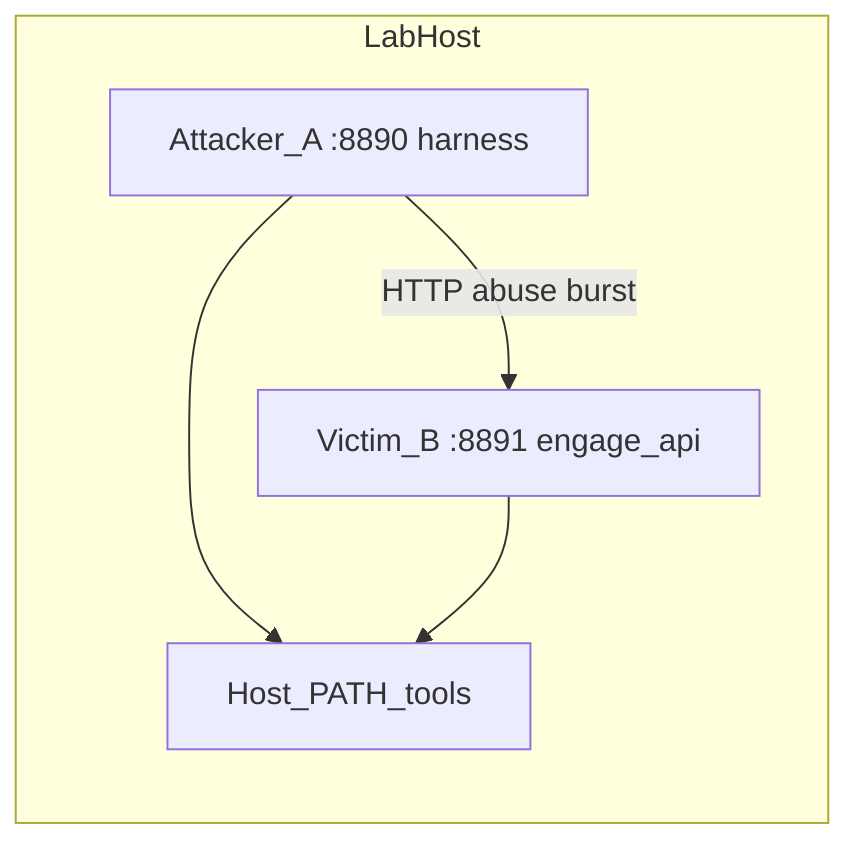

# Engage: user-friendly install + red-vs-blue aggressive lab

## Цель продукта

1. **User-friendly multi-distro** установка CLI-зависимостей для `client-native` Engage (не только Kali): `apt` / `dnf` / `pacman` / `zypper` / `apk` + fallback (где безопасно документировано).
2. **Lab red-vs-blue на одной машине (разные порты):**
   - **Victim (B)**: `engage-api` (+ опционально MCP) — **цель**; минимальная конфигурация, фиксированные порты, отдельный `ENGAGE_RUNNER_WORKDIR` / jobs dir.
   - **Attacker (A)**: `engage-api` **или** только harness-процесс с тем же бинарным тулчейном на хосте — **источник агрессии**; шлёт на victim **супер-агрессивный** набор запросов (не «симметричный smoke» двух инстансов).

3. **Проверить затею**: после прогона — баги, фиксы микро-PR, документ **Go/No-Go** по жизнеспособности client-native + install UX.

## Юридические и операционные границы (обязательно)

- Только **собственная** lab-среда / VPN / изолированная VM; **никаких** внешних целей без письменного разрешения.
- Victim слушает **localhost** или private lab network; не публиковать в интернет без edge hardening.
- «Супер-агрессивный» = **автоматизированный abuse** против **вашего** victim-инстанса: malformed JSON, oversized bodies, concurrency burst, auth fuzz (если включён auth на B), pathological catalog parameters, rate-limit stress — **не** реальные illegal атаки на третьи стороны.

Документировать это в первом PR (Wave A): [`docs/engage/engage-red-blue-lab.md`](docs/engage/engage-red-blue-lab.md) (новый).

## Мультиагентная модель (роли и ветки)

См. [.cursor/rules/veil-agent-parallel-branches.mdc](.cursor/rules/veil-agent-parallel-branches.mdc), [.cursor/rules/veil-agent-critic.mdc](.cursor/rules/veil-agent-critic.mdc), [`.cursor/agents/manifest.yaml`](.cursor/agents/manifest.yaml).

| Роль | Кто | Ветка (паттерн) | Ответственность |
|------|-----|-----------------|-----------------|
| **Orchestrator / Critic** | основной чат | `main` | порядок мерджей, APPROVE/REQUEST_CHANGES, финальный Go/No-Go |
| **Agent-Install** | `engage-implementer` | `engage/install-pNN-<slug>` | installer + yaml map + preflight |
| **Agent-Lab** | `engage-implementer` | `engage/lab-pNN-<slug>` | victim/attacker launchers + red harness |
| **Agent-Docs** | `docs-only` или implementer | `docs/engage-install-pNN-<slug>` | runbook + README glue |
| **User (ты)** | — | — | полевой прогон на железе, логи, воспроизводимость |

**Правило diff:** один PR = одна строка в таблице merge order ниже; целевой diff **≤ ~150 строк** (исключение — сгенерированный `engage-tools-packages.yaml`, отдельный коммит внутри того же PR).

## Топология red-vs-blue (same-host)

Harness может быть:
- чистый `bash` + `curl`/`jq` (минимальный Go-импакт), **или**
- маленький `go test`/cmd только если bash недостаточен — отдельная фаза, последней очереди.

## Merge order (строго; субагенты стартуют только после merge зависимости на `main`)

| # | PR | Содержимое (минимальный diff) | Зависит от |
|---|----|-------------------------------|------------|
| 1 | `engage/install-p01-lab-legal` | Новый `docs/engage/engage-red-blue-lab.md` + 1–2 ссылки из `engage/README.md` | — |
| 2 | `engage/install-p02-packages-yaml` | Только [`scripts/ops/engage-tools-packages.yaml`](scripts/ops/engage-tools-packages.yaml) (данные) | PR1 |
| 3 | `engage/install-p03-install-skeleton` | [`scripts/ops/install-engage-host-tools.sh`](scripts/ops/install-engage-host-tools.sh): detect PM, `--plan`, `--yes` no-op install stubs | PR2 |
| 4 | `engage/install-p04-preflight` | Расширение [`scripts/engage/preflight-client-tools.sh`](scripts/engage/preflight-client-tools.sh) (профили / `--json`) | PR3 |
| 5 | `engage/lab-p05-victim-instance` | [`scripts/engage/run-client-native-api-instance.sh`](scripts/engage/run-client-native-api-instance.sh) или расширение существующего launcher: роль `victim`, порты, workdir | PR4 |
| 6 | `engage/lab-p06-attacker-instance` | launcher роли `attacker` (отдельные порты/env) | PR5 |
| 7 | `engage/lab-p07-red-harness` | [`scripts/test/smoke-engage-red-vs-blue.sh`](scripts/test/smoke-engage-red-vs-blue.sh): агрессивные сценарии против `ENGAGE_VICTIM_URL` | PR6 |
| 8 | `engage/install-p08-make-docs` | `Makefile` targets + [`docs/engage/engage-install-linux.md`](docs/engage/engage-install-linux.md) + `scripts/README.md` | PR7 |
| 9 | **Field** | Полевой прогон у пользователя; [`docs/engage/engage-red-blue-bugs.md`](docs/engage/engage-red-blue-bugs.md) | PR8 |
| 10+ | `engage/fix-pXX-<slug>` | Один баг = один PR | поле |

**Параллельность:** после merge **PR4** можно параллелить **PR5** и **док-патч** только если файлы не пересекаются; при конфликте — строго по таблице.

## Содержание фаз (кратко)

### Wave A — PR1: legal + multi-agent runbook

- Новый `docs/engage/engage-red-blue-lab.md`: роли агентов, ветки, merge order, safety.
- Ссылка из [`engage/README.md`](engage/README.md).

### Wave B — PR2: package map

- YAML: tool → packages по семействам ОС; без исполняемой логики.

### Wave C–D — PR3–4: installer + preflight

- Installer вызывает пакетный менеджер по профилю `minimal|recommended|full`.
- Preflight проверяет наличие после install; `--json` для автоматизации.

### Wave E–G — PR5–7: victim / attacker / harness

- **Victim**: стабильный URL `http://127.0.0.1:8891` (пример), отдельные каталоги work/jobs/files.
- **Attacker**: отдельный порт; harness использует **только** URL victim (не hardcode глобально — env `ENGAGE_VICTIM_URL`).
- **Harness «супер-агрессивный»** (примеры сценариев, все против localhost victim):
  - burst concurrent `POST /api/tools/*` с валидными/невалидными телами;
  - oversized JSON / wrong content-type;
  - rapid `GET /health` + `GET /api/tools` while tools POST;
  - если на B включён auth — отдельный подпакет fuzz **только** против B с известным тестовым токеном из lab env (не prod secrets).

### Wave H — PR8: Makefile + install-linux.md

- `make engage-install-plan`, `make engage-install-host-tools`, `make test-engage-red-blue` (имя финализировать в PR).

### Wave I — Field + bug log

- Пользователь выполняет сценарий на своей машине; заполняется `docs/engage/engage-red-blue-bugs.md`.

### Wave J — Fix slices + viability

- Микро-PR на каждый баг; финальный [`docs/engage/engage-client-native-viability.md`](docs/engage/engage-client-native-viability.md): Go/No-Go.

## Критерии Go/No-Go (жизнеспособность)

- **Go:** install + preflight зелёные на ≥2 семействах PM из матрицы; red harness завершается без краша victim; критичные утечки/DoS зафиксированы как issues с mitigation.
- **No-Go:** невозможно стабильно поставить core tools на non-Kali без неприемлемого количества manual steps; victim падает от базового harness; стоимость поддержки пакетной матрицы выше пользы.

## Связь с существующими артефактами

- [`docs/engage/engage-client-dependencies.md`](docs/engage/engage-client-dependencies.md) — остаётся источником списков инструментов.
- [`scripts/engage/run-client-native-api.sh`](scripts/engage/run-client-native-api.sh) — не ломать; instance-скрипт может обёрнуть его с env.

## Примечание для манифеста субагентов

После утверждения плана — добавить в [`.cursor/agents/manifest.yaml`](.cursor/agents/manifest.yaml) опциональные `phases:` с `plan_path: .cursor/plans/engage_userfriendly_install_73f6d9c0.plan.md` и `phase_slug` по PR1…PR8 (отдельный микро-PR после PR1, чтобы не смешивать контент и манифест).
