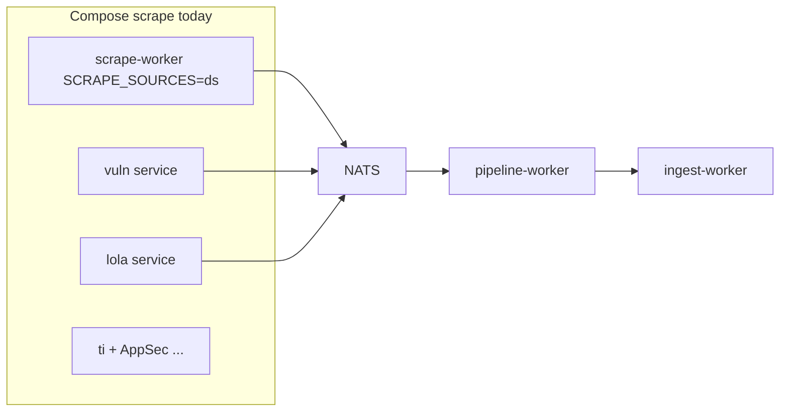

# Scrape factory slice 2: vuln + lola

## Где мы сейчас

| Артефакт | Статус |
|----------|--------|
| [scrape_factory_dry](.cursor/plans/scrape_factory_dry_5ee3f1f0.plan.md) срез 1 | **done** — `scrape-worker`, `factory.Run`, `ds/scrapesource`, `DomainPublisher` для DS |
| Veil фаза B (все producers в factory) | **частично** — только `ds` |
| Compose profile `scrape` | `scrape-worker` + legacy `vuln`, `lola`, `ti`, AppSec |
| [pipeline-worker](ingest/pipeline-worker/internal/handle/) | handlers для vuln/lola/ds уже есть |



**Цель среза 2:** один `scrape-worker` обслуживает `ds,vuln,lola`; отдельные compose-сервисы `vuln` и `lola` удаляются.

---

## 1. DRY: `internal/scrapepub` → `DomainPublisher`

Повторить паттерн [scrapers/ds/internal/scrapepub/publisher.go](scrapers/ds/internal/scrapepub/publisher.go):

**vuln** — [scrapers/vuln/internal/scrapepub/publisher.go](scrapers/vuln/internal/scrapepub/publisher.go):
- `rawPublisher` interface + `NewFromRaw(pub)`
- `New(pub, subject)` → `NewFromRaw(scrapepub.NewDomainPublisher(..., scrapev1.SourceVuln, subject))`
- Методы `Upsert`, `PublishNVDPage`, `MergeExploitForCVE` вызывают `raw.Publish(...)` вместо локального `publish()`

**lola** — [scrapers/lola/internal/scrapepub/publisher.go](scrapers/lola/internal/scrapepub/publisher.go):
- то же с `SourceLola` и методами repository (`UpsertArtifact`, STIX, links, …)

**Не трогаем в этом PR:** payloads с `pkg/ingestv1` в scrape (vuln `MergeExploit`, lola link kinds) — pipeline уже умеет; вынос в scrape-only типы — [срез 3](#slice-3-after).

---

## 2. `scrapesource` + `factory.Register`

**[scrapers/vuln/scrapesource/source.go](scrapers/vuln/scrapesource/source.go)** (новый):

```go
func init() { factory.Register("vuln", func() factory.Source { return &Source{} }) }

func (s *Source) Name() string { return "vuln" }
func (s *Source) Policy() factory.FetchPolicy { return factory.PolicyPeriodic }

func (s *Source) Run(ctx context.Context, deps *factory.ScrapeDeps) error {
    cfg, err := config.LoadConfig()
    // ...
    pub, _ := deps.Publisher("vuln")
    repo := vulnscrapepub.NewFromRaw(pub)
    scraper := usecase.NewScraperUsecase(repo, deps.Log, cfg.NVD.APIKey, deps.Ledger)
    return scraper.Run(ctx)
}
```

- Ledger берётся из `deps.Ledger` (уже открывается в [factory/runner.go](ingest/scrape/factory/runner.go) через `feeds.OpenLedgerFromEnv`) — **не** дублировать `OpenLedgerFromEnv` в vuln.
- `config.LoadConfig()` и env NVD остаются как сейчас.

**[scrapers/lola/scrapesource/source.go](scrapers/lola/scrapesource/source.go)** (новый):

```go
func (s *Source) Policy() factory.FetchPolicy { return factory.PolicyPeriodic }

func (s *Source) Run(...) {
    pub, _ := deps.Publisher("lola")
    repo := lolascrapepub.NewFromRaw(pub)
    scraper := usecase.NewScraperUsecase(repo, deps.Log, lolaCacheDir())
    return scraper.Run(ctx)
}
```

- `lolaCacheDir()` — `LOLA_CACHE_DIR` → `SCRAPE_CACHE_DIR` → `./data/cache` (как в [components/init.go](scrapers/lola/internal/components/init.go)).

---

## 3. `scrape-worker` cmd и go.mod

[ingest/scrape/cmd/main.go](ingest/scrape/cmd/main.go):

```go
import (
    _ "ds/scrapesource"
    _ "vuln/scrapesource"
    _ "lola/scrapesource"
)
```

[ingest/scrape/cmd/go.mod](ingest/scrape/cmd/go.mod) — `require` + `replace` для модулей `vuln` и `lola`.

[docker/scrape-worker.Dockerfile](docker/scrape-worker.Dockerfile) — без смены пути build (`ingest/scrape/cmd`); после `go mod tidy` подтянутся транзитивные зависимости vuln/lola.

**Thin wrappers** (как ds):

- [scrapers/vuln/cmd/main.go](scrapers/vuln/cmd/main.go) → `factory.Run` + `SourceNames: []string{"vuln"}` + `_ "vuln/scrapesource"`
- [scrapers/lola/cmd/main.go](scrapers/lola/cmd/main.go) → аналогично для `lola`

`components.InitComponents` / отдельный NATS connect в vuln/lola **больше не используются из cmd** (пакет `components` можно оставить для тестов или пометить deprecated — не удалять без нужды).

---

## 4. Compose

[docker-compose.yml](docker-compose.yml):

| Действие | Детали |
|----------|--------|
| Расширить `scrape-worker.environment` | env с сервисов `vuln` и `lola`: `VULN_*`, `LOLA_*`, `VITESS_DSN`, `SCRAPE_MIN_REFETCH_AFTER`, `GITHUB_TOKEN`, proxy vars |
| `SCRAPE_SOURCES` default | `ds,vuln,lola` |
| Удалить сервисы | `vuln`, `lola` |
| Volumes | общий `./data/cache:/data/cache` (уже есть) |

`pipeline-worker` / `ingest-worker` — **без изменений** (subjects те же: `scrape.vuln.events`, `scrape.lola.events`).

---

## 5. Тесты и проверка

**Unit:**
- `go test ./ingest/scrape/factory/... ./scrapers/scrapepub/... ./scrapers/vuln/... ./scrapers/lola/... ./scrapers/ds/...`
- В [factory/registry_test.go](ingest/scrape/factory/registry_test.go): тест `SourcesFor([]string{"vuln","lola"})` после `Register` mock (или интеграционный build tag — опционально)

**Smoke (ручной):**

```bash
docker compose --profile scrape up --build -d scrape-worker pipeline-worker ingest-worker nats neo4j crawl-db
# SCRAPE_SOURCES=ds,vuln,lola по умолчанию
# lag scrape.> и ingest.> → 0
# Cypher: Vulnerability, LOLBAS/GTFOBins-related nodes выросли
```

---

## 6. Документация

- [ingest/discovery/README.md](ingest/discovery/README.md) — зарегистрированные sources: `ds`, `vuln`, `lola`
- [docs/architecture/threatintel-runtime.md](docs/architecture/threatintel-runtime.md) — `scrape-worker` env vuln/lola; убрать `vuln`/`lola` из таблицы отдельных сервисов
- [scrapers/README.md](scrapers/README.md) — compose service column для vuln/lola → `scrape-worker`

---

## Вне scope (срез 3+)

<a id="slice-3-after"></a>

| Тема | Почему позже |
|------|----------------|
| **ti** | normalize в [feeds/runner.go](scrapers/ti/internal/feeds/runner.go) — отдельный PR: raw scrape + normalize только в pipeline |
| **AppSec** (sbom, coderules, nuclei) | другой boot pattern (`config.FromEnv` + inline publish) |
| **ingestv1 в scrape payloads** | vuln/lola — замена на scrape-local types + pipeline decode |
| **proxypool ×4 → feeds** | DRY после миграции всех domain scrapers |
| **Vitess policies per feed** | Veil фаза C |
| **E2E + graph-pack v0.3.1** | Veil фаза E, после стабильного полного `SCRAPE_SOURCES` |

---

## Критерии готовности

- [ ] `factory.Register("vuln")` и `factory.Register("lola")`; `SCRAPE_SOURCES=ds,vuln,lola` работает в одном `scrape-worker`
- [ ] Compose: нет отдельных `vuln` / `lola` сервисов
- [ ] `vuln`/`lola` `internal/scrapepub` без дублирования `publish()` — через `NewFromRaw` + `DomainPublisher`
- [ ] `vuln` использует `deps.Ledger` из factory (один `OpenLedgerFromEnv`)
- [ ] `go test` зелёный по затронутым пакетам
- [ ] Smoke: vuln + lola данные доходят до Neo4j через pipeline → ingest-worker

---

## Порядок коммитов

1. vuln/lola `scrapepub` refactor (`NewFromRaw`)
2. `vuln/scrapesource`, `lola/scrapesource`
3. `scrape-worker` cmd imports + go.mod; thin vuln/lola cmd
4. compose + docs
5. tests + smoke notes
