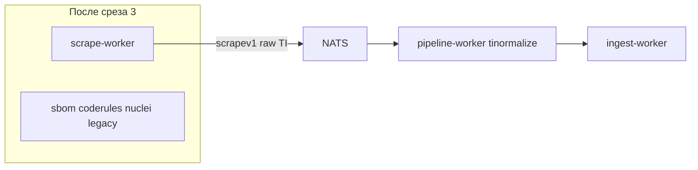

# Scrape factory slice 3: TI + normalize только в pipeline

## Контекст

| Срез | Статус |
|------|--------|
| [scrape_factory_dry](.cursor/plans/scrape_factory_dry_5ee3f1f0.plan.md) — DS | done |
| [factory_slice_2_vuln_lola](.cursor/plans/factory_slice_2_vuln_lola_8127b37e.plan.md) | done — `SCRAPE_SOURCES=ds,vuln,lola`, compose без `vuln`/`lola` |
| [veil_refactor](.cursor/plans/veil_refactor.plan.md) фаза B | **осталось:** `ti` + AppSec; убрать normalize из scrapers |
| Veil фаза E (graph-pack release) | **вне scope** — не `gh release`, не обновление `DEFAULT_PACK_URL` |



**Цель:** закрыть главное нарушение 3-context для TI: scraper публикует **сырые** `tidomain.*` / KEV row / JSONL line; `tinormalize` — **только** в [ingest/pipeline-worker/internal/handle/ti.go](ingest/pipeline-worker/internal/handle/ti.go).

---

## 1. DRY: `ti/internal/scrapepub` → `DomainPublisher`

По образцу [scrapers/ds/internal/scrapepub/publisher.go](scrapers/ds/internal/scrapepub/publisher.go):

- `rawPublisher` + `NewFromRaw(pub)`
- `New(pub, subject)` → `NewFromRaw(scrapepub.NewDomainPublisher(..., scrapev1.SourceTI, subject))`
- Все методы вызывают `raw.Publish(...)` вместо локального `publish()`

**Оставляем без изменения в этом PR** (pipeline уже умеет, см. [handle/ti.go](ingest/pipeline-worker/internal/handle/ti.go)):

- KEV: `ingestv1.TIKEVVulnPayload` в `KindTIKEVRow`
- JSONL: `ingestv1.TIJSONLRecordPayload` в `KindTIJSONLLine`

Вынос в scrape-only типы — срез 4+.

---

## 2. Убрать `normalize` из scraper (ключевое)

### [scrapers/ti/internal/feeds/runner.go](scrapers/ti/internal/feeds/runner.go)

Заменить все `normalize.NormalizeIOC(ioc)` → публикация **сырого** `domain.IOC` через `r.Repo.UpsertIOC(ctx, ioc)`.

PT RSS ([~220–231](scrapers/ti/internal/feeds/runner.go)):

- Убрать `normalize.ReportStableID` и цикл с `ni, ok := normalize.NormalizeIOC`
- Оставить: `UpsertReport` + для каждого извлечённого IOC — `UpsertIOC(ctx, ioc)` (как сейчас по смыслу `LinkReportMentionsIOC`, который и так игнорирует `reportID` в [scrapepub](scrapers/ti/internal/scrapepub/publisher.go))

### [scrapers/ti/internal/feeds/ioc_threatfox.go](scrapers/ti/internal/feeds/ioc_threatfox.go)

- `iocFromThreatFoxExport` возвращает `(domain.IOC, bool)` **без** `normalize.NormalizeIOC` в конце
- Удалить import `ti/internal/normalize`
- Обновить комментарий («maps … to domain IOC»)

### Проверка

```bash
rg 'ti/internal/normalize' scrapers/ti/internal/feeds
# ожидание: 0 совпадений
```

`ti/internal/usecase` и `ti/internal/storage/neo4j` с normalize — **не трогаем** (legacy ingest path / workeringest); scrape path идёт через `feeds.Runner` + scrapepub.

---

## 3. `ti/scrapesource` + `factory.Register`

Новый файл [scrapers/ti/scrapesource/source.go](scrapers/ti/scrapesource/source.go):

```go
func init() { factory.Register("ti", func() factory.Source { return &Source{} }) }

func (s *Source) Policy() factory.FetchPolicy { return factory.PolicyDaily }

func (s *Source) Run(ctx context.Context, deps *factory.ScrapeDeps) error {
    pub, err := deps.Publisher("ti")
    repo := tiscrapepub.NewFromRaw(pub)
    runner := feeds.NewRunner(repo, deps.Log)

    if feeds := os.Getenv("TI_FEEDS"); strings.TrimSpace(feeds) != "" {
        kinds := strings.Split(feeds, ",")
        if err := runner.Run(ctx, kinds); err != nil { return err }
    }
    if path := strings.TrimSpace(os.Getenv("TI_JSONL_FILE")); path != "" {
        // scan file → repo.PublishJSONLLine (как ti/cmd/main сегодня)
    }
    return nil
}
```

Env (из текущего compose `ti`):

| Variable | Default (compose) | Meaning |
|----------|-------------------|---------|
| `TI_FEEDS` | `kev,urlhaus,threatfox,malwarebazaar,feodo` | Список feeds для `feeds.Runner` |
| `TI_JSONL_FILE` | опционально `/app/example.jsonl` | Локальный JSONL (bypass ledger) |
| `TI_*` | как в [docker-compose.yml](docker-compose.yml) `ti` | лимиты, cache, proxy, API keys |

`ti/go.mod`: `require` + `replace` для [ingest/scrape/factory](ingest/scrape/factory/).

---

## 4. `scrape-worker` и thin `ti/cmd`

[ingest/scrape/cmd/main.go](ingest/scrape/cmd/main.go):

```go
_ "ti/scrapesource"
```

[ingest/scrape/cmd/go.mod](ingest/scrape/cmd/go.mod) — `require ti`, `replace` → `../../../scrapers/ti`.

[scrapers/ti/cmd/main.go](scrapers/ti/cmd/main.go) — thin wrapper:

```go
factory.Run(ctx, factory.RunOptions{SourceNames: []string{"ti"}, Log: logger})
```

Флаги `--feeds` / `--input` в standalone `ti` cmd можно заменить на env (`TI_FEEDS`, `TI_JSONL_FILE`) для единообразия со scrape-worker; при необходимости оставить flags как override поверх env (минимально).

---

## 5. Compose

[docker-compose.yml](docker-compose.yml):

| Действие | Детали |
|----------|--------|
| Расширить `scrape-worker.environment` | все `TI_*`, `MALWAREBAZAAR_*`, `THREATFOX_*`, `OPENPHISH_*`, `FEODO_*`, `PT_RSS_URL` с сервиса `ti` |
| `SCRAPE_SOURCES` default | `ds,vuln,lola,ti` |
| `TI_JSONL_FILE` | опционально смонтировать `example.jsonl` (как сейчас `command: --input /app/example.jsonl`) |
| **Удалить** сервис `ti` | |
| Оставить | `sbom`, `coderules`, `nuclei` — **срез 4** |

`pipeline-worker` / subjects — без изменений (`scrape.ti.events` → `ingest.ti.events`).

---

## 6. Тесты

- Обновить [scrapers/ti/internal/feeds/ioc_threatfox_test.go](scrapers/ti/internal/feeds/ioc_threatfox_test.go) — по-прежнему проверяет type mapping (normalize не нужен)
- Добавить unit-тест runner: mock repo, один feed path публикует IOC **до** normalize (опционально через fake repo, записывающий payload)
- Добавить/расширить тест в [ingest/pipeline-worker/internal/handle/ti.go](ingest/pipeline-worker/internal/handle/ti.go) или `_test.go`: `KindTIIoCRaw` с «грязным» IOC → normalized idempotency key
- `go test ./ingest/scrape/factory/... ./scrapers/ti/... ./ingest/pipeline-worker/internal/handle/...`

---

## 7. Проверка без релиза (явно не делаем)

**Делаем (smoke):**

```bash
docker compose --profile scrape up --build -d scrape-worker pipeline-worker ingest-worker nats neo4j crawl-db
# SCRAPE_SOURCES=ds,vuln,lola,ti
# lag scrape.> и ingest.> → 0
# Cypher: IOC, Report, KEV-related nodes
```

**Не делаем:**

- `gh release create v0.3.1-graph-pack`
- Обновление [docker/graph-bootstrap.sh](docker/graph-bootstrap.sh) `DEFAULT_PACK_URL`
- Требование «новый sha256 ≠ b4fd360a…» как gate для merge (можно локально `./scripts/build-graph-pack.sh` **только для отчёта**, без публикации)

---

## 8. Документация

- [ingest/scrape/README.md](ingest/scrape/README.md) — зарегистрирован `ti`, env `TI_FEEDS` / `TI_JSONL_FILE`
- [docs/threatintel-runtime.md](docs/threatintel-runtime.md) — убрать `ti` из legacy services; normalize только в pipeline
- [docs/coding-style.md](docs/coding-style.md) или [docs/ingest-contract.md](docs/ingest-contract.md) — одна строка: TI IOC normalize в pipeline-worker, не в scraper
- [scrapers/README.md](scrapers/README.md) — compose column для `ti` → `scrape-worker`

---

## Вне scope (срез 4+)

| Тема | Когда |
|------|--------|
| AppSec → scrape-worker | Срез 4 |
| `ingestv1` payloads в scrape (KEV, JSONL) → scrape-only types | Отдельно |
| Vitess policies per feed (Veil C) | После полной factory |
| Graph ctx cleanup (Veil D) | Параллельно/после |
| E2E полный + **релиз** graph-pack | Только по явному решению пользователя |

---

## Критерии готовности

- [ ] `factory.Register("ti")`; `SCRAPE_SOURCES` с `ti` работает в `scrape-worker`
- [ ] Compose: нет отдельного сервиса `ti`
- [ ] `scrapers/ti/internal/feeds` не импортирует `ti/internal/normalize`
- [ ] `ti/internal/scrapepub` на `NewFromRaw` + `DomainPublisher`
- [ ] Pipeline по-прежнему нормализует `KindTIIoCRaw` / campaign / cluster / report
- [ ] `go test` зелёный по затронутым пакетам
- [ ] Smoke compose без публикации релиза

---

## Порядок коммитов

1. Убрать normalize из `feeds/` (+ тесты threatfox)
2. `ti/scrapepub` NewFromRaw
3. `ti/scrapesource` + factory wiring
4. `scrape-worker` cmd + thin `ti/cmd` + go.mod
5. compose + docs
6. pipeline/handle тесты при необходимости
