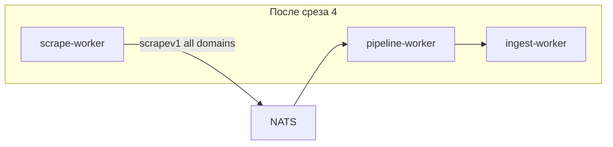

# Scrape factory slice 4: AppSec (sbom + coderules + nuclei)

## Контекст Veil (не забываем)

Три контекста ([veil_refactor.plan.md](veil_refactor.plan.md)):

1. **Scrape** — fetch → `scrapev1` на `scrape.>` (без Neo4j, без graph normalize в scrapers).
2. **Pipeline** — `pipeline-worker` → `ingestv1` на `ingest.>`.
3. **Graph** — `ingest-worker` → Neo4j.

Один бинарь [`scrape-worker`](ingest/scrape/cmd/main.go), оркестрация [`ingest/scrape/factory`](ingest/scrape/factory/), publish через [`scrapers/scrapepub/domain.go`](scrapers/scrapepub/domain.go).

| Срез | Статус |
|------|--------|
| [scrape_factory_dry](.cursor/plans/scrape_factory_dry_5ee3f1f0.plan.md) — DS | done |
| [factory_slice_2](.cursor/plans/factory_slice_2_vuln_lola_8127b37e.plan.md) — vuln, lola | done |
| [factory_slice_3](.cursor/plans/factory_slice_3_ti_477684c7.plan.md) — TI | done |
| **Срез 4 (этот)** | AppSec → `scrape-worker` |
| Veil фаза E (graph-pack release) | **вне scope** |



После среза 4 в profile `scrape` **не останется** отдельных producer-сервисов — только `scrape-worker` + pipeline/ingest (+ infra).

---

## Текущее состояние

- Factory: `ds`, `vuln`, `lola`, `ti`
- Legacy compose: `sbom`, `coderules`, `nuclei` — каждый сам `ConnectJetStreamAndStream` и строит envelope inline:
  - [scrapers/sbom/internal/usecase/scrape.go](scrapers/sbom/internal/usecase/scrape.go)
  - [scrapers/coderules/internal/usecase/runner.go](scrapers/coderules/internal/usecase/runner.go)
  - [scrapers/nuclei/internal/usecase/runner.go](scrapers/nuclei/internal/usecase/runner.go)
- Pipeline: [ingest/pipeline-worker/internal/handle/appsec.go](ingest/pipeline-worker/internal/handle/appsec.go) уже есть

---

## 1. rawPublisher в usecase (без импорта factory)

Локальный интерфейс в каждом модуле (как DS):

```go
type rawPublisher interface {
    Publish(ctx context.Context, kind, contentKey string, payload any) error
}
```

`deps.Publisher("sbom")` из factory — это `scrapepub.DomainPublisher`, совместим с интерфейсом.

| Модуль | Сейчас | После |
|--------|--------|-------|
| sbom | `PublishJSON(ctx, subject, env)` | `Publish(ctx, kind, key, payload)` |
| coderules | `cweScrapeBridge` + semgrep/codeql с `JetStreamPublisher` | `rawPublisher` везде |
| nuclei | inline `NewEnvelope` + `PublishJSON` | `rawPublisher.Publish` |

Убрать из `usecase.Options`: `NATSURL`, `ScrapeSubject` — subject задаёт [factory/subjects.go](ingest/scrape/factory/subjects.go).

---

## 2. Три scrapesource + factory.Register

### [scrapers/sbom/scrapesource/source.go](scrapers/sbom/scrapesource/source.go)

- `PolicyPeriodic`
- `config.FromEnv()` + `cvesource.New` + `usecase.NewRunner(deps.Log, cveSrc, pub, …)`

### [scrapers/coderules/scrapesource/source.go](scrapers/coderules/scrapesource/source.go)

- `PolicyPeriodic` (достаточно для первого PR; CWE zip — тот же run)
- `CODERULES_SOURCES`, лимиты из env

### [scrapers/nuclei/scrapesource/source.go](scrapers/nuclei/scrapesource/source.go)

- `PolicyPeriodic`
- `NUCLEI_YEARS`, `NUCLEI_MAX`

Каждый: `go.mod` + `replace` на factory (как [scrapers/ti/go.mod](scrapers/ti/go.mod)).

---

## 3. scrape-worker и thin cmd

[ingest/scrape/cmd/main.go](ingest/scrape/cmd/main.go):

```go
_ "sbom/scrapesource"
_ "coderules/scrapesource"
_ "nuclei/scrapesource"
```

Thin: [scrapers/sbom/cmd/main.go](scrapers/sbom/cmd/main.go), coderules, nuclei → `factory.Run` + `SourceNames: []string{"sbom"}` и т.д.

---

## 4. Compose + Dockerfile

- `SCRAPE_SOURCES` default: `ds,vuln,lola,ti,sbom,coderules,nuclei`
- Перенести env с `sbom` / `coderules` / `nuclei` на `scrape-worker`
- Volume: `SBOM_CVE_LIST_FILE` → [scrapers/sbom/fixtures/cve_list_seed.txt](scrapers/sbom/fixtures/cve_list_seed.txt) (`/fixtures/cve_list_seed.txt`)
- **Удалить** сервисы `sbom`, `coderules`, `nuclei`

[docker/scrape-worker.Dockerfile](docker/scrape-worker.Dockerfile):

```dockerfile
COPY --from=build /src/scrapers/sbom/fixtures/cve_list_seed.txt /fixtures/cve_list_seed.txt
```

---

## 5. Тесты

- `go test ./scrapers/sbom/... ./scrapers/coderules/... ./scrapers/nuclei/... ./ingest/scrape/...`
- Mock `rawPublisher` в sbom usecase (ожидаемый `KindSBOMOSVJSON`)
- `factory/registry_test` — `SourcesFor` с `sbom`

---

## 6. Документация

- [ingest/discovery/README.md](ingest/discovery/README.md)
- [docs/threatintel-runtime.md](docs/threatintel-runtime.md)
- [scrapers/README.md](scrapers/README.md)
- [docs/ingest-contract.md](docs/ingest-contract.md) — фаза B factory: все producers в scrape-worker

---

## 7. Smoke (без релиза)

```bash
docker compose --profile scrape up --build -d scrape-worker pipeline-worker ingest-worker nats neo4j crawl-db
```

- lag `scrape.>` / `ingest.>` → 0
- Cypher: Package, SecurityAdvisory, CWE, NucleiTemplate, …

**Не делаем:** `gh release`, `DEFAULT_PACK_URL`, export sha256 gate как release.

---

## Вне scope

| Тема | Когда |
|------|--------|
| Graph-pack release | Veil E — по решению |
| Vitess per-feed policies | Veil C |
| scrape-only types вместо ingestv1 в payload | Отдельный PR |
| `ingest/graph` | Veil D |
| Параллельный `RunAll` | Опционально |

---

## Критерии готовности

- [ ] `factory.Register` для sbom, coderules, nuclei
- [ ] Compose без отдельных AppSec producers
- [ ] AppSec usecase не вызывают `ConnectJetStreamAndStream`
- [ ] `go test` зелёный
- [ ] Smoke без релиза

---

## Порядок коммитов

1. sbom usecase → rawPublisher
2. coderules (+ cweScrapeBridge)
3. nuclei usecase
4. три scrapesource + go.mod
5. scrape-worker cmd + Dockerfile
6. compose + docs + tests
