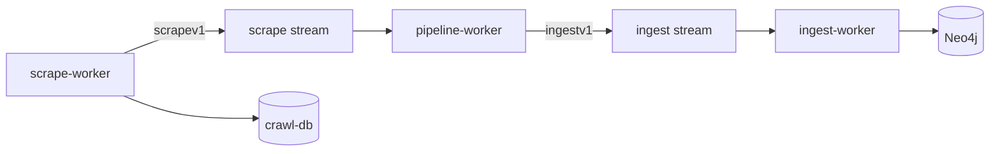

# Scrape factory slice 5: Vitess ledger + per-feed policies

## Контекст (что уже сделано)

| Срез | Результат |
|------|-----------|
| [scrape_factory_dry](.cursor/plans/scrape_factory_dry_5ee3f1f0.plan.md) | DS + factory + `scrape-worker` |
| [factory_slice_2](.cursor/plans/factory_slice_2_vuln_lola_8127b37e.plan.md) | vuln, lola |
| [factory_slice_3](.cursor/plans/factory_slice_3_ti_477684c7.plan.md) | TI, normalize только в pipeline |
| [factory_slice_4](.cursor/plans/factory_slice_4_appsec_9a2c1f3e.plan.md) | sbom, coderules, nuclei — **фаза B factory закрыта** |



**Veil 3 контекста** ([veil_refactor.plan.md](.cursor/plans/veil_refactor.plan.md)): ledger — **только ctx1** (метаданные URL, не граф). Normalize/dedup — pipeline; Neo4j — ingest-worker.

**Вне scope среза 5:** `gh release`, export pack, `DEFAULT_PACK_URL` (Veil E); перенос `ingest/graph` (Veil D); параллельный `RunAll`.

---

## Проблема сейчас

- [`factory.Source.Policy()`](ingest/scrape/factory/source.go) логируется в `RunAll`, но **не влияет** на fetch.
- [`feeds.FetchIfDue`](ingest/scrape/feeds/fetch.go) + [`ledger.Store`](ingest/scrape/ledger/ledger.go) реализованы; factory уже открывает ledger ([`factory.Run`](ingest/scrape/factory/runner.go) → `deps.Ledger`).
- **Единственный потребитель:** NVD pages в [vuln usecase](scrapers/vuln/internal/usecase/scrape.go) (через `deps.Ledger` из [vuln/scrapesource](scrapers/vuln/scrapesource/source.go)).
- TI/DS/lola/AppSec каждый раз качают и публикуют без ledger keys.
- Политики на `scrapesource` частично неверны vs [veil_refactor таблица](.cursor/plans/veil_refactor.plan.md): например CWE/MITRE должны быть `static`, TI feeds — `daily`.

---

## Цель среза 5

1. Таблица **resource_key + policy** для основных HTTP-фидов (по Veil).
2. Прокинуть `deps.Feeds` + `deps.Ledger` в usecase/feeds runners (без дублирования `OpenLedgerFromEnv` в scrapers).
3. Обернуть HTTP fetch в `FetchIfDue`; при `Skipped`/`Unchanged` — **не** вызывать `Publish`.
4. Дополнить `FetchIfDue`: если в ledger есть `content_sha256` и тело после fetch совпало — `Unchanged: true` (skip publish, всё равно обновить `last_fetched_at`).

---

## 1. Усилить `ingest/scrape/feeds` + ledger

**Файлы:** [ingest/scrape/feeds/fetch.go](ingest/scrape/feeds/fetch.go), [ingest/scrape/ledger/ledger.go](ingest/scrape/ledger/ledger.go)

- `ledger.GetContentSHA(ctx, resourceKey)` (или чтение в `ShouldFetch`) для сравнения после fetch.
- `FetchIfDue` возвращает `Unchanged: true`, когда hash совпал — callers не публикуют.
- Unit-тесты: mock DB / sqlmock или in-memory sqlite не нужен — table-driven на helper с fake `Store` interface при необходимости.

**Env** (уже в compose): `VITESS_DSN`, `SCRAPE_MIN_REFETCH_AFTER`, `SCRAPE_FORCE_REFETCH` — задокументировать поведение в [ingest/discovery/README.md](ingest/discovery/README.md).

---

## 2. Политики на `scrapesource`

| Source | `Policy()` сейчас | Целевое (Veil) |
|--------|-------------------|----------------|
| `ti` | daily | daily (OK) |
| `vuln` | periodic | periodic (OK) |
| `lola` | periodic | **static** для MITRE STIX / LOLBAS trees; periodic для остальных sub-feeds — если один `Source`, оставить `periodic` и static только на ключах в usecase |
| `ds` | periodic | periodic |
| `sbom` | periodic | periodic (OSV per CVE keys) |
| `coderules` | periodic | **static** для CWE zip; periodic для Semgrep/CodeQL GitHub |
| `nuclei` | periodic | periodic (path-level) |

Для `coderules`/`lola` с одним `Run()`: policy на **resource_key** в `FetchIfDue`, не обязательно менять top-level `Source.Policy()` — но CWE/MITRE keys используют `PolicyStatic`.

---

## 3. Пилот интеграции (порядок PR внутри среза)

### 3.1 TI (daily) — высокий эффект

**Файлы:** [scrapers/ti/internal/feeds/runner.go](scrapers/ti/internal/feeds/runner.go), [scrapers/ti/scrapesource/source.go](scrapers/ti/scrapesource/source.go)

- `NewRunner` принимает `*feeds.Client`, `*ledger.Store` (из `ScrapeDeps`).
- Пилотные feeds: **KEV**, **URLhaus** (стабильные URL, простой GET).
- Keys: `ti:kev`, `ti:urlhaus:recent`, …; policy `PolicyDaily`.
- При `Skipped` + cache hit — parse/publish из cache (как NVD); при `Unchanged` — skip publish.

### 3.2 vuln — выровнять и расширить

- Убрать дублирующий `RecordFetch` в fallback path [scrape.go](scrapers/vuln/internal/usecase/scrape.go) — только через `FetchIfDue`.
- Добавить ledger для **Exploit-DB CSV** / Metasploit listing (periodic keys по veil таблице).

### 3.3 DS (periodic)

**Файлы:** [scrapers/ds/internal/usecase](scrapers/ds/internal/usecase), [scrapers/ds/scrapesource/source.go](scrapers/ds/scrapesource/source.go)

- GitHub list/file fetch: key `gh:owner/repo:path` + `PolicyPeriodic`.
- Передавать `deps.Feeds`, `deps.Ledger` в `Ingestor`.

### 3.4 sbom OSV (periodic)

**Файлы:** [scrapers/sbom/internal/usecase/scrape.go](scrapers/sbom/internal/usecase/scrape.go)

- Перед `osv.GetVuln`: `FetchIfDue` key `osv:CVE-…` или обёртка в osv client.
- Unchanged CVE → skip `Publish` (меньше шума на `scrape.>`).

### 3.5 AppSec (опционально в том же срезе, если объём позволяет)

- **coderules** CWE zip: `coderules:cwe:mitre_zip`, `PolicyStatic`.
- **nuclei** / semgrep: path-level periodic (как в veil).

Если объём большой — **sbom + coderules CWE** в срезе 5, Semgrep/Nuclei — срез 5b (отдельный follow-up).

---

## 4. Паттерн для разработчиков

```go
// В usecase/feeds после factory deps:
res, err := feeds.FetchIfDue(ctx, feedsClient, ledger, key, sourceName, url, policy, cachePath, buildReq)
if err != nil { return err }
if res.Skipped && len(res.Body) == 0 { return nil } // или warn
if res.Unchanged { return nil }
// parse res.Body → pub.Publish(...)
```

`scrapesource` передаёт `deps.Feeds`, `deps.Ledger` — **не** вызывает `feeds.OpenLedgerFromEnv` локально (удалить остатки в [vuln/internal/components/init.go](scrapers/vuln/internal/components/init.go) если файл ещё есть и не используется).

---

## 5. Тесты

- `ingest/scrape/feeds`: `FetchIfDue` — skipped, unchanged, force refetch.
- `ingest/scrape/ledger`: `ShouldFetch` для static/daily/periodic.
- TI или vuln: один table-driven тест «unchanged → Publish not called» (mock `rawPublisher`).

```bash
go test ./ingest/scrape/... ./scrapers/ti/... ./scrapers/vuln/... ./scrapers/ds/... ./scrapers/sbom/...
```

---

## 6. Документация

- [ingest/discovery/README.md](ingest/discovery/README.md) — таблица policies + resource_key conventions.
- [docs/threatintel-runtime.md](docs/threatintel-runtime.md) — `crawl-db`, ledger env, повторный scrape пропускает due URLs.
- [docs/ingest-contract.md](docs/ingest-contract.md) — ledger только ctx1; pipeline dedup без изменений.

---

## 7. Smoke (без релиза)

```bash
docker compose --profile scrape up --build -d crawl-db scrape-worker pipeline-worker ingest-worker nats neo4j
# 1-й прогон: данные в crawl_resource
# 2-й прогон (без SCRAPE_FORCE_REFETCH): логи "skipped" / меньше publish; lag → 0
```

Проверка SQL: `SELECT resource_key, fetch_policy, last_fetched_at FROM crawl_resource LIMIT 20;`

---

## Критерии готовности

- [ ] `FetchIfDue` поддерживает `Unchanged` по `content_sha256`
- [ ] TI (минимум KEV + URLhaus) + vuln NVD используют `deps.Ledger` из factory
- [ ] DS или sbom OSV подключены (минимум один из AppSec/non-TI)
- [ ] `PolicyStatic` на CWE/MITRE resource keys
- [ ] `go test` зелёный; smoke с `crawl-db` без release

---

## После среза 5 (не в этом PR)

| Тема | План |
|------|------|
| Остальные TI feeds + lola + nuclei paths | Vitess 5b или продолжение C |
| E2E + export + `gh release` | Veil E |
| `ingest/graph` layout | Veil D |
| Мёртвый код (`components/init`, per-scraper Dockerfiles) | Cleanup PR |
