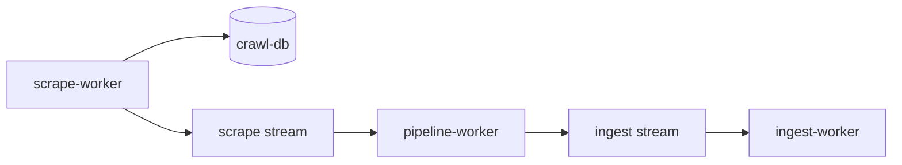

# Scrape factory slice 6: Vitess 5b + актуализация Veil master plan

## Контекст

| Срез | Статус |
|------|--------|
| [scrape_factory_dry](.cursor/plans/scrape_factory_dry_5ee3f1f0.plan.md) | done — DS, factory |
| [factory_slice_2](.cursor/plans/factory_slice_2_vuln_lola_8127b37e.plan.md) | done — vuln, lola |
| [factory_slice_3](.cursor/plans/factory_slice_3_ti_477684c7.plan.md) | done — TI → pipeline normalize |
| [factory_slice_4](.cursor/plans/factory_slice_4_appsec_9a2c1f3e.plan.md) | done — sbom, coderules, nuclei в `scrape-worker` |
| [factory_slice_5](.cursor/plans/factory_slice_5_vitess_c26de8fc.plan.md) | done — `FetchIfDue` + `Unchanged`, pilot ledger |
| **Срез 6 (этот)** | Vitess **5b** + refresh [veil_refactor.plan.md](.cursor/plans/veil_refactor.plan.md) |



**Veil фазы (фактическое состояние):**

| Фаза | Статус |
|------|--------|
| A — NATS + skeleton (`scrapev1`, `ingest/`, `pipeline-worker`) | **done** |
| B — factory, все 7 sources в `scrape-worker` | **done** |
| C — Vitess ledger | **partial** (pilot в срезе 5; 5b в срезе 6) |
| D — `ingest/graph` | **partial** ([`ingest/graph/worker`](ingest/graph/worker/) есть; `workeringest` ещё в `scrapers/`) |
| E — E2E + `gh release` v0.3.1 | **pending** (вне scope среза 6) |

---

## Часть A: обновить [veil_refactor.plan.md](.cursor/plans/veil_refactor.plan.md)

**Не трогать** execution-slice планы (`factory_slice_*`, `scrape_factory_dry`).

### Frontmatter

- **Удалить** блок `todos:` с устаревшими `pending` (ingest-skeleton, scraper-factory, …) — они дублируют тело и вводят в заблуждение.
- Оставить: `name`, `overview`, `isProject: false`.

### Новая секция «Прогресс factory / Veil» (после overview)

Таблица срезов 1–6 со ссылками на `.cursor/plans/factory_slice_*.plan.md` и одной строкой «текущий этап: **C (Vitess 5b)**».

### Обновить «Где остановились»

- E2E scrape: **ready for formal smoke** (compose profile полный: `scrape-worker` + `pipeline-worker` + `ingest-worker` + `crawl-db`).
- Убрать формулировки «отдельные producer-сервисы vuln/ti/sbom» — они удалены в срезе 2–4.
- Блокер v0.3.1 ZIP — оставить, но указать: factory + pipeline готовы; нужен полный scrape run перед export.

### Фазы A–E в теле плана

Пометить выполненные пункты (**done** / **partial**) inline, без отдельного YAML-todo list. Пример:

- A.1–A.4: done
- B.5–B.7: done (normalize TI в [ingest/pipeline-worker/internal/handle/ti.go](ingest/pipeline-worker/internal/handle/ti.go))
- C.8–C.9: partial → **5b закрывает C** для основных HTTP feeds
- D.10–D.11: partial (worker в `ingest/graph`; storage/workeringest — срез 7+)
- E: unchanged, **out of scope slice 6**

### Критерии готовности v0.3.1

Отметить галочками уже выполненное:

- [x] Два NATS-контура + normalize только в pipeline
- [~] Vitess ledger (после 5b → [x])
- [ ] Neo4j growth / new pack sha256 / release

---

## Часть B: Vitess 5b — оставшиеся фиды

Паттерн из среза 5 (без изменений контракта):

```go
res, err := feeds.FetchIfDue(ctx, fc, led, key, source, url, policy, cacheRel, buildReq)
if res.Unchanged { return nil } // skip Publish
```

Справочник ключей дополнить в [ingest/discovery/README.md](ingest/discovery/README.md).

### B.1 TI — остальные feeds ([scrapers/ti/internal/feeds/runner.go](scrapers/ti/internal/feeds/runner.go))

Уже на ledger: `ti:kev`, `ti:urlhaus:recent`.

Перевести с `getBytesCached` на `fetchLedger` (`PolicyDaily`), с `Unchanged` → skip publish:

| Feed | resource_key (предложение) | URL env |
|------|---------------------------|---------|
| `pt` | `ti:pt:rss` | `PT_RSS_URL` |
| `threatfox` export | `ti:threatfox:export` | export URL const |
| `threatfox` API | `ti:threatfox:api` | при `THREATFOX_AUTH_KEY` |
| `malwarebazaar` | `ti:malwarebazaar:recent` | API URL |
| `feodo` | `ti:feodo:blocklist` | `FEODO_BLOCKLIST_URL` |
| `openphish` | `ti:openphish:feed` | `OPENPHISH_FEED_URL` |

POST/API feeds: `buildReq` с method/body как сейчас; ledger key отдельный на режим export vs API.

### B.2 lola — LOLBAS / GTFOBins / LOFTS ([scrapers/lola/internal/usecase/scrape.go](scrapers/lola/internal/usecase/scrape.go), [lofts.go](scrapers/lola/internal/usecase/lofts.go))

MITRE STIX уже: `lola:mitre:enterprise-stix` (`PolicyStatic`).

- Прокинуть `deps.Feeds` / `deps.Ledger` (если ещё не везде) в `fetchBytes` → `FetchIfDue` с `PolicyPeriodic`.
- Keys: `lola:lolbas:tree`, `lola:gtfobins:tree`, per-file `lola:file:{path}` или reuse `gh:file:…` стиль.
- LOFTS URL: `lola:lofts:{host}` periodic.

### B.3 nuclei ([scrapers/nuclei/internal/usecase/runner.go](scrapers/nuclei/internal/usecase/runner.go))

- `scrapesource`: передать `deps.Feeds`, `deps.Ledger`.
- `NewRunner(..., fc, led)`.
- Per template file: `nuclei:file:{path}`, `PolicyPeriodic`; list-dir по year: `nuclei:list:http/cves/{year}` (optional, если list идёт через GitHub API).

### B.4 coderules — Semgrep / CodeQL ([scrapers/coderules/internal/usecase/runner.go](scrapers/coderules/internal/usecase/runner.go))

CWE zip уже: `coderules:cwe:mitre_zip` (`PolicyStatic`).

- Semgrep/CodeQL GitHub paths: `gh:file:semgrep:…` / `gh:file:codeql:…`, `PolicyPeriodic`.
- При `Unchanged` на `.yml`/`.ql` — skip `Publish`.

### B.5 vuln — GHSA / Vulners (если в Run)

Проверить [scrapers/vuln/internal/usecase](scrapers/vuln/internal/usecase): опционально ledger на крупные blob URL (Vulners page), не блокер 5b.

### B.6 Тесты

- Расширить [ingest/scrape/feeds/fetch_test.go](ingest/scrape/feeds/fetch_test.go) при новых edge cases (POST skip unchanged).
- Один TI test: mock publisher + `Unchanged` → `Upsert*` не вызывается (table-driven).
- `go test` по затронутым модулям + `ingest/scrape/cmd` build.

### B.7 Документация (кроме veil_refactor)

- [ingest/discovery/README.md](ingest/discovery/README.md) — полная таблица resource_key.
- [scrapers/README.md](scrapers/README.md) — одна строка «ledger: все публичные HTTP feeds через `FetchIfDue`».

---

## Smoke (без release)

```bash
docker compose --profile scrape up --build -d crawl-db scrape-worker pipeline-worker ingest-worker nats neo4j
# 1-й прогон: crawl_resource заполняется (ti:*, nuclei:*, …)
docker compose restart scrape-worker
# 2-й прогон: логи "unchanged" / "skip publish" на KEV, ThreatFox, nuclei paths
```

SQL: `SELECT source, COUNT(*) FROM crawl_resource GROUP BY source;`

**Не делаем:** `gh release`, export pack, `DEFAULT_PACK_URL`.

---

## Вне scope среза 6

| Тема | Следующий срез |
|------|----------------|
| E2E формальный + export + release | Veil E (срез 7?) |
| `ingest/graph` storage move | Veil D |
| Cleanup legacy `docker/*.Dockerfile` per-scraper | Cleanup PR |
| Параллельный `factory.RunAll` | optional |
| `factory.Source.Policy()` enforcement в registry | optional |

---

## Критерии готовности среза 6

- [ ] [veil_refactor.plan.md](.cursor/plans/veil_refactor.plan.md) актуализирован: нет stale YAML todos; фазы A–C отражают срезы 1–5/6
- [ ] TI feeds (кроме JSONL) на `FetchIfDue` + daily keys
- [ ] nuclei + coderules semgrep/codeql + lola file fetches на ledger
- [ ] Документация resource_key обновлена
- [ ] `go test` зелёный; smoke crawl-db ×2 без release

---

## Порядок коммитов

1. `veil_refactor.plan.md` — refresh прогресса (можно отдельным коммитом в начале)
2. TI remaining feeds → `fetchLedger`
3. lola + nuclei + coderules semgrep/codeql
4. README + tests
5. Smoke notes (без release)
