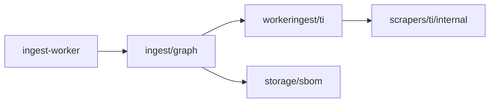

# Scrape factory slice 7: ingest/graph (Veil D)

## Контекст

| Срез | Статус |
|------|--------|
| [scrape_factory_dry](scrape_factory_dry_5ee3f1f0.plan.md) | done |
| [factory_slice_2](factory_slice_2_vuln_lola_8127b37e.plan.md) – [6](factory_slice_6_vitess_5b_99ccc1ee.plan.md) | done |
| **Срез 7 (этот)** | Veil **D** — `ingest/graph` consolidation |

**Veil фазы:** A–C done; **D in progress** (этот срез); E (v0.3.2 release) — [срез 8 в veil_refactor](veil_refactor.plan.md).

[`ingest/graph/worker`](../../ingest/graph/worker/) существует, но импортировал `scrapers/*/workeringest` и `scrapers/*/storage/neo4j`. Цель: канонические пути под `ingest/graph/`.

---

## Scope

### In scope

1. **Перенос** (без изменения MERGE-семантики):
   - `scrapers/{ti,vuln,lola,ds}/workeringest` → [`ingest/graph/workeringest/`](../../ingest/graph/workeringest/)
   - `scrapers/{sbom,coderules,nuclei}/storage/neo4j` → [`ingest/graph/storage/`](../../ingest/graph/storage/)
2. Модуль [`ingest/graph/go.mod`](../../ingest/graph/go.mod); worker → `require ingest/graph`.
3. **Re-export** в `scrapers/*` (deprecated, 1 release cycle).
4. Документация: [`ingest/graph/README.md`](../../ingest/graph/README.md), [`docs/ingest-contract.md`](../../docs/ingest-contract.md).

### Out of scope (срез 8)

- E2E formal smoke, export, `gh release v0.3.2-graph-pack`
- Vitess / scrape / pipeline
- Удаление legacy per-scraper Dockerfiles

---

## Критерии готовности

- [x] `ingest/graph/worker` импортирует только `ingest/graph/...`
- [x] `go build ./ingest/graph/worker/...` зелёный (через `go.work`)
- [x] Re-export в scrapers (`storage/neo4j/forward.go`) компилируется
- [x] Master plan: срез 7 done, фаза D done

**Примечание:** физический перенос `workeringest` в `ingest/graph/workeringest/` невозможен без выноса `scrapers/*/internal/*` в публичные пакеты (правило Go `internal`). Вместо этого — [`ingest/graph/legacy/`](../ingest/graph/legacy/) facade.

---

## Порядок коммитов

1. `ingest/graph/` move + `go.mod`
2. Worker imports
3. Scrapers re-export (delete old impl)
4. Docs + `go test` / `go build`
