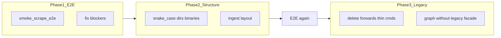

# Scrape factory slice 8 v2: E2E + структура + legacy cleanup (без релиза)

## Контекст

| Срез | Статус |
|------|--------|
| 1–7 | **done** (factory, 7 sources, Vitess, graph storage + legacy facade) |
| **8 v1** | [factory_slice_8_e2e](factory_slice_8_e2e_d1352ee7.plan.md) — **бракован** (release) |
| **8 v2 (этот)** | **next** — закончить Veil refactor |

**Veil фаза E** = пайплайн **работает end-to-end**, каталоги **`ingest/`** отражают три контекста, имена **snake_case**, legacy **удалён**.  
**Релиз graph-pack / `gh release` / v0.3.2 ZIP — вне scope** (отдельное решение пользователя, не блокер refactor).



---

## Целевая структура (из [veil_refactor](veil_refactor.plan.md))

```text
ingest/
  scrape/
    scrape_worker/          # был ingest/scrape/cmd
    factory/
    feeds/
    ledger/
  pipeline/
    pipeline_worker/          # был ingest/pipeline-worker
  knowledge/
    ingest_worker/            # был ingest/graph/worker
    storage/                  # sbom, coderules, nuclei (+ ti/vuln/lola/ds когда promote)
    workeringest/             # цель: без legacy/
pkg/
  scrapev1/
  ingestv1/
scrapers/                     # только fetch + scrapev1 publish (scrapesource)
  {ti,vuln,...}/scrapesource/
api/  mcp/  knowledge/
```

**Именование (единый стиль):**

| Было | Стало |
|------|--------|
| бинарь / Dockerfile `scrape-worker` | `scrape_worker` |
| `pipeline-worker` | `pipeline_worker` |
| `ingest-worker` | `ingest_worker` |
| compose service | `scrape_worker`, `pipeline_worker`, `ingest_worker` (или alias с `profiles`; синхронно с бинарями) |
| Go module `ingest-worker` | `ingest_worker` или `github.com/.../ingest/knowledge/ingest_worker` |

`go.work`, [docker-compose.yml](../../docker-compose.yml), [docker/*.Dockerfile](../../docker/), CI — обновить **в одном PR** среза 8 v2 (риск из master plan).

---

## Phase 1 — E2E (сначала, на текущих именах)

Сервисы profile `scrape`: `crawl-db`, `nats`, `scrape-worker`, `pipeline-worker`, `ingest-worker`, `neo4j`.

**Прогон 1 — полный путь:**

```bash
docker compose --profile scrape up --build -d crawl-db nats neo4j scrape-worker pipeline-worker ingest-worker
```

Проверки (зафиксировать в `scripts/smoke_scrape_e2e.sh`):

1. JetStream: lag `SCRAPE` и `INGEST` → 0
2. MySQL: `SELECT source, COUNT(*) FROM crawl_resource GROUP BY source;`
3. Cypher: counts по `Vulnerability`, `IOC`, `Package`, `NucleiTemplate`, `SigmaRule`, …
4. `curl` API `/health`, `/v1/categories` (если api в compose)
5. Логи pipeline: TI normalize, AppSec parse — без panic

**Прогон 2 — ledger:**

```bash
docker compose restart scrape-worker
```

Ожидание: `unchanged` / `skip publish` на KEV, ThreatFox, nuclei paths.

**E2E env (не release):** поднять `NVD_MAX_PAGES`, `GITHUB_TOKEN` для стабильного smoke — в [docs/architecture/threatintel-runtime.md](../../docs/architecture/threatintel-runtime.md) как «E2E profile», без export/release.

**Исправлять блокеры** до Phase 2 (не переименовывать сломанный стек).

---

## Phase 2 — Структура + snake_case

1. Переименовать каталоги:
   - `ingest/scrape/cmd` → `ingest/scrape/scrape_worker`
   - `ingest/pipeline-worker` → `ingest/pipeline/pipeline_worker`
   - `ingest/graph/worker` → `ingest/knowledge/ingest_worker`
2. Dockerfiles: `docker/scrape_worker.Dockerfile`, `pipeline_worker.Dockerfile`, `ingest_worker.Dockerfile`
3. `docker-compose.yml`: service names + build dockerfile paths + `ENTRYPOINT` бинарии
4. `go.work` paths
5. Документация: [ingest/README.md](../../ingest/README.md), [ingest/discovery/README.md](../../ingest/discovery/README.md), [scrapers/README.md](../../scrapers/README.md)

**Не трогать** пока: перенос `scrapers/*/internal` в `ingest/` (только пути worker/cmd).

**Повторить smoke** после rename (Phase 1 script с новыми именами сервисов).

---

## Phase 3 — Завершить graph (убрать «половинчатость» среза 7)

Срез 7 оставил [`ingest/graph/legacy/`](../../ingest/graph/legacy/) из‑за Go `internal`.

**Цель 8 v2:** `ingest_worker` импортирует только `ingest/graph/storage/*` и `ingest/graph/workeringest/*` — **без** `legacy/`.

Варианты (выбрать при исполнении, предпочтение A):

| | Подход |
|---|--------|
| A | Promote graph writers: `scrapers/ti/internal/storage/neo4j` → `scrapers/ti/graph/neo4j` (public); перенести handlers в `ingest/graph/workeringest/ti` |
| B | Оставить реализацию в `scrapers/*/workeringest`, но удалить `legacy/` — worker импортирует scrapers напрямую (**откат критерия среза 7**) — **нежелательно** |

После A: удалить `storage/neo4j/forward.go` в scrapers (уже есть для AppSec).

---

## Phase 4 — Удалить legacy (только после зелёного E2E ×2)

| Артефакт | Действие |
|----------|----------|
| `scrapers/*/storage/neo4j/forward.go` | удалить (канон в `ingest/graph/storage`) |
| `ingest/graph/legacy/*` | удалить после workeringest promote |
| `scrapers/ingest-worker/` (если ещё есть) | удалить |
| Per-scraper `docker/*-scraper.Dockerfile`, thin `scrapers/*/cmd` только для local | удалить или README «deprecated» |
| [scrapers/vuln/internal/storage/mongo](scrapers/vuln/internal/storage/mongo) | удалить |
| Дубли `internal/scrapepub` без `NewFromRaw` | свести к `scrapers/scrapepub` |
| `getBytesCached` мёртвый в TI (если не используется) | удалить |

**Не удалять:** `scrapers/*/scrapesource`, domain `internal/usecase`, `pipeline-worker` handlers.

---

## Вне scope 8 v2

| Тема | Когда |
|------|--------|
| `gh release`, graph-pack v0.3.2, `DEFAULT_PACK_URL` | **Не делаем** (явное решение) |
| `export-graph-cypher` как gate | опционально локально, не критерий готовности |
| `ingest/scrape/sources/` вместо `scrapers/*/scrapesource` | срез 9+ |
| `proxypool` DRY | срез 9+ |
| Deploy LB / production | ops, не refactor |

---

## Критерии готовности среза 8 v2

- [ ] `scripts/smoke_scrape_e2e.sh` проходит 2× (до и после rename)
- [ ] Compose profile `scrape`: все 7 sources → Neo4j nodes растут vs пустой граф
- [ ] Каталоги `ingest/scrape/scrape_worker`, `ingest/pipeline/pipeline_worker`, `ingest/knowledge/ingest_worker`
- [ ] Бинарии и Dockerfiles: `scrape_worker`, `pipeline_worker`, `ingest_worker`
- [ ] Нет `ingest/graph/legacy/`; нет `forward.go` в scrapers AppSec storage
- [ ] `go test` / `go build` зелёные; `go.work` актуален
- [ ] [veil_refactor.plan.md](veil_refactor.plan.md): фаза E **done**, срез 8 v2 **done**

---

## Порядок коммитов

1. `smoke_scrape_e2e.sh` + фиксы E2E blockers
2. Rename dirs + docker + compose + go.work
3. smoke снова
4. graph workeringest promote + drop legacy/
5. legacy deletion sweep + docs
