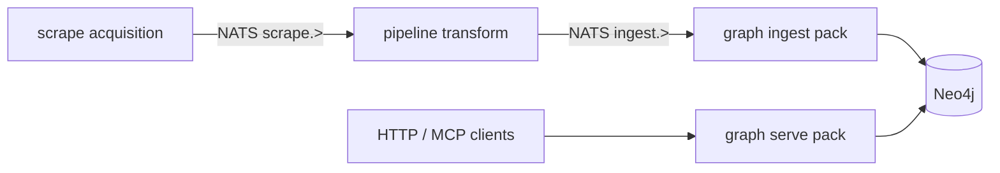
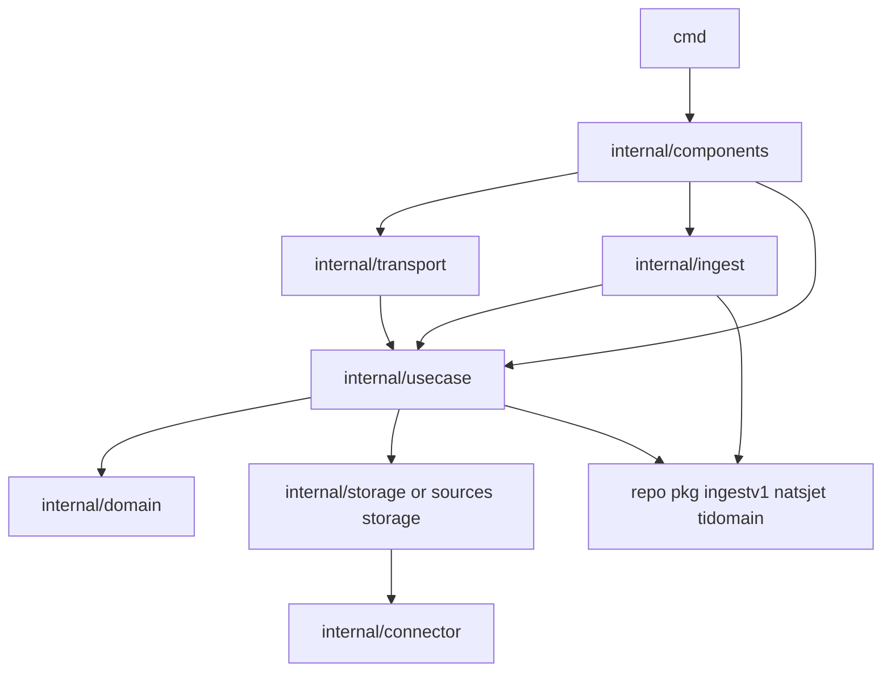

# Graph layer — структура, именование, два модуля

## Как называть слой (ответ на «graph или interaction?»)

В Veil три **runtime-слоя** по потоку данных:



| Название | Что это | Не путать с |
|----------|---------|-------------|
| **graph/** (оставляем) | Зона Neo4j: запись из `ingest.>` + чтение через API/MCP | «Graph DB» как продукт |
| **ingest pack** | Inbound-адаптер: JetStream consumer → MERGE | Слоем pipeline (тот только публикует `ingestv1`) |
| **serve pack** | Inbound-адаптер: HTTP/MCP → read-only Cypher | Ingest worker |

**Межслойное взаимодействие** — только NATS + [`pkg/ingestv1`](pkg/ingestv1). Код `graph/` не импортирует `discovery/` или `pipeline/`.

`ingest_worker` — это **порт/адаптер** (hexagonal: driving adapter с bus), не отдельный «бизнес-слой». Оркестрация MERGE — `internal/usecase`; Cypher — `internal/.../storage`.

---

## Go layering (best practice + ваш кодстайл)

Официальная модель ([go.dev/doc/modules/layout](https://go.dev/doc/modules/layout)): **`cmd/`** — `main`, **`internal/`** — приватно модулю, **`pkg/`** (repo root) — общее между слоями.

**Направление зависимостей (стрелки = «импортирует»):**



Правила (как в [`docs/coding-style.md`](docs/coding-style.md)):

- `domain` — без Bolt, NATS, HTTP
- `usecase` — без subject strings / Cypher
- `cmd` — только wiring: env, `components.Init`, signal, `errgroup`
- `connector` — тонкая обёртка Bolt / JetStream ([`pkg/natsjet`](pkg/natsjet) для stream ensure)

**Не** `internal → cmd`. **Не** `domain → storage`.

---

## Целевая структура (2 модуля + shared connector)

Сейчас ~15 модулей в [`graph/go.work`](graph/go.work). Цель — **3 модуля**:

```
graph/
  go.work                          # use: ./ingest ./serve ./connector
  connector/                       # shared Neo4j client + query (ex neo4jclient)
    go.mod
    neo4j/
    query/
  ingest/                          # write path (NATS → MERGE)
    go.mod
    cmd/ingest_worker/main.go
    internal/
      config/
      components/                  # DI: stores + domain appliers
      connector/nats/              # ex internal/natsensure
      ingest/                    # pull loop, route by source (ex cmd/main bulk)
      ingestkit/                 # ex internal/ingestkit
      sources/
        ti/   {domain,usecase,storage,envelope}
        vuln/ lola/ ds/
      appsec/
        sbom/ coderules/ nuclei/   # ex graph/storage/*
  serve/                           # read path (api + mcp)
    go.mod
    cmd/api/main.go
    cmd/mcp/main.go
    internal/
      config/
      components/
      connector/neo4j/             # uses graph/connector
      usecase/
      domain/
      transport/httpserver/        # ex api/internal/transport
      transport/mcpserver/         # ex mcp/internal/transport
```

[`graph/api`](graph/api/) уже близок к эталону (`cmd` + `internal/components` + `usecase` + `transport`) — переносим в `serve/` с сохранением пакетов.

[`graph/ingest_worker/cmd/main.go`](graph/ingest_worker/cmd/main.go) (~345 строк) — разбить: `cmd` тонкий, логика в `internal/ingest` + `internal/components`.

---

## Что не делаем в этом рефакторинге

- Переименование `graph/` → другое (вы выбрали **keep graph**)
- AppSec symmetry (`sources/` vs `storage/`) — только переезд в `ingest/internal/appsec/`
- Объединение ingest + serve в **один** `go.mod` (вы разделили: serve = api+mcp, ingest = worker)
- Изменения `deploy/discovery`, `pipeline/`, repo `pkg/*` (кроме import path при необходимости)

---

## Стратегия малого diff

- Один todo = один коммит: перенос каталога + `go mod` + правка import path + `go build` одного бинарника
- Сначала создать новые пути с **re-export / type alias**, потом переключить импорты, потом удалить старые каталоги
- После каждого шага: `go build` затронутого `cmd`

---

## Фаза 0 — документация и семантика

| ID | Действие |
|----|----------|
| `doc-graph-semantics` | В [`docs/coding-style.md`](docs/coding-style.md): секция Graph = ingest pack + serve pack + connector; диаграмма зависимостей |
| `doc-graph-readme` | Обновить [`graph/README.md`](graph/README.md): дерево `ingest/`, `serve/`, `connector/` |
| `doc-runtime-paths` | Проверить [`docs/threatintel-runtime.md`](docs/threatintel-runtime.md) — пути бинарей без изменения имён сервисов compose |

---

## Фаза 1 — `graph/connector` (ex neo4jclient)

| ID | Действие |
|----|----------|
| `connector-init` | Создать [`graph/connector/go.mod`](graph/connector/go.mod); перенести [`graph/neo4jclient/neo4j`](graph/neo4jclient/neo4j), [`graph/neo4jclient/query`](graph/neo4jclient/query) |
| `connector-imports-ingest` | Временные re-export в `graph/neo4jclient` → forward import (опционально, 1 коммит) |
| `connector-imports-sources` | Переключить `graph/sources/*/storage` на `graph/connector/neo4j` |
| `connector-imports-appsec` | Переключить `graph/storage/*` |
| `connector-imports-api` | Переключить `graph/api/internal/storage` |
| `connector-imports-mcp` | Переключить `graph/mcp/internal/connector/neo4jconn` → общий connector или thin wrapper |
| `connector-rm-neo4jclient` | Удалить [`graph/neo4jclient/`](graph/neo4jclient/) |
| `connector-test` | `go test ./...` в connector |

---

## Фаза 2 — `graph/ingest` модуль (write path)

| ID | Действие |
|----|----------|
| `ingest-mod-init` | `graph/ingest/go.mod`; `cmd/ingest_worker/` скелет |
| `ingest-move-natsensure` | `graph/internal/natsensure` → `graph/ingest/internal/connector/nats` |
| `ingest-move-ingestkit` | `graph/internal/ingestkit` → `graph/ingest/internal/ingestkit` |
| `ingest-move-source-ti` | `graph/sources/ti` → `graph/ingest/internal/sources/ti` (domain, usecase, storage, ingest→`envelope.go`) |
| `ingest-move-source-vuln` | vuln |
| `ingest-move-source-lola` | lola |
| `ingest-move-source-ds` | ds |
| `ingest-move-appsec-sbom` | `graph/storage/sbom` → `graph/ingest/internal/appsec/sbom` |
| `ingest-move-appsec-coderules` | coderules |
| `ingest-move-appsec-nuclei` | nuclei |
| `ingest-extract-components` | Вынести DI из main в `internal/components` (stores, appliers, close) |
| `ingest-extract-loop` | Pull loop + routing → `internal/ingest/consumer.go` |
| `ingest-cmd-thin` | `cmd/ingest_worker/main.go` только signal + `components.Run` |
| `ingest-rm-old-worker` | Удалить `graph/ingest_worker/` |
| `ingest-rm-old-sources` | Удалить `graph/sources/` |
| `ingest-rm-old-storage` | Удалить `graph/storage/` |
| `ingest-build` | `go build ./graph/ingest/cmd/ingest_worker` |

---

## Фаза 3 — `graph/serve` модуль (read path)

| ID | Действие |
|----|----------|
| `serve-mod-init` | `graph/serve/go.mod` |
| `serve-move-api-cmd` | `graph/api/cmd` → `graph/serve/cmd/api` |
| `serve-move-api-internal` | `graph/api/internal/*` → `graph/serve/internal/` (config, components, usecase, domain, transport/httpserver) |
| `serve-move-mcp-cmd` | `graph/mcp/cmd` → `graph/serve/cmd/mcp` |
| `serve-move-mcp-internal` | mcp transport → `internal/transport/mcpserver`; убрать дубль neo4j conn → `graph/connector` |
| `serve-dry-query` | `usecase` использует `connector/query` напрямую; убрать лишний слой в api storage если дублирует connector |
| `serve-rm-old-api` | Удалить `graph/api/` |
| `serve-rm-old-mcp` | Удалить `graph/mcp/` |
| `serve-build-api` | `go build ./graph/serve/cmd/api` |
| `serve-build-mcp` | `go build ./graph/serve/cmd/mcp` |

---

## Фаза 4 — go.work, Makefile, deploy

| ID | Действие |
|----|----------|
| `graph-work-rewrite` | [`graph/go.work`](graph/go.work): только `connector`, `ingest`, `serve` |
| `makefile-test-graph` | [`Makefile`](Makefile) `test-graph`: build ingest_worker + api + mcp из новых путей |
| `docker-ingest-dockerfile` | [`deploy/graph/docker/ingest_worker.Dockerfile`](deploy/graph/docker/ingest_worker.Dockerfile): `WORKDIR graph/ingest` |
| `docker-api-dockerfile` | [`deploy/graph/docker/api.Dockerfile`](deploy/graph/docker/api.Dockerfile): `WORKDIR graph/serve`, `cmd/api` |
| `docker-mcp-if-any` | MCP Dockerfile/compose service если есть |
| `compose-smoke` | `make test-graph` зелёный |

---

## Фаза 5 — выравнивание domain/usecase (кодстайл)

| ID | Действие |
|----|----------|
| `ingest-ti-envelope-package` | `ingest/apply.go` → `envelope.go` или `internal/sources/ti/envelope`; `setup.go` рядом |
| `ingest-domain-pkg-tidomain` | Убрать лишние alias-обёртки в graph TI domain где можно импортировать `pkg/tidomain` из usecase только |
| `ingest-pr-checklist` | Пройти PR checklist из coding-style: cmd без Cypher, usecase без NATS subjects |
| `serve-pr-checklist` | serve: cmd без Cypher; transport без Bolt driver |

---

## Критерии готовности

- `graph/go.work` — 3 модуля (`connector`, `ingest`, `serve`)
- Нет `graph/sources/`, `graph/storage/`, `graph/ingest_worker/`, `graph/api/`, `graph/mcp/`, `graph/neo4jclient/` на верхнем уровне
- `ingest_worker` / `api` / `mcp` собираются из `graph/ingest` и `graph/serve`
- Import paths: только `graph/ingest/...`, `graph/serve/...`, `graph/connector/...`, repo `pkg/*`
- `make test-graph` зелёный

## Риски

| Риск | Митигация |
|------|-----------|
| Mass import path churn | По одному source/бинарнику за коммит |
| Docker GOWORK paths | Обновить deploy в той же фазе 4 |
| MCP/API shared code | Один модуль `serve` — общий `internal/config` для Neo4j env |
