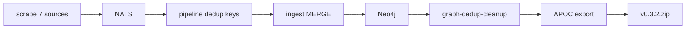

# Graph pack v0.3.2 — быстрый богатый прогон (~25 мин)

## Цель

- **Не** крутить полный NVD (часы) — только базовая выборка CVE.
- Уложиться в **~25 минут** wall-clock на scrape + ingest.
- Получить **больше узлов/связей**, чем в pack **v0.3.0–v0.3.1** (те релизы строились на seed/smoke или частичном crawl).
- **Дубликаты:** idempotency в pipeline, MERGE в ingest, опционально [`scripts/graph-dedup-cleanup.sh`](scripts/graph-dedup-cleanup.sh) перед экспортом.



---

## Профиль env «fast-rich» (~25 мин)

Добавить обёртку [`scripts/graph-pack-run-v032.sh`](scripts/graph-pack-run-v032.sh) (новый файл) с фиксированным профилем — не полагаться на smoke defaults в shell.

| Переменная | Значение | Зачем |
|------------|----------|--------|
| `GRAPH_PACK_SKIP` | `1` | чистая Neo4j без v0.3.1 seed |
| `SCRAPE_SOURCES` | `ds,vuln,lola,ti,sbom,coderules,nuclei` | все 7 |
| `NVD_MAX_PAGES` | **`1`** | ~2000 CVE, не полный feed |
| `VULN_METASPLOIT_MAX_RB` | **`0`** | MSF tree/raw слишком долго |
| `VULN_EXPLOITDB_MAX_ROWS` | `5000` | один CSV, быстро |
| `DS_MAX_ATOMIC` | **`0`** | zip 161MB убьёт бюджет |
| `DS_MAX_SIGMA` | `120` | богаче smoke, укладывается в codeload |
| `DS_MAX_YARA` | `80` | то же |
| `DS_MAX_CALDERA` | `40` | выборочно |
| `SBOM_SOURCES` | `osv,ghsa` | GHSA через codeload/tree |
| `SBOM_MAX_CVES` | `80` | OSV по seed list |
| `SBOM_MAX_GHSA` | `50` | advisory paths |
| `CODERULES_MAX_SEMGREP` | `40` | |
| `CODERULES_MAX_CODEQL` | `30` | |
| `NUCLEI_MAX` | `60` | |
| `LOLA_MITRE_MAX_TECHNIQUES` | `2000` | STIX без полного enterprise dump |
| `SCRAPE_FORCE_REFETCH` | `1` | свежий crawl после `down -v` |

**Не задавать** smoke-лимиты (`DS_MAX_*=5`, `NVD` unset из smoke script).

Ожидаемый вклад в «больше чем 0.3.x»:

- **TI:** KEV + ThreatFox + MalwareBazaar + JSONL (раньше в pack часто только seed IOC).
- **ds:** десятки–сотни Sigma/YARA (раньше ~10 sigma в smoke Neo4j).
- **sbom:** OSV + GHSA packages/advisories.
- **lola / coderules / nuclei:** сотни сущностей detection/appsec.
- **vuln:** 2k CVE + exploit refs (без полного NVD catalog).

---

## Фаза 1 — Прогон

```bash
cd /home/bbv/Desktop/threat_intelligence
docker compose -f deploy/discovery/compose.yml -f deploy/pipeline/compose.yml -f deploy/graph/compose.yml down -v --remove-orphans

./scripts/graph-pack-run-v032.sh   # новый: export env + compose-up-full
```

Мониторинг до `scrape_worker` **Exited (0)**:

```bash
docker compose -f deploy/discovery/compose.yml -f deploy/pipeline/compose.yml -f deploy/graph/compose.yml logs -f scrape_worker
```

После scrape — ingest drain (~3–8 мин при профиле выше):

```bash
sleep 180
docker compose ... exec -T neo4j cypher-shell -u neo4j -p neo4jpassword \
  "MATCH (n) RETURN labels(n)[0] AS label, count(*) AS c ORDER BY c DESC LIMIT 25;"
```

Сравнение с v0.3.1 (опционально, до перезаписи):

```bash
# поднять только graph с testpack 0.3.1, снять counts, затем снова clean run
```

---

## Фаза 2 — Дедуп в графе (перед экспортом)

```bash
./scripts/graph-dedup-cleanup.sh --dry-run
./scripts/graph-dedup-cleanup.sh
```

Убирает параллельные `HAS_ADVISORY`; isolated IOC cleanup по умолчанию off.

Pipeline/ingest уже дедуплируют по `ingestv1.idempotency_key` ([`pipeline/pub/publish.go`](pipeline/pub/publish.go), MERGE в [`graph/sources/*/ingest`](graph/sources/ti/ingest/)).

---

## Фаза 3 — Экспорт и ZIP v0.3.2

```bash
./scripts/export-graph-cypher.sh
GRAPH_PACK_VERSION=v0.3.2 ./scripts/build-graph-pack.sh
du -h data/neo4j_user_export/graph.cypher data/neo4j_user_export/releases/threat-intel-graph-v0.3.2.zip
```

Проверка sha256 — как в unlimited-плане.

---

## Фаза 4 — Release и конфиги

1. `gh release create v0.3.2-graph-pack ...`
2. [`deploy/graph/docker/graph-bootstrap.sh`](deploy/graph/docker/graph-bootstrap.sh) → URL v0.3.2
3. [`docker-compose.testpack.yml`](docker-compose.testpack.yml) → `threat-intel-graph-v0.3.2.zip`
4. [`docs/threatintel-runtime.md`](docs/threatintel-runtime.md) — секция «fast-rich profile» + v0.3.2

---

## Фаза 5 — Проверка импорта

Чистая Neo4j + testpack v0.3.2; `curl` `/health`, `/v1/categories`, spot-check counts vs post-export DB.

---

## Критерии готовности

- [ ] `graph-pack-run-v032.sh` + прогон уложился в ~25–35 мин (scrape exit 0)
- [ ] Neo4j counts выше типичного smoke и выше импорта v0.3.1-only seed по ключевым labels
- [ ] `graph-dedup-cleanup` выполнен
- [ ] `threat-intel-graph-v0.3.2.zip` + gh release + bootstrap URL
- [ ] testpack import OK
