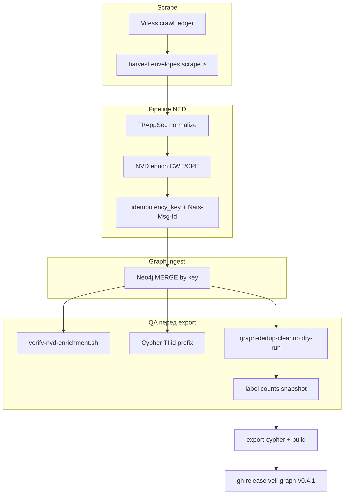

# Сборка graph pack v0.4.1 с проверкой NED

## Контекст

Текущая версия: [`versions.env`](versions.env) → `GRAPH_PACK_VERSION=v0.4.0`. Ingest-код на `main` не менялся с последнего релиза — **bump обязателен только для артефакта** (v0.4.1), не для `check-graph-version` (нет правок в `discovery/`, `pipeline/`, `graph/ingest/`, `pkg/`).

Вы выбрали: **v0.4.1** + **публикация на GitHub**.

## Архитектура пайплайна (что именно проверяем)



| Слой | Нормализация | Enrichment | Дедуп |
|------|--------------|------------|-------|
| **Scrape** | локально только (напр. CVE case) | сырой NVD JSON → `KindVulnNVDPage` | crawl ledger + `content_key` |
| **Pipeline NED** | [`pipeline/pkg/ti/normalize`](pipeline/pkg/ti/normalize), NVD в [`pipeline/ned/.../vuln/enrich`](pipeline/ned/internal/sources/vuln/enrich/nvd.go) | CWE/CPE на vuln upserts | [`pipeline/ned/internal/dedup`](pipeline/ned/internal/dedup) |
| **Graph ingest** | **не** re-normalize ([`docs/ingest-contract.md`](docs/ingest-contract.md)) | MERGE `HAS_CWE`, `AFFECTS`→`CPE` | MERGE по `idempotency_key` |
| **Housekeeping** | — | — | [`scripts/housekeeping/graph-dedup-cleanup.sh`](scripts/housekeeping/graph-dedup-cleanup.sh) — параллельные rels в Neo4j |

Профиль crawl: [`deploy/profiles/fast-rich.env`](deploy/profiles/fast-rich.env) — 7 источников, `NVD_MAX_PAGES=1` (~2k CVE), `GRAPH_PACK_SKIP=1` (чистая Neo4j без скачивания старого pack).

---

## Фаза 0 — Pre-flight (~5 мин)

Из корня репозитория:

```bash
# Юнит-тесты NED (нормализация TI + idempotency keys)
make test-pipeline

# Свободные порты 7687/7474/4222/3306; Docker с достаточным RAM для Neo4j
docker compose -f deploy/discovery/compose.yml -f deploy/pipeline/compose.yml -f deploy/graph/compose.yml ps
```

Опционально: `make test-scrape test-graph` если давно не гонялись.

---

## Фаза 1 — Bump версии

```bash
./scripts/release/bump-graph-version.sh patch   # v0.4.0 → v0.4.1 в versions.env + docker-compose.testpack.yml
make check-graph-version   # должен пройти (или N/A если нет ingest diff vs base)
```

Обновить путь в [`docker-compose.testpack.yml`](docker-compose.testpack.yml): `veil-graph-v0.4.1.zip`.

---

## Фаза 2 — Полный прогон fast-rich (~25–35 мин)

```bash
./scripts/graph-pack/profile-fast-rich.sh
```

Скрипт делает `compose down -v`, поднимает полный стек через [`scripts/ops/compose-up-full.sh`](scripts/ops/compose-up-full.sh) (`scrape_worker`, `pipeline_worker`, `ingest_worker`, Neo4j).

**Мониторинг завершения scrape:**

```bash
# в отдельном терминале
docker compose -f deploy/discovery/compose.yml -f deploy/pipeline/compose.yml -f deploy/graph/compose.yml \
  ps -a scrape_worker
docker compose ... logs -f scrape_worker
```

Критерий: `scrape_worker` → **Exited (0)** (как в [`scripts/test/smoke-scrape-e2e.sh`](scripts/test/smoke-scrape-e2e.sh)).

**Drain pipeline/ingest** после scrape (~3–8 мин):

```bash
sleep 180   # при необходимости повторить, пока counts стабилизируются
```

Проверить, что workers живы:

```bash
docker compose ... ps pipeline_worker ingest_worker neo4j
```

---

## Фаза 3 — Верификация enrichment / normalize / dedup

### 3.1 Enrichment (NVD → CWE/CPE)

```bash
./scripts/test/verify-nvd-enrichment.sh
```

Ожидание при `NVD_MAX_PAGES=1`: **ненулевые** `has_cwe`, `affects`, `cpe_nodes`. Ноль по всем трём — enrichment не отработал (проверить логи `pipeline_worker`, NATS subject `ingest.>`).

Дополнительно (из [`README.md`](README.md)):

```cypher
MATCH (v:Vulnerability)-[:HAS_CWE]->() RETURN count(*) AS has_cwe;
MATCH (v:Vulnerability)-[:AFFECTS]->(:CPE) RETURN count(*) AS affects;
```

### 3.2 Нормализация (pipeline → graph, не в ingest)

Проверка, что IOC в Neo4j используют канонические id из NED (`ti:ioc:…`):

```cypher
// Должно быть 0: graph не должен иметь IOC без префикса ti:ioc:
MATCH (i:IOC) WHERE NOT i.id STARTS WITH 'ti:ioc:' RETURN count(i) AS bad_ids;

// Выборочно: value в lower/canonical (URL)
MATCH (i:IOC) WHERE i.type = 'url' AND i.value CONTAINS 'HTTPS' RETURN i.id LIMIT 5;
// ожидание: 0 строк с HTTPS в value
```

Контракт: graph ingest **не** импортирует `pipeline/pkg/ti/normalize` — если `bad_ids > 0`, проблема в pipeline или старых данных, не в export.

Юнит-гарантия: [`pipeline/ned/internal/sources/ti/transform_test.go`](pipeline/ned/internal/sources/ti/transform_test.go) (`HTTPS://Evil.COM` → `https://evil.com/path` + `ti:ioc:` key).

### 3.3 Дедупликация

**В графе (перед export):**

```bash
./scripts/housekeeping/graph-dedup-cleanup.sh --dry-run
./scripts/housekeeping/graph-dedup-cleanup.sh
```

`dupGroups` для `HAS_ADVISORY` → **0** (или исправлено вторым прогоном).

**Scrape ledger** (опционально, отдельный короткий smoke): `./scripts/test/smoke-scrape-e2e.sh --restart-scrape` на smoke-профиле — не обязателен для fast-rich pack, но подтверждает `unchanged|skip publish` на pass 2.

**Pipeline/ingest** — косвенно: стабильные counts при повторном `cypher-shell`; отсутствие взрыва дубликатов одного label.

### 3.4 Общий snapshot (для release notes)

```cypher
MATCH (n) RETURN labels(n)[0] AS label, count(*) AS c ORDER BY c DESC LIMIT 25;
MATCH (n:Vulnerability) RETURN count(n) AS vulnerabilities;
MATCH (n:IOC) RETURN count(n) AS iocs;
```

Сохранить вывод для [`docs/templates/graph-pack-release-notes.md`](docs/templates/graph-pack-release-notes.md).

**Gate:** все проверки 3.1–3.3 зелёные → идём на export. Иначе — логи workers, не публикуем.

---

## Фаза 4 — Export и ZIP

```bash
./scripts/graph-pack/export-cypher.sh
GRAPH_PACK_VERSION=v0.4.1 ./scripts/graph-pack/build.sh
du -h data/neo4j_user_export/graph.cypher data/neo4j_user_export/releases/veil-graph-v0.4.1.zip
```

Артефакт: `data/neo4j_user_export/releases/veil-graph-v0.4.1.zip` + `manifest.v0.4.1.json`.

---

## Фаза 5 — Публикация GitHub

```bash
GRAPH_PACK_VERSION=v0.4.1 ./scripts/release/publish-graph-pack.sh --skip-build
```

Скрипт создаёт release **`veil-graph-v0.4.1`** ([`scripts/release/publish-graph-pack.sh`](scripts/release/publish-graph-pack.sh)), подставляет ingest changelog с прошлого `veil-graph-v*` тега.

После publish — commit bump `versions.env` + `docker-compose.testpack.yml` (если ещё не закоммичен):

```bash
git add versions.env docker-compose.testpack.yml
git commit -m "release: graph pack v0.4.1 (fast-rich)"
git push origin HEAD
```

---

## Фаза 6 — Smoke импорта (рекомендуется)

Проверить, что pack импортируется и API жив:

1. Обновить [`docker-compose.testpack.yml`](docker-compose.testpack.yml) → `veil-graph-v0.4.1.zip`
2. `docker compose -f docker-compose.yml -f docker-compose.testpack.yml up --build -d`
3. `curl -sf http://127.0.0.1:8090/health`
4. Повторить `verify-nvd-enrichment.sh` на импортированной БД

---

## Риски и отладка

| Симптом | Вероятная причина |
|---------|-------------------|
| `has_cwe = 0` | `pipeline_worker` не потребляет `scrape.>` или NVD pages не публикуются |
| IOC с `HTTPS` в value | сообщения обошли NED (прямой ingest — нарушение контракта) |
| `dupGroups > 0` после cleanup | повторный ingest без idempotency; прогнать cleanup ещё раз |
| Scrape не exit 0 | сеть, rate limit, ошибка источника — `logs scrape_worker` |
| `data/` permission denied | `git add` с `':!data'`; export пишет в `data/neo4j_user_export/` — нужны права на каталог |

Ориентир по времени из [архивного плана v0.3.2](.cursor/plans/archive/graph_pack_v0.3.2_fast_c2f9eaa0.plan.md): scrape ~20–25 мин + drain ~5–10 min + export/build ~2–5 min.

---

## Критерии готовности

- [ ] `scrape_worker` Exited (0), Neo4j counts стабильны
- [ ] `verify-nvd-enrichment.sh` — ненулевые CWE/CPE
- [ ] Cypher: `bad_ids = 0` для IOC, нет `HTTPS` в normalized URL values
- [ ] `graph-dedup-cleanup` dry-run → 0 dup groups (или исправлено)
- [ ] `veil-graph-v0.4.1.zip` собран, sha256 в manifest
- [ ] GitHub release `veil-graph-v0.4.1` создан
- [ ] Commit + push `versions.env` / testpack path
