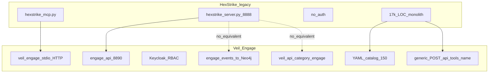
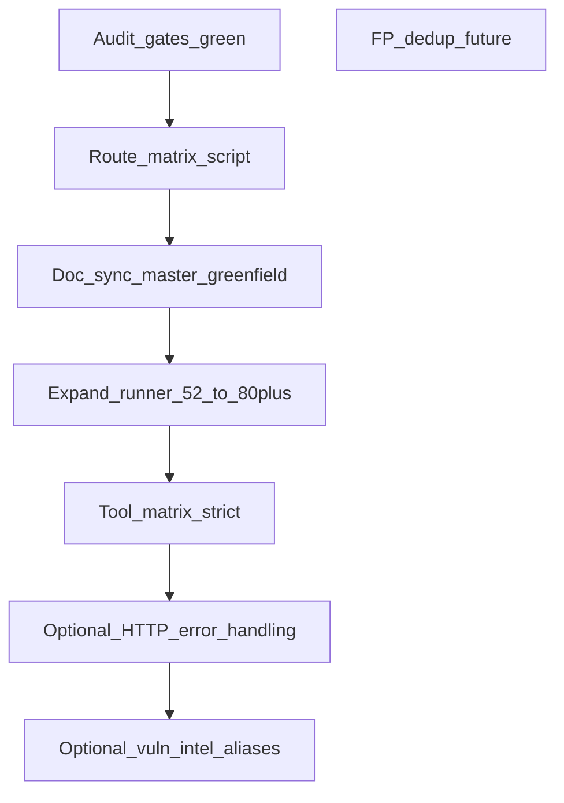

# Аудит переноса HexStrike → Veil Engage

## Вердикт: перенос архитектуры подтверждён

**Целевая модель достигнута:** четвёртый слой [engage/](engage/) заменяет монолит Python ([`.external/hexstrike-ai-master/`](.external/hexstrike-ai-master/)) по схеме «capabilities parity», не line-by-line port — это зафиксировано в [engage_hexstrike_master](.cursor/plans/engage_hexstrike_master_7666e9b4.plan.md) и [external-hexstrike.md](docs/external/external-hexstrike.md).



| Критерий мастер-DoD | Статус | Доказательство |
|---------------------|--------|----------------|
| 150 MCP имён + bridge tools | **OK** | [`check-catalog-parity.sh`](scripts/engage/check-catalog-parity.sh); [`engage-legacy-parity.md`](docs/engage/engage-legacy-parity.md) |
| Intelligence / workflows / CTF / BB / CVE HTTP | **OK** | [`router.go`](engage/serve/internal/transport/httpserver/router.go) + usecase-пакеты |
| Graph write + read | **OK** | events pipeline; `target-timeline`; veil-stack CI |
| CI (unit, parity, events, veil-stack, secure) | **OK** | [`.github/workflows/engage.yml`](.github/workflows/engage.yml), [`engage-secure.yml`](.github/workflows/engage-secure.yml) |
| Secure deploy | **OK** | Phase 23: `ENGAGE_DENY_RAW_COMMAND`, Keycloak smoke |
| 156 legacy HTTP routes — all accounted | **Частично** | ~100 per-tool routes **намеренно N/A**; ~15–25 functional routes **ещё не сверены** (см. ниже) |
| 150 tools реально исполняются | **Partial** | **52** `enabled: true` в [`tools.live.yaml`](engage/serve/catalog/tools.live.yaml) |
| README KPI (24x, 98.7%) | **Не заявлено** | [`engage-hexstrike-parity.sh`](scripts/benchmark/engage-hexstrike-parity.sh) — regression only |

**Расхождение документов:** [greenfield](.cursor/plans/engage_layer_greenfield_9d048eec.plan.md) помечает Phase 16–23 как **done**; [мастер-план](.cursor/plans/engage_hexstrike_master_7666e9b4.plan.md) в frontmatter всё ещё `pending` и матрица пробелов (L104–126) **устарела** (описывает CTF/BB как Missing — уже реализованы). **Первый шаг аудита:** синхронизировать статусы, не переписывать код.

---

## Что перенесено (не портировать повторно)

### Greenfield R0–R74 + Phase 15 v2
Сводка в [engage_layer_greenfield_9d048eec.plan.md](.cursor/plans/engage_layer_greenfield_9d048eec.plan.md): scaffold, auth, catalog, runner, jobs, intelligence, MCP bridge, playbooks, events→ingest, veil read, decision engine parity.

### Phase 16–23 (код + parity doc)
| Phase | Ключевые артефакты |
|-------|-------------------|
| 16 | [`target_timeline.go`](engage/serve/internal/usecase/intelligence/target_timeline.go), graph correlate |
| 17 | [`internal/usecase/ctf/`](engage/serve/internal/usecase/ctf/), 7× `/api/ctf/*`, [`playbooks/ctf.yaml`](engage/serve/playbooks/ctf.yaml) |
| 18 | [`bugbounty/manager.go`](engage/serve/internal/usecase/bugbounty/manager.go), phased `execute.go`, 6 workflows |
| 19 | runner image, 52 live tools, [`check-catalog-args`](scripts/engage/check-catalog-args.sh), tool matrix |
| 20 | [`internal/usecase/cve/`](engage/serve/internal/usecase/cve/), `/api/vuln-intel/*` |
| 21 | browser sidecar, scan-progress, executive summary |
| 22 | `ENGAGE_MAX_PARALLEL`, ffuf/sqlmap parsers, benchmark script |
| 23 | veil-stack CI, secure raw deny, graph version gate |

### Архитектурные улучшения (не регресс)
- Единый `POST /api/tools/{name}` вместо ~100 дублирующих Flask handlers
- Keycloak + RBAC, secure nginx overlay
- Запись в Neo4j + чтение через veil-api (legacy этого не имел)

---

## Классификация 156 legacy HTTP routes

| Класс | ~Кол-во | Engage | Действие аудита |
|-------|---------|--------|-----------------|
| **A. Per-tool** `/api/tools/{binary}` | ~100 | `POST /api/tools/{name}` | **N/A** — задокументировать в parity matrix |
| **B. Core ops** (health, command, files, jobs, cache, telemetry, processes) | ~25 | Реализовано | Авто-сверка path→handler |
| **C. Intelligence + BB + visual** | ~20 | Реализовано | Авто-сверка |
| **D. CTF + vuln-intel** | ~12 | 7 CTF + 3 vuln-intel | Сверка **3 extra** vuln-intel routes |
| **E. Process pool / error-handling / AI / Python** | ~25 | **Нет HTTP** или упрощено | Решение: port / alias / **N/A** |

### Категория E — детальный backlog (требует решения в аудите)

| Legacy route | Engage сейчас | Рекомендация |
|--------------|---------------|--------------|
| `POST /api/vuln-intel/attack-chains` | Частично: `discover-attack-chains` + CVE graph | **Alias** или document equivalence |
| `POST /api/vuln-intel/threat-feeds` | `cve-monitor` частично | **Port** thin wrapper или N/A «merged into cve-monitor» |
| `POST /api/vuln-intel/zero-day-research` | Нет | **Port** heuristic stub или N/A «no LLM» |
| `POST /api/ai/test_payload` | Нет | **N/A** или port validate-only |
| `POST /api/ai/advanced-payload-generation` | `payloads/generate` базовый | **Partial** — расширить или N/A |
| `POST /api/python/install`, `/api/python/execute` | Нет | **N/A** (sandbox risk) или Phase 24+ isolated runner |
| `GET/POST /api/process/pool-stats`, `performance-dashboard`, `execute-async`, `auto-scaling` | Jobs + `GET /api/processes/dashboard` | **Partial** — expose subset или N/A |
| `GET/POST /api/error-handling/*` (6 routes) | Recovery **in-process** only | **Port** read-only diagnostics API или N/A |
| `POST /api/tools/browser-agent` | Catalog + sidecar `browser_agent_inspect` | **OK** via unified tool path |

---

## Пробелы, требующие порта или расширения

### P0 — Execution breadth (критично для «полного» HexStrike)

| Пробел | Legacy | Engage | Порт |
|--------|--------|--------|------|
| Enabled tools | 150 в MCP | **52** live | Расширить [`runner.Dockerfile`](deploy/engage/docker/runner.Dockerfile) + `tools.live.yaml`; цель 80–100 tier-1 по [`tool-matrix`](scripts/engage/tool-matrix-from-effectiveness.py) |
| Tool matrix CI | effectiveness ≥0.85 | best-effort ≥15 | Поднять `ENGAGE_TOOL_MATRIX_STRICT`; чинить red tools (ARGS, binary, timeout) |
| `binary: api` entries | in-process в Python | 2 в catalog | Убедиться что все `binary: api` в [`DOCUMENTED_GENERIC`](scripts/engage/extract-legacy-catalog.py) |

**Не портировать в runner:** ghidra, burpsuite, metasploit GUI, angr (тяжёлые) — **N/A** с причиной в [`engage-tools.md`](docs/engage/engage-tools.md).

### P1 — Behavioral depth (средний приоритет)

| Подсистема Python | Engage | Gap |
|-------------------|--------|-----|
| `ModernVisualEngine` (ANSI UI) | Structured JSON + PDF | **N/A** — agents не нуждаются в ANSI |
| `PerformanceMonitor` | `/api/telemetry`, metrics | **Partial** — optional `GET /api/process/resource-usage` |
| `CTFTeamCoordinator` / `CTFChallengeAutomator` | [`ctf/team.go`](engage/serve/internal/usecase/ctf/team.go), [`automator.go`](engage/serve/internal/usecase/ctf/automator.go) | Сверить golden outputs vs legacy samples |
| `BugBountyWorkflowManager` timing estimates | `estimated_time` в phases | Сверить поля ответа с Python snapshot |
| Findings FP / dedup | parsers nuclei/ffuf/sqlmap | **Future** (вне мастер-DoD) |
| README KPI timing | marketing | benchmark script only |

### P2 — HTTP surface (низкий приоритет, если агенты не ломаются)

Портировать только если есть реальные потребители (не MCP catalog name):

1. `error-handling/*` — diagnostics для operators
2. `process/pool-stats` + `performance-dashboard` — observability
3. `vuln-intel/threat-feeds`, `zero-day-research` — обёртки над [`cve/`](engage/serve/internal/usecase/cve/)

### P3 — Явно вне scope (не портировать)

- LLM / `AIExploitGenerator` neural paths
- Line-by-line `hexstrike_server.py`
- Правки `.external/`
- Публикация graph pack без запроса
- Обязательное достижение 24x speed в CI

---

## План проведения аудита (4 этапа)

### Этап 1 — Автоматические gates (1 PR, docs-only findings)

Запустить и зафиксировать в отчёте:

```bash
make test-engage
make test-engage-parity
make test-engage-catalog-args
make test-engage-decision-parity
make test-engage-tool-matrix      # записать pass/skip/fail count
make test-engage-events-pipeline  # если Docker
make test-engage-veil-stack-ci
make test-engage-benchmark          # timing table artifact
```

**Выход:** `docs/engage/engage-audit-report.md` (новый) — таблица gate → pass/fail/skip.

### Этап 2 — Route matrix (новый скрипт, 1 PR)

Создать [`scripts/engage/check-route-parity.py`](scripts/engage/check-route-parity.py):

1. Парсить все `@app.route` из `hexstrike_server.py` (156 paths)
2. Сопоставить с:
   - explicit handlers в [`router.go`](engage/serve/internal/transport/httpserver/router.go)
   - правилами **N/A**: prefix `/api/tools/` → unified catalog
   - MCP bridge aliases в [`intel_bridge.go`](engage/serve/internal/transport/mcpserver/intel_bridge.go)
3. Вывод: `implemented` | `na_unified_tool` | `na_out_of_scope` | `missing`
4. CI: `make test-engage-route-parity` (fail только на `missing` без записи в parity doc)

Обновить [`engage-legacy-parity.md`](docs/engage/engage-legacy-parity.md): секция **«Route parity matrix»** с полным списком `missing` / `N/A`.

### Этап 3 — MCP ↔ catalog ↔ runner triangle (1 PR)

| Check | Script / method |
|-------|-----------------|
| 150 MCP names ⊆ catalog | existing parity |
| Every `enabled: true` has binary in runner image | extend [`list-runner-binaries.sh`](scripts/engage/list-runner-binaries.sh) vs live yaml |
| Every enabled tool runs in matrix | tool-matrix |
| Intelligence bridge tools callable | MCP smoke + unit tests |
| `binary: api` tools return JSON via bridge | spot-check 10 names |

**Выход:** CSV `enabled,runnable,matrix_pass,notes` в audit report.

### Этап 4 — Документация и закрытие планов (1 PR)

1. Обновить [мастер-план](.cursor/plans/engage_hexstrike_master_7666e9b4.plan.md) frontmatter: Phase 16–23 → `completed`; обновить gap matrix L104–126
2. Добавить в greenfield ссылку на [`engage-audit-report.md`](docs/engage/engage-audit-report.md)
3. Закрыть R2–R6 (уже в greenfield) — без нового кода
4. Definition of Done мастер-плана: чеклист с галочками

---

## Приоритизированный backlog после аудита



| Приоритет | ID | Задача | Оценка |
|-----------|-----|--------|--------|
| **Audit** | A1–A4 | Gates + route script + doc sync | 2–3 d |
| **P0** | E1 | +30–50 enabled tools в runner/live | 3–5 d |
| **P0** | E2 | Tool matrix strict ≥30 green | 2 d |
| **P1** | D1 | CTF/BB golden parity vs Python fixtures | 1–2 d |
| **P2** | H1 | `error-handling` read-only API (optional) | 1 d |
| **P2** | H2 | vuln-intel alias routes | 0.5 d |
| **Future** | F1 | FP rate labeled dataset | backlog |

---

## Критерии «аудит пройден»

- [ ] Все automated gates green (или documented SKIP)
- [ ] `check-route-parity.py`: **0 unexplained `missing`**
- [ ] [`engage-legacy-parity.md`](docs/engage/engage-legacy-parity.md) содержит полную матрицу 156 routes (implemented / N/A + reason)
- [ ] Мастер-план и greenfield согласованы по статусу Phase 16–23
- [ ] Backlog P0/P1/P2 зафиксирован с owner (Phase 24+ или ops)
- [ ] Подтверждение пользователю: **архитектура перенесена**; **execution parity** — отдельный трек P0

---

## Связанные артефакты

| Документ | Роль в аудите |
|----------|----------------|
| [engage-legacy-parity.md](docs/engage/engage-legacy-parity.md) | Living checklist — обновить после этапа 2 |
| [engage-tools.md](docs/engage/engage-tools.md) | Runner matrix, N/A tools |
| [mcp-agents.md](docs/agents/mcp-agents.md) | Dual MCP workflow |
| [`.cursor/plans/engage/`](.cursor/plans/engage/) | 34 phase plans — reference only |
| [phase_7_closure_audit](.cursor/plans/engage/phase_7_closure_audit_44334bf3.plan.md) | Прецедент формального audit close |
