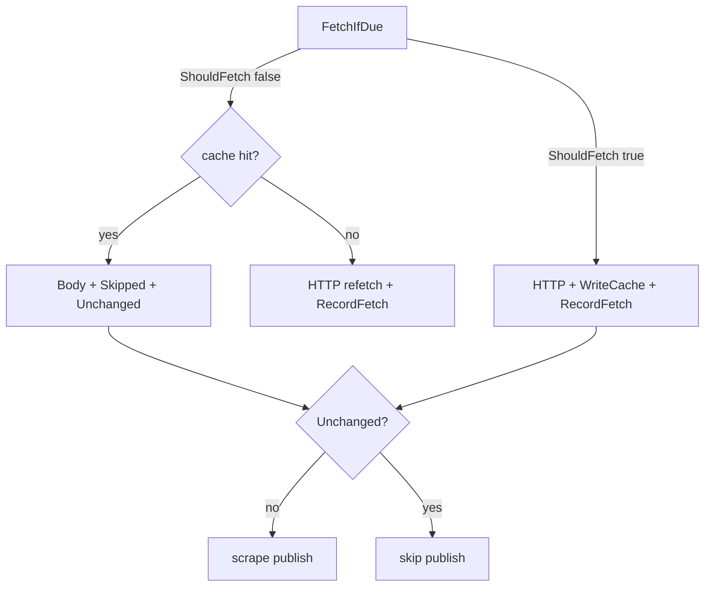

# Миграция, фиксы scrape и full-enrich прогон

## Текущее состояние

| Путь | Содержимое |
|------|------------|
| [`data/cache/`](data/cache/) (~65M) | `atomic`, `lolbas`, `nvd`, `sigma`, `ti`, `yara` — **не мигрировано** |
| [`var/veil/`](var/veil/) (~24K) | Пустые `.gitkeep` — compose уже смотрит сюда |
| Код persistent state | Уже в `main`: mounts, `FetchIfDue` cache-miss refetch, `profile-incremental-pack.sh` |

Прошлый fast-rich (v0.4.1) падал на **exit 1** из‑за:
- **lola/MITRE** — после `FetchIfDue` парсинг только с диска, без `res.Body` + ledger/cache рассинхрон
- **coderules/CodeQL** — `coderulesGitRef()` = `master`, у [`github/codeql`](https://github.com/github/codeql) default **`main`** → codeload 404
- **nuclei** — 0 шаблонов: листинг `http/cves/{year}` без файлов / устаревшие годы (`2023,2024` по умолчанию)

---

## Фаза 1 — Миграция и очистка

Новый скрипт [`scripts/ops/migrate-var-veil.sh`](scripts/ops/migrate-var-veil.sh):

```bash
mkdir -p var/veil/{blobs,ledger/mysql,graph/releases}
[ -d data/cache ] && rsync -a data/cache/ var/veil/blobs/
[ -d data/neo4j_user_export ] && rsync -a data/neo4j_user_export/ var/veil/graph/
# после успешного rsync + du -s сравнение:
rm -rf data/cache/* data/neo4j_user_export/*
# оставить data/*/.gitkeep если есть
```

- Запуск **до** compose (права: `chown` при необходимости, как при v0.4.1 export).
- Если есть старый Docker volume `crawl_db_data` с ledger — опционально `docker volume inspect` + dump через [`scripts/crawl/ledger-dump.sh`](scripts/crawl/ledger-dump.sh) **до** wipe; после миграции ledger начнётся заново в `var/veil/ledger/mysql/` (нормально: cache даст skip HTTP, hash перезапишется при refetch).

Удалить/обезвредить legacy:
- Очистить [`data/cache/`](data/cache/) и [`data/neo4j_user_export/`](data/neo4j_user_export/) после rsync
- В коде заменить fallback `./data/cache` → пустая строка или `var/veil/blobs` в [`scrape/harvest/internal/sources/*/scrapesource`](scrape/harvest/internal/sources/lola/scrapesource/source.go) и аналогах (vuln, ti) — чтобы без `SCRAPE_CACHE_DIR` не писать в старый путь

---

## Фаза 2 — Фиксы scrape (ledger-first)



### 2.1 MITRE STIX ([`mitre_stix.go`](scrape/harvest/internal/sources/lola/internal/usecase/mitre_stix.go))

После `FetchIfDue`:
- Если `len(res.Body) > 0` — парсить STIX из `bytes.NewReader(res.Body)` (не только `os.Open(cache)`).
- Иначе — открыть `filepath.Join(u.cache, cacheRel)` как сейчас.
- Убрать ошибку «ledger without cache» на успешном refetch.

### 2.2 CodeQL ([`coderules/.../github_fetch.go`](scrape/harvest/internal/sources/coderules/internal/usecase/github_fetch.go))

- `coderulesGitRef()` → использовать [`feeds.gitHubRefs()`](scrape/harvest/internal/feeds/github.go) (`main`, `master`) в `GitHubRawURL` и codeload.
- [`runCodeQL`](scrape/harvest/internal/sources/coderules/internal/usecase/runner.go): при ошибке list на одном ref — пробовать следующий; путь оставить `javascript/ql/src/Security/CWE-079` (существует на `main`).
- Ошибка list → **warn + return nil** (не валить весь `coderules`, как semgrep при `continue`).

### 2.3 Nuclei ([`nuclei/.../config.go`](scrape/harvest/internal/sources/nuclei/internal/config/config.go), [`runner.go`](scrape/harvest/internal/sources/nuclei/internal/usecase/runner.go))

- Default `NUCLEI_YEARS`: `2023,2024,2025,2026`.
- Если за прогон `count==0` — **warn** с `base` и `len(items)` (видно в логах).
- `github_fetch`: refs `main`/`master` (как CodeQL).

### 2.4 LOFTS / GTFOBins

- **LOFTS** — DNS `lofts.galeal.com` недоступен; уже `LOFTS_SKIP_ON_ERROR=true` в профилях — оставить skip, не считать failure.
- **GTFOBins 0** — добавить warn при пустом list; при необходимости проверить `_gtfobins` через GitHub API (отдельный микро-фикс, если list пустой на обоих refs).

### 2.5 Тесты

- Unit: MITRE-парсинг с `res.Body` (mock `FetchIfDue` result).
- `make test-scrape` после правок.

---

## Фаза 3 — Профиль full-enrich (ledger + incremental seed)

Новый [`deploy/profiles/full-enrich.env`](deploy/profiles/full-enrich.env):

| Переменная | Значение |
|------------|----------|
| `SCRAPE_FORCE_REFETCH` | `0` |
| `GRAPH_PACK_SKIP` | `0` |
| `BASE_GRAPH_PACK_VERSION` | `v0.4.1` |
| `NVD_MAX_PAGES` | `10` (~20k CVE) |
| `SCRAPE_SOURCES` | все 7 |
| Лимиты | как fast-rich (Sigma/YARA/SBOM/…) |

Скрипт [`scripts/graph-pack/profile-full-enrich.sh`](scripts/graph-pack/profile-full-enrich.sh):
1. `./scripts/ops/migrate-var-veil.sh` (флаг `--skip-migrate` если уже сделано)
2. `./scripts/ops/compose-down-ephemeral.sh`
3. `source_profile full-enrich`
4. `./scripts/ops/compose-up-full.sh`

**Ledger-дисциплина:**
- Каждый URL — стабильный `resource_key` (`nvd:page:…`, `lola:mitre:…`, `coderules:…`, `nuclei:file:…`) — уже в коде.
- Без `SCRAPE_FORCE_REFETCH` повторный прогон = skip HTTP + skip publish для unchanged.
- Перед стартом: `./scripts/crawl/status.sh` (пустой ledger OK после первой миграции).

**Ожидаемое время:** ~1–2 ч scrape + drain + export (зависит от сети).

---

## Фаза 4 — Запуск и проверка (после approve)

1. `./scripts/ops/migrate-var-veil.sh`
2. Убедиться: `var/veil/graph/releases/veil-graph-v0.4.1.zip` есть (или скачать release)
3. Применить фиксы кода (фаза 2)
4. `./scripts/graph-pack/profile-full-enrich.sh`
5. Дождаться `scrape_worker` **Exited (0)** (не 1)
6. `./scripts/test/verify-nvd-enrichment.sh` — `has_cwe` / `affects` >> 0
7. `./scripts/crawl/status.sh` — ledger заполнен
8. Опционально: export/build следующего pack (`v0.4.2`)

---

## Критерии готовности

- [ ] `data/cache` пуст или удалён; blobs в `var/veil/blobs/` (~65M+)
- [ ] MITRE/CodeQL/Nuclei дают ненулевой ingest в логах
- [ ] `scrape_worker` exit 0
- [ ] Ledger: десятки+ записей `crawl_resource`, повторный `--no-down` прогон быстрее (unchanged в логах)
- [ ] NVD ~10 страниц, enrichment в Neo4j выше baseline v0.4.1
