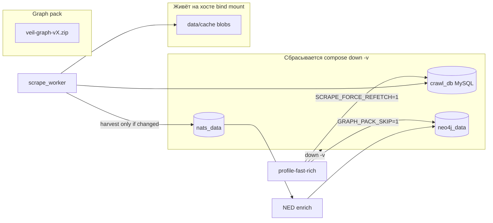
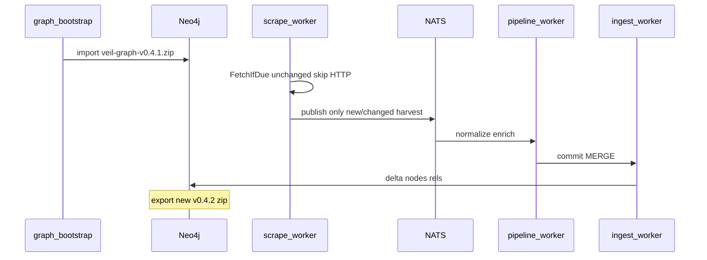

# Persistent crawl state и incremental graph pack

## Почему сейчас «ходим по 100 раз в одно и то же»

Три независимых механизма уже есть, но **graph-pack профиль их обнуляет**:



| Что есть | Где | Проблема |
|----------|-----|----------|
| **Ledger** (`crawl_resource`) | MySQL volume `crawl_db_data` | Удаляется `profile-fast-rich.sh` → `compose down -v` |
| **Disk cache (L1)** | [`data/cache`](data/cache) → `/data/cache` | Живёт на хосте, но **не связан жёстко** с ledger → баг MITRE: ledger «unchanged», файла нет |
| **Skip publish** | [`FetchIfDue`](discovery/harvest/internal/feeds/fetch.go) `Unchanged` | После пустого Neo4j не переигрывает сообщения в NATS |
| **Force refetch** | [`deploy/profiles/fast-rich.env`](deploy/profiles/fast-rich.env) `SCRAPE_FORCE_REFETCH=1` | Игнорирует ledger на каждой сборке pack |
| **Пустой граф** | `GRAPH_PACK_SKIP=1` | Не импортирует v0.4.0 перед crawl — всё с нуля |

Итог: при каждой сборке pack вы **намеренно** делаете full refetch + full ingest, хотя инфраструктура dedup уже написана.

---

## Целевая модель (medium)

**Два класса данных:**

1. **Crawl state** (долгоживущий) — «куда ходили, что скачали, hash тела»
2. **Graph artifacts** (версионируемые релизы) — ZIP/Cypher для bootstrap

**Один корень на хосте** вместо разрозненного `data/`:

```text
var/veil/
  blobs/              # HTTP-тела (бывш. data/cache), content by path key
  ledger/             # MySQL datadir (bind mount crawl-db)
  knowledge/
    working/graph.cypher
    releases/veil-graph-vX.Y.Z.zip
```

Эфемерно по-прежнему только: `neo4j_data`, `nats_data` (и при необходимости JetStream).

---

## 1. Реорганизация путей (`var/veil`)

**Файлы:**

- [`scripts/lib/common.sh`](scripts/lib/common.sh) — новые дефолты:
  - `VEIL_VAR_DIR=${VEIL_VAR_DIR:-$VEIL_ROOT/var/veil}`
  - `SCRAPE_BLOB_DIR`, `CRAWL_LEDGER_DATA_DIR`, `GRAPH_PACK_DIR`, `NEO4J_EXPORT_*`
- [`deploy/discovery/compose.yml`](deploy/discovery/compose.yml) — volumes:
  - `../../var/veil/blobs:/data/cache` (пока путь в контейнере `/data/cache` для минимального diff)
  - `../../var/veil/ledger/mysql:/var/lib/mysql` вместо anonymous `crawl_db_data`
- [`deploy/knowledge/compose.yml`](deploy/knowledge/compose.yml) — `../../var/veil/graph:/var/lib/neo4j/import/user_export`
- [`deploy/compose.scale.yml`](deploy/compose.scale.yml) — те же mounts
- [`docker-compose.testpack.yml`](docker-compose.testpack.yml) — путь к zip в `var/veil/graph/releases/`
- [`.gitignore`](.gitignore), [`.dockerignore`](.dockerignore) — `var/veil/blobs/`, `var/veil/ledger/`, `var/veil/graph/` (оставить `.gitkeep` в пустых каталогах)
- Документация: [`docs/threatintel-runtime.md`](docs/threatintel-runtime.md), [`docs/graph-pack.md`](docs/graph-pack.md), [`scripts/README.md`](scripts/README.md)

**Миграция (одноразово в README/scripts):**

```bash
mkdir -p var/veil/{blobs,ledger/mysql,graph/releases}
# если есть старые данные:
[ -d data/cache ] && rsync -a data/cache/ var/veil/blobs/
[ -d data/neo4j_user_export ] && rsync -a data/neo4j_user_export/ var/veil/graph/
```

**Compose env:** явно `SCRAPE_CACHE_DIR=/data/cache` на `scrape_worker` (сейчас mount есть, env часто не задан — fallback `./data/cache` в коде хрупкий).

---

## 2. Исправить контракт ledger ↔ cache

В [`discovery/harvest/internal/feeds/fetch.go`](discovery/harvest/internal/feeds/fetch.go), ветка `!ok` (ledger says skip):

```go
if !ok {
  if b, hit := c.ReadCache(cachePath); hit { ... }
  return FetchResult{Skipped: true}, nil  // BUG: нет тела, upstream падает
}
```

**Поведение после фикса:**

- Если ledger говорит «не fetch», но **cache miss** → **сделать HTTP fetch** (или вернуть явную ошибку с auto-refetch в вызывающем коде).
- Лог: `ledger skip but cache miss; refetching` + `RecordFetch`.

Покрыть тестом в [`fetch_test.go`](discovery/harvest/internal/feeds/fetch_test.go) (сценарий: ledger row есть, файл удалён → refetch, не `Skipped` без body).

Это закрывает инцидент **lola MITRE** при `down -v` только для MySQL, но сохранённом/частичном cache.

---

## 3. Incremental graph pack (главный workflow)

Новый профиль [`deploy/profiles/incremental-pack.env`](deploy/profiles/incremental-pack.env):

| Переменная | Значение | Смысл |
|------------|----------|--------|
| `SCRAPE_FORCE_REFETCH` | `0` | Уважать ledger + cache |
| `GRAPH_PACK_SKIP` | `0` | Импорт baseline pack в Neo4j |
| `GRAPH_PACK_DEFAULT_VERSION` | `v0.4.1` (или `BASE_GRAPH_PACK_VERSION`) | Предыдущий релиз как seed |
| `SCRAPE_SOURCES` | как fast-rich | Те же 7 источников |
| `NVD_MAX_PAGES` | `1` | Лимиты как сейчас |

Новые скрипты:

- [`scripts/ops/compose-down-ephemeral.sh`](scripts/ops/compose-down-ephemeral.sh) — `down` **без** `-v` на `crawl_db` / host `var/veil`; опционально `-v` только `neo4j_data`, `nats_data`
- [`scripts/graph-pack/profile-incremental-pack.sh`](scripts/graph-pack/profile-incremental-pack.sh) — `compose-down-ephemeral` + `source_profile incremental-pack` + `compose-up-full`

**Поток сборки v0.4.2:**



- Unchanged feeds → **нет HTTP**, **нет NATS**, Neo4j уже содержит данные из pack.
- Changed feeds (новый NVD page, обновился KEV) → только дельта проходит NED → enrichment на новых CVE.

**Изменить [`deploy/profiles/fast-rich.env`](deploy/profiles/fast-rich.env):**

- Убрать `SCRAPE_FORCE_REFETCH=1` по умолчанию; вынести в `deploy/profiles/full-rebuild.env` для редкого «выжечь всё и перекачать».

**Изменить [`scripts/graph-pack/profile-fast-rich.sh`](scripts/graph-pack/profile-fast-rich.sh):**

- Либо переключить на вызов incremental + флаг `--full` для старого поведения (`down -v` + force refetch).

---

## 4. «Помнить куда ходили» — observability

Новый [`scripts/crawl/status.sh`](scripts/crawl/status.sh):

- SQL к `crawl_resource`: count по `source`, `last_fetched_at`, сколько static с `content_sha256`
- Размер `var/veil/blobs` на диске
- Подсказка: «следующий incremental pack → `profile-incremental-pack.sh`»

Опционально в том же PR: `scripts/crawl/ledger-dump.sh` (export `crawl_resource` в JSON для бэкапа перед экспериментами) — лёгкий бэкап без смены MySQL на SQLite (medium scope).

---

## 5. Compose: bootstrap vs ingest (из опыта v0.4.1)

В [`deploy/knowledge/compose.yml`](deploy/knowledge/compose.yml):

- `ingest_worker` должен **`depends_on: graph-bootstrap: service_completed_successfully`** (как `api`), иначе при testpack/import создаёт constraints до Cypher и import падает.

Для incremental pack: после bootstrap ingest может стартовать и обрабатывать только новые `ingest.>` сообщения.

---

## 6. Что НЕ входит в medium (явно отложено)

- SQLite вместо MySQL для ledger (full scope)
- CAS `blobs/sha256/ab/...` вместо path-key cache (можно phase 2 поверх `var/veil/blobs`)
- `SCRAPE_REPLAY_UNCHANGED=1` (форс-публикация всего cache в NATS при пустом Neo4j без pack seed) — **не нужен**, если default = seed из прошлого ZIP

---

## 7. Проверка (acceptance)

1. Первый прогон `profile-incremental-pack.sh` с локальным `var/veil/graph/releases/veil-graph-v0.4.1.zip` → bootstrap OK, scrape логи с `unchanged, skip publish` для KEV/MITRE/NVD page.
2. Второй прогон без `down -v` ledger → wall-clock **значительно меньше**, HTTP почти нет.
3. `scripts/crawl/status.sh` показывает заполненный ledger.
4. Удалить один файл в `var/veil/blobs/mitre/...` → следующий scrape **refetch**, не silent fail.
5. Export → `var/veil/graph/releases/veil-graph-v0.4.2.zip`, NVD enrichment counts не ниже baseline.
6. `make test-pipeline` + тест `FetchIfDue` cache-miss refetch.

---

## Порядок реализации

1. `var/veil` paths в `common.sh` + compose mounts + `.gitignore`
2. Fix `FetchIfDue` + unit test
3. `compose-down-ephemeral.sh`, `incremental-pack.env`, `profile-incremental-pack.sh`; ослабить `fast-rich`
4. `scripts/crawl/status.sh` (+ optional ledger-dump)
5. `ingest_worker` depends_on bootstrap
6. Docs + migration note в `docs/graph-pack.md`
