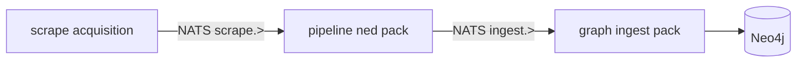
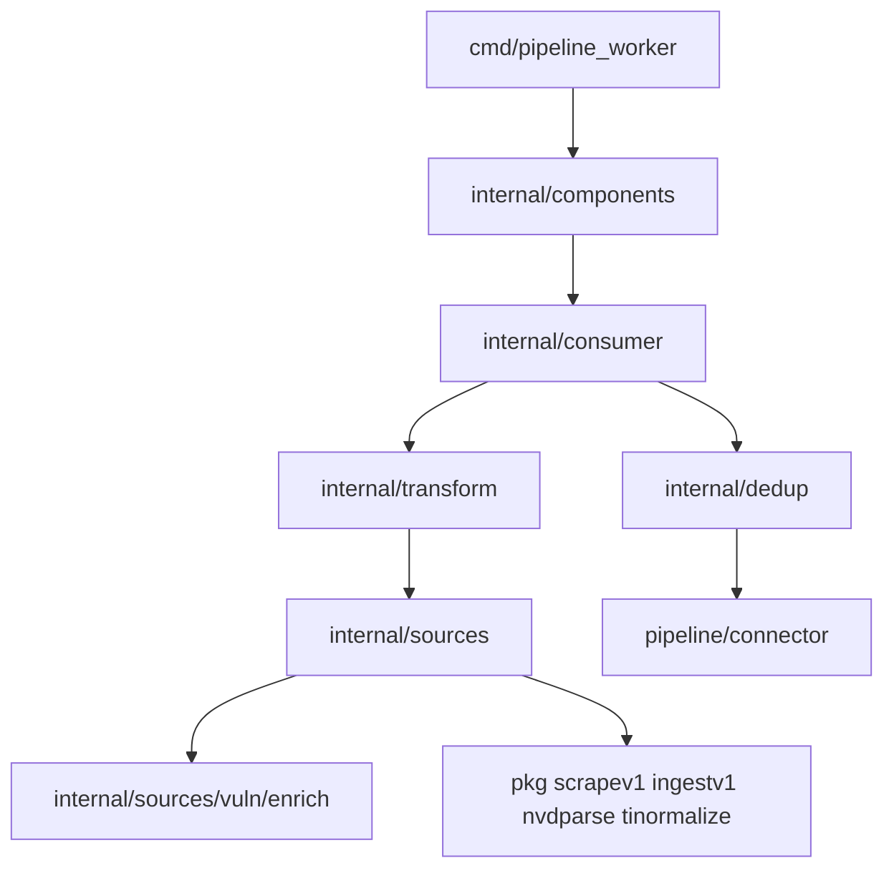

# Pipeline layer — NED (normalize, enrichment, deduplication)

## Семантика слоя (как у graph)

В Veil три runtime-слоя; **pipeline** — единственное место, где выполняется **NED** на шине:



| Термин | Что это | Не путать с |
|--------|---------|-------------|
| **pipeline/** (оставляем) | Зона NED: `scrapev1` → `ingestv1` | Слоем graph (MERGE) |
| **ned pack** | JetStream consumer + transform по доменам | `pipeline_worker` как «отдельный продукт» |
| **connector** | NATS publish + ensure streams (ex [`pipeline/pub`](pipeline/pub/)) | Business normalize |

**Межслойное взаимодействие** — только NATS + `pkg/*`. `pipeline/` не импортирует `discovery/` или `knowledge/`.

`pipeline_worker` — **driving adapter** (hexagonal): pull `scrape.>`, делегирует NED, publish `ingest.>`.

---

## Три фазы NED (границы ответственности)

| Фаза | Где в коде | Примеры |
|------|------------|---------|
| **Normalize** | `internal/sources/*/normalize` + `pkg/tinormalize` | TI canonical IOC ID, campaign/cluster shape, AppSec YAML parse |
| **Enrich** | `internal/sources/*/enrich` | NVD page → CWE/CPE via [`pkg/nvdparse`](pkg/nvdparse) + [`pkg/nvdmap`](pkg/nvdmap) ([`handle/vuln.go`](pipeline/pipeline_worker/internal/handle/vuln.go)) |
| **Dedup** | `pkg/ingestv1` idempotency keys + [`connector` publish](pipeline/pub/publish.go) `Nats-Msg-Id` | `VulnUpsertIdempotencyKey`, `TIIoCIdempotencyKey`; JetStream stream dedup |

**Важно про scripts/** (по вашему выбору — **defer**): в этом рефакторинге bash не переносим. В docs явно разделить:

| Script | Роль | Слой |
|--------|------|------|
| [`compose-up-full.sh`](scripts/compose-up-full.sh), [`smoke_scrape_e2e.sh`](scripts/smoke_scrape_e2e.sh) | Оркестрация compose | ops |
| [`verify-nvd-enrichment.sh`](scripts/verify-nvd-enrichment.sh) | **Проверка** Neo4j после ingest | graph read / QA |
| [`graph-dedup-cleanup.sh`](scripts/graph-dedup-cleanup.sh) | **Починка** дублей в БД | graph housekeeping |

Ни один из них не заменяет runtime NED в `pipeline_worker`.

---

## Проблема сейчас (~10 mini-модулей в [`pipeline/go.work`](pipeline/go.work))

```
pipeline/
  pipeline_worker/          # main + pull loop + handle/*
  pub/                      # NATS publish
  internal/normalize/
    ti/ tidomain/ tiingest/ vuln/ appsec/   # отдельные go.mod — лишняя фрагментация
```

- `handle/*` смешивает normalize + enrich + маршрутизацию без явной структуры
- [`pipeline/internal/normalize/tidomain`](pipeline/internal/normalize/tidomain/) — тонкий re-export [`pkg/tidomain`](pkg/tidomain/) (удалить)
- [`pipeline/internal/normalize/ti`](pipeline/internal/normalize/ti/) — re-export [`pkg/tinormalize`](pkg/tinormalize/) (удалить, импортировать pkg напрямую)
- Pull loop и env routing сидят в [`pipeline_worker/cmd/main.go`](pipeline/pipeline_worker/cmd/main.go) (~190 строк) — разнести как в graph ingest

---

## Целевая структура (2 модуля, зеркало graph)

```
pipeline/
  go.work                    # use: ./connector ./ned
  connector/                 # ex pub
    go.mod
    nats/                    # JetStreamPublisher, EnsureBothStreams
  ned/                       # ex pipeline_worker + internal/normalize
    go.mod
    cmd/pipeline_worker/main.go
    README.md
    internal/
      config/
      components/            # DI: publisher, transform registry
      connector/nats/        # pull subscribe scrape stream (stream ensure → connector)
      consumer/              # pull loop (ex main runPullLoop)
      transform/             # route by scrapev1.Source (ex handle/handler.go)
      sources/
        ti/     {transform.go, normalize via pkg/tinormalize}
        vuln/   {transform.go, enrich/nvd.go, domain}
        lola/
        ds/
        appsec/ {sbom, coderules, nuclei — ex handle/appsec*}
      dedup/                 # PublishIngest wrapper; docs link to ingestv1 keys
```

**Поток зависимостей внутри ned:**



Правила (как graph): `cmd` без subject strings в цикле; `transform` без прямого `nats.Connect`; enrich только в pipeline; graph не парсит NVD.

---

## Что не делаем

- Переименование `pipeline/` → `ned/` на верхнем уровне репо
- Перенос/переписывание `scripts/*` (только документация границ)
- Объединение connector + ned в один `go.mod`
- Изменения `discovery/`, `knowledge/`, `pkg/*` кроме удаления дублирующих import path в pipeline

---

## Стратегия малого diff

- Один todo = один коммит: перенос + `go mod` + import path + `go build ./cmd/pipeline_worker`
- Сначала `connector`, потом `ned`, потом удаление legacy paths
- После каждого шага: `go build` + `go test` затронутого пакета

---

## Фаза 0 — документация и семантика NED

| ID | Действие |
|----|----------|
| `doc-pipeline-ned-semantics` | [`docs/agents/coding-style.md`](docs/agents/coding-style.md): секция Pipeline = connector + **ned pack**; таблица Normalize / Enrich / Dedup; диаграмма; граница со scripts |
| `doc-pipeline-readme` | [`pipeline/README.md`](pipeline/README.md): дерево `connector/`, `ned/` |
| `doc-runtime-pipeline` | [`docs/architecture/threatintel-runtime.md`](docs/architecture/threatintel-runtime.md): module path `pipeline/ned`, сервис compose `pipeline_worker` без переименования |
| `doc-scripts-taxonomy` | [`scripts/README.md`](scripts/README.md): колонка «слой» (ops / graph QA / graph housekeeping) — без переноса кода |

---

## Фаза 1 — `pipeline/connector` (ex pub)

| ID | Действие |
|----|----------|
| `connector-init` | `pipeline/connector/go.mod`; перенести [`pipeline/pub/publish.go`](pipeline/pub/publish.go) → `connector/nats/publish.go` (package `nats` или `connector`) |
| `connector-imports-ned` | Переключить импорты в worker на `pipeline/connector` |
| `connector-rm-pub` | Удалить [`pipeline/pub/`](pipeline/pub/) |
| `connector-test` | `go build ./...` в connector |

---

## Фаза 2 — `pipeline/ned` модуль (runtime NED)

| ID | Действие |
|----|----------|
| `ned-mod-init` | `pipeline/ned/go.mod`; `cmd/pipeline_worker/` скелет |
| `ned-move-transform-ti` | `handle/ti*.go` → `ned/internal/sources/ti/`; импорт `pkg/tidomain`, `pkg/tinormalize` напрямую |
| `ned-move-transform-vuln` | `handle/vuln*.go` → `sources/vuln/`; `enrich/nvd.go` выделить из `vulnFromNVDPage` |
| `ned-move-transform-lola` | lola |
| `ned-move-transform-ds` | ds |
| `ned-move-transform-appsec` | `appsec*.go` → `sources/appsec/` |
| `ned-move-transform-router` | `handle/handler.go` → `internal/transform/router.go` |
| `ned-move-dedup` | `PublishIngest` + publish loop → `internal/dedup/` |
| `ned-extract-consumer` | Pull loop + `handleScrapeMsg` → `internal/consumer/consumer.go` |
| `ned-extract-components` | NATS connect, subscribe, publisher → `internal/components/` |
| `ned-extract-config` | env (`NATS_*`, `*_INGEST_SUBJECT`, `PIPELINE_BATCH`) → `internal/config/` |
| `ned-cmd-thin` | `cmd/pipeline_worker/main.go`: signal + `components.Run` |
| `ned-rm-normalize-minimods` | Удалить `pipeline/internal/normalize/{ti,tidomain,tiingest,vuln,appsec}` и их `go.mod` |
| `ned-rm-pipeline-worker` | Удалить [`pipeline/pipeline_worker/`](pipeline/pipeline_worker/) |
| `ned-build` | `go build ./pipeline/ned/cmd/pipeline_worker` |

---

## Фаза 3 — go.work, Makefile, deploy

| ID | Действие |
|----|----------|
| `pipeline-work-rewrite` | [`pipeline/go.work`](pipeline/go.work): только `connector`, `ned` + repo `pkg/*` |
| `makefile-test-pipeline` | [`Makefile`](Makefile) `test-pipeline`: test/build из `pipeline/ned` |
| `docker-pipeline-dockerfile` | [`deploy/pipeline/docker/pipeline_worker.Dockerfile`](deploy/pipeline/docker/pipeline_worker.Dockerfile): `WORKDIR pipeline/ned`, `COPY pkg/` |
| `pipeline-verify` | `make test-pipeline` зелёный |

---

## Фаза 4 — выравнивание NED (кодстайл)

| ID | Действие |
|----|----------|
| `ned-dedup-tests` | Тесты idempotency keys для ti/vuln (перенести `ti_test.go`, `vuln_test.go`) |
| `ned-pr-checklist` | Checklist: cmd без scrape routing; enrich только в `sources/vuln/enrich`; dedup keys только через `ingestv1` helpers |
| `ned-tiingest-inline` | Логику [`tiingest/envelope.go`](pipeline/internal/normalize/tiingest/envelope.go) → `sources/ti/` (убрать отдельный пакет) |

---

## Критерии готовности

- `pipeline/go.work` — 2 модуля (`connector`, `ned`)
- Нет `pipeline/pipeline_worker/`, `pipeline/pub/`, `pipeline/internal/normalize/` на верхнем уровне
- `pipeline_worker` собирается из `pipeline/ned/cmd/pipeline_worker`
- Import paths: `pipeline/ned/...`, `pipeline/connector/...`, repo `pkg/*`
- `make test-pipeline` зелёный
- В coding-style и runtime задокументированы NED vs scripts (без переноса bash)

## Риски

| Риск | Митигация |
|------|-----------|
| Import path churn | По одному source за коммит |
| `ingestpub` alias в main | Единый module path `pipeline/connector` |
| Путаница dedup script vs NED | Явная таблица в coding-style + scripts README |
