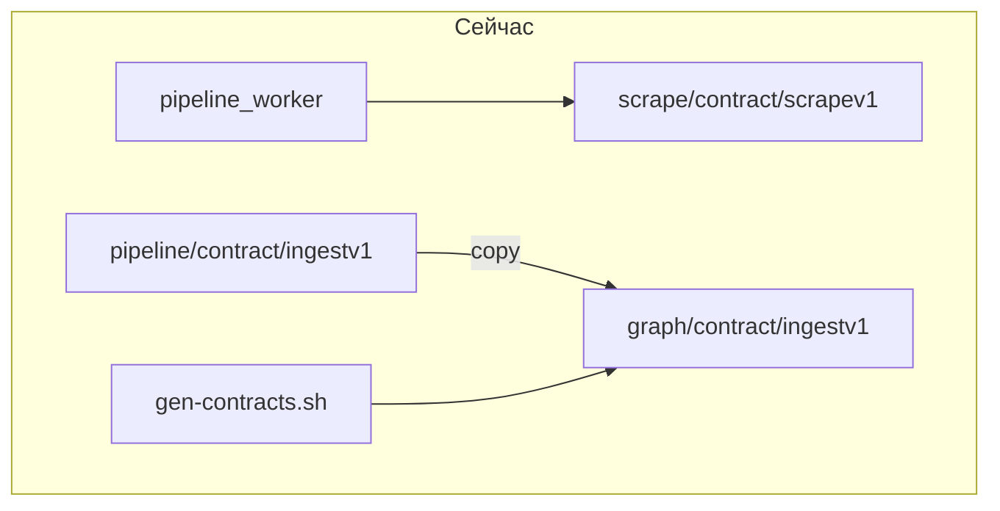

# pkg DRY refactor — изоляция слоёв без повторов

## Цель

- **DRY:** одинаковый код → [`pkg/`](pkg/) (включая дубли, которые сейчас только в scrape).
- **Изоляция:** `scrape/`, `pipeline/`, `graph/` не импортируют друг друга; общение только через NATS + типы из `pkg/`.
- **В слоях остаётся:** оркестрация (`usecase`, `handle`, `ingest_worker`, `factory`, Cypher MERGE).
- **Убрать:** `*/contract/*`, [`scripts/gen-contracts.sh`](scripts/gen-contracts.sh), `make contracts`, копию `graph/contract/ingestv1`.
- **Схемы:** [`docs/schemas/`](docs/schemas/) остаются **документацией**; SOT для Go — ручное поддержание `pkg/scrapev1`, `pkg/ingestv1` (без codegen).
- **Планы:** заархивировать/удалить устаревшие [`.cursor/plans/`](.cursor/plans/).

## Текущее состояние (кратко)



```mermaid
flowchart TB
  subgraph target [Цель]
    PSV[pkg/scrapev1]
    PIV[pkg/ingestv1]
  end
  scrape[scrape/] --> PSV
  scrape --> NATS1[NATS scrape.>]
  NATS1 --> pipeline[pipeline/]
  pipeline --> PSV
  pipeline --> PIV
  PIV --> NATS2[NATS ingest.>]
  NATS2 --> graph[graph/]
  graph --> PIV
```

## Целевая структура pkg/

| Модуль | Откуда | Кто импортирует |
|--------|--------|-----------------|
| [`pkg/nvdparse`](pkg/nvdparse/) | уже есть | scrape vuln, pipeline vuln |
| `pkg/scrapev1` | `scrape/contract/scrapev1` | scrape, pipeline |
| `pkg/ingestv1` | `pipeline/contract/ingestv1` | pipeline, graph |
| `pkg/natsjet` | `scrape/pub`, `pipeline/pub`, `graph/internal/natsensure` | все три слоя |
| `pkg/tidomain` | `pipeline/.../tidomain` + `graph/.../ti/domain` | pipeline TI, graph TI |
| `pkg/tinormalize` | `pipeline/.../ti/normalize` + `graph/.../ti/normalize` | pipeline TI, graph TI |
| `pkg/nvdmap` | `nvdToDomain` / `nvdToVulnDomain` | scrape vuln, pipeline vuln |
| `pkg/proxypool` | 4× `scrape/sources/*/internal/proxypool` | ti, vuln, ds, lola |
| `pkg/githubraw` | nuclei + coderules `github_fetch` | scrape nuclei, coderules |

**Не в pkg (остаётся в слое — разная ответственность):** `scrape/feeds`, `scrape/ledger`, `graph/neo4jclient`, Cypher в `graph/sources/*/storage`, `pipeline/internal/handle` routing.

## Правила изоляции (обновить в docs)

- Запрет cross-layer: `scrape` ↛ `pipeline` ↛ `graph`.
- Разрешено всем слоям: `pkg/*` (каждый модуль — свой `go.mod`, как [`pkg/nvdparse`](pkg/nvdparse/go.mod)).
- **Нет** root `go.work` ([`AGENTS.md`](AGENTS.md)).
- Каждый [`scrape/go.work`](scrape/go.work), [`pipeline/go.work`](pipeline/go.work), [`graph/go.work`](graph/go.work) добавляет нужные `../pkg/...` через `use (...)`.

## Стратегия «без большого diff»

- Один todo = один логический шаг = один коммит (перенос файла, смена импортов в одном пакете, удаление tombstone).
- Сначала **добавить** pkg + тонкие re-export/wrapper в старом месте (если нужно), потом **переключить** импорты, потом **удалить** старые файлы.
- После каждого шага: `go test` / `go build` только затронутого модуля (см. [`Makefile`](Makefile)).
- Не смешивать перенос контрактов и proxypool в одном коммите.

---

## Фаза 0 — зачистка планов

| ID | Действие |
|----|----------|
| `plans-archive-active` | Переместить [graph_pack_v0.3.2_fast](.cursor/plans/graph_pack_v0.3.2_fast_c2f9eaa0.plan.md) и [veil_status_and_scaling](.cursor/plans/veil_status_and_scaling_375a8014.plan.md) в [`.cursor/plans/archive/`](.cursor/plans/archive/) |
| `plans-readme` | Обновить [`.cursor/plans/archive/README.md`](.cursor/plans/archive/README.md): что заархивировано, что superseded этим планом |
| `plans-root-clean` | Убедиться, что в `.cursor/plans/` остаётся только новый план (+ archive/) |

---

## Фаза 1 — `pkg/scrapev1`

| ID | Действие |
|----|----------|
| `pkg-scrapev1-init` | Создать `pkg/scrapev1/go.mod`, скопировать `envelope.go` (+ тесты) из [`scrape/contract/scrapev1`](scrape/contract/scrapev1/) |
| `pkg-scrapev1-work-scrape` | Добавить `../pkg/scrapev1` в [`scrape/go.work`](scrape/go.work) |
| `pkg-scrapev1-import-scrape-pub` | Переключить импорты в [`scrape/pub`](scrape/pub/), [`scrape/pub/domain.go`](scrape/pub/domain.go) |
| `pkg-scrapev1-import-ti` | Переключить `scrape/sources/ti/...` (scrapepub, usecase) |
| `pkg-scrapev1-import-vuln` | vuln source |
| `pkg-scrapev1-import-lola` | lola source |
| `pkg-scrapev1-import-ds` | ds source |
| `pkg-scrapev1-import-sbom` | sbom source |
| `pkg-scrapev1-import-coderules` | coderules source |
| `pkg-scrapev1-import-nuclei` | nuclei source |
| `pkg-scrapev1-import-factory` | [`scrape/factory`](scrape/factory/) если есть ссылки |
| `pkg-scrapev1-test-scrape` | `cd scrape/scrape_worker && go build`; тесты `scrape/pub` |
| `pkg-scrapev1-rm-contract` | Удалить [`scrape/contract/`](scrape/contract/), убрать из `scrape/go.work` |
| `pkg-scrapev1-makefile` | [`Makefile`](Makefile) `test-scrape`: `pkg/scrapev1` вместо `scrape/contract` |

---

## Фаза 2 — `pkg/ingestv1` + удаление codegen

| ID | Действие |
|----|----------|
| `pkg-ingestv1-init` | Создать `pkg/ingestv1` из [`pipeline/contract/ingestv1`](pipeline/contract/ingestv1/) |
| `pkg-ingestv1-work-pipeline` | `pipeline/go.work` + импорты [`pipeline/pub`](pipeline/pub/) |
| `pkg-ingestv1-import-handle` | По одному файлу в [`pipeline/pipeline_worker/internal/handle/`](pipeline/pipeline_worker/internal/handle/): `handler.go`, `ti.go`, `vuln.go`, `lola.go`, `ds.go`, `appsec.go`, `appsec_parse.go` + `*_test.go` |
| `pkg-ingestv1-import-normalize` | Пакеты в [`pipeline/internal/normalize/`](pipeline/internal/normalize/) ссылающиеся на ingestv1 |
| `pkg-ingestv1-import-cmd` | [`pipeline/pipeline_worker/cmd/main.go`](pipeline/pipeline_worker/cmd/main.go) |
| `pkg-ingestv1-work-graph` | `graph/go.work` + замена `graph/contract/ingestv1` |
| `pkg-ingestv1-import-ingest-worker` | [`graph/ingest_worker/cmd/main.go`](graph/ingest_worker/cmd/main.go) |
| `pkg-ingestv1-import-sources-ti` | `graph/sources/ti/ingest/*` |
| `pkg-ingestv1-import-sources-vuln` | vuln ingest |
| `pkg-ingestv1-import-sources-lola` | lola ingest |
| `pkg-ingestv1-import-sources-ds` | ds ingest |
| `pkg-ingestv1-import-storage-appsec` | `graph/storage/{sbom,coderules,nuclei}` |
| `pkg-ingestv1-import-workeringest` | `graph/workeringest/*` |
| `pkg-ingestv1-test` | `make test-pipeline test-graph` |
| `pkg-ingestv1-rm-pipeline-contract` | Удалить `pipeline/contract/` |
| `pkg-ingestv1-rm-graph-contract` | Удалить `graph/contract/` |
| `pkg-ingestv1-rm-gen-contracts` | Удалить [`scripts/gen-contracts.sh`](scripts/gen-contracts.sh); убрать `contracts` из [`Makefile`](Makefile), [`CONTRIBUTING.md`](CONTRIBUTING.md), [`scripts/README.md`](scripts/README.md) |
| `pkg-ingestv1-docs` | Обновить [`docs/coding-style.md`](docs/coding-style.md), [`docs/ingest-contract.md`](docs/ingest-contract.md), [`AGENTS.md`](AGENTS.md): SOT = pkg, schemas = docs only |

---

## Фаза 3 — pipeline читает `pkg/scrapev1` (убрать скрытый cross-layer)

| ID | Действие |
|----|----------|
| `pkg-scrapev1-work-pipeline` | Добавить `../pkg/scrapev1` в [`pipeline/go.work`](pipeline/go.work) |
| `pkg-scrapev1-import-pipeline-handle` | Заменить `scrape/contract/scrapev1` → `pkg/scrapev1` во всех handle + tests |
| `pkg-scrapev1-test-pipeline` | `cd pipeline/pipeline_worker && go test ./...` |

---

## Фаза 4 — `pkg/natsjet`

Общий JetStream: connect, `PublishJSON` с generic dedup key, `EnsureStream(name, subjects)`.

| ID | Действие |
|----|----------|
| `pkg-natsjet-init` | `pkg/natsjet`: `Connect`, `Publisher[T]`, `EnsureStream` |
| `pkg-natsjet-test` | unit-тесты на marshal + MsgId |
| `pkg-natsjet-scrape-pub` | [`scrape/pub/publish.go`](scrape/pub/publish.go) — thin wrapper: dedup = `ContentKey`, validate `scrapev1` |
| `pkg-natsjet-pipeline-pub` | [`pipeline/pub/publish.go`](pipeline/pub/publish.go) — dedup = `IdempotencyKey` |
| `pkg-natsjet-graph-ensure` | [`graph/internal/natsensure`](graph/internal/natsensure/ensure.go) → вызов `pkg/natsjet.EnsureStream("INGEST", ...)` |
| `pkg-natsjet-pipeline-ensure` | `EnsureBothStreams` в pipeline/pub |
| `pkg-natsjet-work-all` | go.work во всех слоях |
| `pkg-natsjet-test-all` | build scrape_worker, pipeline_worker, ingest_worker |

---

## Фаза 5 — `pkg/tidomain` + `pkg/tinormalize`

| ID | Действие |
|----|----------|
| `pkg-tidomain-init` | Объединить типы из [`pipeline/internal/normalize/tidomain`](pipeline/internal/normalize/tidomain/) и [`graph/sources/ti/internal/domain`](graph/sources/ti/internal/domain/) |
| `pkg-tinormalize-init` | Перенести `CanonicalID`, `NormalizeIOC`, `NormalizeCampaign`, … |
| `pkg-tinormalize-test` | Скопировать/объединить table-driven тесты |
| `pkg-tidomain-pipeline` | pipeline normalize/ti → импорт pkg |
| `pkg-tidomain-graph-domain` | graph `internal/domain` → type alias или embed pkg types |
| `pkg-tinormalize-graph` | graph storage + usecase → pkg/tinormalize |
| `pkg-tidomain-rm-dup` | Удалить дублирующие файлы normalize/domain в обоих слоях |
| `pkg-ti-test` | TI tests pipeline + graph ti source |

---

## Фаза 6 — `pkg/nvdmap`

| ID | Действие |
|----|----------|
| `pkg-nvdmap-init` | `ToVulnRecord(v nvdparse.Vulnerability) VulnRecord` — единая структура |
| `pkg-nvdmap-scrape` | [`scrape/sources/vuln/internal/usecase/scrape.go`](scrape/sources/vuln/internal/usecase/scrape.go): убрать `nvdToDomain` |
| `pkg-nvdmap-pipeline` | [`pipeline/.../handle/vuln.go`](pipeline/pipeline_worker/internal/handle/vuln.go): убрать `nvdToVulnDomain` |
| `pkg-nvdmap-test` | тесты на CVE/CVSS/CPE mapping |

---

## Фаза 7 — `pkg/proxypool`

| ID | Действие |
|----|----------|
| `pkg-proxypool-init` | Обобщить 4 файла (ti/vuln/ds/lola); вынести отличия в opts/config |
| `pkg-proxypool-import-ti` | ti usecase/feeds |
| `pkg-proxypool-import-vuln` | vuln |
| `pkg-proxypool-import-ds` | ds |
| `pkg-proxypool-import-lola` | lola |
| `pkg-proxypool-rm-dup` | Удалить `scrape/sources/*/internal/proxypool/` |
| `pkg-proxypool-test` | smoke build scrape_worker |

---

## Фаза 8 — `pkg/githubraw`

| ID | Действие |
|----|----------|
| `pkg-githubraw-init` | ListDir + ledger-backed fetch из nuclei/coderules usecase |
| `pkg-githubraw-nuclei` | nuclei usecase |
| `pkg-githubraw-coderules` | coderules usecase |
| `pkg-githubraw-rm-dup` | удалить дубли `github_fetch.go` |
| `pkg-githubraw-test` | unit с mock feeds |

---

## Фаза 9 — graph layer DRY (остаётся в graph, не pkg)

Тонкие обёртки ingest (4 домена) — **логика MERGE остаётся**, повтор только wiring:

| ID | Действие |
|----|----------|
| `graph-ingestkit-init` | `graph/internal/ingestkit`: generic `SetupWriter(cfg, storeCtor)` |
| `graph-ingestkit-ti` | рефактор [`graph/sources/ti/ingest/setup.go`](graph/sources/ti/ingest/setup.go) |
| `graph-ingestkit-vuln` | vuln |
| `graph-ingestkit-lola` | lola |
| `graph-ingestkit-ds` | ds |
| `graph-workeringest-fold` | Опционально: убрать [`graph/workeringest/*`](graph/workeringest/) — прямой импорт `sources/*/ingest` из ingest_worker (отдельный коммит) |

---

## Фаза 10 — документация и финальная проверка

| ID | Действие |
|----|----------|
| `docs-readme-pkg` | [`README.md`](README.md): таблица `pkg/*`, убрать `make contracts` |
| `docs-scrape-readme` | [`scrape/README.md`](scrape/README.md), [`pipeline/README.md`](pipeline/README.md), [`graph/README.md`](graph/README.md) |
| `docs-schemas-note` | В [`docs/schemas/`](docs/schemas/): комментарий «синхронизировать вручную с pkg/*» |
| `ci-makefile-final` | Финальный [`Makefile`](Makefile): все `test-*` через pkg |
| `e2e-smoke` | `scripts/compose-up-full.sh` или layer smoke — scrape → pipeline → graph |
| `git-grep-contract` | `rg contract/` — ноль устаревших путей |

---

## Что сознательно не трогаем в этом рефакторинге

- **AppSec asymmetry** (`graph/storage/*` vs `graph/sources/*`) — отдельная задача, не DRY.
- **Neo4j Cypher** в каждом source — уникальная логика слоя graph.
- **Deploy/compose** — менять только если пути бинарей/module cache потребуют (обычно нет).
- **Graph pack v0.3.2** — отложен; старый план в archive.

## Риски

| Риск | Митигация |
|------|-----------|
| Drift pkg vs JSON schema | Чеклист в CONTRIBUTING: при изменении envelope — обновить `docs/schemas/` в том же PR |
| Сломанный import path | По одному source/пакету за коммит + `go build` |
| proxypool различия между sources | Config struct; не форсировать byte-identical до анализа diff ti vs vuln |

## Критерии готовности

- Нет каталогов `*/contract/`, нет `gen-contracts.sh`, нет `make contracts`.
- `pipeline` не импортирует ничего из `scrape/` или `graph/`.
- `graph` не импортирует `scrape/` или `pipeline/`.
- Все три `go.work` ссылаются только на нужные `pkg/*`.
- `make test-scrape test-pipeline test-graph` зелёные.
