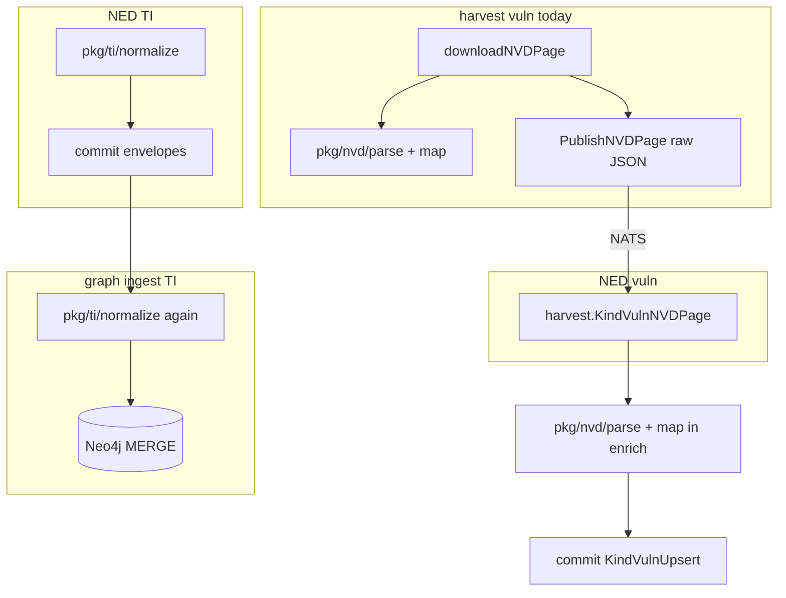

# Follow-up: NVD только в pipeline + TI normalize только в NED

После [pkg rename](.cursor/plans/pkg_rename_and_audit_f5fedb76.plan.md) остались два нарушения DRY и границ слоёв из секции «Опциональный follow-up».

## Текущее состояние



| Проблема | Где | Факт |
|----------|-----|------|
| Двойной NVD parse | [`discovery/harvest/.../vuln/usecase/scrape.go`](discovery/harvest/internal/sources/vuln/internal/usecase/scrape.go) | `parseNVD` + `nvdmap.FromNVD` только для `len(vulns)` / логов; на wire уходит **сырой** `harvest.VulnNVDPage` через [`PublishNVDPage`](discovery/harvest/internal/sources/vuln/internal/scrapepub/publisher.go) |
| NVD в корневом `pkg/` | [`pkg/nvd/parse`](pkg/nvd/parse), [`pkg/nvd/map`](pkg/nvd/map) | Импорты: harvest + [`pipeline/ned/.../enrich/nvd.go`](pipeline/ned/internal/sources/vuln/enrich/nvd.go) |
| Двойной TI normalize | pipeline + graph | NED нормализует в [`pipeline/ned/internal/sources/ti/transform.go`](pipeline/ned/internal/sources/ti/transform.go); graph снова в [`usecase/ingest.go`](knowledge/ingest/internal/sources/ti/usecase/ingest.go) и [`storage/neo4j.go`](knowledge/ingest/internal/sources/ti/storage/neo4j.go) |

`pkg/ti/domain` остаётся в корневом [`pkg/`](pkg/) — нужен scrape (alias), pipeline и graph.

---

## PR 1 — Vuln: harvest = raw only, `nvd/*` → `pipeline/pkg`

### Цель

Harvest **только fetch + ledger + publish** `harvest.KindVulnNVDPage`. Парсинг CWE/CPE/CVSS — **только NED**.

### 1.1 Упростить harvest vuln

Файл: [`discovery/harvest/internal/sources/vuln/internal/usecase/scrape.go`](discovery/harvest/internal/sources/vuln/internal/usecase/scrape.go)

- Удалить импорты `pkg/nvd/parse`, `pkg/nvd/map`, функции `parseNVD`, `nvdToDomain`.
- В `ScrapeNVD` после `downloadNVDPage`:
  - публиковать `PublishNVDPage(ctx, start, data)` **без** полного parse;
  - для пагинации читать `totalResults` лёгким helper (unmarshal только `{ "totalResults": N }` в unexported struct в том же пакете или `harvest` internal util) — **не** тянуть `nvd/parse`;
  - условие остановки `len(vulns)==0` заменить на проверку пустого `vulnerabilities` массива через тот же minimal JSON scan **или** `start >= total` только по `totalResults`.
- Логи: `pageCount` = длина сырого JSON / `totalResults`, не число распарсенных CVE.

`harvest.KindVulnCVEUpsert` / exploit merge **не трогать** — это отдельный wire-path без NVD page.

### 1.2 Перенос `pkg/nvd` → `pipeline/pkg/nvd`

```
pipeline/pkg/
  go.mod
  nvd/
    parse/
    map/          # package nvdmap (как сейчас)
    README.md
```

- Переместить [`pkg/nvd/*`](pkg/nvd/) → `pipeline/pkg/nvd/*`.
- Модуль: `github.com/butbeautifulv/threat_intelligence/pipeline/pkg`.
- Обновить [`pipeline/go.work`](pipeline/go.work): ` ./pkg` вместо зависимости harvest от `../pkg/nvd`.
- [`pipeline/ned/go.mod`](pipeline/ned/go.mod): `require` + `replace` на `../pkg` (nvd подмодули).
- Удалить `pkg/nvd/` из корневого [`pkg/go.mod`](pkg/go.mod); убрать из [`discovery/go.work`](discovery/go.work) / [`discovery/harvest/go.mod`](discovery/harvest/go.mod) любые `pkg` imports связанные с nvd (harvest после 1.1 не импортирует `pkg` для vuln NVD).

### 1.3 Тесты и docs

| Файл | Действие |
|------|----------|
| [`pipeline/ned/internal/sources/vuln/enrich/nvd.go`](pipeline/ned/internal/sources/vuln/enrich/nvd.go) | импорты → `pipeline/pkg/nvd/...` |
| [`pipeline/ned/internal/sources/vuln/transform_test.go`](pipeline/ned/internal/sources/vuln/transform_test.go) | `testdata` путь → `pipeline/pkg/nvd/parse/testdata/...` |
| [`Makefile`](Makefile) | `test-pipeline`: nvd tests под `pipeline/pkg` |
| [`docs/agents/coding-style.md`](docs/agents/coding-style.md) | NED enrich / harvest: «NVD parse только в pipeline» |
| [`docs/architecture/ontology-appsec.md`](docs/architecture/ontology-appsec.md), [`README.md`](README.md) | ссылки `pkg/nvd` → `pipeline/pkg/nvd` |

Проверка: `make test-scrape test-pipeline` (graph не затронут).

---

## PR 2 — TI: normalize только в NED, graph доверяет `commit`

### Цель

**Normalize** — ответственность pipeline (NED). **Graph ingest** — MERGE уже нормализованных payload + стабильные ключи из `commit`, без `pkg/ti/normalize`.

### 2.1 Контракт `commit` (документация + комментарии)

В [`pkg/commit/envelope.go`](pkg/commit/envelope.go) (или [`docs/contracts/ingest-contract.md`](docs/contracts/ingest-contract.md)):

- Для `KindTIIoC`, `KindTICampaign`, `KindTICluster`, `KindTIActor`, `KindTIReport`: payload **уже нормализован NED**; graph не должен менять `value`/`type`/tags.
- `IdempotencyKey` для TI IOC = `ti:ioc:<canonical>` ([`TIIoCIdempotencyKey`](pkg/commit/envelope.go)) — источник truth для Neo4j node `id`.

### 2.2 Graph: убрать повторную нормализацию

Удалить пакет [`knowledge/ingest/internal/sources/ti/normalize/`](knowledge/ingest/internal/sources/ti/normalize/).

**[`usecase/ingest.go`](knowledge/ingest/internal/sources/ti/usecase/ingest.go):**

- `UpsertIOC`: не вызывать `NormalizeIOC`; upsert как есть (invalid → skip по пустому value, если нужно — только validate, не normalize).
- `UpsertCampaign` / `UpsertCluster`: убрать `NormalizeCampaign` / `NormalizeCluster`.
- `KindTIJSONLRecord` → `IngestOne`: либо deprecate в пользу уже развернутых NED kinds, либо оставить без normalize (данные уже из commit line, разобранные NED в `jsonlToIngest`).

**[`envelope/apply.go`](knowledge/ingest/internal/sources/ti/envelope/apply.go):**

- Для upsert kinds передавать в repo **`env.IdempotencyKey`** (или извлечённый canonical id) вместо пересчёта в storage.
- Link kinds (`KindTILinkCampaignIOC`, …): payload IOC уже нормализован NED; link repo должен использовать тот же id, что и upsert (см. 2.3).

**[`storage/neo4j.go`](knowledge/ingest/internal/sources/ti/storage/neo4j.go):**

- Заменить `normalize.CanonicalID(i)` на параметр `id string` в `UpsertIOC` / link-методах **или** парсинг canonical из `idempotency_key` (`strings.TrimPrefix(key, "ti:ioc:")`).
- Убрать импорт `pkg/ti/normalize`.

### 2.3 Pipeline: гарантии перед graph

Проверить/дополнить [`pipeline/ned/internal/sources/ti/transform.go`](pipeline/ned/internal/sources/ti/transform.go):

- Все пути к `commit` (включая `jsonlToIngest`) проходят `tinormalize` **до** `NewEnvelope`.
- Если появятся `KindTILink*` publishers — IOC в link payload тоже normalized + idempotency keys согласованы.

Опционально: перенести [`pkg/ti/normalize`](pkg/ti/normalize) → [`pipeline/pkg/ti/normalize`](pipeline/pkg/ti/normalize) после того как graph перестанет импортировать (scrape normalize не использует).

`pkg/ti/domain` **остаётся** в корневом `pkg/` (scrape alias + shared types).

### 2.4 Тесты

| Область | Действие |
|---------|----------|
| [`pipeline/ned/internal/sources/ti/transform_test.go`](pipeline/ned/internal/sources/ti/transform_test.go) | оставить/расширить: normalized payload + canonical idempotency key |
| Graph TI | unit/integration: upsert с pre-normalized IOC → MERGE по `idempotency_key`, без второго normalize |
| Regression | `make test-pipeline test-graph`; smoke `scripts/smoke_scrape_e2e.sh` для TI path |

Обновить PR checklist в [`docs/agents/coding-style.md`](docs/agents/coding-style.md): «graph ingest не импортирует `ti/normalize`».

---

## Порядок и риски

| Шаг | PR | Зависимости |
|-----|-----|-------------|
| 1 | Vuln raw + `pipeline/pkg/nvd` | Независим |
| 2 | TI normalize boundary | После PR1 или параллельно; логически независим |

| Риск | Митигация |
|------|-----------|
| Изменение логики early-stop в `ScrapeNVD` | Сохранить поведение `NVD_MAX_PAGES` / `totalResults`; добавить unit test на pagination helper |
| Graph MERGE с другим id без normalize | Сравнить `CanonicalID(normalized)` с суффиксом `idempotency_key` в тесте; миграция Neo4j **не** нужна, если pipeline уже писал те же ключи |
| `KindTIJSONLRecord` в graph | Убедиться, что NED разворачивает JSONL в отдельные commit kinds на NATS path (основной поток) |

**Вне scope:** переименование JSON `kind` / NATS subjects; перенос `pkg/ti/domain` в pipeline; root `go.work`.
