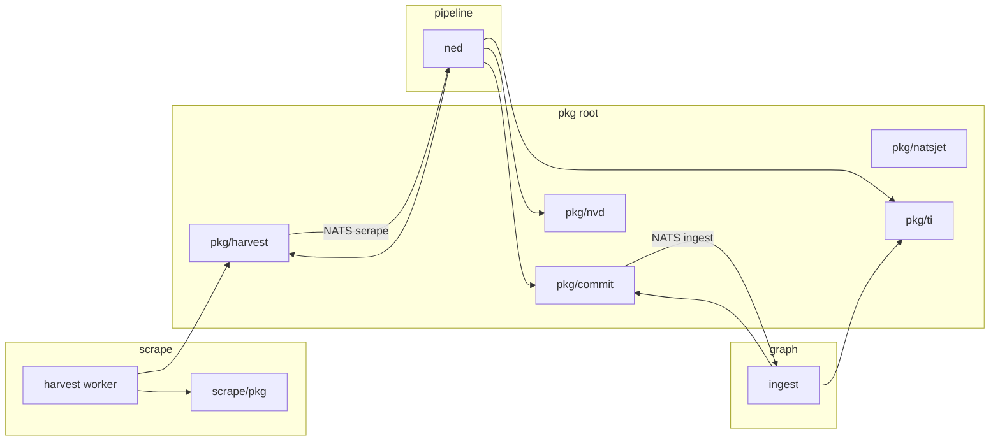

# Реорганизация pkg: harvest/commit + аудит по Google Go Style

## Контекст

Сейчас в корне [`pkg/`](pkg/) — 9 отдельных `go.mod`-модулей. Wire-типы [`pkg/scrapev1`](pkg/scrapev1/) и [`pkg/ingestv1`](pkg/ingestv1/) импортируются так:

| Пакет | scrape | pipeline | graph |
|-------|--------|----------|-------|
| scrapev1 → **harvest** | да | да | нет |
| ingestv1 → **commit** | нет | да | да |
| natsjet | connector | connector | ingest connector |
| githubraw, proxypool | harvest | — | — |
| nvdparse, nvdmap | harvest vuln | ned vuln | — |
| tidomain | harvest ti (alias) | ned ti | ingest ti |
| tinormalize | — | ned ti | ingest ti |

Правило репозитория ([`docs/coding-style.md`](docs/coding-style.md), [`AGENTS.md`](AGENTS.md)): слои **не импортируют** друг друга; общее — только через NATS + общий `pkg/`. Перенос в `scrape/pkg` возможен **только** для кода, который не нужен pipeline/graph.

**Выбранные имена:** `pkg/harvest` + `pkg/commit` (NATS `scrape.>` / `ingest.>` и JSON `kind` вида `scrape_*` / `ti_*` **не меняем** — это стабильный wire-контракт; меняются путь импорта, package name, префиксы ошибок, JSON schema filenames).



---

## Фаза 1 — Переименование wire: `harvest` / `commit`

### 1.1 Перенос пакетов

- [`pkg/scrapev1/`](pkg/scrapev1/) → [`pkg/harvest/`](pkg/harvest/)
  - `package harvest`
  - Ошибки: `scrapev1:` → `harvest:` (в [`envelope.go`](pkg/scrapev1/envelope.go))
  - Package doc: «envelope для NATS `scrape.>` (выход harvest-слоя)»
- [`pkg/ingestv1/`](pkg/ingestv1/) → [`pkg/commit/`](pkg/commit/)
  - `package commit`
  - Ошибки: `ingestv1:` → `commit:`
  - Package doc: «envelope для NATS `ingest.>` (выход NED → graph ingest)»

### 1.2 Механическая замена импортов (~45 Go-файлов + go.mod/go.work)

Заменить пути и алиасы:

```go
// было
"github.com/butbeautifulv/threat_intelligence/pkg/scrapev1"
// стало
"github.com/butbeautifulv/threat_intelligence/pkg/harvest"
```

Аналогично `ingestv1` → `commit`. Типы `scrapev1.Envelope` → `harvest.Envelope`, `ingestv1.Kind*` → `commit.Kind*`.

**Зоны:** [`scrape/connector`](scrape/connector/), [`scrape/harvest`](scrape/harvest/), [`pipeline/ned`](pipeline/ned/), [`pipeline/connector`](pipeline/connector/), [`graph/ingest`](graph/ingest/).

### 1.3 Документация и схемы

| Было | Станет |
|------|--------|
| `docs/schemas/scrapev1-envelope.json` | `docs/schemas/harvest-envelope.json` |
| `docs/schemas/ingestv1-envelope.json` | `docs/schemas/commit-envelope.json` |
| [`docs/ingest-contract.md`](docs/ingest-contract.md) | harvest/commit, ссылки на `pkg/harvest`, `pkg/commit` |
| [`docs/coding-style.md`](docs/coding-style.md) | таблицы слоёв, PR checklist |
| [`AGENTS.md`](AGENTS.md), [`CONTRIBUTING.md`](CONTRIBUTING.md), [`README.md`](README.md), layer READMEs | те же замены |
| [`Makefile`](Makefile) | `test-scrape` → `pkg/harvest`; `test-pipeline`/`test-graph` → `pkg/commit` |

**Не трогать:** `.cursor/plans/*.plan.md` (по правилу репо).

### 1.4 Проверка

```bash
make test-scrape test-pipeline test-graph
```

---

## Фаза 2 — Что остаётся в корневом `pkg/`, что уезжает

### Остаётся в корне (межслойные контракты и shared helpers)

| Пакет | Почему корень |
|-------|----------------|
| **harvest**, **commit** | Контракт NATS между 2+ слоями |
| **natsjet** | Одинаковый JetStream bootstrap в трёх `connector` / graph ingest |
| **ti/domain**, **ti/normalize** | Используются pipeline **и** graph (normalize для MERGE-ключей); scrape только алиасит domain |
| **nvd/parse**, **nvd/map** | Сейчас и harvest vuln, и ned enrich ([`scrape/.../vuln/usecase/scrape.go`](scrape/harvest/internal/sources/vuln/internal/usecase/scrape.go) парсит NVD до publish). Перенос **только** в `pipeline/pkg` потребует отдельного рефактора: harvest публикует сырой `KindVulnNVDPage`, parse только в NED — **вынести в follow-up**, не блокировать rename |

### Перенос в `scrape/pkg/` (только scrape)

| Пакет | Новый путь | Импорты |
|-------|------------|---------|
| githubraw | [`scrape/pkg/githubraw/`](scrape/pkg/githubraw/) | nuclei, coderules usecase |
| proxypool | [`scrape/pkg/proxypool/`](scrape/pkg/proxypool/) | ti feeds, vuln, ds, lola |

- Отдельный `go.mod`: `module github.com/butbeautifulv/threat_intelligence/scrape/pkg` (один модуль, подпакеты `githubraw`, `proxypool`).
- Добавить в [`scrape/go.work`](scrape/go.work); убрать `../pkg/githubraw`, `../pkg/proxypool`.
- Удалить [`pkg/githubraw/`](pkg/githubraw/), [`pkg/proxypool/`](pkg/proxypool/).

### Не создавать `graph/pkg/` и `pipeline/pkg/` в этом PR

- **graph:** кроме wire (`commit`) и TI — своих shared libs нет.
- **pipeline:** `nvd`/`tinormalize` пока нельзя изолировать без нарушения границ или дублирования; оставить в корневом `pkg/` до опционального vuln raw-only рефактора.

---

## Фаза 3 — Упрощение модулей и целевая структура `pkg/`

### 3.1 Один `go.mod` на корневой `pkg/`

Сейчас каждый подпакет — отдельный модуль → шум в `go.work` и `replace` в каждом layer `go.mod`.

**Цель:**

```text
pkg/
  go.mod                    # module github.com/butbeautifulv/threat_intelligence/pkg
  harvest/
  commit/
  natsjet/
  ti/
    domain/
    normalize/
  nvd/
    parse/
    map/
```

- Перенести `nvdparse` → `pkg/nvd/parse`, `nvdmap` → `pkg/nvd/map` (package `parse` / `map` или `nvdparse` внутри — предпочтительно короткие имена по [Google naming](https://google.github.io/styleguide/go/best-practices): `nvd.Parse`, `nvd.MapCVE` через подпакеты `nvd/parse`, `nvd/map`).
- Перенести `tidomain` → `pkg/ti/domain`, `tinormalize` → `pkg/ti/normalize`.
- Удалить отдельные `pkg/*/go.mod`; в [`scrape/go.work`](scrape/go.work), [`pipeline/go.work`](pipeline/go.work), [`graph/go.work`](graph/go.work) — одна строка `../pkg`.
- В layer `go.mod`: одна зависимость `pkg` + `replace` вместо 5–7.

### 3.2 Итоговая карта зависимостей

```text
scrape/go.work  → ../pkg, ./scrape/pkg, connector, harvest, proxybroker
pipeline/go.work → ../pkg, connector, ned
graph/go.work   → ../pkg, connector, ingest, serve
```

---

## Фаза 4 — Ревизия по [Google Go Style Guide](https://google.github.io/styleguide/go/guide)

Применить к **всем** пакетам в `pkg/` и новым `scrape/pkg/` (не массовый рефактор слоёв):

### Принципы (зафиксировать в docs)

Добавить секцию **«Go style (Google)»** в [`docs/coding-style.md`](docs/coding-style.md):

- **Clarity > cleverness** — имена и структура объясняют «что» и «почему»; комментарии про rationale, не пересказ кода ([guide: Clarity](https://google.github.io/styleguide/go/guide#clarity)).
- **Least mechanism** — без лишних абстракций; maps/slices вместо generic «util» ([guide: Simplicity](https://google.github.io/styleguide/go/guide#simplicity)).
- **MixedCaps**, `gofmt` обязателен ([guide: Formatting](https://google.github.io/styleguide/go/guide#formatting)).
- **Имена пакетов** — короткие, без `v1` в имени директории (версия только в `schema_version`); не повторять имя пакета в экспортируемых символах ([best practices: Avoid repetition](https://google.github.io/styleguide/go/best-practices#avoid-repetition)).
- **Ошибки** — `%w` для wrap; стабильный префикс `harvest:`, `commit:`; без `panic` в библиотечном коде.
- **API surface** — экспортировать только то, что нужно слоям; вспомогательное — unexported.
- **Тесты** — table-driven где есть варианты; `testdata/` рядом с пакетом ([best practices: Test data](https://google.github.io/styleguide/go/best-practices)).

### Конкретные правки в `pkg/`

| Область | Действие |
|---------|----------|
| Package comments | У каждого пакета — 1 предложение «что это» + граница использования (какие слои могут импортировать) |
| `harvest` / `commit` | Проверить stutter (`Envelope.Validate` ок); константы `Kind*` оставить как wire-stable |
| `natsjet` | Убедиться, что публичный API минимален (EnsureStream, Publish helpers) |
| `ti/normalize` | Импорт только `ti/domain`, не `commit` |
| `nvd/*` | README из `nvdparse` перенести в `pkg/nvd/README.md` |
| Дубли domain | [`scrape/.../ti/internal/domain`](scrape/harvest/internal/sources/ti/internal/domain/entity.go) — оставить type alias на `ti/domain` (уже так); не плодить третьи копии |

### Чего не делать в этом PR

- Массовое переименование JSON `kind` / NATS stream names.
- Перенос `nvd` только в pipeline без изменения vuln harvest (отдельный PR).
- Root `go.work` (по-прежнему запрещён в AGENTS.md).

---

## Порядок выполнения (минимизировать поломки)

1. **harvest/commit rename** + docs/schemas + импорты + `make test-*` (можно с временными отдельными go.mod).
2. **Консолидация `pkg/go.mod`** + перенос `ti/*`, `nvd/*` + обновление go.work/go.mod слоёв.
3. **scrape/pkg** (githubraw, proxypool) + вычистка старых путей.
4. **Style pass** + секция Google в coding-style.
5. Финальный `make test-scrape test-pipeline test-graph`.

---

## Риски

| Риск | Митигация |
|------|-----------|
| Пропущенный импорт `scrapev1` в docs/compose | `rg 'scrapev1\|ingestv1'` по репо перед merge |
| Сломанные `replace` в go.mod | После консолидации — один `replace .../pkg => ../../pkg` |
| Путаница `harvest` (пакет) vs `scrape/harvest` (модуль) | В коде: import path `pkg/harvest`, локальный alias `harvestwire` только при коллизии имён |

---

## Опциональный follow-up (не в scope основного PR)

- Vuln: harvest публикует только raw NVD page → `nvd/*` переезжает в `pipeline/pkg/nvd`, scrape перестаёт парсить на fetch.
- `tinormalize` только в pipeline; graph читает уже нормализованный `commit` payload (убрать normalize из graph ingest).
