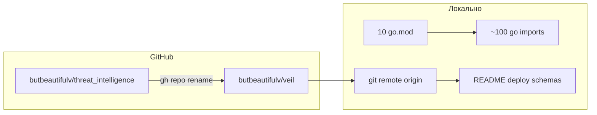

# Переименование репозитория threat_intelligence → veil

## Краткий ответ

**Да, это можно сделать через меня**, при условии что:
- у вас настроен `gh auth login` с правами **admin** на `butbeautifulv/threat_intelligence`;
- вы согласны на **полное** переименование (вы выбрали): GitHub repo + Go module path + все импорты.

Текущее состояние:
- Remote: `https://github.com/butbeautifulv/threat_intelligence.git`
- Go modules (10× `go.mod`): `github.com/butbeautifulv/threat_intelligence/...`
- ~100+ `.go` файлов с импортами этого префикса
- Доки, JSON schemas, `graph-bootstrap.sh` (URL релиза graph pack)

Имя продукта в README уже **Veil**; переименование затронет **технический** идентификатор репозитория и module path.



---

## Что делаю я (агент)

### 1. Переименование на GitHub

```bash
gh repo rename veil --repo butbeautifulv/threat_intelligence
```

GitHub **сохраняет редирект** со старого URL на новый (clone/fetch обычно продолжают работать), но лучше сразу обновить `origin`:

```bash
git remote set-url origin https://github.com/butbeautifulv/veil.git
```

### 2. Go module path (механическая замена)

Замена во всех файлах:

`github.com/butbeautifulv/threat_intelligence` → `github.com/butbeautifulv/veil`

Затронутые модули ([pkg/go.mod](pkg/go.mod), [discovery/harvest/go.mod](discovery/harvest/go.mod), [pipeline/ned/go.mod](pipeline/ned/go.mod), [graph/ingest/go.mod](graph/ingest/go.mod), и остальные 6 `go.mod`).

После замены в каждом слое:

```bash
make test-scrape test-pipeline test-graph
```

При необходимости `go work sync` в `discovery/`, `pipeline/`, `knowledge/`.

### 3. Документация и артефакты

| Файл | Что менять |
|------|------------|
| [README.md](README.md), [deploy/README.md](deploy/README.md) | Ссылки на releases (`github.com/.../veil/releases/...`) |
| [docs/agents/coding-style.md](docs/agents/coding-style.md) | Строка про Go module path |
| [docs/schemas/*.json](docs/schemas/), [docs/graph-pack-manifest.schema.json](docs/graph-pack-manifest.schema.json) | `$id` URLs |
| [deploy/knowledge/docker/graph-bootstrap.sh](deploy/knowledge/docker/graph-bootstrap.sh) | `DEFAULT_PACK_URL` |
| [LICENSE](LICENSE) | Имя проекта, если упоминается старое |

**Не трогать** (исторические): `.cursor/plans/archive/*` — опционально, по желанию.

### 4. Коммит и push

Один коммит (или два: `chore: rename module to veil` + отдельно только если GitHub rename делается в другой момент):

```
chore: rename repository and module path to veil

Rename GitHub repo to butbeautifulv/veil and update Go module
imports, docs, and release URLs from threat_intelligence.
```

---

## Что остаётся на вас (вне репозитория)

| Действие | Зачем |
|----------|--------|
| Переименовать локальную папку `threat_intelligence` → `veil` | Git не хранит имя каталога; только удобство |
| Обновить клоны на других машинах | `git remote set-url` или переклонировать |
| CI/CD (GitHub Actions secrets, deploy keys) | Если URL hardcoded |
| Внешние ссылки (блоги, bookmarks) | Редирект GitHub временный, не вечный |
| **Graph pack ZIP** `threat-intel-graph-v0.3.2.zip` | Имя артефакта на старых releases не менится; новые релизы можно назвать `veil-graph-...` отдельным решением |

---

## Порядок операций (важно)

1. **Сначала** `gh repo rename veil` (иначе push на новый module path уйдёт в старый repo slug до переименования — не критично, но путаница).
2. **Затем** массовая замена в коде + `go mod tidy` / тесты.
3. **Push** в `butbeautifulv/veil`.
4. **Локально** обновить `origin` URL.

Риски: минимальны при полной замене строки; `grep threat_intelligence` после PR должен давать 0 в коде (кроме archive/plans по желанию).

---

## Ограничения

- Без вашего **GitHub-токена / gh auth** я не смогу переименовать repo на сервере — только подготовить код и дать команду.
- Переименование **организации** (`butbeautifulv`) не входит в задачу.
- Старые **git tags/releases** остаются под старыми именами файлов; URL релизов редиректятся GitHub’ом на новый repo path.
